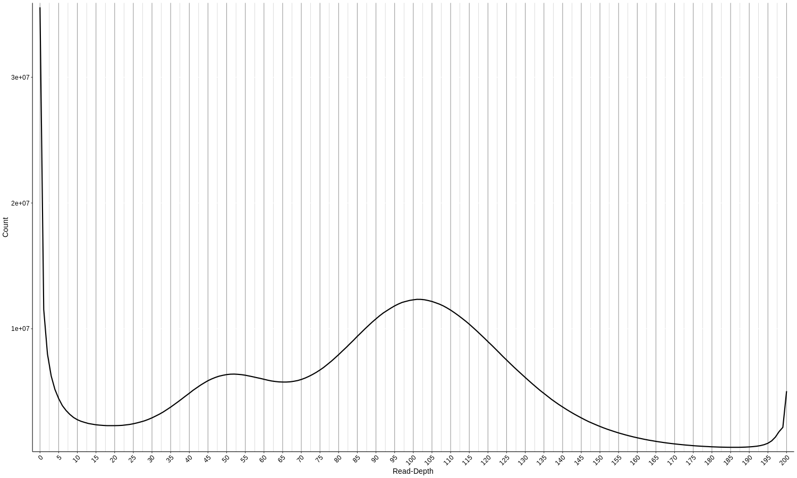
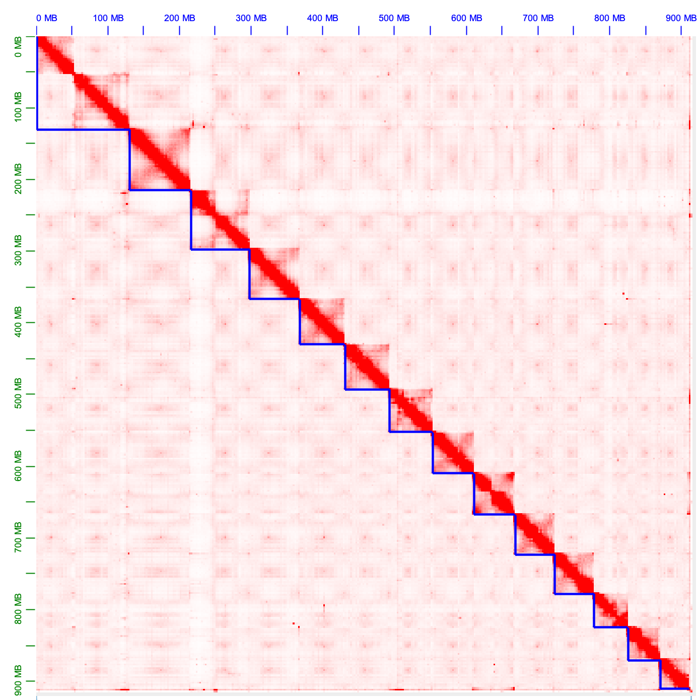
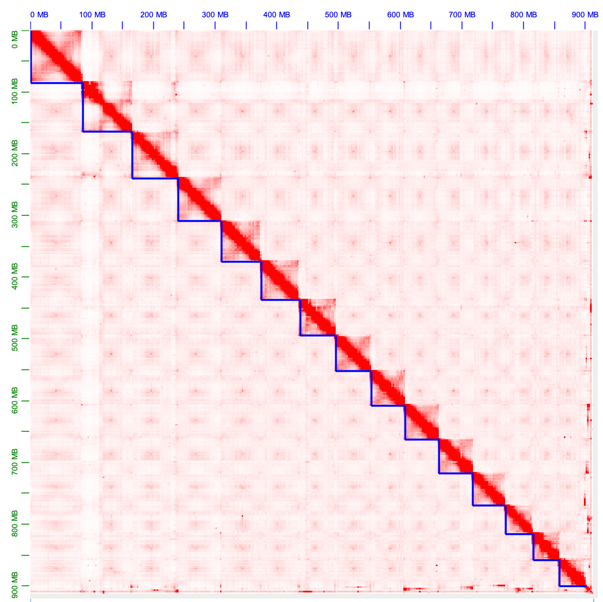

# AEP Genome Assembly

This document describes the assembly process for the strain AEP *H. vulgaris* genome. Our approach was as follows: we generated an initial draft assembly with Canu using Nanopore reads, we then polished the draft with Pilon using 10x linked reads, mis-assemblies were identified and broken with Tigmint using 10x data, uncollapsed haplotigs were merged with purge_haplotigs based on 10X read depth distribution, de-duplicated contigs were scaffolded with ARCS using 10X data, gaps introduced by ARCS were filled with PBJelly using Nanopore and PacBio reads, pseudo-chromosome scaffolds were assembled with the Juicer and 3d-dna pipelines using Hi-C data, the new gaps created by the Hi-C scaffolding were filled with PBJelly using PacBio and Nanopore data, and finally the genome was polished with Pilon using 10x, PacBio, and Nanopore data.

[TOC]

## De-Novo Strain AEP H. vulgaris Genome Assembly 

To generate the initial draft genome, we used Canu (v2.0) to assemble a de novo assembly from our Nanopore sequencing data: 

(*00_canuAssembly/runCanu.sh*)

```bash
#!/bin/bash

canu -d aep_canu -p aep_canu1 genomeSize=1g ovlMerDistinct=0.975 useGrid=remote -nanopore-raw
Nanopore/PROM_021_Juliano_Siebert_Hydra_HCL2_50K_01_11_2019/*.gz
```

The resulting fasta file `hydra_aep.canu.contigs.fasta` was used as the starting point for the rest of the genome assembly process.

### Resulting Genome Stats

Assembly size statistics were generated using assembly-stats (github.com/sanger-pathogens/assembly-stats)

(*stats for 00_canuAssembly/hydra_aep.canu.contigs.fasta*)

```
sum = 1047612583, n = 2624, ave = 399242.60, largest = 14388250
N50 = 2616727, n = 100
N60 = 1604856, n = 153
N70 = 894765, n = 243
N80 = 422017, n = 409
N90 = 127714, n = 875
N100 = 1003, n = 2624
N_count = 0
Gaps = 0
```

## Polishing the Initial Draft Assembly with Pilon

While the Nanopore reads used to generate the Canu draft assembly are quite long, they are also error prone. In this step, we try to fix some of those errors using our 10X data, which was sequenced on a conventional Illumina sequencer and has much more accurate base calls. 

### Mapping 10X Data to the Canu Draft Genome

Pilon requires as input a bam file of reads aligned to the genome. We used the longranger pipeline (v2.2.2) to map our 10X reads. First, we prepped the Canu draft genome for mapping:

(*01_initialPilon/makeCanuRef.sh*)

```bash
#! /bin/bash
#SBATCH -p bigmemm
#SBATCH --job-name=lRanger
#SBATCH -c 4
#SBATCH -t 60-0
#SBATCH --mem=16G
#SBATCH --error=lRanger_mkref_%j.err
#SBATCH --output=lRanger_mkref_%j.out

../../longranger-2.2.2/longranger mkref hydra_aep.canu.contigs.fasta
```

Then we mapped the 10X fastq files:

(*01_initialPilon/runLrAlign.sh*)

```bash
#! /bin/bash
#SBATCH -p bigmemh
#SBATCH --job-name=lRanger
#SBATCH -c 32
#SBATCH -t 60-0
#SBATCH --mem=300G
#SBATCH --error=lRanger_align.err
#SBATCH --output=lRanger_align.out

../resources/longranger-2.2.2/longranger align \
	--id=Canu10xMap \
	--fastqs=../resources/reads/10x/ \
	--sample=Hydra \
	--localcores=32 \
	--localmem=300 \
	--reference=../resources/references/canuDraft/refdata-hydra_aep.canu.contigs
```

This generated the file `possorted_bam.bam` that we used for the Pilon polishing.

### Prepping Canu Draft for Pilon Run

We next polished the genomic using Pilon (v.1.23). Because Pilon has high memory requirements, we had to split the draft genome into ~50 Mb chunks to reduce memory overhead. First we determined contig lengths:

```bash
samtools faidx hydra_aep.canu.contigs.fasta  
cut -f 1,2 hydra_aep.canu.contigs.fasta.fai > contLengths.txt
```

Then we used the following R script to split the genome fasta into ~50 Mb chunks

(*01_initialPilon/makeContigGroups.r*)

```R
scaffs <- read.table("contLengths.txt", stringsAsFactors = F)

#sort contigs from largest to smallest
scaffs <- scaffs[order(-scaffs$V2),]

#initialize vector to accumulate contigs until they encompass 50 Mb
#(holds, chunk in progress)
scaffV <- c()
#initialize list for 50 Mb chunks
scaffL <- c()

#initialize running length counter
totalSeq <- 0
for(i in 1:nrow(scaffs)){
  #if the scaffold is bigger than 50 Mb it gets to be in it's own chunk
  if (scaffs[i,2] >= 50000000) {
    scaffL <- c(scaffL, scaffs[i,1])
    #if our running length counter hasn't gotten to 50 Mb and we aren't
    #out of contigs, add the contig to our chunk in progress
  } else if (totalSeq + scaffs[i,2] < 50000000 & i != nrow(scaffs)) {
    totalSeq <- totalSeq + scaffs[i,2]
    scaffV <- c(scaffV, scaffs[i,1])
    #if we're at the end of the contig, finalize the last working chunk 
    #and add it to our chunk list
  } else if (i == nrow(scaffs)) {
    scaffV <- c(scaffV, scaffs[i,1])
    scaffL <- c(scaffL, paste(scaffV, collapse = " "))
    #if none of the above conditions have been met, our chunk in
    #progress has exceeded 50 MB. Finalize chunk in progress and
    #add it to our list.
  } else {
    totalSeq <- scaffs[i,2]
    scaffL <- c(scaffL, paste(scaffV, collapse = " "))
    scaffV <- c(scaffs[i,1])
  }
}

write.table(scaffL, file = "contGroups.txt", quote = F, sep = " ", row.names = F, col.names = F)
```

### Running Pilon

The following script looped through the contig chunk list generated above, extracted the corresponding sequences, and ran Pilon on just that subset of subsequences.

(*01_initialPilon/runPilon.sh*)

```bash
#! /bin/bash
#SBATCH -p bigmemh
#SBATCH --job-name=Pilon
#SBATCH -c 60
#SBATCH -t 60-0
#SBATCH --mem=350G
#SBATCH --error=pilon_%j.err
#SBATCH --output=pilon_%j.out

module load pilon

COUNTER=0

while read p; do
        echo "$p"

        let COUNTER=COUNTER+1

        echo "$COUNTER"

        samtools faidx ../resources/references/canuDraft/hydra_aep.canu.contigs.fasta $p > subGenome.fa

        java -Xmx300G -jar /share/apps/pilon-1.23/pilon-1.23.jar \
                --genome subGenome.fa --bam possorted_bam.bam \
                --output $COUNTER --outdir pilOut --threads 60

done < resources/references/canuDraft/contGroups.txt

rm subGenome.fa
```

For some reason (I think because the `contGroups.txt` didn't end with an empty line), the script missed the last chunk of contigs, so this script caught that last chunk of the genome:

(*01_initialPilon/runPilonLastOne.sh*)

```bash
#! /bin/bash
#SBATCH -p bigmemh
#SBATCH --job-name=Pilon
#SBATCH -c 60
#SBATCH -t 60-0
#SBATCH --mem=350G
#SBATCH --error=pilon_%j.err
#SBATCH --output=pilon_%j.out

module load pilon

COUNTER=22

conts=$(head -n 22 ../resources/references/canuDraft/contGroups.txt | tail -n 1)

cut -d " " -f 1 "$conts"


samtools faidx ../resources/references/canuDraft/hydra_aep.canu.contigs.fasta $conts > subGenome.fa

java -Xmx300G -jar /share/apps/pilon-1.23/pilon-1.23.jar \
                --genome subGenome.fa --bam possorted_bam.bam \
                --output $COUNTER --outdir pilOut --threads 60

rm subGenome.fa
```

We then combined the output files into a new, polished draft genome

``cat pilOut/*fasta > canuPilon.fasta``

### Resulting Genome Stats

(*stats for 01_initialPilon/canuPilon.fasta*)

```bash
sum = 1064563770, n = 2624, ave = 405702.66, largest = 14626543
N50 = 2659828, n = 100
N60 = 1631039, n = 153
N70 = 911864, n = 242
N80 = 429739, n = 409
N90 = 130666, n = 873
N100 = 1003, n = 2624
N_count = 0
Gaps = 0
```

## Breaking Mis-Assemblies with TigMint

Next, we wanted to cross-reference our Canu draft with our 10X reads to try and identify possible mis-assemblies. We did this using TigMint (v1.1.2).

### Prepping 10X Fastq Files with Longranger

Although the TigMint pipeline handles the actual mapping of the data, it requires that the raw 10X data go through some initial processing by longranger:

(*01_initialPilon/runLrBasic.sh*)

```bash
#! /bin/bash
#SBATCH -p bigmemh
#SBATCH --job-name=lRangerB
#SBATCH -c 60
#SBATCH -t 60-0
#SBATCH --mem=350G
#SBATCH --error=lRanger_basic_%j.err
#SBATCH --output=lRanger_basic_%j.out

../resources/longranger-2.2.2/longranger basic \
	--id=aep10x_b \
	--fastqs=../resources/reads/10x/ \
	--sample=Hydra \
	--localcores=60 \
	--localmem=350
```

The resulting processed fastq file (`barcoded.fastq.gz`) was unzipped and renamed to `reads.fastq`

### Running TigMint

TigMint is executed using a makefile that's included when the software is installed. We slightly modified the config section of this make file (lines 1 to 58) and renamed the file from `tigmint-make` to `tigmint-make-mod`

(*02_tigmint/tigmint-make-mod*)

```bash
#!/usr/bin/make -rRf
# Correct misassemblies using Tigmint
# Written by Shaun Jackman @sjackman
# Contributions by Lauren Coombe

# Usage:
# tigmint-make draft=myassembly reads=myreads

# To run Tigmint and calculate assembly metrics:
# tigmint-make draft=myassembly reads=myreads ref=GRCh38 G=3088269832

# Name of the draft assembly, draft.fa
draft=draft

# Name of the reads, reads.fq.gz, after running longranger basic
reads=reads

# Reference genome, ref.fa, for calculating assembly contiguity metrics
#ref=ref

# Size of the reference genome, for calculating NG50 and NGA50
#G=0

# Minimum molecule size
minsize=2000

# Minimum AS/Read length ratio
as=0.65

# Maximum number of mismatches
nm=5

# Maximum distance between reads to be considered the same molecule
dist=100000

# Mapping quality threshold
mapq=1

# Bp of contigs to trim after cutting at error
trim=0

#Threshold for number of spanning molecules to consider properly assembled
span=20

#Window size for checking for spanning molecules
window=1000

# Parameters of ARCS
c=5
e=30000
r=0.05

# Parameters of LINKS
a=0.1
l=10

# Number of threads
t=58
```

Prior to running TigMint, we set aside any contigs smaller than 2 Kb, which TigMint would ignore anyway

```bash
mv canuPilon.fasta draft.full.fa
seqkit seq -m 2000 > draft.fa
seqkit seq -M 2000 > draft.small.fa
```

We then executed the TigMint pipeline on only the > 2 Kb contigs using the following script (bwa version used: v0.7.9a)

(*02_tigmint/runTigmintMake.sh*)

```bash
#! /bin/bash
#SBATCH -p bigmemh
#SBATCH --job-name=tig
#SBATCH -c 60
#SBATCH -t 60-0
#SBATCH --mem=200G
#SBATCH --error=tigmint_%j.err
#SBATCH --output=tigmint_%j.out

source ../resources/venv/bin/activate

module load bwa

../resources/tigmint/bin/tigmint-make-mod tigmint draft=draft reads=reads
```

We then brought the small contigs back in

`cat draft.tigmint.fa draft.small.fa > draft.tigmint.full.fa`

Finally, we renamed the contigs to have simpler headers:

`bioawk -c fastx '{ print ">scaffold-" ++i"\n"$seq }' < draft.tigmint.full.fa > draft.tigmint.final.fa`

### Resulting Genome Stats

(*stats for 02_tigmint/tigmint.fa*)

```bash
sum = 1064563770, n = 2838, ave = 375110.56, largest = 14626543
N50 = 2379922, n = 106
N60 = 1590296, n = 162
N70 = 898475, n = 254
N80 = 413015, n = 428
N90 = 128223, n = 904
N100 = 66, n = 2838
N_count = 0
Gaps = 0
```

## Collapsing Haplotigs with Purge_Haplotigs

In some cases, the two copies of a particular locus in a genome will be different enough in sequence composition that they will be treated as two distinct sequences by the genome assembler. For this assembly, we want to generate a haploid genome without alternative alleles. Also, some of our downstream assembly steps assume a haploid input, so if we don't address this issue it could cause mis-assemblies.

### Identifying Uncollapsed Haplotigs Using 10X Data

To identify uncollapsed haplotigs in our TigMint-processed assembly, we mapped our 10X data to our draft genome and looked at the read depth distribution

To do this, we first had to prep the TigMint-processed reference genome for mapping:

(*03_purgeHaplotigs/makeTigmintRef.sh*)

```bash
#! /bin/bash
#SBATCH -p bigmemm
#SBATCH --job-name=lRanger
#SBATCH -c 4
#SBATCH -t 60-0
#SBATCH --mem=16G
#SBATCH --error=lRanger_mkref_%j.err
#SBATCH --output=lRanger_mkref_%j.out

../../longranger-2.2.2/longranger mkref tigmint.fa
```

We then used the longranger pipeline to map the 10X data to the TigMint-processed genome

(*03_purgeHaplotigs/runLrAlign.sh*)

```bash
#! /bin/bash
#SBATCH -p bigmemh
#SBATCH --job-name=lRanger
#SBATCH -c 32
#SBATCH -t 60-0
#SBATCH --mem=300G
#SBATCH --error=lRanger_align.err
#SBATCH --output=lRanger_align.out

../resources/longranger-2.2.2/longranger align \
        --id=tig10xMap \
        --fastqs=../resources/reads/10x/ \
        --sample=Hydra \
        --localcores=32 \
        --localmem=300 \
        --reference=../resources/references/canPilTig/refdata-tigmint
```

The resulting bam file (`possorted_bam.bam`) was renamed to `posSort.10x.bam`

We then generated a distribution plot of read depth across the contigs in our assembly using a function provided by the Purge_Haplotigs package (v1.1.1)

(*03_purgeHaplotigs/runMakePlot.sh*)

```bash
#! /bin/bash
#SBATCH -p med
#SBATCH --job-name=mh
#SBATCH -c 24
#SBATCH -t 60-0
#SBATCH --mem=0
#SBATCH --error=mh.err
#SBATCH --output=mh.out

purge_haplotigs readhist -b posSort.10x.bam -g ../resources/references/canPilTig/tigmint.fa -t 24
```



The bimodal distribution in read depth clearly indicated that we had uncollapsed heterozygosity in the assembly. 

### Collapsing Haplotigs

We used the purge_haplotigs pipeline to remove this uncollapsed heterozygosity. We used the distribution plot to specify the bounds of the two populations: the population with half read density (depth from 17 to 67) and the population with full read density (depth from 67 to 185).

(*03_purgeHaplotigs/runPurge.sh*)

```bash
#! /bin/bash
#SBATCH -p med
#SBATCH --job-name=purge
#SBATCH -c 24
#SBATCH -t 60-0
#SBATCH --mem=0
#SBATCH --error=purge.err
#SBATCH --output=purge.out

purge_haplotigs contigcov -i posSort.10x.bam.gencov -l 17 -m 67 -h 185

purge_haplotigs purge -d -g ../resources/references/canPilTig/tigmint.fa -c coverage_stats.csv -t 24 -b posSort.10x.bam
```

Following the removal of haplotigs, the fasta file `curated.fasta` containing the newly haploid assembly was created.

### Resulting Genome Stats

(*stats for 03_purgeHaplotigs/curated.fasta*)

```bash
sum = 912230933, n = 851, ave = 1071951.74, largest = 14626543
N50 = 3194819, n = 79
N60 = 2258720, n = 113
N70 = 1588928, n = 162
N80 = 916426, n = 239
N90 = 503295, n = 370
N100 = 185, n = 851
N_count = 0
Gaps = 0
```

## Scaffolding Contigs with 10X Data

We next attempted to scaffold together some of the contigs broken by TigMint. For this, we used Arcs (v1.1.1) in conjunction with our 10X data. 

### Mapping 10X Data to the Haplotig-Purged Genome

First we prepped the haplotig-purged genome for mapping with longranger

(*04_arcs/makeRef.sh*)

```bash
#! /bin/bash
#SBATCH -p bigmemm
#SBATCH --job-name=lRanger
#SBATCH -c 4
#SBATCH -t 60-0
#SBATCH --mem=16G
#SBATCH --error=lRanger_mkref_%j.err
#SBATCH --output=lRanger_mkref_%j.out

../../longranger-2.2.2/longranger mkref curated.fasta
```

We then aligned our 10X data to the genome

(*04_arcs/runLrAlign.sh*)

```bash
#! /bin/bash
#SBATCH -p bigmemh
#SBATCH --job-name=lRanger
#SBATCH -c 60
#SBATCH -t 60-0
#SBATCH --mem=0
#SBATCH --error=lRanger_align.err
#SBATCH --output=lRanger_align.out

../resources/longranger-2.2.2/longranger align \
        --id=purgedMap \
        --fastqs=../resources/reads/10x/ \
        --sample=Hydra \
        --localcores=60 \
        --localmem=500 \
        --reference=../resources/references/purgedCanPilTig/refdata-curated
```

Arcs requires namesorted bam files, which we generated using samtools (v1.12)

(*04_arcs/nameSort.sh*)

```bash
#! /bin/bash
#SBATCH -p med
#SBATCH --job-name=sort
#SBATCH -c 24
#SBATCH -t 60-0
#SBATCH --mem=0
#SBATCH --error=sort.err
#SBATCH --output=sort.out

samtools sort -@ 24 -n possorted_bam.bam -o nameSorted.bam
```

### Running Arcs

We ran arcs using the following three scripts:

(*04_arcs/runArcs.sh*)

```bash
#! /bin/bash
#SBATCH -p bigmemh
#SBATCH --job-name=arcs
#SBATCH -c 24
#SBATCH -t 60-0
#SBATCH --mem=0
#SBATCH --error=arcs.err
#SBATCH --output=arcs.out

arcs -f ../resources/references/purgedCanPilTig/curated.fasta -s 95 -c 5 -l 0 -z 500 \
        -m 20-100000 -d 0 -e 200000 -r 0.05 -v -b arcs nameSorted.bam
```

(*04_arcs/runMakeTsvTig.sh*)

```bash
#! /bin/bash
#SBATCH -p bigmemh
#SBATCH --job-name=arcs
#SBATCH -c 24
#SBATCH -t 60-0
#SBATCH --mem=36G
#SBATCH --error=arcs_py.err
#SBATCH --output=arcs_py.out

python3 ../resources/arcs/Examples/makeTSVfile.py arcs_original.gv arcs.tigpair_checkpoint.tsv ../resources/references/purgedCanPilTig/curated.fasta
```

Before running the last script, we ran:

`touch empty.fof`

(*04_arcs/runLINKS.sh*)

(Links version: v1.8.6)

```bash
#! /bin/bash
#SBATCH -p bigmemh
#SBATCH --job-name=arcs
#SBATCH -c 24
#SBATCH -t 60-0
#SBATCH --mem=36G
#SBATCH --error=arcs_LINKS.err
#SBATCH --output=arcs_LINKS.out

LINKS -f ../resources/references/purgedCanPilTig/curated.fasta -s empty.fof -k 15 -b arcs -l 5 -t 2 -a 0.3
```

After scaffolding, we dropped all sequences shorter than 1 Kb and gave the remaining scaffolds simpler names

```bash
seqkit seq -m 1000 arcs.scaffolds.fa > arcs.filt.fa
bioawk -c fastx '{ print ">scaffold-" ++i"\n"$seq }' < arcs.filt.fa > arcs.final.fa
assembly-stats arcs.final.fa
```

### Resulting Genome Stats

(*stats for 04_arcs/arcs.final.fa*)

```bash
sum = 912266983, n = 480, ave = 1900556.21, largest = 23426568
N50 = 5698892, n = 45
N60 = 4589015, n = 62
N70 = 3270389, n = 85
N80 = 2070133, n = 121
N90 = 1005296, n = 182
N100 = 1027, n = 480
N_count = 36800
Gaps = 368
```

## Filling Gaps with PBJelly

Although the Arcs scaffolding did increase assembly contiguity, it also introduced gaps. We attempted to fill in some of those gaps with PBJelly (PBSuite v15.8.24) using our long read data. Our long read data consisted of a relatively high coverage Nanopore dataset (~40X) that we used for generating the initial draft genome as well as a relatively low coverage PacBio library (~4X). Because the PacBio data was generated using relatively error-free chemistry (v3), and because it was generated using an entirely different platform from the Nanopore data, we opted to use both for the gap filling.

### Correcting Long Reads Using Canu

Long read data is fairly error-prone. To make sure the input provided to pbjelly was accurate as possible, we corrected the reads before mapping them to our draft genome. To do this, we used the read correction functionality built into the Canu assembly pipeline (v2.2-development).

#### Correcting PacBio Reads

Our starting file for the PacBio data was a bam file, which we had to first to convert to a fastq file before performing the correction. We did this using samtools.

(*05_initialPBJ/genFasta.sh*)

```bash
#! /bin/bash
#SBATCH -p bigmemm
#SBATCH --job-name=bm2fa
#SBATCH -c 2
#SBATCH -t 60-0
#SBATCH --mem=16G
#SBATCH --error=b2f_%j.err
#SBATCH --output=b2f_%j.out

samtools bam2fq pb.subreads.bam | gzip > pb.subreads.fq.gz
```

We then corrected the PacBio reads using the following script:

(*05_initialPBJ/runCanuPB.sh*)

```bash
#! /bin/bash
#SBATCH -p med
#SBATCH --job-name=canuCor
#SBATCH -c 8
#SBATCH -t 60-0
#SBATCH --mem=60G
#SBATCH --error=canuCor_%j.err
#SBATCH --output=canuCor_%j.out

canu -correct -s canuSpecPB.txt -p aepPB -d aepPB genomeSize=1.25g -pacbio-raw pb.subreads.fq.gz
```

 The following text was used in the `canuSpecPB.txt` config file describing run parameters for the read correction pipeline

(*05_initialPBJ/canuSpecPB.txt*)

```bash
useGrid=false
corMemory=50
corThreads=8
minInputCoverage=4
stopOnLowCoverage=4
```

The corrected reads were written to the file `aepPB.correctedReads.fasta`

#### Correcting Nanopore Reads

We used the following script to correct the Nanopore reads:

(*05_initialPBJ/runCanuNano.sh*)

```bash
#! /bin/bash
#SBATCH -p med
#SBATCH --job-name=canuCor
#SBATCH -c 8
#SBATCH -t 60-0
#SBATCH --mem=60G
#SBATCH --error=canuCor_%j.err
#SBATCH --output=canuCor_%j.out

canu -correct -s canuSpecNano.txt -p aepNP -d aepNP genomeSize=1.25g -nanopore-raw nanoReads.fastq.gz
```

The contents of the `canuSpecNano.txt` document were as follows:

(*05_initialPBJ/canuSpecNano.txt*)

```bash
corMemory=50
corThreads=6
ovlMemory=50
ovlThreads=6
mhapMemory=50
mhapThreads=6
mmapMemory=50
mmapThreads=6
ovsMemory=50
ovsThreads=6
ovbMemory=50
ovbThreads=6
gridOptions="-p bigmemh -t 60-0"
```

We split the corrected Nanopore reads into 9 read chunks (to facillitate parallelization with pbjelly)

(*05_initialPBJ/splitReads.sh*)

```bash
#! /bin/bash
#SBATCH -p med
#SBATCH --job-name=sub
#SBATCH -c 2
#SBATCH -t 60-0
#SBATCH --mem=60G
#SBATCH --error=sub.err
#SBATCH --output=sub.out

zcat aepNP/aepNP.correctedReads.fasta.gz | split -l 800000 - NP
```

The resulting fasta files were named as follows:

```bash
NPaa.fasta
NPab.fasta
NPac.fasta
NPad.fasta
NPae.fasta
NPaf.fasta
NPag.fasta
NPah.fasta
NPai.fasta
```

### Filling Gaps with PBJelly

PBJelly requires that the genome fasta file include quality scores, which we didn't have for our Arcs-processed assembly, so we used a utility script provided by PBJelly to generate a fake scores file:

`fakeQuals.py arcs.fa arcs.qual`

We also had to rename the genome file from `arcs.fa` to `arcs.fasta` (PBJelly doesn't recognize fasta files ending in `.fa`)

PBJelly uses a config XML document to specify a number of parameters. Our config file (`config.xml`) was as follows:

(*05_initialPBJ/config.xml*)

```xml
<jellyProtocol>
        <reference>/home/jacazet/reference/aepAssembly/resources/references/arcs/arcs.fasta</reference>
        <outputDir>/home/jacazet/reference/aepAssembly/05_pbj/pbOut</outputDir>
    <blasr>-minMatch 8 -minPctIdentity 70 -bestn 1 -nCandidates 20 -maxScore -500 -nproc 60 -noSplitSubreads</blasr>
    <input baseDir="/home/jacazet/reference/aepAssembly/resources/reads/correctedLR/">
            <job>NPaa.fasta</job>
            <job>NPab.fasta</job>
            <job>NPac.fasta</job>
            <job>NPad.fasta</job>
            <job>NPae.fasta</job>
            <job>NPaf.fasta</job>
            <job>NPag.fasta</job>
            <job>NPah.fasta</job>
            <job>NPai.fasta</job>
            <job>aepPB.correctedReads.fasta</job>
    </input>
</jellyProtocol>
```

We experienced a previously documented parsing error when initially running the PBJelly pipeline, we addressed this by making the following changes to the `Jelly.py` script:

(*modified version available in the file 05_initialPBJ/Jelly.py*)

```bash
@@ -33,7 +33,7 @@
     def __parse(self):
         for line in self.fileHandler.readlines():
             if line.startswith('>'):
-                curName = line.strip()[1:]
+                curName = line.strip()[1:].split()[0]
                 self[curName] = StringIO()
                 continue
             self[curName].write(line.strip())
@@ -61,7 +61,7 @@
         splRE = re.compile("\s+")
         for line in self.fileHandler.readlines():
             if line.startswith('>'):
-                curName = line.strip()[1:]
+                curName = line.strip()[1:].split()[0]
                 if self.convert:
                     self[curName] = []
                 else:
```

We then executed the PBJelly pipeline using the following script:

(*05_initialPBJ/runPBJ.sh*)

```bash
#! /bin/bash
#SBATCH -p bigmemh
#SBATCH --job-name=pbj
#SBATCH -c 60
#SBATCH -t 60-0
#SBATCH --mem=350G
#SBATCH --error=pbj.err
#SBATCH --output=pbj.out

source /home/jacazet/PBSuite_15.8.24/setup.sh

Jelly.py setup --debug config.xml
Jelly.py mapping --debug config.xml
Jelly.py support --debug config.xml
Jelly.py extraction --debug config.xml
Jelly.py assembly config.xml -x "-p 10000000 -n 60 -w 1000000000 --debug"
Jelly.py output --debug config.xml
```

This pipeline produced the fasta file `jelly.out.fasta`. We standardized all unfilled or partially filled gaps in this output to be 100 bases long:

```bash
sed 's/N\{100,\}/NNNNNNNNNNNNNNNNNNNNNNNNNNNNNNNNNNNNNNNNNNNNNNNNNNNNNNNNNNNNNNNNNNNNNNNNNNNNNNNNNNNNNNNNNNNNNNNNNNNN/g' jelly.out.fasta > jelly.shrink.fasta.tmp
```

We then gave the genome scaffolds simpler/more uniform names

```bash
bioawk -c fastx '{ print ">scaffold-" ++i"\n"$seq }' < jelly.shrink.fasta.tmp > jelly.shrink.fasta
```

### Resulting Genome Stats

(*stats for 05_initialPBJ/jelly.shrink.fasta*)

```bash
sum = 915367558, n = 454, ave = 2016228.10, largest = 23436662
N50 = 6244338, n = 43
N60 = 4961880, n = 60
N70 = 3503292, n = 81
N80 = 2215013, n = 115
N90 = 1153376, n = 171
N100 = 1490, n = 454
N_count = 25200
Gaps = 252
```

## Scaffolding Using Hi-C Data

To go from the scaffolds in our post-PBJelly assembly to psuedo-chromosomes, we employed Hi-C data for the final scaffolding step.

### Mapping Hi-C Reads Using Juicer

The Juicer pipeline requires a list of possible restriction enzyme cut site coordinates for the Hi-C protocol used to generate the sequencing data. We used a utility script provided with Juicer to identify cut sites for the Arima kit that we used to generate our libraries:

(*06_hic/getCuts.sh*)

```bash
#! /bin/bash
#SBATCH -p med
#SBATCH --job-name=cutS
#SBATCH -c 1
#SBATCH -t 60-0
#SBATCH --mem=16G
#SBATCH --error=cutS_%j.err
#SBATCH --output=cutS_%j.out

python ../juicer/misc/generate_site_positions.py Arima pbj \
        ../../resources/references/pbj/jelly.shrink.fasta
```

We found that we needed to modify the Juicer pipeline (v1.6) for it to run on our computing cluster. We named the modified script  `juicerMod.sh`

These are the changes we made to the original juicer script (output from `diff -B juicer.sh juicerMod.sh`):

(*modified script available in the file 06_hic/juicerMod.sh*)

```bash
71,72c71,72
< isRice=$(host $(hostname) | awk '{if ($1~/rice/){print 1}else {print 0}}') #'
< isBCM=$(host $(hostname) | awk '{if ($1~/bcm/){print 1}else {print 0}}') #'
---
> isRice=1
> isBCM=0
79c79
<     isNots=$(host $(hostname) | awk '{if ($1~/nots/){print 1}else {print 0}}') #'
---
>     isNots=0
82,84c82,84
< 	load_bwa="module load  GCCcore/7.3.0 BWA/0.7.17"
< 	load_java="module load Java/1.8.0_162" 
< 	load_gpu="module load gcccuda/2016a;module load CUDA/8.0.44;" 
---
> 	load_bwa=""
> 	load_java="" 
> 	load_gpu="" 
86,88c86,88
< 	load_bwa="export PATH=/home/ncd4/bwa:$PATH"
< 	load_java="module load Java/8.0.3.22" 
< 	load_gpu="module load gcccuda/2016a;module load CUDA/8.0.54;" 
---
> 	load_bwa=""
> 	load_java="" 
> 	load_gpu="" 
656d645
< 		#SBATCH --threads-per-core=1		
674,675c661,662
< 			echo "Running command bwa mem -SP5M $threadstring $refSeq $name1$ext $name2$ext > $name$ext.sam" 
< 			srun --ntasks=1 bwa mem -SP5M $threadstring $refSeq $name1$ext $name2$ext > $name$ext.sam
---
> 			echo "Running command /usr/bin/bwa mem -SP5M $threadstring $refSeq $name1$ext $name2$ext > $name$ext.sam" 
> 			srun --ntasks=1 /usr/bin/bwa mem -SP5M $threadstring $refSeq $name1$ext $name2$ext > $name$ext.sam
711d694
<                 #SBATCH --threads-per-core=1
824c803
< 	sbatch_mem_alloc="#SBATCH --mem=64G"
---
> 	sbatch_mem_alloc="#SBATCH --mem=50G"
853c829
< 			if ! ${juiceDir}/scripts/sort --parallel=48 -S 32G -T ${tmpdir} -m -k2,2d -k6,6d -k4,4n -k8,8n -k1,1n -k5,5n -k3,3n $splitdir/*.sort.txt > $outputdir/merged_sort.txt
---
> 			if ! sort --parallel=48 -S 32G -T ${tmpdir} -m -k2,2d -k6,6d -k4,4n -k8,8n -k1,1n -k5,5n -k3,3n $splitdir/*.sort.txt > $outputdir/merged_sort.txt
1273,1274c1216
< 
< echo "(-: Finished adding all jobs... Now is a good time to get that cup of coffee... Last job id $jid"
---
> echo "(-: Finished adding all jobs... Now is a good time to get that cup of coffee... Last job id $jid"
```

We then used the following script to run the Juicer pipeline. Note that we specified a subdirectory `work/` as the working directory. Within that working directory we created a `fastq` folder in which we placed the raw Hi-C reads.

(*06_hic/runJuicer.sh*)

```bash
#! /bin/bash
#SBATCH -p med
#SBATCH --job-name=jLaunch
#SBATCH -c 1
#SBATCH -t 60-0
#SBATCH --mem=8G
#SBATCH --error=jLaunch_%j.err
#SBATCH --output=jLaunch_%j.out

./scripts/juicerMod.sh \
        -g pbj -z ../resources/references/pbj/jelly.shrink.fasta \
        -p ../resources/references/pbj/jelly.shrink.genome \
        -q med -Q 60-0 -l med -L 60-0 -t 8 \
        -D /home/jacazet/reference/aepAssembly/06_HiC \
        -d /home/jacazet/reference/aepAssembly/06_HiC/work
```

We found we had to run the above script twice, because part of the job scheduling code didn't function properly. This caused jobs to run asynchronously after a certain point, causing the pipeline to choke. Rerunning the script after the first run errored out allowed things to be completed successfully.

### Scaffolding using 3d-dna

We then took the aligned reads from the Juicer pipeline `merged_nodups.txt` and fed them into the 3d-dna pipeline (v180922):

(*06_hic/run3dDna.sh*)

```bash
#! /bin/bash
#SBATCH -p bigmemh
#SBATCH --job-name=3D
#SBATCH -c 60
#SBATCH -t 60-0
#SBATCH --mem=0
#SBATCH --error=3D_%j.err
#SBATCH --output=3D_%j.out

module load bio

cd 3d-dna

./run-asm-pipeline.sh -r 3 \
        --editor-repeat-coverage 4 \
        --sort-output \
        --editor-saturation-centile 3 \
        ../../resources/references/pbj/jelly.shrink.fasta \
        ../work/aligned/merged_nodups.txt
```

This initial step produced 14 psuedo-chromosomal scaffolds:

 

We then did some slight manual rearrangement of the assembly (recorded in the file `jelly.shrink.rawchrom.review.assembly`) and ran the final steps of the assembly pipeline:

(*06_hic/runFinalize3d.sh*)

```bash
#! /bin/bash
#SBATCH -p bigmemh
#SBATCH --job-name=3D
#SBATCH -c 60
#SBATCH -t 60-0
#SBATCH --mem=0
#SBATCH --error=3D_%j.err
#SBATCH --output=3D_%j.out

module load bio

cd 3d-dna

./run-asm-pipeline-post-review.sh -r jelly.shrink.rawchrom.review.assembly \
        -g 100 \
        --sort-output \
        ../../resources/references/pbj/jelly.shrink.fasta \
        ../work/aligned/merged_nodups.txt
```

This is the resulting final assembly post-scaffolding:



We then removed the debris not incorporated into the pseudo-chromosomal scaffolds (small minority of overall sequence):

```bash
#! /bin/bash
#SBATCH --job-name=3Dsort
#SBATCH --nodes=1
#SBATCH --mem=0
#SBATCH --exclusive
#SBATCH --time=60-0
#SBATCH --partition=med
#SBATCH --error=3dSort.err
#SBATCH --output=3dSort.out

seqtk seq -S 3d-dna/jelly.shrink.FINAL.fasta > aepChroms.tmp

seqkit sort -2 -j 22 -l -w 0 aepChroms.tmp > aepChroms.sort.fa

tail -n 30 aepChroms.sort.fa > aepChroms.fa

rm aepChroms.tmp aepChroms.sort.fa
```

### Resulting Genome Stats

(*results for 06_hic/aepChroms.fasta*)

```bash
sum = 900562707, n = 15, ave = 60037513.80, largest = 85796200
N50 = 59318989, n = 7
N60 = 56347069, n = 8
N70 = 55628830, n = 10
N80 = 52441500, n = 12
N90 = 43961904, n = 13
N100 = 41414056, n = 15
N_count = 65000
Gaps = 650
```

## Filling Pseudo-Chromosome Scaffold Gaps with PBJelly

The Hi-C scaffolding introduced a large number of gaps, so we performed another round of PBJelly gap filling using the same approach as before. We again used the corrected versions of the long reads for this step (created for the first PBJelly step). 

```bash
#making fake score for genome reference fasta
fakeQuals.py aepChroms.fa aepChroms.qual
```

For this PBJelly run, we wanted to reduce the total runtime by parallelizing the mapping step of the pipeline. To do this, we first ran the `setup` function within the `Jelly.py` script using a standard configuration file (`config.xml`):

(*07_finalPBJ/runPBJ.sh*)

```bash
#! /bin/bash
#SBATCH -p bigmemh
#SBATCH --job-name=pbj
#SBATCH -c 60
#SBATCH -t 60-0
#SBATCH --mem=0
#SBATCH --error=pbj.err
#SBATCH --output=pbj.out

source /home/jacazet/PBSuite_15.8.24/setup.sh

Jelly.py setup --debug config.xml
```

(*07_finalPBJ/config.xml*)

```xml
<jellyProtocol>
        <reference>/home/jacazet/reference/aepAssembly/resources/references/hic/aepChroms.fasta</reference>
        <outputDir>/home/jacazet/reference/aepAssembly/07_pbj/pbOut</outputDir>
    <blasr>-minMatch 8 -minPctIdentity 70 -bestn 1 -nCandidates 20 -maxScore -500 -nproc 60 -noSplitSubreads</blasr>
    <input baseDir="/home/jacazet/reference/aepAssembly/resources/reads/correctedLR/">
            <job>NPaa.fasta</job>
            <job>NPab.fasta</job>
            <job>NPac.fasta</job>
            <job>NPad.fasta</job>
            <job>NPae.fasta</job>
            <job>NPaf.fasta</job>
            <job>NPag.fasta</job>
            <job>NPah.fasta</job>
            <job>NPai.fasta</job>
            <job>aepPB.correctedReads.fasta</job>
    </input>
</jellyProtocol>
```

We then spread the mapping step of the pipeline across ten different nodes (one for each corrected read fasta file), with a custom config file for each node.

(*07_finalPBJ/runMapArray.sh*)

```bash
#! /bin/bash -l
#SBATCH -p med
#SBATCH --job-name=pbj
#SBATCH -c 24
#SBATCH -t 60-0
#SBATCH --mem=0
#SBATCH --error=pbj_%a.err
#SBATCH --output=pbj_%a.out
#SBATCH --array=1-10

conda deactivate
conda deactivate

source /home/jacazet/PBSuite_15.8.24/setup.sh

Jelly.py mapping --debug mCon$SLURM_ARRAY_TASK_ID.xml
```

The config for the first node was:

(*07_finalPBJ/mCon1.xml*)

```xml
<jellyProtocol>
        <reference>/home/jacazet/reference/aepAssembly/resources/references/hic/aepChroms.fasta</reference>
        <outputDir>/home/jacazet/reference/aepAssembly/07_pbj/pbOut</outputDir>
    <blasr>-minMatch 8 -minPctIdentity 70 -bestn 1 -nCandidates 20 -maxScore -500 -nproc 24 -noSplitSubreads</blasr>
    <input baseDir="/home/jacazet/reference/aepAssembly/resources/reads/correctedLR/">
            <job>NPaa.fasta</job>
    </input>
</jellyProtocol>
```

The config for the second node (`mCon2.xml`) was identical to `mCon1.xml` except for the name of the read fasta file:

(output from `diff mCon1.xml mCon2.xml`)

```
6c6
<             <job>NPaa.fasta</job>
---
>             <job>NPab.fasta</job>
```

This same pattern was also used to generated config files 3 through 10.

After mapping, we completed the pipeline using a single node with the  `config.xml` config file

(*07_finalPBJ/runScaf.sh*)

```bash
#! /bin/bash -l
#SBATCH -p bigmemh
#SBATCH --job-name=pbj
#SBATCH -c 60
#SBATCH -t 60-0
#SBATCH --mem=0
#SBATCH --error=pbj.err
#SBATCH --output=pbj.out

conda deactivate
conda deactivate

source /home/jacazet/PBSuite_15.8.24/setup.sh

Jelly.py support --debug config.xml
Jelly.py extraction --debug config.xml
Jelly.py assembly config.xml -x "-p 10000000 -n 60 -w 1000000000 --debug"
Jelly.py output --debug config.xml
```

After the pipeline ran, we again standardized gap sizes to be 100 Ns long and gave the pseudo-chromosomes standardized, simple names

```bash
sed 's/N\{100,\}/NNNNNNNNNNNNNNNNNNNNNNNNNNNNNNNNNNNNNNNNNNNNNNNNNNNNNNNNNNNNNNNNNNNNNNNNNNNNNNNNNNNNNNNNNNNNNNNNNNNN/g' jelly.out.fasta > jelly.shrink.fasta.tmp
bioawk -c fastx '{ print ">chr-" ++i"\n"$seq }' < jelly.shrink.fasta.tmp > aepChr.gapfill.fa
mkdir ../../resources/references/hicPbj
mv aepChr.gapfill.fa ../../resources/references/hicPbj/
```

### Resulting Genome Stats

(*stats for 07_finalPBJ/aepChr.gapfill.fa*)

```bash
sum = 902557598, n = 15, ave = 60170506.53, largest = 85893416
N50 = 59588707, n = 7
N60 = 56383333, n = 8
N70 = 55692616, n = 10
N80 = 52603229, n = 12
N90 = 44101130, n = 13
N100 = 41562951, n = 15
N_count = 56200
Gaps = 562
```

## Final Polish Using Pilon

To finalize our assembly, we performed one last polishing step using Pilon. For this round we chose to use our 10X, Nanopore, and PacBio reads as input to try and maximize accuracy.

### Mapping the 10X, Nanopore, and PacBio Reads

To map the 10X reads, we again used the longranger pipeline. First, we prepped the gap-filled psuedo-chromosome scaffolds for mapping:

(*08_finalPilon/makeRef.sh*)

```bash
#! /bin/bash
#SBATCH -p bigmemh
#SBATCH --job-name=lRanger
#SBATCH -c 4
#SBATCH -t 60-0
#SBATCH --mem=16G
#SBATCH --error=lRanger_mkref_%j.err
#SBATCH --output=lRanger_mkref_%j.out

../../longranger-2.2.2/longranger mkref aepChr.gapfill.fa
```

We then mapped the 10X reads with the longranger align pipeline:

(*08_finalPilon/runLrAlign.sh*)

```bash
#! /bin/bash
#SBATCH -p bigmemh
#SBATCH --job-name=lRanger
#SBATCH -c 60
#SBATCH -t 60-0
#SBATCH --mem=0
#SBATCH --error=lRanger_align.err
#SBATCH --output=lRanger_align.out

../resources/longranger-2.2.2/longranger align \
	--id=hicPbj10xMap \
	--fastqs=../resources/reads/10x/ \
	--sample=Hydra \
	--localcores=32 \
	--localmem=300 \
	--reference=../resources/references/hicPbj/refdata-aepChr.gapfill.fa
```

We next mapped both the Nanopore and PacBio reads using minimap2 (v2.17-r941). This required we perform separate indexing of the genome fasta file for the Nanopore and PacBio datasets:

(*08_finalPilon/makeMMI.sh*)

```bash
#! /bin/bash
#SBATCH -p med
#SBATCH --job-name=mmi
#SBATCH -c 4
#SBATCH -t 60-0
#SBATCH --mem=50G
#SBATCH --error=mmi.err
#SBATCH --output=mmi.out

minimap2 -d aepChr.gapfill.pbref.mmi -x map-pb aepChr.gapfill.fa
minimap2 -d aepChr.gapfill.onref.mmi -x map-ont aepChr.gapfill.fa
```

We again used the corrected versions of the long reads for this step (created for the first PBJelly step). This was the script we used to map the PacBio reads following genome indexing:

(*08_finalPilon/mmPB.sh*)

```bash
#!/bin/sh
#SBATCH --job-name=mmPB
#SBATCH --nodes=1
#SBATCH --mem=0
#SBATCH --exclusive
#SBATCH --time=60-0
#SBATCH --partition=med
#SBATCH --error=mmPB.err
#SBATCH --output=mmPB.out

minimap2 -ax map-pb -t 22 \
	../resources/references/hicPbj/aepChr.gapfill.pbref.mmi \
	../resources/reads/correctedLR/aepPB.correctedReads.fasta |
	samtools view -b - > pb.bam
```

And this was the script for mapping the Nanopore reads:

(*08_finalPilon/mmON.sh*)

```bash
#!/bin/sh
#SBATCH --job-name=mmON
#SBATCH --nodes=1
#SBATCH --mem=0
#SBATCH --exclusive
#SBATCH --time=60-0
#SBATCH --partition=med
#SBATCH --error=mmON.err
#SBATCH --output=mmON.out

minimap2 -ax map-ont -t 22 \
	../resources/references/hicPbj/aepChr.gapfill.onref.mmi \
	../resources/reads/correctedLR/NPa*.fasta |
	samtools view -b - > on.bam
```

Pilon requires sorted and indexed bam files as input. minimap2 doesn't sort it's output by default, so we sorted and indexed the initial bams using samtools:

(*08_finalPilon/sort.sh*)

```bash
#! /bin/bash
#SBATCH --job-name=sort
#SBATCH --nodes=1
#SBATCH --mem=0
#SBATCH --exclusive
#SBATCH --time=60-0
#SBATCH --partition=med
#SBATCH --error=sort.err
#SBATCH --output=sort.out

samtools sort -@ 24 -o pb.sort.bam pb.bam
samtools sort -@ 24 -o on.sort.bam on.bam

samtools index pb.sort.bam
samtools index on.sort.bam
```

### Polishing Pseudo-Chromosomes w/ Pilon

Next we looped through the fifteen psuedo-chromosome scaffolds and polished them using 10X, Nanopore, and PacBio reads:

(*08_finalPilon/runPilon.sh*)

```bash
#! /bin/bash
#SBATCH -p bigmemh
#SBATCH --job-name=Pilon
#SBATCH -c 45
#SBATCH -t 60-0
#SBATCH --mem=0
#SBATCH --error=pilon_%j.err
#SBATCH --output=pilon_%j.out

module load pilon

chrs=( chr-1 \
        chr-2 \
        chr-3 \
        chr-4 \
        chr-5 \
        chr-6 \
        chr-7 \
        chr-8 \
        chr-9 \
        chr-10 \
        chr-11 \
        chr-12 \
        chr-13 \
        chr-14 \
        chr-15 )

for arg in "${chrs[@]}"
do

        echo "$arg"

        samtools faidx ../resources/references/hicPbj/aepChr.gapfill.fa $arg > subGenome.fa

        java -Xmx460G -jar /share/apps/pilon-1.23/pilon-1.23.jar \
                --genome subGenome.fa --bam possorted_bam.bam \
                --nanopore on.sort.bam --pacbio pb.sort.bam \
                --output $arg --outdir pilOut --threads 45

done

rm subGenome.fa
```

We then pooled the corrected fasta files and standardized gaps to be 100 Ns long. Note that we opted to output the genome fasta without linebreaks (each chromosome takes up one line in the fasta file). Our final assembly was called `aep.final.genome.fa`

```bash
cd pilOut
cat chr-1.fasta chr-[2-9].fasta chr-1[0-5].fasta > final.pilon.fasta
seqtk seq -l 0 -U final.pilon.fasta > aep.final.genome.fa.tmp
sed 's/N\+/NNNNNNNNNNNNNNNNNNNNNNNNNNNNNNNNNNNNNNNNNNNNNNNNNNNNNNNNNNNNNNNNNNNNNNNNNNNNNNNNNNNNNNNNNNNNNNNNNNNN/g' aep.final.genome.fa.tmp > aep.final.genome.fa
sed -i 's/_pilon//g' aep.final.genome.fa
```

## Final Assembly Stats

Our starting assembly stats:

(*stats for 00_canuAssembly/hydra_aep.canu.contigs.fasta*)

```bash
sum = 1047612583, n = 2624, ave = 399242.60, largest = 14388250
N50 = 2616727, n = 100
N60 = 1604856, n = 153
N70 = 894765, n = 243
N80 = 422017, n = 409
N90 = 127714, n = 875
N100 = 1003, n = 2624
N_count = 0
Gaps = 0
```

Our final assembly stats:

(*stats for 08_finalPilon/aep.final.genome.fa*)

```bash
sum = 900935055, n = 15, ave = 60062337.00, largest = 85887368
N50 = 59555380, n = 7
N60 = 56258654, n = 8
N70 = 55696070, n = 10
N80 = 52414368, n = 12
N90 = 43941197, n = 13
N100 = 41470725, n = 15
N_count = 56100
Gaps = 561
```

Our starting BUSCO scores:

```bash
	--------------------------------------------------
	|Results from dataset metazoa_odb10               |
	--------------------------------------------------
	|C:91.2%[S:84.3%,D:6.9%],F:4.1%,M:4.7%,n:954      |
	|870	Complete BUSCOs (C)                       |
	|804	Complete and single-copy BUSCOs (S)       |
	|66	Complete and duplicated BUSCOs (D)        |
	|39	Fragmented BUSCOs (F)                     |
	|45	Missing BUSCOs (M)                        |
	|954	Total BUSCO groups searched               |
	--------------------------------------------------
```

Our Final BUSCO scores:

```bash
	--------------------------------------------------
	|Results from dataset metazoa_odb10               |
	--------------------------------------------------
	|C:90.7%[S:90.0%,D:0.7%],F:4.1%,M:5.2%,n:954      |
	|866	Complete BUSCOs (C)                       |
	|859	Complete and single-copy BUSCOs (S)       |
	|7	Complete and duplicated BUSCOs (D)        |
	|39	Fragmented BUSCOs (F)                     |
	|49	Missing BUSCOs (M)                        |
	|954	Total BUSCO groups searched               |
	--------------------------------------------------
```

## Files Associated with This Document


```bash
01_aepGenomeAssembly/
├── 00_canuAssembly
│   ├── hydra_aep.canu.contigs.fasta
				Initial draft AEP assembly generated by Canu. Assembled using nanopore reads.
│   └── runCanu.sh
				Shell script containing command used to generate the initial Canu draft assembly.
├── 01_initialPilon
│   ├── canuPilon.fasta
				Pilon-corrected draft assembly polished using 10x reads.
│   ├── contLengths.txt
				Text file grouping hydra_aep.canu.contigs.fasta contigs into ~50Mb chunks.
				Generated by makeContigGroups.r and used by runPilon.sh.
│   ├── makeCanuRef.sh
				Shell script to prepare hydra_aep.canu.contigs.fasta for the longranger 
				mapping pipeline
│   ├── makeContigGroups.r
				R script that groups hydra_aep.canu.contigs.fasta into ~50Mb chunks in 
				preparation for runPilon.sh.
│   ├── runLrAlign.sh
				Shell script that uses the longranger align pipeline to map 10x reads
				to the hydra_aep.canu.contigs.fasta draft assembly.
│   ├── runPilonLastOne.sh
				Shell script that runs pilon on a ~50Mb chunk of the genome from contLengths.txt
				that was missed by runPilon.sh.
│   └── runPilon.sh
				Shell script that uses Pilon to correct errors in the hydra_aep.canu.contigs.fasta
				draft assembly using 10x reads.
├── 02_tigmint
│   ├── runLrBasic.sh
				Script that processes the raw 10x fastq files in preparation for running Tigmint.
│   ├── runTigmintMake.sh
				Shell script that executes a modified make file (tigmint-make-mod) to run the Tigmint
				mis-assembly detection pipeline. 
│   ├── tigmint.fa
				Draft assembly where contigs have been broken at predicted mis-assembly sites by Tigmint
│   └── tigmint-make-mod
				Modified version of the makefile provided by Tigint (tigmint-make, located in tigmint/bin 
				by default). Used to run the Tigmint pipeline.
├── 03_purgeHaplotigs
│   ├── curated.fasta
				Draft assembly where haplotigs have been collapsed by purge_haplotigs.
│   ├── makeTigmintRef.sh
				Shell script to prep tigmint.fa for the longranger mapping pipeline.
│   ├── runLrAlign.sh
				Shell script that uses the longranger pipeline to align the 10x reads
				to tigmint.fa.
│   ├── runMakePlot.sh
				Shell script that generates a plot of the coverage distribution for contigs
				in the tigmint.fa assembly. Used to tune the settings in runPurge.sh.
│   └── runPurge.sh
				Shell script that uses purge_haplotigs to collapse haplotigs based on 10x
				read coverage data. 
├── 04_arcs
│   ├── arcs.final.fa
				Draft assembly where contigs have been scaffolded together by ARCS using 10x
        sequencing data.
│   ├── makeRef.sh
				Shell script that preps the arcs.final.fa for the longranger mapping pipeline.
│   ├── nameSort.sh
				Shell script that uses samtools to name sort the bam file generated by runLrAlign.sh.
│   ├── runArcs.sh
				Shell script that uses 10X data to identify contigs in curated.fasta that can be scaffolded
				together.
│   ├── runLINKS.sh
				Shell script that uses the output from runMakeTsvTig.sh and runArcs.sh to scaffold the 
				contigs from curated.fasta.
│   ├── runLrAlign.sh
				Shell script that uses the longranger pipeline to align the 10x reads to curated.fasta.
│   └── runMakeTsvTig.sh
				Shell script that takes the output from runArcs.sh and prepares it for use by the runLINKS.sh
				script.
├── 05_initialPBJ
│   ├── canuSpecNano.txt
				Config file used by Canu to correct the nanopore reads.
│   ├── canuSpecPB.txt
				Config file used by Canu to correct the pacbio reads.
│   ├── config.xml
				Config file used for running the PBJelly gap-filling pipeline.
│   ├── genFasta.sh
				Shell script that uses samtools to convert pb.subreads.bam to a fastq file.
│   ├── Jelly.py
				Modified version of the script included in the PBJelly installation that fixes a known fasta
				parsing bug.
│   ├── jelly.shrink.fasta
				Draft assembly where gaps introduced by scaffolding were partially filled using PBJelly.
│   ├── runCanuNano.sh
				Shell script that uses Canu to perform read correction on pacbio reads.
│   ├── runCanuPB.sh
				Shell script that uses Canu to perform read correction on pacbio reads.
│   ├── runPBJ.sh
				Shell script that performs gap filling on arcs.final.fa with PBJelly using corrected pacbio
				and nanopore reads.
│   └── splitReads.sh
				Shell script that splits the corrected nanopore reads into 9 separate files.
├── 06_hic
│   ├── aepChroms.fasta
				Draft assembly consisting of 15 psuedo-chromsome assemblies created by the 3d-dna pipeline
│   ├── getCuts.sh
				Shell script that predicts cut sites for the restriction enzymes used to generate the 
				hi-c libraries. Needed by the Juicer alignment pipeline.
│   ├── jelly.shrink.final.assembly
				File containing the final scaffolding results from the 3d-dna pipeline.
│   ├── jelly.shrink.final.hic
				Chromatin contact frequency file for the final scaffolding results from the 3d-dna pipeline.
│   ├── jelly.shrink.rawchrom.assembly
				File containing the initial scaffolding results frmo the 3d-dna pipeline
│   ├── jelly.shrink.rawchrom.hic
				Chromatin contact frequency file for the initial scaffolding results from the 3d-dna pipeline.
│   ├── jelly.shrink.rawchrom.review.assembly
				File containing the manual changes made to jelly.shrink.rawchrom.assembly to generate the
				final assembly.
│   ├── juicerMod.sh
				Modified version of the Juicer slurm pipeline script. Used to get the pipeline to work properly
				with our computing cluster set-up.
│   ├── run3dDna.sh
				Shell script that runs the 3d-dna pipeline. Used to generate jelly.shrink.rawchrom.assembly. 
│   ├── runFinalize3d.sh
				Shell script that incorporates the manual changes specified in 
				jelly.shrink.rawchrom.review.assembly to generate a finalized assembly.
│   └── runJuicer.sh
				Shell that executes juicerMod.sh to map the hi-c data to jelly.shrink.fasta.
├── 07_finalPBJ
│   ├── aepChr.gapfill.fa
				Draft assembly where gaps introduced by the hi-c scaffolding process were partially filled
				with PBJelly using corrected pacbio and nanopore data.
│   ├── config.xml
				Config file used for the set-up and post-mapping gap-filling steps of the PBJelly pipeline.
│   ├── mCon10.xml
				Config file used for the parallelized mapping step of the PBJelly pipeline.
│   ├── mCon1.xml
				Config file used for the parallelized mapping step of the PBJelly pipeline.
│   ├── mCon2.xml
				Config file used for the parallelized mapping step of the PBJelly pipeline.
│   ├── mCon3.xml
				Config file used for the parallelized mapping step of the PBJelly pipeline.
│   ├── mCon4.xml
				Config file used for the parallelized mapping step of the PBJelly pipeline.
│   ├── mCon5.xml
				Config file used for the parallelized mapping step of the PBJelly pipeline.
│   ├── mCon6.xml
				Config file used for the parallelized mapping step of the PBJelly pipeline.
│   ├── mCon7.xml
				Config file used for the parallelized mapping step of the PBJelly pipeline.
│   ├── mCon8.xml
				Config file used for the parallelized mapping step of the PBJelly pipeline.
│   ├── mCon9.xml
				Config file used for the parallelized mapping step of the PBJelly pipeline.
│   ├── runMapArray.sh
				Shell script that executes the mapping step of the PBJelly pipeline in parallel 
				across 10 nodes (one node per read file)
│   ├── runPBJ.sh
				Shell script that executes the set-up step of the PBJelly pipeline.
│   └── runScaf.sh
				Shell script that executes the post-mapping gap-filling steps of the PBJelly pipeline.
└── 08_finalPilon
    ├── aep.final.genome.fa
				Final assembly for the strain AEP H. vulgaris genome
    ├── makeMMI.sh
				Shell script that prepares aepChr.gapfill.fa for aligning both nanopore and pacbio
				data using minimap2.
    ├── makeRef.sh
				Shell script that preps the aepChr.gapfill.fa for the longranger mapping pipeline.
    ├── mmON.sh
				Shell script that aligns the corrected nanopore reads to aepChr.gapfill.fa using
				minimap2.
    ├── mmPB.sh
				Shell script that aligns the corrected pacbio reads to aepChr.gapfill.fa using
				minimap2.
    ├── runLrAlign.sh
				Shell script that uses the longranger pipeline to align the 10x reads
				to aepChr.gapfill.fa.
    ├── runPilon.sh
				Shell script that performs a final polishing step on aepChr.gapfill.fa with Pilon
				using 10x, corrected pacbio, and corrected nanopore reads.
    └── sort.sh
				Shell script that sorts and indexes bam files produced by mmON.sh and mmPB.sh.

```

