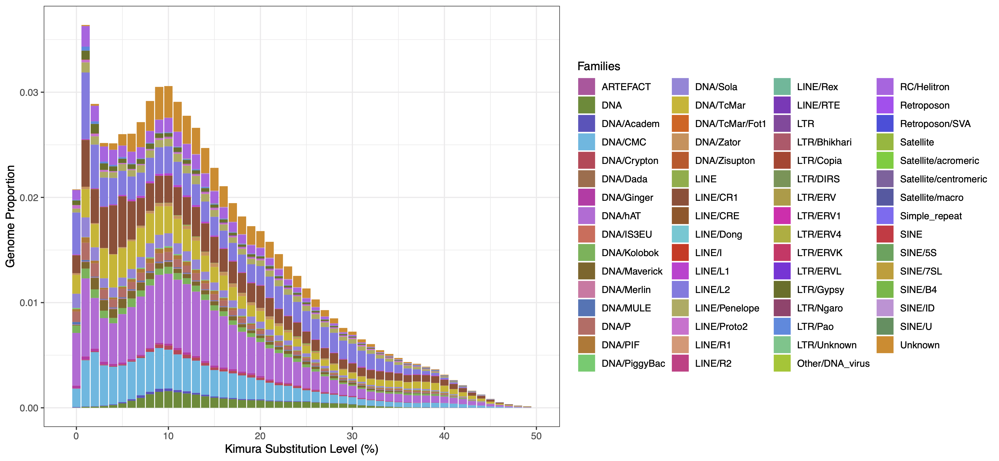
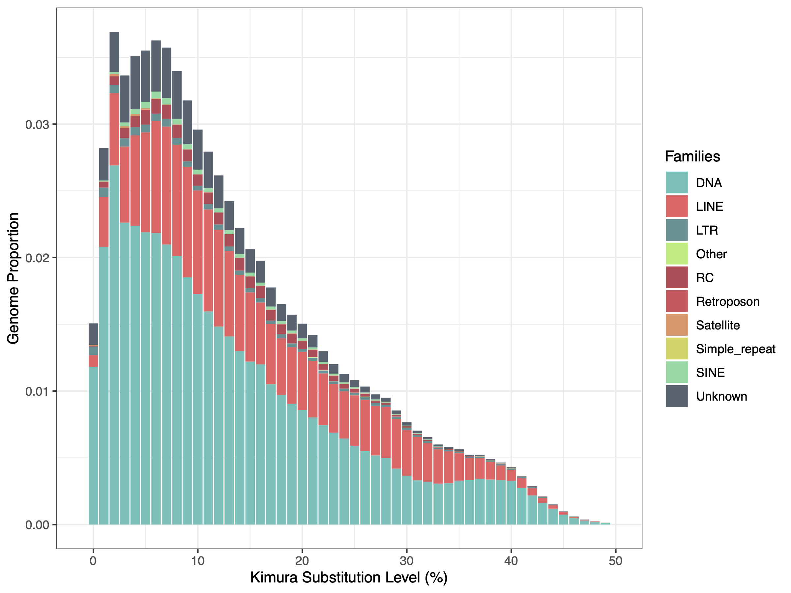
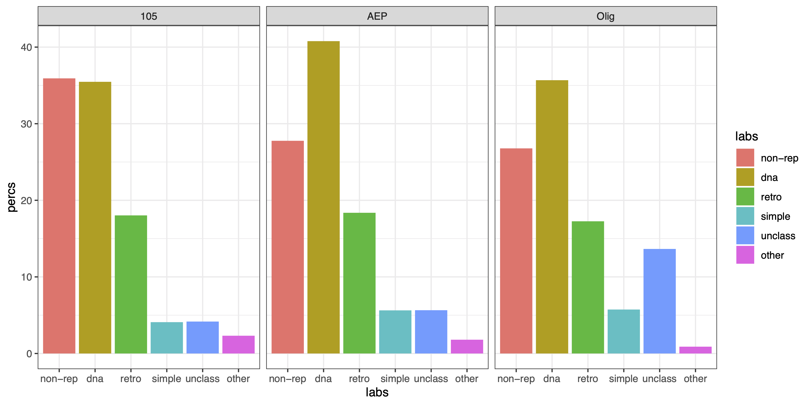

# Identifying and Masking Repetitive Regions in *Hydra* Genomes

This document covers our analysis of repetitive elements in *H. vulgaris* and *H. oligactis* genome assemblies. For the strain AEP *H. vulgaris* and the *H. oligactis* genomes, this included performing ab initio predictions of repeat families. RepeatMasker was then used to identify repetitive regions in the *H. oligactis* and strain AEP and strain 105 *H. vulgaris* genomes. The RepeatMasker output was also used to generate plots visualizing repeat landscapes in each genome.

[TOC]

## Masking Repeats in the Strain AEP *H. vulgaris* assembly

### Identifying Repeat Families Using RepeatModeler2

Currently, repeat databases lack extensive and well curated REs for *Hydra*, so using publicly available databases would likely miss a large portion of the repeats. We therefore used RepeatModeler2 (v2.0.1) to perform ab initio repeat family predictions for the AEP assembly.

Before running the primary RepeatModeler2 pipeline, we first had to index the genome fasta file:

(*01_aepRep/buildRMRef.sh*)

```bash
#! /bin/bash
#SBATCH -p med
#SBATCH --job-name=RMDB
#SBATCH -c 8
#SBATCH -t 60-0
#SBATCH --mem=16G
#SBATCH --error=RMDB.err
#SBATCH --output=RMDB.out

../../RepeatModeler-2.0.1/BuildDatabase -name aep aep.final.genome.fa
```

We then ran the RepeatModeler2 pipline with default settings, although we did include the optional LTR prediction pipeline:

(*01_aepRep/runRM.sh*)

```bash
#! /bin/bash
#SBATCH -p bigmemh
#SBATCH --job-name=RM
#SBATCH -c 16
#SBATCH -t 60-0
#SBATCH --mem=360G
#SBATCH --error=RM_%j.err
#SBATCH --output=RM_%j.out

export PATH="/home/jacazet/reference/makerAnnotations/RepeatMasker:$PATH"
export PATH="/home/jacazet/reference/makerAnnotations/RepeatModeler-2.0.1:$PATH"

../../RepeatModeler-2.0.1/RepeatModeler -database aep -pa 4 -LTRStruct
```

The resulting *Hydra*-specific repeat file (`consensi.fa.classified`, which was renamed to  `aep-families.fa`) was then used to mask the AEP assembly using RepeatMasker. 

### Masking Repeats using RepeatMasker

We used RepeatMasker (v4.0.7) to identify and mask repetitive sequences in the AEP assembly using repeat families predicted by RepeatModeler2:

(*01_aepRep/runRMaskFull.sh*)

```bash
#! /bin/bash
#SBATCH -p med
#SBATCH --job-name=RMask
#SBATCH -c 24
#SBATCH -t 60-0
#SBATCH --mem=0
#SBATCH --error=RMask_%j.err
#SBATCH --output=RMask_%j.out

module load singularity

singularity exec -B /home/jacazet/reference/makerAnnotations/aepAnnot/repMask ~/maker-plus_3.01.03.sif RepeatMasker -pa 24 -lib aep-families.fa aep.final.genome.fa
```

Because there may have been some repeat families that were missed by repeatmodeler, we also ran repeatmasker using the `eumetazoa` Dfam repeat database (included with RepeatMasker installation, Dfam version 3.1) to try and catch some of the missed repeats.

(*01_aepRep/runRMaskEuk.sh*)

```bash
#! /bin/bash
#SBATCH -p med
#SBATCH --job-name=RMask
#SBATCH -c 24
#SBATCH -t 60-0
#SBATCH --mem=0
#SBATCH --error=RMask_%j.err
#SBATCH --output=RMask_%j.out

module load singularity

singularity exec -B /home/jacazet/reference/makerAnnotations/aepAnnot/repMask ~/maker-plus_3.01.03.sif RepeatMasker -pa 8 -species eumetazoa aep.final.genome.fa                           
```

We then pooled the two masking results with the following command (note: the repeatmodeler results were moved to a folder called `maskFull` and the eumetazoa Dfam results were moved to a folder called `eukMaskFull`):

`zcat maskFull/*cat eukMaskFull/*cat > bothMaskFull.cat`

The pooled file was then processed to generate output files (including a hard masked fasta file and a repeat coordinates gff file) that combined the two masking results:

(*01_aepRep/processBothFull.sh*)

```bash
#! /bin/bash
#SBATCH -p med
#SBATCH --job-name=procRep
#SBATCH -c 4
#SBATCH -t 60-0
#SBATCH --mem=0
#SBATCH --error=process.err
#SBATCH --output=process.out

../../RepeatMasker/ProcessRepeats -a -species eumetazoa -gff bothMaskFull.cat
```

As part of this command, we included the `-a` flag, which created an optional alignment file needed to create the repeat landscape plots (used for visualization, described below).

The `ProcessRepeats` command generated the following statistics report:

(*excerpt from 01_aepRep/bothMaskFull.tbl*)

```bash
==================================================
file name: bothMaskFull
sequences:            15
total length:  900935055 bp  (900878955 bp excl N/X-runs)
GC level:        Unknown %
bases masked:  650780425 bp ( 72.23 %)
==================================================
               number of      length   percentage
               elements*    occupied  of sequence
--------------------------------------------------
Retroelements       369371    165530264 bp   18.37 %
   SINEs:            43707      5695511 bp    0.63 %
   Penelope          65254     20585629 bp    2.28 %
   LINEs:           303485    148934201 bp   16.53 %
    CRE/SLACS          337       180807 bp    0.02 %
     L2/CR1/Rex     213886    117270315 bp   13.02 %
     R1/LOA/Jockey     213        14587 bp    0.00 %
     R2/R4/NeSL       1837       450159 bp    0.05 %
     RTE/Bov-B        6756      1071405 bp    0.12 %
     L1/CIN4          1250        70123 bp    0.01 %
   LTR elements:     22179     10900552 bp    1.21 %
     BEL/Pao          2957      2360150 bp    0.26 %
     Ty1/Copia        2208       366647 bp    0.04 %
     Gypsy/DIRS1     13500      7818160 bp    0.87 %
       Retroviral     1945        70337 bp    0.01 %

DNA transposons     1053016    367413268 bp   40.78 %
   hobo-Activator   309698    120244440 bp   13.35 %
   Tc1-IS630-Pogo   150676     60159302 bp    6.68 %
   En-Spm                0            0 bp    0.00 %
   MuDR-IS905            0            0 bp    0.00 %
   PiggyBac           4586      2548041 bp    0.28 %
   Tourist/Harbinger  4140      1589641 bp    0.18 %
   Other (Mirage,    43967     16251064 bp    1.80 %
    P-element, Transib)

Rolling-circles      42095     15375012 bp    1.71 %

Unclassified:       190699     50938067 bp    5.65 %

Total interspersed repeats:   583881599 bp   64.81 %


Small RNA:           40214      5293672 bp    0.59 %

Satellites:           2407       613933 bp    0.07 %
Simple repeats:     505012     46346571 bp    5.14 %
Low complexity:      89006      4386174 bp    0.49 %
==================================================
```

Because some analyses require that only simple or only complex (i.e., interspersed) repeats be masked, we did additional repeatmasker runs to selectively mask just one of the two repeat types.

We first masked simple repeats using the repeatmodeler libraries:

(*01_aepRep/runRMaskSimple.sh*)

```bash
#! /bin/bash
#SBATCH -p med
#SBATCH --job-name=RMask
#SBATCH -c 24
#SBATCH -t 60-0
#SBATCH --mem=60G
#SBATCH --error=RMask_%j.err
#SBATCH --output=RMask_%j.out

module load singularity

singularity exec -B /home/jacazet/reference/makerAnnotations/aepAnnot/repMask ~/maker-plus_3.01.03.sif RepeatMasker \
        -noint \
        -pa 8 \
        -lib aep-families.fa \
        aep.final.genome.fa
        
```

Then we masked simple repeats using the Dfam eumetazoa library:

(*01_aepRep/runRMaskEukSmpl.sh*)

```bash
#! /bin/bash
#SBATCH -p med
#SBATCH --job-name=RMask
#SBATCH -c 24
#SBATCH -t 60-0
#SBATCH --mem=0
#SBATCH --error=RMask_%j.err
#SBATCH --output=RMask_%j.out

module load singularity

singularity exec -B /home/jacazet/reference/makerAnnotations/aepAnnot/repMask ~/maker-plus_3.01.03.sif RepeatMasker -noint -pa 8 -species eumetazoa aep.final.genome.fa
```

We then combined the repeatmasker output files:

`zcat eukMaskSimp/*cat.gz maskSimp/*cat.gz > bothMaskSimp.cat`

And generated the final masked product:

(*01_aepRep/processBothSimp.sh*)

```bash
#! /bin/bash
#SBATCH -p med
#SBATCH --job-name=procRep
#SBATCH -c 24
#SBATCH -t 60-0
#SBATCH --mem=0
#SBATCH --error=process.err
#SBATCH --output=process.out

../../RepeatMasker/ProcessRepeats -species eumetazoa -noint -gff bothMaskSimp.cat
```

We next performed interspersed/complex repeat masking, first with the repeatmodeler library:

(*01_aepRep/runRMaskCplx.sh*)

```bash
#! /bin/bash
#SBATCH -p med
#SBATCH --job-name=RMask
#SBATCH -c 24
#SBATCH -t 60-0
#SBATCH --mem=0
#SBATCH --error=RMask_%j.err
#SBATCH --output=RMask_%j.out

module load singularity

singularity exec -B /home/jacazet/reference/makerAnnotations/aepAnnot/repMask ~/maker-plus_3.01.03.sif RepeatMasker -nolow -norna -pa 24 -lib aep-families.fa aep.final.genome.fa
```

Then with the eumetazoa library:

(*01_aepRep/runRMaskEukCplx.sh*)

```bash
#! /bin/bash
#SBATCH -p med
#SBATCH --job-name=RMask
#SBATCH -c 24
#SBATCH -t 60-0
#SBATCH --mem=0
#SBATCH --error=RMask_%j.err
#SBATCH --output=RMask_%j.out

module load singularity

singularity exec -B /home/jacazet/reference/makerAnnotations/aepAnnot/repMask ~/maker-plus_3.01.03.sif RepeatMasker -nolow -norna -pa 8 -species eumetazoa aep.final.genome.fa
```

We then combined these two outputs:

`zcat eukMaskCplx/*cat.gz maskCplx/*cat.gz > bothMaskCplx.cat`

And generated the final masked files:

(*01_aepRep/processBothCplx.sh*)

```bash
#! /bin/bash
#SBATCH -p med
#SBATCH --job-name=procRep
#SBATCH -c 24
#SBATCH -t 60-0
#SBATCH --mem=0
#SBATCH --error=process.err
#SBATCH --output=process.out

../../RepeatMasker/ProcessRepeats -species eumetazoa -nolow -gff bothMaskCplx.cat
```

Finally, we created softmasked versions for all of the above repeatmasker runs using bedtools

```bash
bedtools maskfasta -fi aep.final.genome.fa -bed bothMaskFull.out.gff -fo aep.genome.fullsoft.fa -soft

bedtools maskfasta -fi aep.final.genome.fa -bed bothMaskCplx.out.gff -fo aep.genome.cplxsoft.fa -soft

bedtools maskfasta -fi aep.final.genome.fa -bed bothMaskSimp.out.gff -fo aep.genome.simpsoft.fa -soft
```

To enable visualization of repeat density throughout the AEP assembly, we generated a bigwig file that quantified the number of repeats present at each position along the genome (essentially just a binary classification). 

(*01_aepRep/repeatDensity.sh*)

```bash
#!/bin/bash

bedtools genomecov -i bothMaskCplx.out.gff -bga -g ../aep.genome > repDensity.bg

bedGraphToBigWig repDensity.bg ../aep.genome repDensity.bw
```

## Masking Repeats in the Strain 105 *H. vulgaris* assembly 

### Masking Repeats Using RepeatMasker

Because we wanted to use the 105 assembly as a point of comparison for the AEP assembly, and because we needed a repeat-masked version of the 105 assembly for our whole genome alignment (described in `07_genomeConservation.md`), we also performed repeat masking on the 2.0 version of the strain 105 *H. vulgaris* genome.

For the 105 assembly, we opted to just use the repeat families we identified using the AEP assembly. The two strains are relatively closely related, so our approach was likely sufficient to capture most repeats, with the caveat that certain very recent repeat families may have been missed.

Overall, our strain 105 masking approach was essentially identical to our approach for strain AEP.

We first masked with the repeatmodeler families:

(*02_105Rep/runRMaskFull105.sh*)

```bash
#! /bin/bash
#SBATCH -p bigmemm
#SBATCH --job-name=RMask
#SBATCH -c 60
#SBATCH -t 60-0
#SBATCH --mem=0
#SBATCH --error=RMask_%j.err
#SBATCH --output=RMask_%j.out

module load singularity

singularity exec -B /home/jacazet/reference/makerAnnotations/aepAnnot/repMask ~/maker-plus_3.01.03.sif RepeatMasker -pa 60 -lib aep-families.fa 105.fa
```

We then masked with the Dfam eumetazoa library:

(*02_105Rep/runRMaskEuk105.sh*)

```bash
#! /bin/bash
#SBATCH -p bigmemm 
#SBATCH --job-name=RMask
#SBATCH -c 60
#SBATCH -t 60-0
#SBATCH --mem=0
#SBATCH --error=RMask_%j.err
#SBATCH --output=RMask_%j.out

module load singularity

singularity exec -B /home/jacazet/reference/makerAnnotations/aepAnnot/repMask ~/maker-plus_3.01.03.sif RepeatMasker -pa 60 -species eumetazoa 105.fa
```

We combined the two outputs:

`zcat 105Full/*cat 105EukFull/*cat > bothMaskFull105.cat `

And generated combined output files:

(*02_105Rep/processBothFull105.sh*)

```bash
#! /bin/bash
#SBATCH -p med
#SBATCH --job-name=procRep
#SBATCH -c 24
#SBATCH -t 60-0
#SBATCH --mem=0
#SBATCH --error=process.err
#SBATCH --output=process.out

../../RepeatMasker/ProcessRepeats -a -species eumetazoa -gff bothMaskFull105.cat
```

This produced the following results table:

(*excerpt from 02_105Rep/bothMaskFull105.tbl*)

```bash
==================================================
file name: bothMaskFull105
sequences:          5525
total length:  853782670 bp  (786368896 bp excl N/X-runs)
GC level:        Unknown %
bases masked:  547108923 bp ( 64.08 %)
==================================================
               number of      length   percentage
               elements*    occupied  of sequence
--------------------------------------------------
Retroelements       343203    153928047 bp   18.03 %
   SINEs:            38473      4778739 bp    0.56 %
   Penelope          43347     14981775 bp    1.75 %
   LINEs:           284106    138174902 bp   16.18 %
    CRE/SLACS          479       303652 bp    0.04 %
     L2/CR1/Rex     216744    114131573 bp   13.37 %
     R1/LOA/Jockey     237        14748 bp    0.00 %
     R2/R4/NeSL       1677       325549 bp    0.04 %
     RTE/Bov-B        7339       902958 bp    0.11 %
     L1/CIN4           875        41858 bp    0.00 %
   LTR elements:     20624     10974406 bp    1.29 %
     BEL/Pao          2510      2314663 bp    0.27 %
     Ty1/Copia        2035       351580 bp    0.04 %
     Gypsy/DIRS1     13917      8132851 bp    0.95 %
       Retroviral     1466        59509 bp    0.01 %

DNA transposons     1006212    302842075 bp   35.47 %
   hobo-Activator   322359    101731995 bp   11.92 %
   Tc1-IS630-Pogo   126977     41903622 bp    4.91 %
   En-Spm                0            0 bp    0.00 %
   MuDR-IS905            0            0 bp    0.00 %
   PiggyBac           4049      1642422 bp    0.19 %
   Tourist/Harbinger  3888      1524997 bp    0.18 %
   Other (Mirage,    43726     14448428 bp    1.69 %
    P-element, Transib)

Rolling-circles      45342     19602116 bp    2.30 %

Unclassified:       155775     35584398 bp    4.17 %

Total interspersed repeats:   492354520 bp   57.67 %


Small RNA:           35432      4371768 bp    0.51 %

Satellites:           1203       153535 bp    0.02 %
Simple repeats:     458267     30537157 bp    3.58 %
Low complexity:      87404      4312296 bp    0.51 %
==================================================
```

We also generated a softmasked version of the genome fasta that was used for a cross-species whole-genome alignment:

```bash
bedtools maskfasta -fi 105.fa -bed bothMaskFull105.out.gff -fo 105.fullsoft.fa -soft
```

## Masking Repeats in the *H. oligactis* Assembly

### Identifying Repeat Families Using RepeatModeler2

As *H. oligactis* is somewhat distantly related to *H. vulgaris*, we opted to generate an *oligactis* specific repeat library using RepeatModeler2

First we prepped the *oligactis* fasta file:

(*03_oligRep/buildRMRefOlig.sh*)

```bash
#! /bin/bash
#SBATCH -p med
#SBATCH --job-name=RMDB
#SBATCH -c 8
#SBATCH -t 60-0
#SBATCH --mem=16G
#SBATCH --error=RMDB.err
#SBATCH --output=RMDB.out

../../RepeatModeler-2.0.1/BuildDatabase -name olig olig_genome.fa
```

We then executed the RepeatModeler2 pipeline using default settings.

Note that in the below script we're running the RepeatModeler2 pipeline through the dfam-tetools wrapper script, as opposed to the script `01_aepRep/runRM.sh` that executed RepeatModeler2 through a Singularity container. Ultimately, the actual command executed by the two scripts was identical.

(*03_oligRep/runRMolig.sh*)

```bash
#! /bin/bash
#SBATCH -p bigmemh
#SBATCH --job-name=RM
#SBATCH --exclusive
#SBATCH -t 60-0
#SBATCH --mem=0
#SBATCH --error=RM_%j.err
#SBATCH --output=RM_%j.out

module load singularity

./dfam-tetools.sh --singularity -- RepeatModeler -database olig -pa 8 -LTRStruct
```

For the *oligactis* genome, we found that we were not able to run the RepeatModeler2 pipeline in its entirety, as it would repeatedly crash during the LTR prediction step. Because the pipeline iteratively updates its repeat family predictions over the course of multiple rounds of analysis, and because LTR prediction is the last step in the pipeline, we were able to recover repeat predictions that were equivalent to the output of a normal RepeatModeler run without invoking the optional LTRPipeline step. We used this recovered repeat family file (`consensi.fa.classified`, which was renamed to `oligConsensi.fa.classified`) for subsequent repeatmasking of the *oligactis* assembly.

### Masking Repeats Using RepeatMasker

For the repeatmasking process, we applied the same basic approach as we did for the *H. vulgaris* genomes. 

We first masked the genome using our set of predicted repeat families from repeatmodeler:

(*03_oligRep/runRMaskFullOlig.sh*)

```bash
#! /bin/bash
#SBATCH -p bigmemm
#SBATCH --job-name=RMask
#SBATCH --exclusive
#SBATCH -t 60-0
#SBATCH --mem=0
#SBATCH --error=RMask_%j.err
#SBATCH --output=RMask_%j.out

module load singularity

singularity exec -B /home/jacazet/reference/makerAnnotations/aepAnnot/repMask ~/maker-plus_3.01.03.sif RepeatMasker -pa 24 -lib oligConsensi.fa.classified olig_genome.fa
```

We then performed an additional masking step using the Dfam eumetazoa repeat library:

(*03_oligRep/runOligMaskEuk.sh*)

```bash
#! /bin/bash
#SBATCH -p med
#SBATCH --job-name=RMask
#SBATCH -c 24
#SBATCH -t 60-0
#SBATCH --mem=0
#SBATCH --error=RMask_%j.err
#SBATCH --output=RMask_%j.out

module load singularity

singularity exec -B /home/jacazet/reference/makerAnnotations/aepAnnot/repMask ~/maker-plus_3.01.03.sif RepeatMasker -pa 8 -species eumetazoa olig_genome.fa
```

We combined these two results:

`zcat oligFullMask/*cat oligEuk/*cat > olig_genome_combined.fa.cat` 

And processed them to generate a final set of masked repeats:

(*03_oligRep/runProcessOlig.sh*)

```bash
#! /bin/bash
#SBATCH -p med
#SBATCH --job-name=procRep
#SBATCH -c 24
#SBATCH -t 60-0
#SBATCH --mem=0
#SBATCH --error=process.err
#SBATCH --output=process.out

../../RepeatMasker/ProcessRepeats -a -species eumetazoa -gff olig_genome_combined.fa.cat
```

This generated the following results table:

(*excerpt from olig_genome_combined.fa.tbl*)

```bash
==================================================
file name: olig_genome_combined.fa
sequences:         16314
total length: 1274417049 bp  (1274416349 bp excl N/X-runs)
GC level:        Unknown %
bases masked:  933076482 bp ( 73.22 %)
==================================================
               number of      length   percentage
               elements*    occupied  of sequence
--------------------------------------------------
Retroelements       520888    219974136 bp   17.26 %
   SINEs:            72040     10988275 bp    0.86 %
   Penelope          79044     29508788 bp    2.32 %
   LINEs:           411250    187430186 bp   14.71 %
    CRE/SLACS         1054       529458 bp    0.04 %
     L2/CR1/Rex     246444    132234354 bp   10.38 %
     R1/LOA/Jockey     530        40706 bp    0.00 %
     R2/R4/NeSL       1030       132656 bp    0.01 %
     RTE/Bov-B       61477     13385729 bp    1.05 %
     L1/CIN4          2277       128162 bp    0.01 %
   LTR elements:     37598     21555675 bp    1.69 %
     BEL/Pao          4480      4038527 bp    0.32 %
     Ty1/Copia        1615       765983 bp    0.06 %
     Gypsy/DIRS1     26775     16124509 bp    1.27 %
       Retroviral     3553       174452 bp    0.01 %

DNA transposons     1606844    454735555 bp   35.68 %
   hobo-Activator   584511    169281114 bp   13.28 %
   Tc1-IS630-Pogo   125711     40879334 bp    3.21 %
   En-Spm                0            0 bp    0.00 %
   MuDR-IS905            0            0 bp    0.00 %
   PiggyBac           6787      3201070 bp    0.25 %
   Tourist/Harbinger  7908      2077348 bp    0.16 %
   Other (Mirage,   122702     36281037 bp    2.85 %
    P-element, Transib)

Rolling-circles      33538     10277857 bp    0.81 %

Unclassified:       546844    173957948 bp   13.65 %

Total interspersed repeats:   848667639 bp   66.59 %


Small RNA:           70798     10576788 bp    0.83 %

Satellites:           3860       789681 bp    0.06 %
Simple repeats:     814707     66381562 bp    5.21 %
Low complexity:     133217      6708423 bp    0.53 %
==================================================
```

We also generated a softmasked version of the genome fasta for subsequent gene prediction analyses.

```bash
bedtools maskfasta -fi olig_genome.fa -bed fullOligMask.out.gff -fo olig_genome.sm.fa -soft
```

## Visualizing Repeat Prediction Results 

To visualize our repeat annotation results, we generated repeat landscape plots, which use sequence divergence in individual repeat instances throughout a genome to infer the history of transposition events.

To generate repeat landscapes, we used the `.align` files generated by the repeatmasker `ProcessRepeats` function.  Repeatmasker has built in functionality both to calculate the divergence statistics needed to create a repeat landscape (saved in a `.divsum` file) and to generate interactive plots of the results (saved as a `.html` file).

We ran these utility functions for all three genomes we had used for repeatmasker runs. First for the AEP assembly:

(*04_visRep/calcKimura.sh*)

```bash
#! /bin/bash
#SBATCH -p med
#SBATCH --job-name=repland
#SBATCH -c 1
#SBATCH -t 60-0
#SBATCH --mem=16G
#SBATCH --error=repland.err
#SBATCH --output=repland.out

perl ../../RepeatMasker/util/calcDivergenceFromAlign.pl -s aep.divsum bothMaskFull.align
perl ../../RepeatMasker/util/createRepeatLandscape.pl -g 900935055 -div aep.divsum > aepRepLand.html
```

Then the 105 assembly:

(*04_visRep/calcKimura105.sh*)

```bash
#! /bin/bash
#SBATCH -p med
#SBATCH --job-name=repland
#SBATCH -c 1
#SBATCH -t 60-0
#SBATCH --mem=16G
#SBATCH --error=repland.err
#SBATCH --output=repland.out

perl ../../RepeatMasker/util/calcDivergenceFromAlign.pl -s 105.divsum bothMaskFull105.align
perl ../../RepeatMasker/util/createRepeatLandscape.pl -g 853782670 -div 105.divsum > 105RepLand.html
```

Then the *oligactis* assembly:

(04_visRep/calcKimuraOlig.sh)

```bash
#! /bin/bash
#SBATCH -p med
#SBATCH --job-name=repland
#SBATCH -c 1
#SBATCH -t 60-0
#SBATCH --mem=16G
#SBATCH --error=repland.err
#SBATCH --output=repland.out

perl ../../RepeatMasker/util/calcDivergenceFromAlign.pl -s olig.divsum olig_genome_combined.fa.align
perl ../../RepeatMasker/util/createRepeatLandscape.pl -g 1274417049 -div olig.divsum > oligRepLand.html
```

We wanted to customize the repeat landscape plots, so we extracted the relevant results table from each `.divsum` file:

```bash
csplit -f aepDiv aep.divsum '/Coverage for each repeat/' '{0}' && sed '1d' aepDiv01 > kimuraAEP.txt && rm aepDiv0*
csplit -f 105Div 105.divsum '/Coverage for each repeat/' '{0}' && sed '1d' 105Div01 > kimura105.txt && rm 105Div0*
csplit -f oligDiv olig.divsum '/Coverage for each repeat/' '{0}' && sed '1d' oligDiv01 > kimuraOlig.txt && rm oligDiv0*
```

We then used the following R script to generated stacked bar graphs of each genome's repeat landscape. We generated two plots per genome: one that grouped repeats by class (e.g., DNA element, retro-element, etc.) and one that grouped repeats by family (CR1, LTR, Mariner, etc.).

(*04_visRep/kimuraPlot.R*)

```R
library(rstudioapi)
library(ggplot2)
library(RColorBrewer)

setwd(dirname(getActiveDocumentContext()$path))

kimP <- function(pref,size){
  
  #get file name that has repeat landscape
  fname <- paste0('kimura',pref,'.txt')
  
  #import data
  kDat <- read.delim(fname,sep = ' ')
  
  #drop a weird last column thats all NAs
  kDat <- kDat[,-ncol(kDat)]
  
  #restructure the data so that all the columns 
  #get combined into a single row, with an 
  #additional column to indicate the repeat 
  #class
  kDat.plot <- lapply(2:ncol(kDat),function(x){
    newDF <- kDat[,c(1,x)]
    colnames(newDF) <- c('perc','cov')
    newDF$ident <- colnames(kDat)[x]
    return(newDF)
  })
  
  kDat.plot <- do.call(rbind,kDat.plot)
  
  #combine results from repeat subfamilies
  kDat.plot$ident <- gsub('[.].*','',kDat.plot$ident)
  
  kDat.plot <- aggregate(kDat.plot$cov,list(kDat.plot$perc,kDat.plot$ident),sum)
  
  colnames(kDat.plot) <- c('perc','ident','cov')
  
  #calculate percent coverage based on genome size
  kDat.plot$cov <- kDat.plot$cov/size
  
  #drop RNA results (things like small RNAs and whatnot)
  kDat.plot <- kDat.plot[!grepl('RNA',kDat.plot$ident),]
  
  #drop artefact results
  kDat.plot <- kDat.plot[!grepl('ARTEFACT',kDat.plot$ident),]
  
  #define colors used in plot
  colourCount <- length(unique(kDat.plot$ident))
  pal <- colorRampPalette(c('#556270','#4ECDC4','#C7F464','#FF6B6B','#C44D58'))(colourCount)
  set.seed(12345)
  pal <- sample(pal)
  
  #generate stacked bar plot of repeat landscape
  ggplot(kDat.plot,aes(x=perc,y=cov,fill=ident)) + 
    geom_bar(stat="identity", position = position_stack(reverse = TRUE)) + 
    scale_fill_manual(name="Families", values = pal) +
    xlim(-1,50) +
    labs(x="Kimura Substitution Level (%)", y="Genome Proportion") + theme_bw()
  
  #save plot
  pname <- paste0('repFamKimura',pref,'.pdf')
  ggsave(pname,width=8,height=6)
  
  
  #repeat the plot data formating process
  kDat.plot <- lapply(2:ncol(kDat),function(x){
    newDF <- kDat[,c(1,x)]
    colnames(newDF) <- c('perc','cov')
    newDF$ident <- colnames(kDat)[x]
    return(newDF)
  })
  
  kDat.plot <- do.call(rbind,kDat.plot)
  
  #this time we'll keep most of the subfamily information
  #we'll just drop the subfamily number
  kDat.plot$ident <- gsub('(^[^.]+[.][^.]+)[.].*','\\1',kDat.plot$ident)
  
  #fix some formatting issues with extra dots
  kDat.plot$ident <- gsub('[.]+','.',kDat.plot$ident)
  
  kDat.plot$ident <- gsub('[.]$','',kDat.plot$ident)
  
  #dot to slash for clarity/readability
  kDat.plot$ident <- gsub('[.]','/',kDat.plot$ident)
  
  #collapse data based on subfamilies
  kDat.plot <- aggregate(kDat.plot$cov,list(kDat.plot$perc,kDat.plot$ident),sum)
  
  colnames(kDat.plot) <- c('perc','ident','cov')
  
  #normalize values by total genome size
  kDat.plot$cov <- kDat.plot$cov/size
  
  #drop RNA repeats
  kDat.plot <- kDat.plot[!grepl('RNA',kDat.plot$ident),]
  
  #generate color set for plotting
  colourCount <- length(unique(kDat.plot$ident))
  #pal <- colorRampPalette(c('#556270','#4ECDC4','#C7F464','#FF6B6B','#C44D58'))(colourCount)
  pal <- c("#ea6519","#494edc","#43cd2d","#8732d9","#97c61d","#b94ff1",
           "#4fb83c","#d640d2","#31cb6b","#ed2bb1","#88b930","#8b36bb",
           "#cdb623","#846bf2","#b0b034","#bc65e2","#5bb354","#ce3aa8",
           "#85af42","#5d53bd","#e08d24","#577ff0","#c99f30","#877ce1",
           "#5e8b2f","#c66dd7","#47a45a","#df73d1","#4fc58a","#e3371f",
           "#36c8d4","#e03842","#38b99a","#e23568","#34b9e1","#d05827",
           "#468ae0","#c07a30","#5558a4","#b49c40","#92489f","#6f9554",
           "#da3f87","#4c905e","#c056a0","#677021","#9b87da","#b0ad5f",
           "#4375b7","#bd442f","#66a1e5","#a05624","#cb94d6","#846625",
           "#87629f","#d7935a","#a4426e","#e69976","#e07aa5","#ab6f4b",
           "#ce4858","#9d4f35","#c3586b","#e36f5b","#c76e66")
  set.seed(3821)
  pal <- sample(pal)
  
  #generate subfamily repeat landscape stacked barplot
  ggplot(kDat.plot,aes(x=perc,y=cov,fill=ident)) + 
    geom_bar(stat="identity", position = position_stack(reverse = TRUE)) + 
    scale_fill_manual(name="Families", values = pal) +
    xlim(-1,50) +
    labs(x="Kimura Substitution Level (%)", y="Genome Proportion") + theme_bw()
  
  pname <- paste0('repSubFamKimura',pref,'.pdf')
  ggsave(pname,width=13,height=6)
}

prefs <- list(c('105',786368896),c('AEP',900878955),c('Olig',1274416349))

lapply(prefs, function(x) kimP(x[1],as.numeric(x[2])))
```

(AEP repeats grouped by class)


(AEP repeats grouped by family)



(105 repeats grouped by class)



(105 repeats grouped by family)


(*oligactis* repeats grouped by class)


(*oligactis* repeats grouped by family)


Finally, we also generated a simple bar plot summarizing the repeat composition of each genome using the result tables generated by the repeatmasker `ProcessRepeats` function:

(*04_visRep/repPercPlots.R*)

```R
library(rstudioapi)
library(ggplot2)

setwd(dirname(getActiveDocumentContext()$path))

#import repeatmasker tables
#(results from both eumetazoa lib and AEP/olig repeatmodeler libs)
fileNames <- c('bothMaskFull.tbl','bothMaskFull105.tbl','olig_genome_combined.fa.tbl')

#function to extract percentage from character string and convert it to numeric data
getPerc <- function(x){
  return(as.numeric(gsub('.*?([^ ]+) \\%$','\\1',x)))
}

#function to extract repeat statistics from repeatmasker tables
percPlot <- function(x){
  
  #import results table text as a character vector
  #one string per line
  rp <- readLines(x)
  
  #extract the percentage of total bases masked
  tmask <- as.numeric(gsub('.*\\((.*)\\%\\).*','\\1',rp[6]))
  
  #extract percentages of masked repeats that were:
  #retroelements, DNA transposons, Unclassified, simple repeats, or low complexity
  percs <- vapply(c(11,27,39,47,48), function(x) getPerc(rp[x]), numeric(1))
  
  #combine simple and low complexity repeats into a single metric
  #also calculate the percent of genome that was non repetitive
  #and the repeats that didn't fit into one of the named categories
  percs <- c(percs[1:3],percs[4] + percs[5],100-tmask,tmask-sum(percs))
  
  fNames <- c('retro','dna','unclass','simple','non-rep','other')
  
  return(data.frame(labs = factor(fNames,fNames[c(5,2,1,4,3,6)]),
                    percs = percs))
}

#combine results from the three different genomes into a single df for plotting
plotDF <- rbind(percPlot(fileNames[1]), percPlot(fileNames[2]), percPlot(fileNames[3]))
#label the species of origin for all the statistics
plotDF$spec <- rep(c('AEP','105','Olig'),c(6,6,6))

#generate barplots of repeat percentages, split by species
ggplot(plotDF,aes(x=labs,y=percs,fill=labs)) + geom_col() + facet_wrap(.~spec) + theme_bw()
ggsave('repPercBar.pdf',width = 10,height = 5)
```



## Files Associated with This Document


```
02_repeatMasking/
├── 01_aepRep
│   ├── aep-families.fa
				AEP Repeat families identified by RepeatModeler2
│   ├── aep.genome.cplxsoft.fa
				AEP genome assembly with interspersed/complex repeats soft-masked
│   ├── aep.genome.fullsoft.fa
				AEP genome assembly with all repeats soft-masked
│   ├── aep.genome.simpsoft.fa
				AEP genome assembly with simple repeats soft-masked
│   ├── bothMaskCplx.cat
				Combined RepeatMasker output from runRMaskCplx.sh and runRMaskEukCplx.sh. Targets
				all complex/interspersed repeats in the AEP genome.
│   ├── bothMaskCplx.out.gff
				Genome coordinates file for all complex/interspersed repeats in the AEP genome.
│   ├── bothMaskFull.align
				AEP repeat alignments. Used to generate the AEP repeat landscape.
│   ├── bothMaskFull.cat
				Combined RepeatMasker output from runRMaskFull.sh and runRMaskEuk.sh. Targets
				all repeats in the AEP genome.
│   ├── bothMaskFull.out.gff
				Genome coordinates file for all repeats in the AEP genome.
│   ├── bothMaskFull.tbl
				Repeat masking report detailing the repeat makeup of the AEP genome.
│   ├── bothMaskSimp.cat
				Combined RepeatMasker output from runRMaskSimple.sh and runRMaskEukSmpl.sh. Targets
				all simple repeats in the AEP genome.
│   ├── bothMaskSimp.out.gff
				Genome coordinates file for all simple repeats in the AEP genome.
│   ├── buildRMRef.sh
				Shell script to prep the AEP genome fasta file for RepeatModeler2
│   ├── processBothCplx.sh
				Shell script that integrates masking results for all complex/interspersed repeats 
				identified by runRMaskCplx.sh and runRMaskEukCplx.sh.
│   ├── processBothFull.sh
				Shell script that integrates masking results for all repeats identified by 
				runRMaskFull.sh and runRMaskEuk.sh.
│   ├── processBothSimp.sh
				Shell script that integrates masking results for all simple repeats identified 
				by runRMaskCplx.sh and runRMaskEukCplx.sh.
│   ├── repDensity.bw
				Bigwig file that shows the number of repetitive elements identified at each 
				position in the AEP genome assembly.
│   ├── repeatDensity.sh
				Shell script that quantifies the number of repetitive elements present at each
				position in the AEP genome assembly and outputs the results as a bigwig file.
│   ├── runRMaskCplx.sh
				Shell script that uses the RepeatModeler2 repeat families to identify and mask
				complex/interspersed repeats in the AEP genome.
│   ├── runRMaskEukCplx.sh
				Shell script that uses the Dfam eumetazoa repeat families to identify and mask
				complex/interspersed repeats in the AEP genome.
│   ├── runRMaskEuk.sh
				Shell script that uses the Dfam eumetazoa repeat families to identify and mask
				all repeats in the AEP genome.
│   ├── runRMaskEukSmpl.sh
				Shell script that uses the Dfam eumetazoa repeat families to identify and mask
				all simple repeats in the AEP genome.
│   ├── runRMaskFull.sh
				Shell script that uses the RepeatModeler2 repeat families to identify and mask
				all repeats in the AEP genome.
│   ├── runRMaskSimple.sh
				Shell script that uses the RepeatModeler2 repeat families to identify and mask
				all simple repeats in the AEP genome.
│   └── runRM.sh
				Shell script that runs the RepeatModeler2 pipeline on the AEP genome.
├── 02_105Rep
│   ├── 105.fullsoft.fa
				Strain 105 genome assembly with all repeats soft-masked.
│   ├── bothMaskFull105.align
				Strain 105 repeat alignments. Used to generate the strain 105 repeat landscape.
│   ├── bothMaskFull105.cat
				Combined RepeatMasker output from runRMaskEuk105.sh and runRMaskFull105.sh. Targets
				all repeats in the strain 105 genome.
│   ├── bothMaskFull105.out.gff
				Genome coordinates file for all repeats in the strain 105 genome.
│   ├── bothMaskFull105.tbl
				Repeat masking report detailing the repeat makeup of the strain 105 genome.
│   ├── processBothFull105.sh
				Shell script that integrates masking results for all repeats identified by 
				runRMaskFull105.sh and runRMaskEuk105.sh.
│   ├── runRMaskEuk105.sh
				Shell script that uses the strain Dfam eumetazoa repeat families to identify 
				and mask all repeats in the strain 105 genome.
│   └── runRMaskFull105.sh
				Shell script that uses the strain AEP RepeatModeler2 repeat families to identify 
				and mask all repeats in the strain 105 genome.
├── 03_oligRep
│   ├── buildRMRefOlig.sh
				Shell script to prep the oligactis genome fasta file for RepeatModeler2
│   ├── oligConsensi.fa.classified
				oligactis Repeat families identified by RepeatModeler2
│   ├── olig_genome_combined.fa.align
				oligactis repeat alignments. Used to generate the oligactis repeat landscape.
│   ├── olig_genome_combined.fa.cat
				Combined RepeatMasker output from runRMaskFullOlig.sh and runOligMaskEuk.sh. Targets
				all repeats in the oligactis genome.
│   ├── olig_genome_combined.fa.out.gff
				Genome coordinates file for all repeats in the oligactis genome.
│   ├── olig_genome_combined.fa.tbl
				Repeat masking report detailing the repeat makeup of the oligactis genome.
│   ├── olig_genome.fullsoft.fa
				oligactis genome assembly with all repeats soft-masked
│   ├── runOligMaskEuk.sh
				Shell script that uses the strain Dfam eumetazoa repeat families to identify 
				and mask all repeats in the oligactis genome.
│   ├── runProcessOlig.sh
				Shell script that integrates masking results for all repeats identified by 
				runRMaskFullOlig.sh and runOligMaskEuk.sh.
│   ├── runRMaskFullOlig.sh
				Shell script that uses the strain oligactis RepeatModeler2 repeat families to 
				identify and mask all repeats in the strain 105 genome.
│   └── runRMolig.sh
				Shell script that runs the RepeatModeler2 pipeline on the oligactis genome.
└── 04_visRep
    ├── 105.divsum
    		Repeat alignment statistics calculated from bothMaskFull105.align
    ├── aep.divsum
    		Repeat alignment statistics calculated from bothMaskFull.align
    ├── calcKimura105.sh
    		Shell script that calculates repeat alignment statistics and generates a 
    		repeat landscape for the strain 105 genome.
    ├── calcKimuraOlig.sh
    		Shell script that calculates repeat alignment statistics and generates a 
    		repeat landscape for the oligactis genome.
    ├── calcKimura.sh
    		Shell script that calculates repeat alignment statistics and generates a 
    		repeat landscape for the strain AEP genome.
    ├── kimura105.txt
    		Table extracted from 105.divsum that was used to generate the strain 105 
    		kimura plot
    ├── kimuraAEP.txt
    		Table extracted from aep.divsum that was used to generate the strain AEP 
    		kimura plot
    ├── kimuraOlig.txt
    		Table extracted from olig.divsum that was used to generate the oligactis 
    		kimura plot
    ├── kimuraPlot.R
    		R script that generates kimura plots using the divsum stats for the oligactis
    		and strain 105 and strain AEP vulgaris genomes.
    ├── olig.divsum
    		Repeat alignment statistics calculated from olig_genome_combined.fa.align
    └── repPercPlots.R
    		R script that generates simple bar plots summarizing the statistics in the 
    		repeatmasker .tbl files for oligactis and the strain 104 and AEP vulgaris
    		genomes.
```

