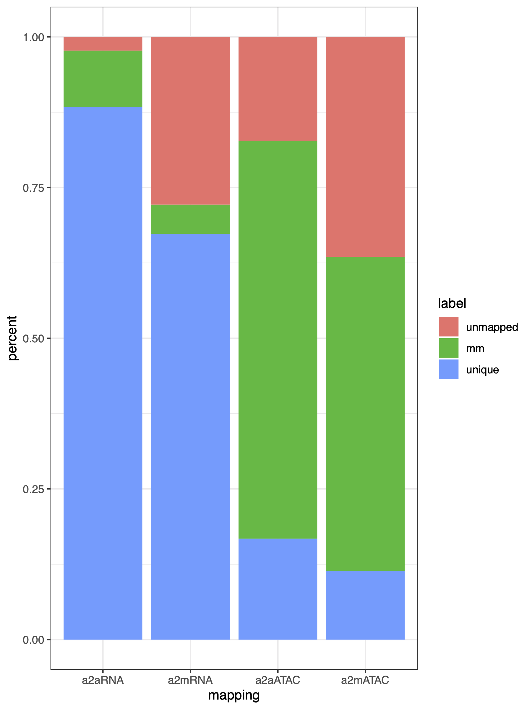

# AEP Genome Gene Model Generation

This document covers the generation of gene models for the strain AEP *H. vulgaris* genome assembly from repeat annotation to final gene models. It also covers the generation of functional annotations for the AEP gene models. Finally, this document describes the approach to benchmark ATAC-seq and RNA-seq read mapping efficiency for the 105 and AEP assemblies. The starting point for this document is the finalized, non-masked AEP assembly. The creation of which is described in `01_aepGenomeAssembly.md`. 

This gene model prediction process entailed generating an initial set of annotations with BRAKER2 using protein hints from a custom metazoan proteome database and transcript hints using whole animal *Hydra* RNA-seq data. We then supplemented these gene models with a second set of predictions generated with exonerate using the *Hydra* LRv2 transcriptome and a custom database of *Hydra* GenBank mRNA sequences. The final set of gene models was generated with the PASA pipeline by using a new transcriptome assembly to augment the splice isoform and UTR annotations. We generated functional annotations using OrthoFinder, InterProScan, and BLAST searches.

[TOC]

## Generating Hints for Gene Predictions

### Transcriptomic Hints

#### Aligning Whole-Animal RNA-seq Data to the AEP Assembly

To provide transcriptomic data for the gene prediction software, we made use of four paired end whole animal RNA-seq libraries generated from various AEP-derived transgenic lines. In the file names below, W indicates data from the watermelon line, O indicates data from the operon line, IW indicates data from the inverse watermelon line, and E indicates data from the enGreen1 line.

```bash
WHOLE_W_CGATGT_L006_R2_all.fastq.gz
WHOLE_W_CGATGT_L006_R1_all.fastq.gz
WHOLE_O_ACAGTG_L006_R2_all.fastq.gz
WHOLE_O_ACAGTG_L006_R1_all.fastq.gz
WHOLE_IW_TGACCA_L006_R2_all.fastq.gz
WHOLE_IW_TGACCA_L006_R1_all.fastq.gz
WHOLE_E_GCCAAT_L006_R2_all.fastq.gz
WHOLE_E_GCCAAT_L006_R1_all.fastq.gz
```

In addition we generated two PE RNA-seq libraries from whole male and female Kiel AEP polyps (non-transgenic):

```bash
F3_S21_L001_R1_001.fastq.gz
F3_S21_L001_R2_001.fastq.gz
M3_S22_L001_R2_001.fastq.gz
M3_S22_L001_R1_001.fastq.gz
```

Prior to performing the analysis the file names were simplified as follows:

```bash
W_R1.fastq.gz
W_R2.fastq.gz
O_R1.fastq.gz
O_R2.fastq.gz
IW_R1.fastq.gz
IW_R2.fastq.gz
E_R1.fastq.gz
E_R2.fastq.gz
F3_R1.fastq.gz
F3_R2.fastq.gz
M3_R1.fastq.gz
M3_R2.fastq.gz
```

Reads were then processed with trimmomatic (v0.36) to remove low quality base calls and sequencing adapter contamination

(*01_prepHints/trim.sh*)

```bash
#! /bin/bash
#SBATCH --job-name=trim
#SBATCH -c 32
#SBATCH -t 60-0
#SBATCH --mem=36G
#SBATCH --error=trim.err
#SBATCH --output=trim.out

module load trimmomatic

prefixes=( E F3 IW M3 O W )

for arg in "${prefixes[@]}"
do
        java -jar /share/apps/Trimmomatic-0.36//trimmomatic-0.36.jar PE -threads 32 \
                reads/"$arg"_R1.fastq.gz reads/"$arg"_R2.fastq.gz \
                reads/"$arg"_R1_trim_p_fq.gz reads/"$arg"_R1_trim_up_fq.gz \
                reads/"$arg"_R2_trim_p_fq.gz reads/"$arg"_R2_trim_up_fq.gz \
                ILLUMINACLIP:./adapters.fa:2:30:10:2:keepBothReads LEADING:3 TRAILING:3 MINLEN:36
done
```

Following processing, R1 and R2 files were pooled:

```bash
cat *1_trim_p*gz > combined_R1.fq.gz
cat *2_trim_p*gz > combined_R2.fq.gz
```

We then prepped the AEP genome (with interspersed repeats hard-masked) for mapping with STAR (v2.7.5c)

(*01_prepHints/makeRef.sh*)

```bash
#! /bin/bash
#SBATCH --job-name=makeRef
#SBATCH -c 24
#SBATCH -t 60-0
#SBATCH --mem=36G
#SBATCH --error=makeRef.err
#SBATCH --output=makeRef.out
#SBATCH -p med

STAR --version

STAR --runThreadN 24 \
        --runMode genomeGenerate \
        --genomeDir ./ref \
        --genomeFastaFiles aep.genome.cplxmask.fa \
        --genomeSAindexNbases 13
```

Next, we mapped the reads to the genome:

(*01_prepHints/runAlign.sh*)

```bash
#! /bin/bash
#SBATCH -p med 
#SBATCH --job-name=align
#SBATCH -t 60-0
#SBATCH --nodes=1
#SBATCH --mem=0
#SBATCH --exclusive
#SBATCH --error=align.err
#SBATCH --output=align.out

STAR --version

STAR --runThreadN 20 \
        --genomeDir ./ref \
        --readFilesIn ../reads/combined_R1.fq.gz ../reads/combined_R2.fq.gz \
        --readFilesCommand gunzip -c \
        --outFileNamePrefix ./out/aep \
        --outSAMprimaryFlag AllBestScore \
        --outSAMtype BAM SortedByCoordinate \
        --twopassMode Basic \
        --outFilterScoreMinOverLread 0.3 \
        --outFilterMatchNminOverLread 0.3 \
        --limitBAMsortRAM 12316579964
```

#### Generating an AEP Transcriptome for Use in Gene Predictions

To aid in later genome annotation steps we also generated a transcriptome using this genome-mapped RNA-seq data. Although we had already generated an AEP transcriptome (LRv2 transcriptome, Siebert et al., 2019), it was not produced using any data from animals undergoing gametogenesis. This could possibly cause us to miss some transcripts specific to male or female polyps. In addition, the transcriptome was designed to have 'low redundancy', and may have omitted some splicing complexity. 

We therefore sought to generate a new transcriptome that both incorporated reads from polyps producing gametes and included the full possible transcriptomic complexity in adult *Hydra*. 

To generate the transcriptome, the mapped reads from the previous section were provided as input to the Trinity reference-guided transcriptome assembly pipeline (v2.11.0)

(*01_prepHints/runTrinity.sh*)

```bash
#! /bin/bash -l
#SBATCH -p med
#SBATCH --job-name=trinity
#SBATCH -c 24
#SBATCH -t 60-0
#SBATCH --mem=0
#SBATCH --error=trinity.err
#SBATCH --output=trinity.out

source ~/perl5/perlbrew/etc/bashrc

source venv/bin/activate

module load jellyfish

which perl

which bowtie2

$TRINITY_HOME/Trinity --genome_guided_bam ../align/out/aepAligned.sortedByCoord.out.bam \
         --genome_guided_max_intron 20000 \
         --max_memory 60G --CPU 24 \
         --SS_lib_type RF
```

Quantifying BUSCO (v5.beta_cv1) metrics for the transcriptome indicated high levels of redundancy (to be expected in a relatively unprocessed transcriptome), but high levels of overall completeness:

```bash
docker run -u $(id -u) -v $(pwd):/busco_wd ezlabgva/busco:v5.beta_cv1 busco -c 4 -m tran -i Trinity-GG.fasta -o trinity -l metazoa_odb10 -f 

	C:95.8%[S:54.1%,D:41.7%],F:0.8%,M:3.4%,n:954	   
	914	Complete BUSCOs (C)			   
	516	Complete and single-copy BUSCOs (S)	   
	398	Complete and duplicated BUSCOs (D)	   
	8	Fragmented BUSCOs (F)			   
	32	Missing BUSCOs (M)			   
	954	Total BUSCO groups searched		
```

### Compiling a Protein Hints Database

Protein sequences from both closely and distantly related species can also provide valuable guides for gene prediction software. Our goal was to make use of diverse metazoan proteomes, with a particular focus on cnidarian species. We downloaded the following proteomes to serve as hints for gene prediction:

```bash
A_diaphana.fa 
https://ftp.ncbi.nlm.nih.gov/genomes/refseq/invertebrate/Exaiptasia_diaphana/latest_assembly_versions/GCF_001417965.1_Aiptasia_genome_1.1/

A_queenslandica.fa 
https://metazoa.ensembl.org/Amphimedon_queenslandica/Info/Index

A_vaga.fa 
https://metazoa.ensembl.org/Adineta_vaga/Info/Index

B_lanceolatum.fa 
https://metazoa.ensembl.org/Branchiostoma_lanceolatum/Info/Index

B_mori.fa 
https://metazoa.ensembl.org/Bombyx_mori/Info/Index

C_elegans.fa 
https://uswest.ensembl.org/Caenorhabditis_elegans/Info/Index

C_hemisphaerica.fa 
http://marimba.obs-vlfr.fr/node/237574

C_intestinalis.fa 
https://uswest.ensembl.org/Ciona_intestinalis/Info/Index

C_milii.fa 
https://uswest.ensembl.org/Callorhinchus_milii/Info/Index

D_melanogaster.fa 
https://uswest.ensembl.org/Drosophila_melanogaster/Info/Index

D_pulex.fa
https://metazoa.ensembl.org/Daphnia_pulex/Info/Annotation/

E_muelleri.fa 
https://spaces.facsci.ualberta.ca/ephybase/

G_gallus.fa 
https://uswest.ensembl.org/Gallus_gallus/Info/Index

H_circumcincta.fa (obtained from authors of the study via personal communication)
https://www.pnas.org/content/116/46/22915

H_echinata.fa 
https://research.nhgri.nih.gov/hydractinia/

H_miamia.fa
https://metazoa.ensembl.org/Hofstenia_miamia/Info/Index?db=core

H_oligactis.fa (obtained from authors of the study via personal communication)
https://www.pnas.org/content/116/46/22915

H_sapiens.fa 
https://uswest.ensembl.org/Homo_sapiens/Info/Index

H_viridissima.fa
https://marinegenomics.oist.jp/hydra_viridissima_a99/viewer/download?project_id=82

H_vulgaris105.fa
https://arusha.nhgri.nih.gov/hydra/download/genemodels_proteins/hydra2.0_genemodels.aa.gz

H_vulgarisZurich.fa (obtained from authors of the study via personal communication)
https://www.pnas.org/content/116/46/22915

L_chalumnae.fa
https://uswest.ensembl.org/Latimeria_chalumnae/Info/Index

L_oculatus.fa
https://uswest.ensembl.org/Lepisosteus_oculatus/Info/Index

M_leidyi.fa
https://research.nhgri.nih.gov/mnemiopsis/download/download.cgi?dl=proteome

M_virulenta.fa
https://marinegenomics.oist.jp/morbakka_virulenta/viewer/download?project_id=70

N_vectensis.fa 
https://simrbase.stowers.org/

O_bimaculoides.fa
https://metazoa.ensembl.org/Octopus_bimaculoides/Info/Index

P_bachei.fa 
https://neurobase.rc.ufl.edu/Pleurobrachia/download

P_marinus.fa 
https://uswest.ensembl.org/comm_marinus

P_miniata.fa 
http://legacy.echinobase.org/Echinobase/PmDownload

P_naikaiensis.fa
http://gigadb.org/dataset/100564

S_callimorphus.fa
https://simrbase.stowers.org/

S_mediterranea.fa
https://planosphere.stowers.org/smedgd

S_purpuratus.fa
https://metazoa.ensembl.org/Strongylocentrotus_purpuratus/Info/Index

T_adhaerens.fa
http://metazoa.ensembl.org/Trichoplax_adhaerens/Info/Index

X_tropicalis.fa 
https://uswest.ensembl.org/Xenopus_tropicalis/Info/Index
```

#### Translating transcriptome sources into proteomes

Notably the files `H_vulgarisZurich.fa`, `H_oligactis.fa `, `H_circumcincta.fa`, and `H_echinata.fa` were transcriptomes, and therefore needed to be translated into protein sequences first. We translated these files using Transdecoder. 

##### Creating a Custom Protein Database to Guide ORF Selection

To guide Transdecoder's selection of possible reading frames, we used BLAST results from a custom protein database.

To generate the BLAST (v2.10.0+) database, we started with the metazoan orthoDB database:

```bash
wget https://v100.orthodb.org/download/odb10_metazoa_fasta.tar.gz
tar xzvf odb10_metazoa_fasta.tar.gz
cat metazoa/Rawdata/* > proteins.fa
rm -r odb10_metazoa_fasta.tar.gz metazoa/
```

We then supplemented these sequences with refseq mRNA entries from cnidarians (excluding *Hydra*), which were retrieved using the following query on refseq:

`srcdb_refseq[prop] AND ("Cnidaria"[Organism] AND biomol_mrna[PROP]) NOT "Hydra vulgaris"[Organism]`

Sequences returned by this query were downloaded into the file `cnido_prot_sequence.fa`

Before we pooled `cnido_prot_sequence.fa` and `proteins.fa`, we first removed all proteins in `cnido_prot_sequence.fa` that were already present in `proteins.fa` using CD-hit (with a 95% sequence similarity threshold; CD-hit version v4.7):

(*01_prepHints/protFilt.sh*)

```bash
#!/bin/bash
#SBATCH --job-name=cdhit
#SBATCH -p bigmemh
#SBATCH --exclusive
#SBATCH --nodes=1
#SBATCH -t 60-0
#SBATCH --mem=0
#SBATCH --error=cdhit.err
#SBATCH --output=cdhit.out

cd-hit-2d -i proteins.fa -i2 cnido_prot_sequence.fa -o cdhit.out -c 0.95 -M 360000 -T 0 -s2 0.9
```

Finally, we pooled `proteins.fa` and `cnido_prot_sequence.fa` to make a final `proteins.fa` file (the old `proteins.fa` file was removed). 

##### Translating the *H. echinata* transcriptome

After compiling `proteins.fa` we used it to generate a BLAST-able database:

`makeblastdb -in proteins.fa -dbtype nucl -title proteins -out proteins`

We then ran TransDecoder (v5.2.0) on the *H. echinata* transcriptome and incorporated BLAST results for the candidate peptide sequences when compared to the protein database:

(*01_prepHints/transDecoderHech.sh*)

```bash
#!/bin/bash -l
#SBATCH -p med
#SBATCH --job-name=TD
#SBATCH -c 24
#SBATCH -t 60-0
#SBATCH --mem=60G
#SBATCH --error=TD.err
#SBATCH --output=TD.out

module load TransDecoder/5.2.0

TransDecoder.LongOrfs -t Hech-trinity.fa

echo "blasting"

~/bin/blastp -query Hech-trinity.fa.transdecoder_dir/longest_orfs.pep \
        -db proteins -max_target_seqs 1 \
    -outfmt 6 -evalue 1e-5 -num_threads 24 > blastpHeck.outfmt6

TransDecoder.Predict -t Hech-trinity.fa --single_best_only --retain_blastp_hits blastpHeck.outfmt6
```

##### Translating Brown *Hydra* Transcriptomes

We used essentially the same approach for the brown *Hydra* transcriptomes, although we used diamond (v2.0.6) instead of BLAST to speed things up.

To make the diamond database from `proteins.fa`:

`diamond makedb -d proteins --in proteins.fa`

We first reduced the redundancy in the *Hydra* transcriptomes using CD-hit:

```bash
cd-hit -i H_vulgarisZurich.fa -o zu.cdhit.fa -c 0.95
cd-hit -i H_oligactis.fa -o oli.cdhit.fa -c 0.95
cd-hit -i H_circumcincta.fa -o cir.cdhit.fa -c 0.95
```

We then ran TransDecoder using the following script:

(*01_prepHints/transDecoderClose.sh*)

```bash
#!/bin/bash -l
#SBATCH -p med
#SBATCH --job-name=TD
#SBATCH -c 24
#SBATCH -t 60-0
#SBATCH --mem=60G
#SBATCH --error=TD.err
#SBATCH --output=TD.out

module load TransDecoder/5.2.0

for arg in *cdhit.fa
do
        echo "$arg"

        TransDecoder.LongOrfs -t "$arg"

        diamond blastp --query "$arg".transdecoder_dir/longest_orfs.pep \
                --db ../proteins --max-target-seqs 1 \
                --outfmt 6 --evalue 1e-5 -p 24 --sensitive > blastp.outfmt6

        TransDecoder.Predict -t "$arg" --single_best_only --retain_blastp_hits blastp.outfmt6
done
```

For all Transdecoder runs, the resulting `.pep` file was used as the proteomes from these species for downstream applications.

#### Final Proteome Compilation and Formating

After generating all the individual protein fasta files, we used a script provided as part of a standard Orthofinder (v2.5.4) installation (`primary_transcript.py`) to extract primary isoforms from each file (this is mainly needed for Ensemble-sourced files). We also removed stop codon symbols from the proteomes. The output was directed into a subdirectory called `primary_transcripts`.

```bash
for f in *fa ; do gsed -i 's/\(^[^>].*\)\*/\1/g' $f ; done
for f in *fa ; do gsed -i 's/\(^[^>].*\)\./\1/g' $f ; done

for f in *fa ; do python /Users/Jcazet/opt/anaconda3/envs/workingEnv/bin/primary_transcript.py $f ; done

cd primary_transcripts

for f in *fa ; do gsed -i 's/\(^>[^ \|]\+\).*/\1/g' $f ; done
```

Files in the `primary transcripts` were then concatenated into the file `allPrimProts.fa`

Finally, atypical non-AA characters were removed to prevent parsing errors later on:

`sed -i -e '/^[^>]/s/[^AaRrNnDdCcEeQqGgHhIiLlKkMmFfPpSsTtWwYyVvBbZzJjXx]/X/g' allPrimProts.fa`

## Performing Ab Initio Gene Predictions

We next used BRAKER2 (v2.1.5) to generate gene models using hints provided by our new transcriptome, proteomic database, and genome-mapped RNA-seq data.

**Note**: The file `aepAligned.sortedByCoord.out.bam` created by STAR after mapping the RNA-seq data to the genome was renamed to `rna.bam` 

(*02_braker2/brakerScript.sh*)

```bash
#!/bin/bash

braker.pl --genome=aep.final.genome.full.softmask.fa \
        --prot_seq=allPrimProts.fa \
        --bam=rna.bam \
        --etpmode \
        --softmasking \
        --cores 48 \
        --species=HyVul \
        --AUGUSTUS_CONFIG_PATH=/home/jacazet/reference/makerAnnotations/aepAnnot/maker_braker/braker/config \
        --AUGUSTUS_BIN_PATH=/home/Augustus/bin \
        --AUGUSTUS_SCRIPTS_PATH=/home/Augustus/scripts \
        --gff3
```

The script above was executed on the cluster within a Singularity container on which BRAKER2 was installed

(*02_braker2/runBraker.sh*)

```bash
#!/bin/bash
#SBATCH --job-name=braker
#SBATCH -p bigmemh
#SBATCH -c 48
#SBATCH -t 60-0
#SBATCH --mem=360G
#SBATCH --error=braker.err
#SBATCH --output=braker.out

module load singularity

singularity exec -H "/home/jacazet" -B /home/jacazet/reference/makerAnnotations/aepAnnot/maker_braker/braker ~/braker2_2.1.5.sif ./brakerScript.sh
```

### Reformating/Fixing Braker2 GFF3 Files

BRAKER2 incorporates gene model predictions from both GeneMark and Augustus. Unfortunately the GeneMark models were improperly formatted in the GFF3 file produced by BRAKER2, in that they all lacked mRNA/transcript and gene rows for the gene models. In addition, some Augustus predictions also lacked mRNA rows, and all Augustus predictions lacked gene rows. We used the following R script to fix that issue

(*02_braker2/brakerFixGname.R*)

```R
library(rstudioapi)

#set the working directory to be the folder in which this script is located
setwd(dirname(getActiveDocumentContext()$path))

gffIn <- read.delim("braker.gff3", header = F)

#pull out only those rose that are from genemark predictions (these are the problem ones)
gffIn.GM <- gffIn[grepl('GeneMark.hmm',gffIn$V2),]

#id the parent gene for each row
gffIn.GM$parent <- gsub('.*Parent=','',gffIn.GM$V9)

#remove gene models with incomplete ORFs that lack a start codon
gffIn.GM <- gffIn.GM[gffIn.GM$parent %in% gffIn.GM[gffIn.GM$V3 == 'start_codon','parent'],] 

#split dataframe by parent ID (groups rows by gene model)
gffIn.GM <- split(gffIn.GM,gffIn.GM$parent)

#now we need to add an mRNA row for each gene model
gffIn.GM <- lapply(gffIn.GM, function(x) {
  newDF <- x
  #pick an arbitrary row that we will remake into an mRNA row
  mRow <- newDF[1,]
  #extract parent ID for gene model in this DF
  #this is the basis for the gene name
  pID <- gsub(';','',newDF[1,'parent'])
  #set the start and end to encompass the full span of all rows for this gene prediction
  mRow[,4] <- min(newDF[,4])
  mRow[,5] <- max(newDF[,5])
  #rename feature type
  mRow[,3] <- 'mRNA'
  mRow[,6] <- '.'
  mRow[,8] <- '.'
  #give the mRNA row the proper mRNA ID in the tags column
  mRow[,9] <- paste0('ID=',pID,'-mRNA-1;Parent=',pID)
  #we also need to create a gene row
  #(the GM predictions only have one isoform, so the gene entry is identical to the mRNA entry)
  gRow <- mRow
  gRow[,9] <- paste0('ID=',pID)
  gRow[,3] <- 'gene'
  #make sure all the rows for CDS, exons, etc. have the new transcript ID for their parent tag
  newDF[,9] <- gsub(paste0('Parent=',pID),paste0('Parent=',pID,'-mRNA-1'),newDF[,9])
  #combine everything
  newDF <- rbind(gRow,mRow,newDF)
  #link all the rows with the gene ID
  newDF[,9] <- paste0(newDF[,9],'gene_id=',pID)
  #delete temp parent column
  newDF$parent <- NULL
  return(newDF)
})

#compile the fixed gene models into a DF
gffIn.GM <- do.call(rbind,gffIn.GM)

#drop the old, improperly formated versions of the GM models
gffIn <- gffIn[!grepl('GeneMark.hmm',gffIn$V2),]

#all the Augustus models lack a gene row, and some of them also lack a mRNA row
#so we need to fix that too

#extract the gene IDs for all rows
gffIn$gID <- gffIn$V9

gffIn$gID <- gsub(';.*','',gffIn$gID)
gffIn$gID <- gsub('[.]t.*','',gffIn$gID)
gffIn$gID <- gsub('ID=','',gffIn$gID)

#there are some weird rows that I don't understand, so let's just drop them
gffIn <- gffIn[!(gffIn$V3 %in% c('initial','terminal','internal')),]

#split augustus models into a list of DFs grouped by gene ID
gffInList <- split(gffIn, gffIn$gID)

gffInList <- lapply(gffInList, function(x) {
  old.df <- x
  #check if the augustus models have an mRNA row
  #if they don't, add them (same approach as above)
  if(length(old.df[old.df$V3 == 'mRNA',1]) == 0) {
    mRow <- old.df[1,]
    mRow[,3] <- 'mRNA'
    mRow[,4] <- min(old.df$V4)
    mRow[,5] <- max(old.df$V5)
    mRow[,6] <- '.'
    mRow[,8] <- '.'
    mRow[,9] <- paste0('ID=',old.df[1,10],'.t1;Parent=',old.df[1,10],';')
    
    #also add a gene row
    gRow <- mRow
    gRow[,9] <- paste0('ID=',old.df[1,10],';')
    gRow[,3] <- 'gene'
    
    new.df <- rbind(gRow,mRow,old.df)
  } else {  #if there's already an mRNA row, then just add the gene row
    gRow <- old.df[old.df$V3 == 'mRNA',][1,]
    gRow[,9] <- paste0('ID=',old.df[1,10],';')
    gRow[,3] <- 'gene'
    gRow[,4] <- min(old.df$V4)
    gRow[,5] <- max(old.df$V5)
    
    new.df <- rbind(gRow,old.df)
  }
  new.df$V9 <- paste0(new.df$V9,'gene_id=',old.df[1,10],';')
  return(new.df)
})

#re-order the gene models so they are consecutive
gffInList <- gffInList[order(as.numeric(gsub('.*g','',names(gffInList))))]

#combine list of DFs into single DF
newGff <- do.call(rbind,gffInList)
#drop temp gene ID row
newGff$gID <- NULL

#combine augustus and GM gene models
newGff <- rbind(newGff,gffIn.GM)

#export reformated GFF3
write.table(newGff, file = 'braker.fix.gff3', row.names = F, col.names = F, sep = '\t', quote = F)
```

Some BRAKER2 gene models included incomplete ORFs with internal stop codons, which we had to filter out. For this step we used a perl script (`transcript_keeper.pl`) from a [very useful repo of genome annotation tools](https://github.com/mscampbell/Genome_annotation) to retain only the complete gene models. We also used several other tools from this repo throughout the annotation process.

```bash
#generate AA sequences from the Braker GFF3 file
gffread -g aep.final.genome.fa -y braker.allprots.fa braker.fix.gff3 
#get the IDs of gene models that don't have internal stop codons
seqkit grep -v -s -r -p "^[^>].*\.[^$]" braker.allprots.fa | grep ">" | sed 's/>//g' > completeBrakerTranscripts.txt
#Generate a new GFF3 file that only includes complete ORFs
cd ../ && perl transcript_keeper.pl gm/completeBrakerTranscripts.txt gm/braker.fix.gff3 > gm/braker.fix.gff3.tmp && cd gm
mv braker.fix.gff3.tmp braker.fix.gff3
gffread -g aep.final.genome.fa -y braker.prots.fa braker.fix.gff3 
```

We generated some stats for these initial gene models. First we looked at the number of Genes/transcripts, exon length, etc.

```bash
perl look_at_transcripts.pl gm/braker.fix.gff3 
```

```bash
median cds length	657
median transcript length	663
median five prime UTR length	0
median three prime UTR length	0
median exon length	119
median intron length	556
total gene count	33683
total transcripts	 36084
total unique transcripts	 36084
total unique cds	 36084

number of genes with five prime UTR	0
number of genes with three prime UTR	0
number of trans with five prime UTR	0
number of trans with three prime UTR	0
```

We also looked at BUSCO stats:

```bash
docker run -u $(id -u) -v $(pwd):/busco_wd ezlabgva/busco:v5.beta_cv1 busco -c 6 -m prot -i braker.prots.fa -o braker -l metazoa_odb10 -f 

	C:92.9%[S:82.0%,D:10.9%],F:3.0%,M:4.1%,n:954	   
	886	Complete BUSCOs (C)			   
	782	Complete and single-copy BUSCOs (S)	   
	104	Complete and duplicated BUSCOs (D)	   
	29	Fragmented BUSCOs (F)			   
	39	Missing BUSCOs (M)			   
	954	Total BUSCO groups searched		
```

## Supplementing Gene Models Using Exonerate

The stats for the Braker2 gene models were quite good; however, the number of complete BUSCOs was somewhat lower than the genome-guided transcriptome we had produced, which suggested that there were additional BUSCOs in our genome that weren't being annotated. We therefore wrote a custom pipeline to produce gene models from nucleotide alignments generated by exonerate (v2.2.0). This would allow us to use as input our previous 'gold standard' annotation (the LRv2 transcriptome) as well as any manually deposited *Hydra* GenBank entries to supplement the BRAKER2 annotations, hopefully filling in some of the gaps in the annotation.

### Compiling the Input Sequences to Be Used for Alignment

We wanted to include manually deposited *Hydra* GenBank sequences because all of those sequences were experimentally validated in some way, making them high quality coding sequence predictions. To get these sequences from GenBank we started with this query on NCBI:

`"Hydra vulgaris"[porgn] AND (biomol_mrna[PROP] AND ddbj_embl_genbank[filter])` 

We downloaded the results as a multi-genbank file (downloaded on November 13, 2020) . This file contained a large number of procedurally deposited GenBank entries that had not been experimentally validated. We filtered out those entries and exported the remaining nucleotide sequences using the following python script:

(*03_exonerate/hydraAnnotations.py*)

```python
#!/usr/bin/env python3
# -*- coding: utf-8 -*-
"""
Created on Sat Nov 14 10:04:21 2020

@author: Jcazet
"""
from Bio import SeqIO
import re

gb = SeqIO.parse('/Users/Jcazet/Google_Drive/Juliano_lab/References/genbank/"Hydra vulgaris"[porgn] AND (biomol_mrna[PROP] AND ddbj_embl_genbank[filter]).gb', "genbank")

# c = 0

gbKeep = []

while True:
    try:
        f = next(gb)
    except StopIteration:
        break
    else:
        tests = []
        tests.append(re.search('est project', f.annotations['references'][0].title, re.IGNORECASE))
        tests.append(re.search('rna interference', f.annotations['references'][0].title, re.IGNORECASE))
        tests.append(re.search('Hydra vulgaris cDNAs', f.annotations['references'][0].title, re.IGNORECASE))
        tests.append(re.search('Comparative analysis of septic', f.annotations['references'][0].title, re.IGNORECASE))
        
        if all(v is None for v in tests):
            f.description = re.sub(r'\, .*cds$',r'',f.description, re.IGNORECASE)
           # print(f.description)
            f.description = f.description + '|' + f.annotations['references'][0].title
            f.id = f.id + '|'
            gbKeep.append(f)


SeqIO.write(gbKeep, "/Users/Jcazet/Google_Drive/Juliano_lab/References/genbank/hydraAnnotations.gb","gb")
SeqIO.write(gbKeep, "/Users/Jcazet/Google_Drive/Juliano_lab/References/genbank/hydraAnnotations.fasta","fasta")
```

We then combined these sequences with the aep LRv2 transcriptome to generate the input for our alignment pipeline.

`cat hydraAnnotations.fasta aepLRv2.fasta > query.fa`

### Pipeline for Generating Gene Models from Exonerate Alignments

In principle, the pipeline is simple, in that Exonerate can take an mRNA sequence and a genome sequence as input and output gene model coordinates in a GFF format; however, there are multiple complications when actually implementing this approach. First, the specific Exonerate algorithm that produces high-quality alignments (`cdna2genome`) is prohibitively slow when given a genome-sized search space. Second, Exonerate has finicky input requirements, including a requirement for a file that specifies the ORF coordinates for a given input transcript. Third, the GFF files produced by Exonerate need extensive formatting fixes.

Pipeline software versions for software not yet mentioned:

BedTools v2.30.0, EMBOSS v6.6.0.0, agat v0.6.1

The pipeline script is provided below:

(*03_exonerate/gbMap.sh*)

```bash
#!/bin/bash -l

source ~/.bash_profile

#The only input for the pipeline script is the name of a file 
#within a subdirectory called query.fa.split/
fileN="$1"

fileN="${fileN/query.fa.split\//}"

#here we define a run name, derived from the input file name
runN="${fileN/.fa/}"

#we'll make an output folder named after the run name to put our output
mkdir "$runN"

cd "$runN"

echo "$runN"

echo "$fileN"

#many of the fasta sequences in the input sequences have long headers with characters
#that can cause parsing errors. These long headers have useful information though,
#so we just pull out the full headers to set aside, then truncate the headers in our actual
#input files
grep ">" ../query.fa.split/"$fileN" > headers.txt

sed 's/|.*//g' ../query.fa.split/"$fileN" > inSeqs.r.fa

#using cd-hit to get rid of any possibly redundant sequences in the input
cd-hit -i inSeqs.r.fa -o inSeqs.fa -c 0.95 -G 0 -aL 0.8

#now we split the multi-fasta into individual files
#which we'll then iterate through one by one
seqkit split --quiet -i -f -O subseqs inSeqs.fa

#initialize empty output files
echo -n > fullRes.gff3

echo -n > rawExo.txt

echo -n > reformatted.gff

#iterate through each sequence from the input file
for arg in subseqs/*fa
do
	#extract the sequence ID from it's file name
	name=$(echo "$arg" | sed "s/subseqs\/inSeqs.id_//g;s/.fa//g")
	echo $name
	
  #Exonerate's cdna2genome algorithm can produce high quality alignments, but
  #it's also prohibitively slow when it has to deal with a genome-sized search
  #space. We use basically the same solution as the MAKER pipeline, and use an
  #initial BLAST search to produce a rough alignment that we can use to
  #identify the general coordinates for the target gene. Then we can generate a
  #high quality Exonerate alignment based on a much smaller search space.
	blastn -query $arg -db ../AEPgenome -outfmt '17 SR' -max_target_seqs 1 > out.sam
	
	#if BLAST produced no alignments, move on to the next query sequence
	if [ ! -s out.sam ]
	then
		continue
	fi
	
	#take the SAM alignments from blast and output the genomic sequence that spans
	#the entirety of the alignment
	samtools view -b out.sam | \
		bedtools bamtobed -tag AS -i - | \
		sort -k1,1 -k2,2n | \
		#merge nearby alignments into a single chunk
		#have to be within 20Kb (max intron size)
		bedtools merge -c 5 -o sum -d 20000 -s -i - | 
		sort -k 4 | \
		tail -n 1 | \
		#add 20 Kb on either side of chunk for good measure
		bedtools slop -i - -g ../aep.genome -b 20000 |
		bedtools getfasta -fi ../aep.genome.fullsoft.fa -bed - \
		> searchSpace.fa
	
  #pull all possible ORF coordinates from transcript sequence
	getorf $arg orfList.txt -find 1
	
	#pull out coordinates for the longest ORF
	seqkit sort --quiet -l -r orfList.txt | \
		head -n 1 | \
		sed 's/.*\[//g;s/\]//g;s/- //g' > coords.txt
	
  #reformat coordinates to work with Exonerate (need to include stop codon in total length)
	/usr/bin/Rscript ../addStopCoord.R coords.txt
		
	rm orfList.txt
	
  #final ORF coords reformatting
	echo $name "+" | \
		cat - coords.txt | \
		tr '\n' ' ' > annot.txt
		
	rm coords.txt
	
	#run the actual exonerate algorithm
	exonerate -q $arg \
		-t searchSpace.fa \
		-E TRUE \
		-m cdna2genome \
		--percent 25 \
		--showalignment FALSE \
		--showvulgar FALSE \
		--showtargetgff TRUE \
		-n 1 \
		-S FALSE \
		--annotation annot.txt \
		--softmasktarget TRUE \
		--seedrepeat 4 \
		--geneseed 250 | \
		sed 's/utr3b/utr3/g;/^#[^#]/d;/^#$/d;/similarity/d' > exo.txt
	#exonerate outputs a lot of additional text beyond just the GFF that we need to get rid of
	csplit -f hit exo.txt '/gff-version/' '{*}'
		
	cat exo.txt >> rawExo.txt
	
	rm hit00
	
	#if exonerate produced no alignments then move on to the next query sequence
	if [ ! -f hit01 ]
	then
		continue
	fi
	
	#this script fixes the all the formatting problems with the exonerate GFF output
	/usr/bin/Rscript ../reformatGff.R hit01
	
	sed -i '/^##/d' hit01.gff
	
	cat hit01.gff >> reformatted.gff

	echo "##gff-version 2" | cat - hit01.gff > geneRes.gff
	
	#delete UTR rows, we'll add them back in later using AGAT 
	#(does a better job with formatting/accuracy)
	sed '/utr5/d;/utr3/d' geneRes.gff > geneRes.utr.gff
	
	conda activate agatEnv

	agat_convert_sp_gxf2gxf.pl -g geneRes.utr.gff \
		-c "gene_id" \
		-gvi 2 \
		-gvo 3 \
		-o geneRes.gff3
	
	conda deactivate
	
  #final tweaks to add proper parent ID to gene model
	/usr/bin/Rscript ../fixParents.R geneRes.gff3
		
	rm hit0*
	
	#add result to full list of gene models
	cat geneRes.pfix.gff3 >> fullRes.gff3
			
done
```

This script uses several supplemental Rscripts, primarily for reformatting text files.

The accessory script below fixes formatting issues with Exonerate's GFF output. In addition it converts the coordinates into their proper genomic equivalents (in the initial output the coordinates are relative to the small stretch of sequence used for the alignment).

(*03_exonerate/reformatGff.R*)

```R
args <- commandArgs(trailingOnly = T)

inGff <- read.delim(file = args[1], sep = "\t", stringsAsFactors = F, header = F)

inGff <- inGff[!grepl("^#",inGff$V1),]
inGff <- inGff[!grepl("^-",inGff$V1),]

stCoord <- gsub(".*:","",inGff[1,1])
stCoord <- as.numeric(gsub("-.*","",stCoord))

inGff$V4 <- inGff$V4 + stCoord
inGff$V5 <- inGff$V5 + stCoord

inGff$V1 <- gsub(":.*","",inGff$V1)

gName <- inGff[grepl("gene",inGff$V3),9]
gName <- gsub(".*sequence ","",gName)
gName <- gsub(" ;.*","",gName)

inGff$V9 <- gsub("gene_id 0 ; ","",inGff$V9)

gName <- paste0(" ; gene_id ",gName)


inGff$V9 <- paste0(inGff$V9,gName)
inGff$V9 <- gsub("^ ; ","",inGff$V9)

end5 <- inGff[inGff$V3 == 'utr5',5]
end5 <- max(end5)

if(inGff[1,7] == '+') {
  inGff[inGff$V3 == 'cds' & inGff$V4 <= end5,4] <- end5 + 1
}

end5 <- inGff[inGff$V3 == 'utr5',4]
end5 <- min(end5)

if(inGff[1,7] == '-') {
  inGff[inGff$V3 == 'cds' & inGff$V5 >= end5,5] <- end5 - 1
}

write.table(file = paste0(args[1],".gff"), inGff, sep = "\t", quote = F, row.names = F, col.names = F)
```

The accessory script below fixes the coordinates for ORFs generated by `getorf` in part by including the stop codon in the final ORF coordinates.

(*03_exonerate/addStopCoord.R*)

```R
args <- commandArgs(trailingOnly = T)

inCoords <- read.delim(args[1], header = F, sep = " ", stringsAsFactors = F)

inCoords$V3 <- NULL

inCoords$V2 <- inCoords$V2 + 3

inCoords$V2 <- inCoords$V2 - inCoords$V1

write.table(inCoords, file = args[1], sep = " ", quote = F, row.names = F, col.names = F)
```

The accessory script below makes sure all of the gene and mRNA IDs are uniformly formatted following the AGAT conversion to GFF3. It also makes sure all rows associated with a gene model have the appropriate parent ID. 

(*03_exonerate/fixParents.R*)

```R
options(stringsAsFactors = F)
args <- commandArgs(trailingOnly = T)

inGff <- read.delim(args[1], sep = "\t", skip = 1, header = F)

gName <- inGff[inGff$V3 == "gene"[1],9]

gName <- gsub("ID=","",gName)
gName <- gsub(";.*","",gName)

inGff$V3 <- gsub("^RNA$","mRNA",inGff$V3)
badRNA <- which(inGff$V3 == "mRNA")

for(i in badRNA) {
  badFormat <- gsub('.*Parent=([^;]*);.*',"\\1",inGff[i,9])
  goodFormat <- toupper(badFormat)
  goodFormat <- paste0("Parent=",goodFormat)
  inGff[i,9] <- gsub(paste0("Parent=",badFormat),goodFormat,inGff[i,9])
}

inGff$V9 <- gsub("nbisL\\d-cds",paste0(gName,"-mRNA"),inGff$V9)
inGff$V9 <- gsub("nbisL\\d",gName,inGff$V9)
inGff$V9 <- gsub("nbis",gName,inGff$V9)
inGff$V9 <- gsub("ID=exon",paste0("ID=",gName,"-exon"),inGff$V9)
inGff$V9 <- gsub("ID=cds",paste0("ID=",gName,"-cds"),inGff$V9)
inGff$V9 <- gsub("ID=(\\d+);",paste0("ID=",gName,"-intron","-\\1;"),inGff$V9)
inGff$V9 <- gsub('T(\\d+)AEP','t\\1aep',inGff$V9)

inGff[inGff$V3 == 'mRNA',9] <- gsub('^(ID=[^;]+)exon','\\1mRNA',inGff[inGff$V3 == 'mRNA',9])
inGff[inGff$V3 %in% c('intron','exon','cds','three_prime_UTR','five_prime_UTR'),9] <- gsub('(Parent=[^-;]+-)[^-;]+','\\1mRNA',inGff[inGff$V3 %in% c('intron','exon','cds','three_prime_UTR','five_prime_UTR'),9])


write.table(inGff, file = gsub(".gff3",".pfix.gff3",args[1]), quote = F, sep = "\t", row.names = F, col.names = F)  
```

### Running the Exonerate Pipeline

To prep for the pipeline, we generated a blast db from the AEP genome file that had all repeats soft-masked

`makeblastdb -in aep.genome.fullsoft.fa -dbtype nucl -title AEPgenome -parse_seqids -out AEPgenome`

We also preped a file with chromosome sizes (needed by bedtools):

```bash
samtools faidx aep.genome.fullsoft.fa
cut -f 1,2 aep.genome.fullsoft.fa.fai > aep.genome
```

Finally, we split our multifasta file of query sequences to run the pipeline in parallel

`seqkit split -p 24 query.fa`

The pipeline was executed using the following script:

(*03_exonerate/slurmRunExo.sh*)

```bash
#! /bin/bash -l
#SBATCH --job-name=exo
#SBATCH -p med
#SBATCH -c 4
#SBATCH -t 60-0
#SBATCH --array=0-23
#SBATCH --mem=8G
#SBATCH --error=exo_%a.err
#SBATCH --output=exo_%a.out

source ~/.bash_profile

conda activate agatEnv

array=(query.fa.split/*)

./gbMap.sh ${array[$SLURM_ARRAY_TASK_ID]}
```

We then concatenated the resulting output files from the 24 separate runs

`cat query.part_0*/fullRes.gff3 > exoCat.gff3`

We filtered out short or incomplete ORFs from the resulting gene predictions.

```bash
#write AA seqeunces from exonerate GFF
agat_sp_extract_sequences.pl -g exoCat.gff3 -f aep.final.genome.rfmt.fa -p -o exoOut.fa
#get the IDs of complete gene models (no internal stops and longer than 20 AA)
seqkit grep -s -r -v -p "\*[A-Z]+" exoPartOut.fa | seqkit grep -s -r -v -p "^\*" - |  seqkit seq -m 20 - > exoFilt.fa
grep '>' exoFilt.fa > exoHeaders.txt
```

**Note**: AGAT can't parse fasta files with excessively large line widths. The initial genome file didn't have linebreaks, so we added them using this command `seqkit seq -w 60 aep.final.genome.fa > aep.final.genome.rfmt.fa `

'Bad' gene models (those models not listed in exoHeaders.txt) were removed from the exonerate GFF3 file using this R script:

(*03_exonerate/subExoComp.R*)

```R
library(rstudioapi)

#set the working directory to be the folder in which this script is located
setwd(dirname(getActiveDocumentContext()$path))

e.full <- read.delim("exoCat.gff3",header = F)

e.keep <- read.delim("exoHeaders.txt", header = F)
e.keep$V1 <- gsub('>','',e.keep$V1)
e.keep$V1 <- gsub('.*gene=','',e.keep$V1)
e.keep$V1 <- gsub(' .*','',e.keep$V1)

e.full$gID <- e.full$V9
e.full$gID <- gsub('.*gene_id=','',e.full$gID)
e.full$gID <- gsub(';.*','',e.full$gID)

e.sub <- e.full[e.full$gID %in% e.keep$V1,]
e.sub$gID <- NULL

write.table(e.sub,file = 'exoCat.complete.gff3',row.names = F, col.names = F, sep = '\t',quote = F)
```

## Curating and Combining Exonerate and Braker2 Gene Models

### Merging the Braker2 and Exonerate Gene Models

We next needed a way to merge the Braker2 and Exonerate gene models into a unified set of predictions. In many cases the two predictions identified a gene model at the same locus, meaning we needed a way to pick the better of the two options. We did this by BLASTing the gene models against our database of proteins (used initially to provide hints to the BRAKER2 pipeline) from other species and then picking whichever gene model had the best alignment score.

First we pooled the Braker2 and Exonerate protein sequences

`cat exoFilt.fa braker.prots.fa > gmCandidates.fa`

Then we removed any stop codon symbols (causes errors when BLASTing)

`sed -i 's/\.$//g;s/\([A-Z]\)\./\1/g;s/\.\([A-Z]\)/\1/g' gmCandidates.fa`

`sed -i 's/\*//g' gmCandidates.fa`

Then we used diamond to align the protein models to `allPrimProts.fa`

(*04_mergeMods/runBlast.sh*)

```bash
#!/bin/bash
#SBATCH -p med
#SBATCH --job-name=blastp
#SBATCH -c 24
#SBATCH -t 60-0
#SBATCH --mem=0
#SBATCH --error=blastp.err
#SBATCH --output=blastp.out

diamond blastp --query gmCandidates.fa \
                --db allPrimProts --sensitive \
                --outfmt 6 --evalue 1e-5 -p 24 > blastpPrimProt.outfmt6
```

Next, we needed to identify which gene models from the two approaches overlapped (indicating a redundancy that needed to be resolved). We did this by looking for genes whose coordinates intersected each other in the genome

```bash
grep -P '\tgene\t' braker.fix.gff3 | awk  'BEGIN { OFS = "\t" } { print $1, $4, $5, $9, $8, $7}' > brakerGenes.bed
grep -P '\tgene\t' exoCat.complete.gff3 | awk 'BEGIN { OFS = "\t" } { print $1, $4, $5, $9, $8, $7}' > exoGenes.bed
bedtools intersect -wo -f 0.3 -F 0.3 -e -s -a brakerGenes.bed -b exoGenes.bed > brakerExoOlap.bed
bedtools intersect -wo -f 0.5 -F 0.5 -e -s -a exoGenes.bed -b exoGenes.bed > exoExoOlap.bed
```

We then used the following R script to reduce the redundancy the BRAKER2 and exonerate models using the BedTools and BLAST output. We kept any gene models that had no intersections, or, if they did have intersections, we kept only the gene model that had the highest alignment score from our protein database BLAST run.

(*04_mergeMods/gmFilt.R*)

```R
library(rstudioapi)
library(plyr)

#set the working directory to be the folder in which this script is located
setwd(dirname(getActiveDocumentContext()$path))

bE.in <- read.delim("brakerExoOlap.bed", header = F)

#name reformatting
bE.in$V10 <- gsub(';.*','',bE.in$V10)
bE.in$V10 <- gsub('ID=','',bE.in$V10)
bE.in$V4 <- gsub('ID=','',bE.in$V4)
bE.in$V4 <- gsub(';.*','',bE.in$V4)
bE.in$V4 <- gsub('[.]t.*','',bE.in$V4)

#drop identical overlap pairs (caused by isoforms)
bE.in <- bE.in[!duplicated(paste(bE.in$V4,bE.in$V10)),]

#self olap for exonerate 
e.in <- read.delim("exoExoOlap.bed", header = F)

e.in$V10 <- gsub(';.*','',e.in$V10)
e.in$V10 <- gsub('ID=','',e.in$V10)

e.in$V4 <- gsub(';.*','',e.in$V4)
e.in$V4 <- gsub('ID=','',e.in$V4)

e.in <- e.in[e.in$V4 != e.in$V10,]

blastHits <- read.delim("blastpPrimProt.outfmt6", header = F)
blastHits$V1 <- gsub("-mRNA.*","",blastHits$V1)

#get sum of bit score for all blast hits for a given gene model
blastHits.score <- aggregate(blastHits[,12], list(blastHits$V1), FUN = sum)

#only keep the isoform with the highest score
blastHits.score$Group.1 <- gsub('[.]t\\d*','',blastHits.score$Group.1)
blastHits.score <- blastHits.score[order(-blastHits.score$x),]
blastHits.score <- blastHits.score[!duplicated(blastHits.score$Group.1),]

#add braker gene model blast score to overlap table
bE.in$bScore <- mapvalues(bE.in$V4,from = blastHits.score$Group.1, to = blastHits.score$x, warn_missing = F)

bE.in[grepl('^file',bE.in$bScore),'bScore'] <- 0

bE.in$bScore <- as.numeric(bE.in$bScore)

#add exonerate gene model blast score to overlap table
bE.in$eScore <- mapvalues(bE.in$V10,from = blastHits.score$Group.1, to = blastHits.score$x, warn_missing = F)

bE.in[!grepl('^\\d',bE.in$eScore),'eScore'] <- 0

bE.in$eScore <- as.numeric(bE.in$eScore)

#get the id of the gene model that has the higher score
bE.in$better <- bE.in$bScore >= bE.in$eScore
bE.in$worse <- ''

bE.in[bE.in$better == FALSE,'worse'] <- bE.in[bE.in$better == FALSE,4]
bE.in$better[bE.in$better == FALSE] <- bE.in[bE.in$better == FALSE,10]
bE.in[bE.in$better == TRUE,'worse'] <- bE.in[bE.in$better == TRUE,10]
bE.in$better[bE.in$better == TRUE] <- bE.in[bE.in$better == TRUE,4]

bE.in <- bE.in[!(bE.in$better %in% bE.in$worse),]

e.in$e1Score <- mapvalues(e.in$V4,from = blastHits.score$Group.1, to = blastHits.score$x, warn_missing = F)
e.in[!grepl('^\\d',e.in$e1Score),'e1Score'] <- 0
e.in$e1Score <- as.numeric(e.in$e1Score)

e.in$e2Score <- mapvalues(e.in$V10,from = blastHits.score$Group.1, to = blastHits.score$x, warn_missing = F)
e.in[!grepl('^\\d',e.in$e2Score),'e2Score'] <- 0
e.in$e2Score <- as.numeric(e.in$e2Score)

#get the id of the gene model that has the higher score
e.in$better <- e.in$e1Score >= e.in$e2Score
e.in$worse <- ''

e.in[e.in$better == FALSE,'worse'] <- e.in[e.in$better == FALSE,4]
e.in$better[e.in$better == FALSE] <- e.in[e.in$better == FALSE,10]
e.in[e.in$better == TRUE,'worse'] <- e.in[e.in$better == TRUE,10]
e.in$better[e.in$better == TRUE] <- e.in[e.in$better == TRUE,4]

e.in <- e.in[!(e.in$e1Score == 0 & e.in$e2Score == 0),]

e.in$sPair <- apply(e.in[,c(4,10)],1, function(x) {
  vIn <- as.vector(x)
  vIn <- vIn[order(vIn)]
  vOut <- paste(vIn,collapse = '_')
  return(vOut)
})

e.in <- e.in[!duplicated(e.in$sPair),]

e.exclude <- unique(e.in$worse)

#pull in all gene ID names
exoGMs <- read.delim("exoGenes.bed", header = F)
bGMs <- read.delim("brakerGenes.bed", header = F)

#name reformating
exoGMs$V4 <- gsub(';.*','',exoGMs$V4)
exoGMs$V4 <- gsub('ID=','',exoGMs$V4)

bGMs$V4 <- gsub(';.*','',bGMs$V4)
bGMs$V4 <- gsub('ID=','',bGMs$V4)

#keep any gene models that had a blast hit and didn't have an overlap
bGMs <- bGMs[!(bGMs$V4 %in% bE.in$V4),]
bGMs <- bGMs[bGMs$V4 %in% blastHits.score$Group.1,]

exoGMs <- exoGMs[!(exoGMs$V4 %in% bE.in$V10),]
exoGMs <- exoGMs[exoGMs$V4 %in% blastHits.score$Group.1,]

bE.in <- bE.in[!(bE.in$bScore == 0 & bE.in$eScore == 0),]

#get list of gene models to keep
gm.keep <- c(bGMs$V4,exoGMs$V4,bE.in$better)
gm.keep <- unique(gm.keep[!(gm.keep %in% e.exclude)])

#filter braker gene models
bGff <- read.delim("braker.fix.gff3",header = F)

bGff$gID <- gsub('.*gene_id=','',bGff$V9)
bGff$gID <- gsub(';','',bGff$gID)

bGff <- bGff[bGff$gID %in% gm.keep,]

bGff$gID <- NULL

write.table(bGff, file = 'braker.keep.gff3', row.names = F, col.names = F, sep = '\t', quote = F)

#filter exonerate gene models
eGff <- read.delim('exoCat.complete.gff3', header = F, skip = 1)

eGff$gID <- gsub('.*gene_id=','',eGff$V9)
eGff$gID <- gsub(';.*','',eGff$gID)

eGff <- eGff[eGff$gID %in% gm.keep,]

eGff$gID <- NULL

write.table(eGff, file = 'exo.keep.gff3', row.names = F, col.names = F, sep = '\t', quote = F)
```

We then pooled the filtered gene models to generate the preliminary merged set of predictions

```bash
cat exo.keep.gff3 braker.keep.gff3 > combined.gm.gff3
agat_sp_keep_longest_isoform.pl --gff combined.gm.gff3 -o combined.gm.longest.gff3
agat_sp_extract_sequences.pl -g combined.gm.longest.gff3 -f aep.final.genome.rfmt.fa -p -o combined.prots.fa
```

### Removing TEs and Short Gene Models

Although we performed extensive repeat masking, there were still contaminating TE proteins in our gene models. To identify and remove at least some of these TEs, we used interProScan (v5.51-85.0) to scan our preliminary protein models to identify genes with transposase domains that we could then filter out.

(*04_mergeMods/comboIPR.sh*)

```bash
#!/bin/bash
#SBATCH --job-name=ipr
#SBATCH -p med 
#SBATCH -c 8
#SBATCH -t 60-0
#SBATCH --mem=0
#SBATCH --error=ipr.err
#SBATCH --output=ipr.out

cd interproscan-5.51-85.0

./interproscan.sh -d comboGM -cpu 8 -dp -f TSV, GFF3 -goterms -i ../combined.prots.fa -iprlookup -pa
```

We used the domain prediction TSV to identify gene models with a transposase domain

`grep 'transpos' combined.prots.fa.tsv | cut -f 1 | sort | uniq > teIDs.txt`

We also flagged any proteins shorter than 50 AAs

`seqkit seq -M 50 -i combined.prots.fa | grep ">" | sed 's/>//g' > shortProts.txt`

Both lists of flagged IDs were used to filter the merged gene set

```bash
cat shortProts.txt teIDs.txt | sed 's/-mRNA-1//g;s/\.t.*//g;s/$/;/g'| sort | uniq > dropTheseGenes.txt
grep -P '\tgene\t' combined.gm.gff3 | cut -f 9 | sed 's/;.*/;/g;s/ID=//g' | grep -v -f dropTheseGenes.txt | sed 's/;$//g' > genesKeep.txt
#Needed to fix a minor formatting issue that caused a parsing error in the gene model gff3
sed 's/cds/CDS/g;s/\([^;]\)$/\1;/g' combined.gm.gff3 > combined.rfmt.gm.gff3
perl gene_keeper.pl gm/genesKeep.txt gm/combined.rfmt.gm.gff3 > gm/combined.gm.filt.gff3
```

Below are the updated gene model stats after the TE and short AA filtering:

```bash
perl look_at_transcripts.pl gm/combined.gm.filt.gff3

median cds length	660
median transcript length	732
median five prime UTR length	61
median three prime UTR length	124
median exon length	124
median intron length	597
total gene count	29394
total transcripts	 31159
total unique transcripts	 31159
total unique cds	 31156

number of genes with five prime UTR	8107
number of genes with three prime UTR	7348
number of trans with five prime UTR	8107
number of trans with three prime UTR	7348
```

### Renaming Gene Models

Next we prettied up the gene model names, giving them names that roughly followed Ensembl naming conventions using a utility function from MAKER3 (v3.01.03)

```bash
gff3_sort -g combined.gm.filt.gff3 -og combined.gm.filt.sort.gff3

for f in {1..15}; do printf "chr-$f\t$f\n" >> sOrder.txt; done

singularity exec -B /home/jacazet/reference/makerAnnotations/aepAnnot/finalize ~/maker-plus_3.01.03.sif maker_map_ids --prefix HVAEP1_ --justify 6 --suffix . --abrv_gene G --abrv_tran T --iterate 1 --sort_order sOrder.txt combined.gm.filt.sort.gff3 > merged.gm.map.txt

singularity exec -B /home/jacazet/reference/makerAnnotations/aepAnnot/finalize ~/maker-plus_3.01.03.sif map_gff_ids merged.gm.map.txt combined.gm.filt.sort.gff3

mv combined.gm.filt.sort.gff3 HVAEP1.baseline.geneModels.gff3
```

To evaluate the completeness, we selected the longest isoform for each gene model, extracted protein sequences, and ran BUSCO

```bash
agat_sp_keep_longest_isoform.pl --gff HVAEP1.baseline.geneModels.gff3 -o HVAEP1.baseline.geneModels.longest.gff3

gffread -g ../../aep.final.genome.fa -y HVAEP1.longest.prot.fa HVAEP1.baseline.geneModels.longest.gff3

docker run -u $(id -u) -v $(pwd):/busco_wd ezlabgva/busco:v5.beta_cv1 busco -c 6 -m prot -i HVAEP1.longest.prot.fa -o final -l metazoa_odb10 -f --offline
```

Including the Exonerate models gave a decent boost to completeness:

```bash
	--------------------------------------------------
	|Results from dataset metazoa_odb10               |
	--------------------------------------------------
	|C:95.0%[S:93.8%,D:1.2%],F:1.3%,M:3.7%,n:954      |
	|906	Complete BUSCOs (C)                       |
	|895	Complete and single-copy BUSCOs (S)       |
	|11	Complete and duplicated BUSCOs (D)        |
	|12	Fragmented BUSCOs (F)                     |
	|36	Missing BUSCOs (M)                        |
	|954	Total BUSCO groups searched               |
	--------------------------------------------------
```

## Updating Gene Models with PASA

The merged exonerate/BRAKER2 gene models were very complete based on the BUSCO metrics; however, these gene models had relatively few isoforms, meaning we were likely underestimating overall transcriptional complexity. Also, only the Exonerate models had UTRs. This motiviated us to try and incorporate more of the information from our transcriptome into our gene models. We used the PASA pipeline (v2.4.1), which provides such a functionality.

We first prepped the transcriptome we generated using Trinity for the PASA pipeline:

(*05_pasaUpdate/runCleanup.sh*)

```bash
#! /bin/bash -l
#SBATCH -p med
#SBATCH --job-name=pasaC
#SBATCH -c 4
#SBATCH -t 60-0
#SBATCH --mem=16G
#SBATCH --error=pasaC.err
#SBATCH --output=pasaC.out

module load singularity

singularity exec -B /home/jacazet/reference/makerAnnotations/aepAnnot/pasa \
        ~/pasa.sif /usr/local/src/PASApipeline/bin/seqclean Trinity-GG.fasta
```

We then ran the main PASA pipeline, which aligned the transcriptome to the genome

(*05_pasaUpdate/runAlignment.sh*)

```bash
#! /bin/bash

/usr/local/src/PASApipeline/Launch_PASA_pipeline.pl \
        -c alignAssembly.config -C -R --CPU 30 \
        --ALIGNER gmap,blat -g aep.final.genome.fa -t Trinity-GG.fasta.clean \
        -T -u Trinity-GG.fasta --TRANSDECODER \
        --stringent_alignment_overlap 30.0 -d
```

We executed the above script from within a singularity container on a slurm computing cluster using the script below:

(*05_pasaUpdate/slurmRunAlignment.sh*)

```bash
#! /bin/bash
#SBATCH -p bigmemh
#SBATCH --job-name=pasaP
#SBATCH -c 60
#SBATCH -t 60-0
#SBATCH --mem=0
#SBATCH --error=pasaP.err
#SBATCH --output=pasaP.out

module load singularity

singularity exec -B /home/jacazet/reference/makerAnnotations/aepAnnot/pasa \
        ~/pasa.sif ./runAlignment.sh\
```

The PASA pipeline was then run again with the `-A` flag, triggering the annotation comparison mode. In this mode, PASA compares the aligned transcripts from the transcriptome to the provided gene annotations, and updates the gene models in cases where the aligned transcripts contained more/better information (e.g., splice sites or UTR coords)

(*05_pasaUpdate/runCompare.sh*)

```bash
#! /bin/bash
#SBATCH -p med 
#SBATCH --job-name=pasaCmp
#SBATCH -c 24
#SBATCH -t 60-0
#SBATCH --mem=60G
#SBATCH --error=pasaCmp.err
#SBATCH --output=pasaCmp.out

module load singularity

singularity exec -B /home/jacazet/reference/makerAnnotations/aepAnnot/pasa/pasaUpdate ~/pasa.sif /usr/local/src/PASApipeline/Launch_PASA_pipeline.pl \
        -c annotationCompare.config -A \
        -g aep.final.genome.fa \
        -t Trinity-GG.fasta.clean \
        -L \
        --annots HVAEP1.baseline.geneModels.gff3 \
        --CPU 24
```

The resulting GFF3 file was named `HVAEP1.geneModels.pUpdate1.gff3`

## Polishing and Finalizing Gene Models

In some cases PASA ended up breaking ORFs of gene models that were previously complete. We dropped the PASA updated versions of those disrupted gene models and restored them to their prior pre-PASA state.

```bash
#get AA sequence for PASA models
gffread -y HVAEP1.geneModels.pUpdate1.prot.fa -g ../../aep.final.genome.fa HVAEP1.geneModels.pUpdate1.gff3

#Get IDs for complete proteins (no broken ORFs)
seqkit grep -v -p '\.' -r -s HVAEP1.geneModels.pUpdate1.prot.fa | grep '>' | sed 's/>//g' > HVAEP1.geneModels.pUpdate1.completeProt.txt

#Drop all incomplete ORFs from the PASA updated models
perl transcript_keeper.pl HVAEP1.geneModels.pUpdate1.completeProt.txt HVAEP1.geneModels.pUpdate1.gff3 > HVAEP1.geneModels.pUpdate1.complete.gff3

#Get the IDs of broken ORFs in the PASA updated models
seqkit grep -p '\.' -r -s HVAEP1.geneModels.pUpdate1.prot.fa | grep '>' | sed 's/>//g' > HVAEP1.geneModels.pUpdate1.incompleteProt.txt

#Pull the pre-PASA versions for the models broken by PASA
perl transcript_keeper.pl HVAEP1.geneModels.pUpdate1.incompleteProt.txt HVAEP1.baseline.geneModels.gff3 > HVAEP1.geneModels.baseline.completeComplement.gff3

#Merge the complete PASA updated models with the restored pre-PASA models
cat HVAEP1.geneModels.baseline.completeComplement.gff3 HVAEP1.geneModels.pUpdate1.complete.gff3 > HVAEP1.geneModels.pUpdate1.filt.gff3
```

While reviewing the PASA-updated gene models, we came across a problem in the exonerate predictions where very large introns got inserted to try and fully align the full 3' UTR sequence that was provided (sometimes these included polyA sequence which weren't removed prior to alignment). We addressed this issue by dropping all 3' UTRs shorter than 20nt that were in an exon on their own at the end of genes using the following R script:

(06_finalize/uFix.R)

```R
setwd(dirname(rstudioapi::getActiveDocumentContext()$path))

inG <- read.delim("HVAEP1.geneModels.pUpdate1.filt.gff3", header = F, skip = 1)

inG <- inG[!grepl("^#",inG$V1),]

#PASA added some of its own models, which we don't really want
#so we just drop them
inG <- inG[!grepl('novel_model|temp_model',inG[,9]),]

#get the gene IDs for each row
inG$gID <- gsub(".*HVAEP1_[TG](\\d+).*","\\1",inG$V9)

#partition rows by gene ID
inG.List <- split(inG, inG$gID)

#sort rows by coords, from 5' to 3' relative to the gene in question
inG.List <- lapply(inG.List, function(x) if(x$V7[1] == '-'){
  return(x[order(-x$V4),])} else {
    return(x[order(x$V4),])
  })

#initialize list of problematic short 3' UTRs
short3 <- list()

#for loop to check all gene models for problematic UTRs
for(i in 1:length(inG.List)){
  subG <- inG.List[[i]]
  #if the gene doesn't even have 3' UTR we can skip it
  if(nrow(subG[subG$V3 == 'three_prime_UTR',]) == 0) {
    next
  }
  #pull 3' UTR rows and calculate each UTR segments length
  prime3 <- subG[subG$V3 == 'three_prime_UTR',]
  prime3L <- prime3[nrow(prime3),5] - prime3[nrow(prime3),4]
  
  #next look for exons at the end of genes that are exclusively made of UTR sequence
  exTest <- subG[subG$V3 == 'exon',]
  exTest <- (exTest[nrow(exTest),4] == prime3[nrow(prime3),4]) & (exTest[nrow(exTest),5] == prime3[nrow(prime3),5])
  
  #flag any 3' UTR-only exons if they are shorter than 20 bp
  if(prime3L <= 20 & exTest){
    short3[[as.character(subG[1,'gID'])]] <- subG
  }
}

#initialize a list of fixed UTRs
short3.fix <- list()

# go through the list of problematic 3' UTRs and drop them from the gene model
for(i in 1:length(short3)) {
  subG <- short3[[i]]
  if(subG$V7[1] == '-') {
    #get current boundary from faulty utr
    oldB <- subG[nrow(subG),4]
    
    #get the new boundary from the next leftmost thing
    newB <- unique(subG$V4)
    newB <- newB[length(newB) - 1]
    
    #delete the bad UTR
    subG <- subG[-which(subG$V3 == 'three_prime_UTR' & subG$V4 == oldB),]
    subG <- subG[-which(subG$V3 == 'exon' & subG$V4 == oldB),]
    
    #update the new Boundary for other rows
    subG[subG$V4 == oldB,'V4'] <- newB
    
    short3.fix[[as.character(subG$gID[1])]] <- subG
    
  } else {
    #get current boundary from faulty utr
    oldB <- subG[nrow(subG),5]
    
    #get the new boundary from the next leftmost thing
    newB <- unique(subG$V5)
    newB <- newB[length(newB) - 1]
    
    #delete the short UTR and it's exon
    subG <- subG[-which(subG$V3 == 'three_prime_UTR' & subG$V5 == oldB),]
    subG <- subG[-which(subG$V3 == 'exon' & subG$V5 == oldB),]
    
    #update the new Boundary for other rows
    subG[subG$V5 == oldB,5] <- newB
    
    short3.fix[[as.character(subG$gID[1])]] <- subG
  }
}

#merged fixed gene models with remaining entries
outG <- inG.List[!(names(inG.List) %in% names(short3.fix))]

outG <- c(outG, short3.fix)

outG <- do.call(rbind,outG)

#make sure output is coordinate sorted
chrNum <- as.numeric(gsub('chr-','',outG$V1))

outG <- outG[order(chrNum,outG$V4),]

#give every row the appropriate gene ID tag
outG$gID <- paste0(';gene_id=HVAEP1_G',outG$gID)

outG$V9 <- paste0(outG$V9,outG$gID)

outG$V9 <- gsub('[.]\\d[.](\\d)[.]','_\\1_',outG$V9)

outG$V9 <- gsub('Name=[^;]+;','',outG$V9)

write.table(outG[,1:9], file = "HVAEP1.geneModels.pUpdate1.filt.uFix.gff3", quote = F, row.names = F, col.names = F, sep = '\t')
```

Because some gene models got merged or otherwise modified since we had used MAKER to reformat the gene names, we had to adjust the gene names so that they were still numbered consecutively according to their order in the genome.

```bash
#agat to try and catch any formatting issues with the GFF3
agat_convert_sp_gxf2gxf.pl -g HVAEP1.geneModels.pUpdate1.filt.uFix.gff3 -gvi 3 -gvo 3 -c 'gene_id' -o HVAEP1.geneModels.pUpdate1.filt.uFix.agat.gff3

for f in {1..15}; do printf "chr-$f\t$f\n" >> sOrder.txt; done

#need to change naming scheme so as to not trip up the MAKER script
sed -i 's/HVAEP1_//g' HVAEP1.geneModels.pUpdate1.filt.uFix.agat.gff3 

singularity exec -B /home/jacazet/reference/makerAnnotations/aepAnnot/finalize ~/maker-plus_3.01.03.sif maker_map_ids --prefix HVAEP1_ --justify 6 --suffix . --abrv_gene G --abrv_tran T --iterate 1 --sort_order sOrder.txt HVAEP1.geneModels.pUpdate1.filt.uFix.agat.gff3 > merged.gm.map.txt

docker run -it -v $(pwd):/usr/local/dockerWD jcazet/maker-plus:3.01.03 maker_map_ids --prefix HVAEP1_ --justify 6 --suffix . --abrv_gene G --abrv_tran T --iterate 1 --sort_order dockerWD/sOrder.txt dockerWD/HVAEP1.geneModels.pUpdate1.filt.uFix.agat.gff3 > merged.gm.map.txt

cp HVAEP1.geneModels.pUpdate1.filt.uFix.agat.gff3 HVAEP1.PU.RN.gff3

singularity exec -B /home/jacazet/reference/makerAnnotations/aepAnnot/finalize ~/maker-plus_3.01.03.sif map_gff_ids merged.gm.map.txt HVAEP1.PU.RN.gff3
```

Finally, because these gene models were passed through many different programs that often added odd/unconventional tags, there were quite a few weird formatting quirks in the 9th column of the GFF3. The following R script trys to catch and correct most of those formatting issues:

(*06_finalize/postRnPolish.R*)

```R
setwd(dirname(rstudioapi::getActiveDocumentContext()$path))

inG <- read.delim('HVAEP1.PU.RN.gff3', skip = 1, header = F)

inG$V9 <- gsub('Name=;','',inG$V9)

inG$V9 <- gsub('Alias=[^;]+;','',inG$V9)

inG$V9 <- gsub('deletions=[^;]+;','',inG$V9)

inG$gID <- gsub('.*HVAEP1_[TG](\\d+).*','\\1',inG$V9)

inG$V9 <- gsub('gene_id=.*$','',inG$V9)

inG$V9 <- paste0(inG$V9,'gene_id=HVAEP1_G',inG$gID)

inG$tID <- gsub('.*(HVAEP1_T\\d+[.]\\d+);.*','\\1',inG$V9)

inG$euFix <- inG$V9

inG$euFix <- gsub(';.*','',inG$euFix)

inG$euFix <- gsub('ID=T\\d+[.]\\d+(\\D+)','\\1',inG$euFix)
inG$euFix <- gsub('ID=T\\d+_\\d+_[^.]+[.](\\D+)','.\\1',inG$euFix)
inG$euFix <- gsub('ID=split[^.]+[.][^.]+','',inG$euFix)
inG$euFix <- gsub('_T\\d+[.]\\d+[.](\\D+)','.\\1',inG$euFix)
inG$euFix <- gsub('ID=file_1_file_1_jg\\d+[.]t\\d+(\\D+)','.\\1',inG$euFix)
inG$euFix <- gsub('ID=t\\d+aep-(\\D+)-(\\d+)','.\\1.\\2',inG$euFix)
inG$euFix <- gsub('ID=nbis-','.',inG$euFix)
inG$euFix <- gsub('five_prime_utr[\\.-]','utr5p',inG$euFix)
inG$euFix <- gsub('three_prime_utr[\\.-]','utr3p',inG$euFix)

inG$euFix <- paste0('ID=',inG$tID,inG$euFix)

targRow <- grepl('UTR',inG$V3) | grepl('exon',inG$V3)

inG[!targRow,'euFix'] <- ''

inG[targRow,9] <- gsub('ID=[^;]+','',inG[targRow,9])

inG[targRow,9] <- paste0(inG[targRow,'euFix'],inG[targRow,9])

inG$euFix <- NULL


inG$cFix <- inG$tID

inG[inG$V3 != 'CDS','cFix'] <- ''

rleRes <- data.frame(lengths = rle(inG$cFix)$lengths, values = rle(inG$cFix)$values)

rleRes <- lapply(rleRes$lengths, function(x) seq(from=1, to=x, by = 1))

rleRes <- do.call(c,rleRes)

inG$cFix <- paste0('.',rleRes,'.',inG$cFix)

inG[inG$V3 != 'CDS','cFix'] <- ''

inG[inG$V3 == 'CDS' ,9] <- gsub('ID=[^;]+','',inG[inG$V3 == 'CDS' ,9])
inG[inG$V3 == 'CDS' ,9] <- paste0('ID=cds',inG[inG$V3 == 'CDS' ,'cFix'],inG[inG$V3 == 'CDS' ,9])

inG$cFix <- NULL

inG$tID <- paste0('transcript_id=',inG$tID)

inG[inG$V3 == 'gene','tID'] <- ''

inG$V9 <- paste0(inG$V9,';',inG$tID)

inG$V9 <- gsub(';$','',inG$V9)

write.table(inG[,1:9],file = 'HVAEP1.PU.RN.pol.gff3', sep = '\t', row.names = F, col.names = F, quote = F)
```

Following these modifications, we finalized the gene models and generated the final fasta and GFF files:

```bash
cp HVAEP1.PU.RN.pol.gff3 HVAEP1.GeneModels.gff3

gffread -y HVAEP1.prot.fa -g ../../aep.final.genome.fa HVAEP1.GeneModels.gff3

gffread -w HVAEP1.tran.fa -g ../../aep.final.genome.fa HVAEP1.GeneModels.gff3

agat_sp_keep_longest_isoform.pl --gff HVAEP1.GeneModels.gff3 -o HVAEP1.GeneModels.longestIso.gff3

gffread -w HVAEP1.tran.longestIso.fa -g ../../aep.final.genome.fa HVAEP1.GeneModels.longestIso.gff3

gffread -y HVAEP1.prot.longestIso.fa -g ../../aep.final.genome.fa HVAEP1.GeneModels.longestIso.gff3
```

Final gene model stats:

```bash
perl look_at_transcripts.pl gm/HVAEP1.GeneModels.gff3 

median cds length	786
median transcript length	1048
median five prime UTR length	145
median three prime UTR length	267
median exon length	129
median intron length	689
total gene count	28917
total transcripts	 37784
total unique transcripts	 37762
total unique cds	 35343

number of genes with five prime UTR	13901
number of genes with three prime UTR	13183
number of trans with five prime UTR	21156
number of trans with three prime UTR	20339
```

```bash
docker run -u $(id -u) -v $(pwd):/busco_wd ezlabgva/busco:v5.beta_cv1 busco -c 6 -m prot -i maker.longest.prots.fa -o maker -l metazoa_odb10 -f

	***** Results: *****

	C:94.7%[S:93.3%,D:1.4%],F:1.7%,M:3.6%,n:954	   
	903	Complete BUSCOs (C)			   
	890	Complete and single-copy BUSCOs (S)	   
	13	Complete and duplicated BUSCOs (D)	   
	16	Fragmented BUSCOs (F)			   
	35	Missing BUSCOs (M)			   
	954	Total BUSCO groups searched		
```

## Generating Functional Annotations

We next set about generating functional annotations for the AEP gene models. To make inferences about gene function, we used protein domain predictions as well as orthology/sequence similarity to genes in better annotated animal models. 

### Predicting Protein Domains Using InterProScan

To predict protein domains, we used the InterProScan pipeline (including the optional modules for Phobius, SignalP, and TMHMM):

(*07_funAnnot/runFinalIpr.sh*)

```bash
#!/bin/bash
#SBATCH --job-name=ipr
#SBATCH -p med 
#SBATCH -c 8
#SBATCH -t 60-0
#SBATCH --mem=0
#SBATCH --error=ipr.err
#SBATCH --output=ipr.out

cd interproscan-5.51-85.0

./interproscan.sh -d final -cpu 8 -dp -f TSV, GFF3 -goterms -i ../HVAEP1.prot.longestIso.fa -iprlookup -pa
```

This generated the output file `HVAEP1.prot.longestIso.fa.tsv`, which we used as our primary resource for determining the protein domain composition of the AEP gene models.

### Predicting Orthology Using OrthoFinder

Identifying orthologs is critical for understanding for any comparative genomics analyses, and can also be a useful way of preliminarily assigning functions to genes of interest. We used OrthoFinder to systematically identify orthologs for all AEP gene models in diverse metazoan species. 

We assembled a total of 45 proteomes for the OrthoFinder analysis.

```bash
A_diaphana.fa
A_millepora.fa
A_queenslandica.fa
A_vaga.fa
Aurelia.fa
B_lanceolatum.fa
B_mori.fa
C_cruxmelitensis.fa
C_elegans.fa
C_hemisphaerica.fa
C_intestinalis.fa
C_milii.fa
C_xamachana.fa
D_melanogaster.fa
D_pulex.fa
E_muelleri.fa
G_gallus.fa
H_circumcincta.fa
H_echinata.fa
H_miamia.fa
H_oligactis.fa
H_sapiens.fa
H_viridissima.fa
H_vulgaris105.fa
H_vulgarisAEP.fa
H_vulgarisAEPlrv2.fa
L_chalumnae.fa
L_oculatus.fa
M_brevicollis.fa
M_leidyi.fa
M_musculus.fa
M_virulenta.fa
N_vectensis.fa
O_bimaculoides.fa
P_bachei.fa
P_lutea.fa
P_marinus.fa
P_miniata.fa
P_naikaiensis.fa
R_esculentum.fa
S_callimorphus.fa
S_mediterranea.fa
S_purpuratus.fa
T_adhaerens.fa
X_tropicalis.fa
```

The sources for most of these proteomes were described above. Below are the sources for the additional proteomes that we added for the OrthoFinder analysis:

```bash
A_millepora.fa
ncbi.nlm.nih.gov/genome/2652

Aurelia.fa
davidadlergold.faculty.ucdavis.edu/jellyfish/

C_cruxmelitensis.fa
github.com/josephryan/Ohdera_et_al_2018/tree/master/AA_Files

C_hemisphaerica.fa
This Study

C_xamachana.fa
mycocosm.jgi.doe.gov/Casxa1/Casxa1.home.html

H_vulgarisAEPlrv2.fa
arusha.nhgri.nih.gov/hydra/download/?dl=tr

M_brevicollis.fa
protists.ensembl.org/Monosiga_brevicollis_mx1_gca_000002865/Info/Index

M_musculus.fa
uswest.ensembl.org/Mus_musculus/Info/Index

P_lutea.fa
plut.reefgenomics.org/download/
```

We also dropped the `H_vulgarisZurich.fa` that was in our original list of proteomes that we used as hints for gene model prediction. 

One of the new sources was the AEP LRv2 trancriptome, which we needed to translate into protein sequence. We did this using transdecoder, similar to what was described above for other transcriptomic sources, although in this case we used the NCBI NR database instead of a custom protein database for generating BLAST hits to prioritize predicted ORFs.

(*07_funAnnot/transDecoder.sh*)

```bash
#!/bin/bash -l
#SBATCH --job-name=TD
#SBATCH -c 24
#SBATCH -t 60-0
#SBATCH --mem=36G
#SBATCH --error=TD.err
#SBATCH --output=TD.out

module load TransDecoder/5.2.0

TransDecoder.LongOrfs -t aepLRv2.fasta

echo "blasting"

~/bin/blastp -query aepLRv2.fasta.transdecoder_dir/longest_orfs.pep \
        -db ~/blastdb/nr -max_target_seqs 1 \
    -outfmt 6 -evalue 1e-5 -num_threads 24 > blastp.outfmt6

TransDecoder.Predict -t aepLRv2.fasta --single_best_only --retain_blastp_hits blastp.outfmt6
```

After we had compiled our protein sources, we reformatted the proteomes to be compatible with Orthofinder (primarily dropping stop codon symbols and spaces in header text) and selected single representative isoforms for each gene (when possible):

```bash
for f in *fa ; do gsed -i 's/\(^[^>].*\)\*/\1/g' $f ; done
for f in *fa ; do gsed -i 's/\(^[^>].*\)\./\1/g' $f ; done

for f in *fa ; do python /Users/Jcazet/opt/anaconda3/envs/workingEnv/bin/primary_transcript.py $f ; done

cd primary_transcripts

for f in *fa ; do gsed -i 's/\(^>[^ \|]\+\).*/\1/g' $f ; done
```

To make interpreting the OrthoFinder results easier, we wanted to incorporate gene names from certain well-studied species (e.g., humans, flies, etc.) into the sequence IDs used in the analysis. By doing this, we would be able to discern the identity of at least some genes in the OrthoFinder gene trees without having to first convert a complex gene ID into something more human readable. 

We used a custom R script to identify proteomes that were associated with functional annotations/gene names in ensembl. We then used the gene IDs from those proteomes to download gene names (as well as GO terms) from biomart. We exported new versions of the proteome fasta files with modified headers that included the abbreviated gene name. We also exported tables that included all the metadata we downloaded (ensembl ID, short gene name, long gene name, GO terms, and uniparc ID) for each proteome as a separate reference.

(*07_funAnnot/getSymbols.R*)

```R
library(rstudioapi)
library(biomaRt)
library(Biostrings)
library(plyr)

setwd(dirname(getActiveDocumentContext()$path))

#get the list of all individual proteomes to be used for orthofinder analysis
seqList <- list.files("individual/primary_transcripts/", full.names = T)

#import AA sequences
seqs <- lapply(seqList, function(x) readAAStringSet(x))

#extract species names from filenames
seqNames <- gsub(".*/","",seqList)
seqNames <- gsub(".fa","",seqNames)
seqNames <- tolower(seqNames)
seqNames <- gsub("_","",seqNames)

names(seqs) <- seqNames

#generate ensembl database name from species name
setName <- vapply(seqNames, function(x) paste0(x,"_gene_ensembl"), character(1))

#check to find which species have databases available
ensembList <- lapply(setName, function(x) try(useEnsembl(biomart = "genes", dataset = x), silent = T))

#subset to only include species with an ensembl db hit
enSubset <- vapply(ensembList, function(x) !is.character(x), logical(1))

ensembList <- ensembList[enSubset]

seqs <- seqs[enSubset]

#initialize empty results object
annots <- list()

#for each proteome, download ensembl annotation data
#gene name, go terms, description, uniparc ID
for (i in 1:length(seqs)){

    res <- getBM(attributes = c("ensembl_gene_id","external_gene_name","external_gene_source","go_id","entrezgene_description","uniparc"),
                 filters = "ensembl_gene_id",
                 values = substr(gsub("[.].*","",seqs[[i]]@ranges@NAMES),1,18),
                 mart = ensembList[[i]])
    
  #drop any characters after a space in gene name
  res[,2] <- gsub(" .*$","",res[,2])
  annots[[i]] <- res
}

#generate ID that combines ensembl ID and gene name
#this will be the ID that's used to replace the AA fasta header
annots <- lapply(annots, function(x) cbind(x,finAnnot = paste(x[,1],x$external_gene_name, sep = "_")))

#subset to annots to just be a conversion table from old to new IDs
finAnnots <- lapply(annots, function(x) unique(x[,c(1,7)]))

#make sure to fix any instances where there was no gene name to append
finAnnots <- lapply(finAnnots, function(x) {
  x[,2] <- gsub('_$','',x[,2])
  return(x)
})

#replace the old names on the AA with the new ones that have the gene name included
newSeqs <- lapply(1:length(seqs), function(x) {
  newSeqObj <- seqs[[x]]
  newSeqObj@ranges@NAMES <- mapvalues(substr(gsub("[.].*","",newSeqObj@ranges@NAMES),1,18), 
                                      from = finAnnots[[x]][,1],
                                      to = gsub("_$","",finAnnots[[x]][,2]))
  return(newSeqObj)
})

#generate modified filenames for the output so as not to overwrite the original files
newFileNames <- vapply(names(seqs), function(x) {
  fChar <- toupper(substr(x,1,1))
  lChar <- substr(x,2,nchar(x))
  return(paste0(fChar,'_',lChar))
}, "")

#export new AA fastas with updated IDs
lapply(1:length(newSeqs), function(i) {
  writeXStringSet(newSeqs[[i]],
                  paste0("individual/primary_transcripts/",newFileNames[i],".fa"))
})

#subset annots to just be ensembl ID and GO terms
goCollapse <- lapply(annots, function(x) x[,c(1,4)])

#collapse GO terms by gene ID
goCollapse <- lapply(goCollapse, function(x) aggregate(x[,2], by = list(x[,1]), paste, collapse = ";"))

#fix cases where empty results were aggregated (creating things like ';;')
goCollapse <- lapply(goCollapse, function(x) {
  newDF <- x
  newDF[,2] <- gsub(';$|;;+|^;','',newDF[,2])
  return(newDF)
})

annots.rfmt <- annots

#reduce annotation tables to one row per gene
annots.rfmt <- lapply(annots.rfmt, function(x) unique(x[,-4]))

#replace old GO column with new, collapsed set of all GO terms for each gene
for(i in 1:length(annots.rfmt)) {
  tmpDF <- annots.rfmt[[i]]
  tmpDF$go <- mapvalues(tmpDF[,1], from = goCollapse[[i]][,1], to = goCollapse[[i]][,2], warn_missing = F)
  annots.rfmt[[i]] <- tmpDF[,-6]
}

#export table on gene functional data for each species
dir.create('ensemblAnnotation',showWarnings = F)

lapply(1:length(annots.rfmt), function(i) {
  write.csv(annots.rfmt[[i]],
                  paste0("ensemblAnnotation/",names(seqs)[i],".csv"), row.names = F)
})
```

We then ran the Orthofinder pipeline on our processed protein fasta files (with settings aimed at maximizing sensitivity/accuracy). The output from this run was placed in the directory `Results_Sep15_1`

(*07_funAnnot/runOrthoF.sh*)

```bash
#! /bin/bash
#SBATCH -p med 
#SBATCH --job-name=orthoF
#SBATCH --exclusive
#SBATCH -t 60-0
#SBATCH --mem=0
#SBATCH --error=orthoF.err
#SBATCH --output=orthoF.out

cd OrthoFinder

./orthofinder -S diamond_ultra_sens -M msa -s ../orthoTree.txt -o ../orthoOut -I 1.3 -t 24 -f ../primary_transcripts
```

Included in the input was a newick tree defining the phylogenetic relationships of all the species in the analysis:

```
((((((((((((((((M_musculus,H_sapiens),G_gallus),X_tropicalis),L_chalumnae),L_oculatus),C_milii),P_marinus),C_intestinalis),B_lanceolatum),(S_purpuratus,P_miniata)),((((D_melanogaster,B_mori),D_pulex),C_elegans),((S_mediterranea,O_bimaculoides),A_vaga))),(P_naikaiensis,H_miamia)),((((((((H_vulgarisAEP,H_vulgarisAEPlrv2),H_vulgaris105),H_oligactis),H_circumcincta),H_viridissima),(C_hemisphaerica,H_echinata)),((((R_esculentum,C_xamachana),Aurelia),M_virulenta),C_cruxmelitensis)),(((S_callimorphus,N_vectensis),E_diaphana),(P_lutea,A_millepora)))),T_adhaerens),(P_bachei,M_leidyi),(A_queenslandica,E_muelleri)),M_brevicollis);
```


Orthofinder can predict the species tree on its own based purely on the protein sequence input, but we found that this did not result in an accurate tree. Because the tree topology is important for getting accurate orthology predictions, we manually specified the tree structure as part of the input to the pipeline.

However, we also wanted to get an estimate of protein sequence divergence between species, so we repeated the Orthofinder analysis while omitting the manually generated tree.

(*07_funAnnot/getSpecTreeDist.sh*)

```bash
#! /bin/bash
#SBATCH -p bigmemh 
#SBATCH --job-name=orthoF
#SBATCH --exclusive
#SBATCH -t 60-0
#SBATCH --mem=0
#SBATCH --error=orthoF.err
#SBATCH --output=orthoF.out

cd OrthoFinder

./orthofinder -S diamond_ultra_sens \
        -M msa \
        -I 1.3 \
        -t 60 \
        -b ../orthoOut/Results_Sep15_1/WorkingDirectory/
```

We then manually fixed the topology of the resulting species tree using Mesquite while retaining the Orthofinder-generated distances.


Finally, in order to more conveniently review the gene trees generated by Orthofinder, we used the following R script to generate PDFs of tree plots based on the Newick-formatted tree files generated by Orthofinder:

(*07_funAnnot/TreePlots.R*)

```R
library(phytools)
setwd(dirname(rstudioapi::getActiveDocumentContext()$path))

#get list of filenames for orthofinder trees
treeFiles <- list.files("Results_Sep15_1/Resolved_Gene_Trees/", full.names = F)

unlink("geneTreePDF", recursive = T)
dir.create("geneTreePDF",showWarnings = F)

#create a pdf for each orthofinder tree
for (treeFile in treeFiles) {
  #extract orthogroup name from tree filename
  ogName <- gsub("_tree.txt","",treeFile)
  
  #import tree
  tree <- read.newick(file = paste0("Results_Sep15_1/Resolved_Gene_Trees/",treeFile))
  
  #fix certain problematically formated gene IDs to make the tree more readable
  tree$tip.label <- gsub("_Parent_.*","",tree$tip.label)
  tree$tip.label <- gsub("Sc4wPfr_.*ID_","",tree$tip.label)
  tree$tip.label <- gsub("mediterranea_.*gene","mediterranea_gene",tree$tip.label)
  tree$tip.label <- gsub(" protein AED.*","",tree$tip.label)
  tree$tip.label <- gsub("_annot","",tree$tip.label)
  
  #export pdf of tree plot
  pdf(file = paste0("geneTreePDF/",ogName,"_tree.pdf"), width = 35, height = (0.2 * length(tree$tip.label)))
  plotTree(tree)
  add.scale.bar(length = 0.1, lwd = 2)
  #nodelabels(text=tree$node.label, adj = c(1.25,-1.25), frame = 'none', cex = 0.8)
  dev.off()
}
```

### BLASTing Against UniProt and GenBank

In addition to identifying direct orthologs using OrthoFinder, we also used BLAST to identify proteins from well annotated databases with significant sequence homology to the AEP gene models. We started with the database of manually deposited *Hydra* sequences from genbank (described above).

We first generated a BLAST database:

```bash
makeblastdb -dbtype nucl -in hydraAnnotations.fasta -title genbank -out genbank
```

We then used the fasta file containing the nucleotide of the longest isoforms from each AEP gene model as a query for a BLASTN search:

(*07_funAnnot/gbAepBlast.sh*)

```bash
#!/bin/bash

blastn -query HVAEP1.tran.longestIso.fa -db genbank -evalue 1e-80 -outfmt 6 -max_target_seqs 3 -num_threads 6 > gb2AEP.txt
```

We also generated a BLAST database from the uniprot protein database (downloaded [here](https://www.uniprot.org/downloads) on July 30th, 2021):

```bash
diamond makedb --in uniprot_sprot.fasta.gz -d up
```

We then used the fasta file containing the AA sequence of the longest isoforms from each AEP gene model as a query for a diamond BLASTP search:

(*07_funAnnot/upAepBlast.sh*)

```bash
#!/bin/bash

diamond blastp -p 6 -d up \
	-o uniprotBlast.txt -f 6 \
	-q HVAEP1.prot.longestIso.fa -k 1 \
	-M 12
	
gsed -i 's/sp|//g' uniprotBlast.txt
```

### Combining Different Annotation Sources

We then combined our InterProScan (specifically the PANTHER and PFAM output), OrthoFinder, and BLAST results into a single functional annotation table (called `HVAEP1_annotation.csv`) using the R script below. This table served as our general point of reference for exploring possible functions for genes of interest.

For integrating the Orthofinder results into this table, we opted to only pull orthologs from a handful of well-studied systemsnamely *H. sapiens*, *M. musculus*, *X. tropicalis*, *D. melanogaster*, and *C. elegans*because of the abundance of functional data available from these systems. In cases where there were orthologs from more than one of these five species, we (somewhat arbitrarily) prioritized species based on the order they were written above. That is, an ortholog from *H. sapiens* was prioritized over orthologs from *M. musculus*, but orthologs from *M. musculus* were prioritized over orthologs from *X. tropicalis*. 

We also attempted to collapse orthologs in cases where multiple members of the same gene family were assigned as orthologs to a single *Hydra* gene, such as collapsing *wnt8a* and *wnt8b* to *wnt8* and *fgf1* and *fgf2* to *fgf1/2*.

(*07_funAnnot/orthologTables.R*)

```R
library(Biostrings)
library(plyr)
setwd(dirname(rstudioapi::getActiveDocumentContext()$path))

#function to expand orthology table so that each AEP gene gets its own row
hExpand <- function(x){
  x <- paste0("Results_Sep15_1/Orthologues/Orthologues_H_vulgarisAEP/H_vulgarisAEP__v__",x,".tsv")
  specOrthos <- read.delim(x, sep = "\t", stringsAsFactors = F, header = T)
  s <- strsplit(specOrthos$H_vulgarisAEP, split = ", ")
  specOrthos <- data.frame(Orthogroup = rep(specOrthos$Orthogroup, sapply(s, length)), H_vulgarisAEP = unlist(s), Ortholog = rep(specOrthos[,3], sapply(s, length)))
  return(specOrthos)
}

#define the species that we want to pull functional annotations from based on orthology (picked well annotated systems)
#the order of these species also defines the priority that they receive when assigning function
#as in: if there's an ortholog from both humans and flies, we'll pick the human one for prediction function
orthoLists <- lapply(c("H_sapiens", "M_musculus","X_tropicalis", "D_melanogaster", "C_elegans"), function(x) hExpand(x))

#collapse all orthology assignments to a single table
orthoLists <- do.call(rbind,orthoLists)

#needed to add this because of one weirdly named drosophila gene
orthoLists$Ortholog <- gsub('_(.)_(.)_','_\\1\\2',orthoLists$Ortholog)

#drop redundant orthology assignments using the species prioritization defined above so that we only use
#one orthology assignment per Hydra gene
orthoLists <- orthoLists[!duplicated(orthoLists$H_vulgarisAEP),]

#only keep orthologs that had a gene name attached
orthoLists <- orthoLists[grepl("_",orthoLists$Ortholog),]

#split gene names from ensembl IDs
orthoLists.rfmt <- strsplit(orthoLists$Ortholog,', ')

#catch any remaining orthologs without a name
orthoLists.rfmt <- lapply(orthoLists.rfmt,function(x) x[grepl('_',x)])

orthoLists.rfmt.IDs <- orthoLists.rfmt

#isolate just the gene names
orthoLists.rfmt <- lapply(orthoLists.rfmt,function(x) gsub('.*_','',x))

#isolate just the ensembl IDs
orthoLists.rfmt.IDs <- lapply(orthoLists.rfmt.IDs,function(x) gsub('_.*','',x))

#bring in long gene names as well (more readable)
descTab <- c('hsapiens.csv','mmusculus.csv','xtropicalis.csv','dmelanogaster.csv','celegans.csv')

descTab <- vapply(descTab,function(x) paste0('../proteomes/ensemblAnnotation/',x),'')

#import ensembl gene info tables
descTab <- lapply(descTab,read.csv)

#collapse into a single table
descTab <- do.call(rbind,descTab)

#pull the long names associated with each Hydra gene in our ortholog table
descList <- lapply(orthoLists.rfmt.IDs,function(x) descTab[descTab$ensembl_gene_id %in% x,4])

#drop redundant long names
descList <- lapply(descList,unique)

#collapse short ortholog names into single string per Hydra gene
orthoLists.rfmt <- lapply(orthoLists.rfmt,function(x) paste(x,collapse = ', '))

#collapse ensembl IDs into single string for each Hydra gene
orthoLists.rfmt.IDs <- lapply(orthoLists.rfmt.IDs,function(x) paste(x,collapse = ', '))

#collapse long ortholog names into single string per Hydra gene
descList <- lapply(descList,function(x) paste(x,collapse = ', '))

#add separate ensembl ID, short name, and long name columns to ortholog table
orthoLists$Ortholog <- unlist(orthoLists.rfmt)
orthoLists$EnsemblID <- unlist(orthoLists.rfmt.IDs)
orthoLists$EnsemblLongName <- unlist(descList)

#this function attempts to automate the process of collapsing gene IDs from the same gene family into a single ID
#that retains accurate information about orthology
#it sort of works...
collapseOrthos <- function(x){
  
  #initialize vector where collapsed ortholog names will be placed
  ortho.annot <- character(0)
  
  #iterate through each set of orthologs (one set per Hydra gene)
  for (batch in x){
    
    #split each name into it's own character string
    batch <- strsplit(batch,", ")[[1]]
    
    #if there's only a single ortholog, there's nothing to collapse,
    #so just add it to the results and move on
    if (length(batch) == 1){
      ortho.annot <- c(ortho.annot,batch)
      next
    }
  
    #try to find the longest common prefixes shared across orthologs
    #this is aimed at identifying common gene names to collapse
    #into a single more compact name
    
    #initialize empty results vector
    ind.lcp <- character(0)
    
    #loop through each ortholog name and find
    #the longest common prefix (lcp) shared between
    #that gene and any of the other remaining
    #gene names
    for (i in 1:length(batch)){
      
      #current gene name being considered
      batchword <- batch[i]
      
      #all other ortholog names
      restword <- batch[-i]
      
      #variable to hold lcp candidates
      temphit <- ""
      
      #loop through other gene names and pull the lcp for each
      #if it beats the current lcp, assign it as the new lcp
      for (j in 1:length(restword)){
        subbatchword <- restword[j]
        lcpres <- substr(subbatchword, start = 1, stop = lcprefix(batchword,subbatchword))
        if(nchar(lcpres) > nchar(temphit)){
          temphit <- lcpres
        }
      }
      
      #after looping through all names, report the longest lcp
      ind.lcp <- c(ind.lcp, temphit)
    }
    
    #if the lcp is short or empty it was likely a singleton
    #meaning it can't be collapsed, so just go with the original name
    for (i in 1:length(ind.lcp)) {
      if(nchar(ind.lcp[i]) < 3){
        ind.lcp[i] <- batch[i]
      }
      if(ind.lcp[i] == ""){
        ind.lcp[i] <- batch[i]
      }
    }
    
    #collapse repeated lcps
    ind.lcp <- unique(ind.lcp)
    
    #drop any numbers that are likely used to refer to orthologs within an annotation set
    #(e.g., extract wnt from wnt8a and wnt8b)
    ind.lcp.pref <- unique(gsub("\\d+$|\\d+.$","",ind.lcp))
    
    #initialize empty results object
    ortho.collapse <- character(0)
    
    #for each gene prefix, collapse all suffixes into a single label
    #(e.g., for prefix DKK, collapse DKK1, DKK2, DKK3, and DKK4 into DKK1/2/3/4)
    for (pref in ind.lcp.pref) {
      #delete the prefix from the gene names
      #this should give all of the ortholog specific numbers/letters
      #(e.g., 8a and 8b for wnt8a and wnt8b)
      ind.lcp.pref.n <- gsub(pref,"",batch[grepl(pref,batch)])
      
      #drop cases where the prefix encompassed the entire gene name
      ind.lcp.pref.n <- ind.lcp.pref.n[ind.lcp.pref.n != ""]
      
      #drop letter suffixes in cases where there is a number then a letter
      #(e.g., convert 8a and 8b to just 8)
      ind.lcp.pref.n <- unique(gsub("(\\d+)\\D$","\\1",ind.lcp.pref.n))
      
      #order suffixes
      ind.lcp.pref.n <- ind.lcp.pref.n[order(ind.lcp.pref.n)]
      
      #collapse into a single string
      ind.lcp.pref.n <- paste(ind.lcp.pref.n, collapse = "/")
      
      #add on prefix
      ind.lcp.pref.n <- paste0(pref,ind.lcp.pref.n)
      
      #add to results list
      ortho.collapse <- c(ortho.collapse,ind.lcp.pref.n)
    }
    
    #after all prefixes have been processed, collapse compact names into single character string
    ortho.collapse <- paste(ortho.collapse, collapse = "; ")
    
    #append final collapsed string to results vector
    ortho.annot <- c(ortho.annot,ortho.collapse)
  }
  return(ortho.annot)
}

orthoLists$OrthologCollapse <- collapseOrthos(orthoLists$Ortholog)

#also bring in blast hits for manually deposited Hydra genbank sequences
gb <- read.delim("/Users/Jcazet/Google_Drive/Juliano_lab/References/genbank/gb2AEP.txt", sep = "\t", stringsAsFactors = F, header  = F)

#drop tailing pipe from accession numbers
gb$V2 <- gsub("[|]","",gb$V2)

#in cases where a genbank entry had multiple hits in the AEP gene models
#just go with the one with the best alignment score
gb <- gb[order(-gb$V12),]

gb <- gb[!duplicated(gb$V2),]

#also just pick a single genbank entry (best hit) for each AEP gene
gb <- gb[!duplicated(gb$V1),]

#subset to just include IDs to queries and hits
gb <- gb[,1:2]

#pull in the full fasta headers from the genbank entries
gb.head <- read.delim("/Users/Jcazet/Google_Drive/Juliano_lab/References/genbank/headers.txt", stringsAsFactors = F, header  = F)

#reformat to get just the gene name information from the header
gb.head$name <- gb.head[,1]
gb.head$name <- gsub(">.*?[|] ","",gb.head$name)
gb.head$name <- gsub("[|].*$","",gb.head$name)
gb.head$name <- gsub("Hydra \\D+? ","",gb.head$name)
gb.head$name <- gsub("strain \\w+? ","",gb.head$name)
gb.head$name <- gsub("isolate \\D+? ","",gb.head$name)
gb.head$name <- gsub(" mRNA","",gb.head$name)
gb.head$name <- gsub("\\D+? for ","",gb.head$name)

#get column of just the accession
gb.head$V1 <- gsub("[|].*","",gb.head$V1)
gb.head$V1 <- gsub(">","",gb.head$V1)

#add header info to blast hit table
gb <- merge(gb, gb.head, by.x = "V2" ,by.y = "V1", all.x = T)

#combine accession and gene name
gb$V2 <- paste0(gb$V2,'; ',gb$name)

gb <- gb[,1:2]

colnames(gb) <- c("genBankAnnotation","ID")

#add genbank hits to ortholog table
orthoLists <- merge(orthoLists, gb, by.x = "H_vulgarisAEP",by.y = "ID",all = T)

#bring in interpro protein domain predictions
ipr <- read.delim("../Genome_annotation/functionalAnnotation/HVAEP1.prot.longestIso.fa.tsv", header = F)

#extract PANTHER annotations
ipr.p <- ipr[ipr$V4 == "PANTHER",]

#drop entries without description
ipr.p <- ipr.p[ipr.p$V6 != "-",]

#remove redundant rows
ipr.p <- ipr.p[!duplicated(paste(ipr.p$V1,ipr.p$V6)),]

ipr.p <- ipr.p[!(ipr.p$V5 %in% gsub(":.*","",ipr.p[grepl(":",ipr.p$V5),"V5"])),]

ipr.p <- ipr.p[!duplicated(ipr.p$V1),]

#subset to just include the most useful columns
ipr.p <- ipr.p[,c(1,5,6)]

colnames(ipr.p) <- c("ID","PANTHER_ID","PANTHER_NAME")

#add PANTHER annotations to ortholog table
orthoLists <- merge(orthoLists, ipr.p, by.x = "H_vulgarisAEP", by.y = "ID", all = T)

#extract pfam predictions from interpro results
ipr.pf <- ipr[ipr$V4 == "Pfam",]

#drop redundant entries (cases where a domain shows up multiple times in a gene)
ipr.pf <- ipr.pf[!duplicated(paste(ipr.pf$V1,ipr.pf$V6)),]

#split table into subtables grouped by gene
ipr.pf.ls <- split(ipr.pf,ipr.pf$V1)

#set aside gene IDs
ipr.pf.ls.nm <- names(ipr.pf.ls)

#collapse the list of pfam domain names into a single character string
ipr.pf.ls.ds <- vapply(ipr.pf.ls, function(x) paste(x[,6],collapse = "; "),"")

#collapse the list of pfam domain IDs into a single character string
ipr.pf.ls.id <- vapply(ipr.pf.ls, function(x) paste(x[,5],collapse = "; "),"")

#generate pfam annotation table consisting of Hydra gene name, all
#associated pfam domain IDs, and corresponding pfam names
ipr.pf <- data.frame(ID = ipr.pf.ls.nm, PFAM_ID = ipr.pf.ls.id, PFAM_NAME = ipr.pf.ls.ds)

#add pfam annotations to ortholog list
orthoLists <- merge(orthoLists, ipr.pf, by.x = "H_vulgarisAEP", by.y = "ID", all = T)

#import uniprot blast hits
upHits <- read.delim('../proteomes/upBlast/uniprotBlast.txt',header = F)[,1:2]

colnames(upHits) <- c("ID",'UniprotHit')

#add uniprot hits to ortholog table
orthoLists <- merge(orthoLists, upHits, by.x = "H_vulgarisAEP", by.y = "ID", all = T)

write.csv(orthoLists,"HVAEP1_annotation.csv", row.names = F)
```

## Benchmarking Mapping Statistics for the AEP and 105 Genome Assemblies

In order to evaluate the differences in mapping efficiency for AEP-derrived sequencing data when using a strain AEP vs. a strain 105 genome reference, we used two different types of sequencing dataRNA-seq and ATAC-seq. 

### Aligning Whole-Animal RNA-seq Data to the AEP and 105 Reference Genomes

For the RNA-seq alignment benchmarking, we used data from an experiment that generated a total of 206,106,125 SE100 reads from whole adult *Hydra* exhibiting different sexual phenotypes. Specifically there were three male replicates (samples M1-3), three female replicates (samples F1-3), and three replicates of *Hydra* that weren't producing gametes (samples NS1-3). 

To generate alignments with these data we first filtered the data using Trimmomatic to remove low quality base calls and adapter contamination, we then used STAR as implemented within rsem (v1.2.31) to align the filtered reads to either the strain 105 or the strain AEP assembly genomes.

Prior to running the alignment pipeline, we first had to prepare the reference sequences for the two genomes. rsem requires a gene to transcript map, which is a text file linking transcript IDs to their parent gene IDs. We generated this for the 105 reference from the gene model gtf file:

```bash
grep mRNA hydra.augustus.gtf | sed 's/.*Name "\(.*\)"; Parent "\(.*\)".*/\2\t\1/g' > dv.g2tMap.txt
```

We then ran the `rem-prepare-reference` command to generate the reference metadata required by the STAR aligner. 

(*08_crossMap/prepRef.sh*)

```bash
#!/bin/bash
#SBATCH -p med
#SBATCH --job-name=prepR
#SBATCH -c 12
#SBATCH -t 60-0
#SBATCH --mem=0
#SBATCH --error=pRef.err
#SBATCH --output=pRef.out

module load rsem

rsem-prepare-reference --gtf hydra.augustus.gtf \
        --star -p 12 --transcript-to-gene-map dv.g2tMap.txt \
        Hm105_Dovetail_Assembly_1.0.fasta dvStar
```

We then ran the RNA-seq mapping pipeline. The pipeline was executed on a computing cluster using the following script:

(*08_crossMap/slurmMap_Dove.sh*)

```bash
#!/bin/bash -l
#SBATCH -p med
#SBATCH --job-name=RNA_Pipeline
#SBATCH -c 12
#SBATCH -t 7-0
#SBATCH --array=0-8
#SBATCH --mem=24G
#SBATCH --error=RNA_Pipeline_%a.err
#SBATCH --output=RNA_Pipeline_%a.out

module load bowtie2
module load fastqc/0.11.4
module load rsem

array=(F1 F2 F3 M1 M2 M3 NS1 NS2 NS3)

resources/RNA_Mapping_Pipeline_dovetail.sh ${array[$SLURM_ARRAY_TASK_ID]}
```

Below is the pipeline script executed within the computing cluster wrapper. The code is almost entirely recycled from a [previous publication](https://github.com/cejuliano/jcazet_regeneration_patterning/blob/master/cluster/resources/RNA_Mapping_Pipeline.sh)

(*08_crossMap/RNA_Mapping_Pipeline_dovetail.sh*)

```bash
#!/bin/bash
# The only argument needed for this script is the unique sample ID
prefix="$1"

echo "$prefix"

# create an initial fastqc report of both forward and reverse reads
# we'll compare this to the filtered reads to ensure that trimming 
# was effective 
echo "initial fastqc report"
fastqc -o . resources/"$prefix"_RNA*.fastq.gz

# Some of the samples have paired end data. In these cases we only 
# want to use read 1 for downstream analyses

# use trimmomatic to remove adapter sequences and
# stretches of low quality base calls.
# It also sets the minimum read size to 32
echo "filtering reads"

# Some of the samples have paired end reads. In these cases we will 
# only use read 1 for downstream analyses

# Some other samples were sequenced over multiple lanes
# For these we'll do the filtering and post filtering QC
# separately, then pool them for mapping

if [ -f resources/"$prefix"_RNA_R1.fastq.gz ]; then

    java -jar resources/trimmomatic-0.36.jar SE -threads 12  -phred33 \
        resources/"$prefix"_RNA_R1.fastq.gz "$prefix"_RNA_trim.fastq.gz \
        ILLUMINACLIP:resources/TruSeq3-SE.fa:2:30:10 LEADING:3 TRAILING:3 \
        SLIDINGWINDOW:4:15 MINLEN:36

elif [ -f resources/"$prefix"_RNA_L3* ]; then

        for arg in resources/"$prefix"_RNA_L*
        do

                echo "$arg"
                outputName="${arg/.fastq.gz/_trim.fastq.gz}"
                outputName="${outputName/resources\//}"

                java -jar resources/trimmomatic-0.36.jar SE -threads 12 -phred33 \
                "$arg" "$outputName" \
                ILLUMINACLIP:resources/TruSeq3-SE.fa:2:30:10 LEADING:3 TRAILING:3 \
                SLIDINGWINDOW:4:15 MINLEN:36

    done

else

                java -jar resources/trimmomatic-0.36.jar SE -threads 12  -phred33 \
        resources/"$prefix"_RNA.fastq.gz "$prefix"_RNA_trim.fastq.gz \
        ILLUMINACLIP:resources/TruSeq3-SE.fa:2:30:10 LEADING:3 TRAILING:3 \
        SLIDINGWINDOW:4:15 MINLEN:36

fi

# create a fastqc report of filtered reads
# so we can make sure filtering worked well

# you should see: high phred scores across the entire
# read length and no overrepresented sequences
echo "post-filtering fastqc report" 
fastqc -o . "$prefix"*trim.fastq.gz

# If reads are split over multiple lanes, pool them here

if [ -f "$prefix"_RNA_L3*trim.fastq.gz ]; then

        echo "pooling lanes"
        zcat "$prefix"_RNA_L*trim.fastq.gz | gzip > "$prefix"_RNA_trim.fastq.gz
        rm "$prefix"_RNA_L*trim.fastq.gz

fi

# We then map reads to the genome and count the number of
# aligned reads per transcript

echo "mapping reads"

# Rsem will output a genes.results file that will be used downstream to
# generate the read count matrix
rsem-calculate-expression --num-threads 12 --star --star-gzipped-read-file \
        --temporary-folder "$prefix"_tmp --output-genome-bam \
        "$prefix"_RNA_trim.fastq.gz resources/dvStar "$prefix"_RNA

rm "$prefix"*isoforms.results
rm -r "$prefix"*.stat

echo "done"
```

After we had aligned the data to the 105 reference, we replaced the STAR genome reference with the AEP reference and re-ran the pipline.

Generating the gene to transcript map for the AEP gene models:

```bash
grep -P '\ttranscript\t' HVAEP1.GeneModels.gtf | sed 's/.*gene_id \"//g;s/\".*id \"/\t/g;s/\".*//g' > HVAEP1.g2tMap.txt
```

Generating the STAR reference for the AEP assembly:

(*08_crossMap/prepRefAEP.sh*)

```bash
#!/bin/bash
#SBATCH -p med
#SBATCH --job-name=prepR
#SBATCH -c 12
#SBATCH -t 60-0
#SBATCH --mem=0
#SBATCH --error=pRef.err
#SBATCH --output=pRef.out

module load rsem

rsem-prepare-reference --gtf HVAEP1.GeneModels.gtf \
        --star -p 12 --transcript-to-gene-map HVAEP1.t2gMap.txt \
        HVAEP1_genome.fa aepGenome
```

We then simply re-ran the RNA mapping pipeline with some minor modifications:

(*08_crossMap/slurmMap.sh*)

```bash
#!/bin/bash -l
#SBATCH -p med
#SBATCH --job-name=RNA_Pipeline
#SBATCH -c 12
#SBATCH -t 7-0
#SBATCH --array=0-8
#SBATCH --mem=24G
#SBATCH --error=RNA_Pipeline_%a.err
#SBATCH --output=RNA_Pipeline_%a.out

module load bowtie2
module load fastqc/0.11.4
module load rsem

array=(F1 F2 F3 M1 M2 M3 NS1 NS2 NS3)

resources/RNA_Mapping_Pipeline.sh ${array[$SLURM_ARRAY_TASK_ID]}
```

The pipeline script `RNA_Mapping_Pipeline.sh` differed from the script used for mapping to the 105 reference (`RNA_Mapping_Pipeline_dovetail.sh`) in the following (superficial) ways:

(Output from `diff RNA_Mapping_Pipeline.sh RNA_Mapping_Pipeline_dovetail.sh` )

```bash
30c30
<     java -jar resources/trimmomatic-0.36.jar SE -threads 24  -phred33 \
---
>     java -jar resources/trimmomatic-0.36.jar SE -threads 12  -phred33 \
44c44
< 		java -jar resources/trimmomatic-0.36.jar SE -threads 24  -phred33 \
---
> 		java -jar resources/trimmomatic-0.36.jar SE -threads 12 -phred33 \
53c53
< 		java -jar resources/trimmomatic-0.36.jar SE -threads 24  -phred33 \
---
> 		java -jar resources/trimmomatic-0.36.jar SE -threads 12  -phred33 \
85,87c85,87
< rsem-calculate-expression --num-threads 24 --output-genome-bam --star \
< 	--temporary-folder "$prefix"_tmp --star-gzipped-read-file --keep-intermediate-files \
< 	"$prefix"_RNA_trim.fastq.gz resources/aepStar "$prefix"_RNA
---
> rsem-calculate-expression --num-threads 12 --star --star-gzipped-read-file \
> 	--temporary-folder "$prefix"_tmp --output-genome-bam --keep-intermediate-files \
> 	"$prefix"_RNA_trim.fastq.gz resources/dvStar "$prefix"_RNA
```

### Aligning Whole-Animal ATAC-seq Data to the AEP and 105 Reference Genomes

For the ATAC-seq alignment benchmarking, we used the whole-animal ATAC-seq data generated for this study. We used the mapping results from the analysis described in `08_creIdentification.md` for the AEP alignment statistics. For the 105 assembly, we simply replaced the AEP bowtie reference with a 105 assembly bowtie reference using the following command:

`bowtie2-build Hm105_Dovetail_Assembly_1.0.fasta hydra_genome`

We then re-ran the mapping pipeline.

### Plotting Differences in Mapping Rates

We pulled the logs from both the RNA-seq (`NS[1-3]_RNALog.final.out`, `F[1-3]_RNALog.final.out`, and `M[1-3]_RNALog.final.out` from the tmp folders generated by rsem) and ATAC-seq (`ATAC_Pipeline_[0-2].err`) mapping pipelines and used them to create plots summarizing the mapping results using the following R script:

(*08_crossMap/mapStats.R*)

```R
setwd(dirname(rstudioapi::getActiveDocumentContext()$path))
library(ggplot2)

#import STAR mapping logs for AEP data mapped to the 105 reference
a2mRNA <- list.files(path='rnaMapStats/a2m',recursive = T,full.names = T)

a2mRNA <- lapply(a2mRNA,read.delim)

#pull total read number
a2mRNA.total <- sum(sapply(a2mRNA,function(x){
  as.numeric(x[4,2])
}))

#calculate portion of reads that were unmapped
a2mRNA.unmapped <- sum(sapply(a2mRNA,function(x){
  sum(as.numeric(x[c(24,27,29,31),2]))
}))/a2mRNA.total

#calculate portion of reads that were uniquely mapped
a2mRNA.unique <- sum(sapply(a2mRNA,function(x){
  as.numeric(x[7,2])
}))/a2mRNA.total

#calculate portion of reads that were multi-mappers
a2mRNA.mm <- sum(sapply(a2mRNA,function(x){
  as.numeric(x[22,2])
}))/a2mRNA.total

#import STAR mapping logs for AEP data mapped to the AEP reference
a2aRNA <- list.files(path='rnaMapStats/a2a',recursive = T,full.names = T)

a2aRNA <- lapply(a2aRNA,read.delim)

#pull total read number
a2aRNA.total <- sum(sapply(a2aRNA,function(x){
  as.numeric(x[4,2])
}))

#calculate portion of reads that were unmapped
a2aRNA.unmapped <- sum(sapply(a2aRNA,function(x){
  sum(as.numeric(x[c(24,27,29,31),2]))
}))/a2aRNA.total

#calculate portion of reads that were uniquely mapped
a2aRNA.unique <- sum(sapply(a2aRNA,function(x){
  as.numeric(x[7,2])
}))/a2aRNA.total

#calculate portion of reads that were multi-mappers
a2aRNA.mm <- sum(sapply(a2aRNA,function(x){
  as.numeric(x[22,2])
}))/a2aRNA.total

#fold increase in unmapped reads with 105 reference
a2mRNA.unmapped/a2aRNA.unmapped


#import error logs for AEP data mapped to the 105 reference
a2mATAC <- list.files(path='atacMapStats/a2m',recursive = T,full.names = T)

a2mATAC <- lapply(a2mATAC,read.delim)

#isolate bowtie output from error logs
a2mATAC <- lapply(a2mATAC,function(x) {
  retVec <- x[c(97:99),]
  retVec <- as.numeric(gsub(' \\(.*','',retVec))
  return(retVec)
})

#get total read number
a2mATAC.total <- sum(sapply(a2mATAC,function(x) sum(x)))

#calculate portion of reads that were unmapped
a2mATAC.unmapped <- sum(sapply(a2mATAC,function(x) x[1]))/a2mATAC.total

#calculate portion of reads that were uniquely mapped
a2mATAC.unique <- sum(sapply(a2mATAC,function(x) x[2]))/a2mATAC.total

#calculate portion of reads that were multi-mappers
a2mATAC.mm <- sum(sapply(a2mATAC,function(x) x[3]))/a2mATAC.total

#import error logs for AEP data mapped to the AEP reference
a2aATAC <- list.files(path='atacMapStats/a2a',recursive = T,full.names = T)

a2aATAC <- lapply(a2aATAC,read.delim)

#isolate bowtie output from error logs
a2aATAC <- lapply(a2aATAC,function(x) {
  retVec <- x[c(97:99),]
  retVec <- as.numeric(gsub(' \\(.*','',retVec))
  return(retVec)
})

#get total read number
a2aATAC.total <- sum(sapply(a2aATAC,function(x) sum(x)))

#calculate portion of reads that were unmapped
a2aATAC.unmapped <- sum(sapply(a2aATAC,function(x) x[1]))/a2aATAC.total

#calculate portion of reads that were uniquely mapped
a2aATAC.unique <- sum(sapply(a2aATAC,function(x) x[2]))/a2aATAC.total

#calculate portion of reads that were multi-mappers
a2aATAC.mm <- sum(sapply(a2aATAC,function(x) x[3]))/a2aATAC.total

#plot to compare ratios for the AEP and 105 reference
plot.df <- data.frame(percent=c(a2aRNA.unique,a2aRNA.mm,a2aRNA.unmapped,
                                a2mRNA.unique,a2mRNA.mm,a2mRNA.unmapped,
                                a2aATAC.unique,a2aATAC.mm,a2aATAC.unmapped,
                                a2mATAC.unique,a2mATAC.mm,a2mATAC.unmapped),
                      label=rep(c("unique","mm","unmapped"),4),
                      mapping=c(rep('a2aRNA',3),rep('a2mRNA',3),rep('a2aATAC',3),rep('a2mATAC',3)))

plot.df$label <- factor(plot.df$label, levels = c("unmapped", "mm",'unique'))

plot.df$mapping <- factor(plot.df$mapping, levels = c('a2aRNA','a2mRNA','a2aATAC','a2mATAC'))

ggplot(plot.df,aes(x=mapping,y=percent,fill=label)) + geom_col() + theme_bw()

ggsave('mappingStats.pdf',width=6,height=8)

#fold increase in unmapped reads with 105 reference
a2mATAC.unmapped/a2aATAC.unmapped
```



## Files Associated with This Document


```
03_aepGenomeAnnotation/
 01_prepHints
  allPrimProts.fa
				Protein multifasta used as protein hints for Braker2 gene prediction.
  combined_R1.fq.gz
				Fastq containing filtered and trimmed reads pooled from multiple 
				whole-animal paired-end RNA-seq datasets. Used as hints for Braker2
				gene prediction and to generate the Trinity-GG.fasta transcriptome.
  combined_R2.fq.gz
				Fastq containing filtered and trimmed reads pooled from multiple 
				whole-animal paired-end RNA-seq datasets. Used as hints for Braker2
				gene prediction and to generate the Trinity-GG.fasta transcriptome.
  makeRef.sh
				Shell script used to prep the AEP assembly for aligning RNA-seq
				data using STAR.
  proteins.fa
				Protein multifasta used as a BLAST database to guide ORF selection
				when translating transcriptomes to proteomes.
  protFilt.sh
				Shell script used to reduce protein redundancy when creating the
				the proteins.fa database
  runAlign.sh
				Shell script that uses STAR to align the RNA-seq data in 
				combined_R1.fq.gz and combined_R2.fq.gz to the AEP assembly.
  runTrinity.sh
				Shell script that takes the aligned reads from runAlign.sh and 
				performs genome guided transcripome assembly. Used to generate
				the Trinity-GG.fasta transcriptome
  transDecoderClose.sh
				Shell script that uses transdecoder to translate transcriptomes
				from the Zurich strain of Hydra vulgaris, Hydra oligactis, and
				Hydra circumcincta into proteomes.
  transDecoderHech.sh
				Shell script that uses transdecoder to translate the transcriptome
				from Hydractinia echinata into a proteome.
  trim.sh
				Shell script that uses trimmomatic to remove low-quality basecalls
				and adapter sequence contamination from the whole-animal RNA-seq data
				used to generate combined_R1.fq.gz and combined_R2.fq.gz
  Trinity-GG.fasta
				Transcriptome generated through the Trinity genome-guided assembly
				pipeline. Generated from combined_R1.fq.gz and combined_R2.fq.gz
				aligned to the AEP assembly.
 02_braker2
  augustusSpeciesHyVul.tar.gz
				Folder containing the optimized Augustus gene prediction parameters for the 
				AEP assembly generated by BRAKER2.
  braker.fix.gff3
				Modified version of the Braker2-generated gene models after some formatting
				issues were fixed and genes with incomplete ORFs were removed.
  brakerFixGname.R
				R script that fixed formatting issues in the initial Braker2 gene models.
  braker.gff3
				Initial gene models for the AEP assembly generated by Braker2 using both
				protein sequence and RNA-seq data as hints. 
  brakerScript.sh
				Wrapper script that runs the runBraker.sh script on a slurm-based computing
				cluster.
  runBraker.sh
				Shell script that uses Braker2 to predict gene models in the AEP assembly using
				RNA-seq data and protein sequences as hints.
 03_exonerate
  addStopCoord.R
				R script that reformats the ORF predictions generated by the getorf program to 
				make them compatible with exonerate. Used within the gbMap.sh script.
  exoCat.complete.gff3
				Filtered version of the gene models generated by exonerate where incomplete ORFs
				have been removed.
  exoCat.gff3
				Gene models generated by a custom exonerate-based pipeline using the H. vulgaris
				LRv2 transcriptome and a custom database of Hydra genbank entries as input.
  fixParents.R
				R script that ensures properly formatted parent ID tags in the gff output generated
				following AGAT conversion of the output generated by exonerate. Used within the 
				gbMap.sh script.
  gbMap.sh
				Shell script that uses exonerate to generate gene models for the AEP assembly
				using the H. vulgaris LRv2 transcriptome and a manually curated database of
				Hydra genbank sequences as input.
  hydraAnnotations.fasta
				Multi-fasta containing a curated database of manually deposited Hydra 
				mRNA sequences from genbank.
  hydraAnnotations.py
				Python script that takes a multi-genbank file of Hydra sequences, removes
				certain procedurally deposited entries, and converts the remaining entries
				into a multi-fasta file.
  reformatGff.R
				R script that modifies the initial exonerate output to fix formatting issues.
				It also adjust the feature coordinates to correspond to the appropriate location
				in the AEP genome. Used within the gbMap.sh script.
  slurmRunExo.sh
				Wrapper script used to run the gbMap.sh script on a slurm-based computing cluster.
  subExoComp.R
				R script used to filter incomplete gene models from the initial output of gbMap.sh. 
				Generates exoCat.complete.gff3 from exoCat.gff3.
 04_mergeMods
  blastpPrimProt.outfmt6
				Tab-delimited output from a BLAST search of the preliminary AEP gene models 
				(pooled from the exonerate and Braker2 predictions) against the allPrimProts.fa
				protein database.
  brakerExoOlap.bed
				Bed file generated by the bedtools intersect function containing all instances 
				where a Braker2 gene model overlapped with an exonerate gene model. Used by 
        gmFilt.R.
  combined.gm.filt.gff3
				Filtered version of the pooled, non-redundant AEP gene models where short and
				TE-derived gene models have been removed. 
  combined.gm.gff3
				A reduced-redundancy set of gene models generated by combining exonerate and
				braker2 gene predictions.
  combined.prots.fa.tsv
				Tab-delimited output generated by InterProScan for the merged braker2 and 
				exonerate gene models. Used to identify and eliminate gene models with
				transposase domains.
  comboIPR.sh
				Shell script that uses InterproScan to identify protein domains in the combined.gm.gff3 
				set of gene models.
  exoExoOlap.bed
				Bed file generated by the bedtools intersect function containing all instances
				where gene models generated by exonerate overlapped each other. Used by gmFilt.R
  gmCandidates.fa
				Multi-fasta file containing pooled protein sequences of all gene models 
				predicted either by exonerate or braker2.
  gmFilt.R
				R script that uses blast hit statistics from blastpPrimProt.outfmt6 along with
				overlap data from exoExoOlap.bed and brakerExoOlap.bed to generate a low 
				redundancy set of gene models from both exonerate and braker2. Used to generate
				combined.gm.gff3.
  HVAEP1.baseline.geneModels.gff3
				GFF3 file containing the combined.gm.filt.gff3 gene models with new, more
				straightforward gene/transcript names.
  runBlast.sh
				Shell script that performs a blast search using gmCandidates.fa as a query
        and allPrimProts.fa as the search database. Generates blastpPrimProt.outfmt6.
 05_pasaUpdate
  HVAEP1.geneModels.pUpdate1.gff3
				Updated version of HVAEP1.baseline.geneModels.gff3 that incorporates splicing/
				UTR infromation from the Trinity-GG.fasta transcriptome. Generated by the PASA
				pipeline.
  runAlignment.sh
				Shell script that uses the PASA pipeline to align the Trinity-GG.fasta 
				transcriptome to the AEP assembly.
  runCleanup.sh
				Shell script that preps the Trinity-GG.fasta transcriptome for the PASA
				alignment pipeline.
  runCompare.sh
				Shell script that compares the gene models in HVAEP1.baseline.geneModels.gff3
				to the aligned Trinity-GG.fasta transcriptome to increase the gene models'
				accuracy/completeness.
  slurmRunAlignment.sh
				Shell script used to run the runAlignment.sh script on a slurm-based computing
				cluster.
 06_finalize
  HVAEP1.GeneModels.gff3
				Finalized gene models for the AEP assembly in GFF3 format.
  HVAEP1.GeneModels.gtf
				Finalized gene models for the AEP assembly in gtf (GFF2.5) format.
  HVAEP1.GeneModels.longestIso.gff3
				Subset of HVAEP1.GeneModels.gff3 that only includes the longest isoform for
				each gene model. 
  HVAEP1.geneModels.pUpdate1.filt.gff3
				Modified version of HVAEP1.geneModels.pUpdate1.gff3 where ORFs broken by the
				PASA pipeline were restored using the gene models from
				HVAEP1.baseline.geneModels.gff3.
  HVAEP1.prot.fa
				Multi-fasta containing the protein sequences of all gene models in the
				finalized AEP annotation set.
  HVAEP1.prot.longestIso.fa
				Multi-fasta containing the protein sequences of only the longest isoform
				from each gene model in the finalized AEP annotation set.
  HVAEP1.PU.RN.gff3
				Modified version of HVAEP1.geneModels.pUpdate1.filt.gff3 where UTR annotation
				errors were corrected and genes/transcripts were renamed to have simpler/more
				uniform IDs.
  HVAEP1.tran.fa
				Multi-fasta containing the transcript sequences of all gene models in the
				finalized AEP annotation set.
  HVAEP1.tran.longestIso.fa
				Multi-fasta containing the transcript sequences of only the longest isoform
				from each gene model in the finalized AEP annotation set.
  postRnPolish.R
				R script that fixes tag formatting errors in HVAEP1.PU.RN.gff3 to generate
				the final set of AEP gene annotations.
  uFix.R
				R script that fixes an inssue in the exonerate-generated gene models where
				certain transcripts had implausibly large introns in their 3' UTRs.
 07_funAnnot
  gb2AEP.txt
				TAb-delimited output from the blast search performed in gbAepBlast.sh.
  gbAepBlast.sh
				Shell script that performs a blast search using the AEP transcript models as
				a query and hydraAnnotations.fasta as a search database.
  getSpecTreeDist.sh
				Shell script that runs the orthofinder pipeline without a manually specified
				species tree. Used to get branch lengths for orthoTree.txt.
  getSymbols.R
				Shell script that uses BioMart to access metadata (including GO terms and gene
				names/descriptions for a number of proteomes in orthoProts.tar.gz).
  HVAEP1_annotation.csv
				Functional annotation table for the AEP gene models. Contains predicted orthologs
				from orthofinder, domain predictions from interproscan, and best blast hits 
				against the uniprot protein database.
  HVAEP1.prot.longestIso.fa.tsv
				Tab-delimited output generated by interproscan for the AEP protein models.
  orthoGeneTreePDF.tzr.gz
				Compressed tarball of a directory containing PDFs of all gene trees generated
				by orthofinder.
  orthologTables.R
				R script that combines functional annotation data from interproscan, orthofinder,
				and blast searches to generate the file HVAEP1_annotation.csv.
  orthoProts.tar.gz
				Compressed tarball of a directory containing all proteomes used in the orthofinder
				analysis.
  orthoRes.tar.gz
				Compressed tarball of a directory containing the full results from the orthofinder
				analysis.
  orthoTree.txt
				Newick-formatted species tree used for the orthofinder analysis.
  orthoTreeWithLengths.sh
				Updated version of orthoTree.txt with branch lengths incorporated from the output
				of getSpecTreeDist.sh
  runFinalIpr.sh
				Shell script that uses interproscan to predict protein domains in the finalized 
				AEP assembly protein models.
  runOrthoF.sh
				Shell script that runs an orthofinder analysis using the proteomes provided in 
				orthoProts.tar.gz to identify orthologs for AEP gene models in diverse metazoan 
				species.
  transDecoder.sh
				Shell script that translates the H. vulgaris LRv2 transcriptome into a proteome.
  TreePlots.R
				R script that generates PDFs from the gene trees produced by the orthofinder
				analysis.
  uniprotBlast.txt
				Tab-delimited output from the blast search performed in upAepBlast.sh.
  upAepBlast.sh
				Shell script that performs a blast search using the AEP protein models as a 
				query and uniprot protein sequences as a search database.
 08_crossMap
   dv.g2tMap.txt
				Gene to transcript ID conversion table for the strain 105 H. vulgaris assembly
				gene models. Required by rsem in the RNA_Mapping_Pipeline_dovetail.sh script.
   HVAEP1.t2gMap.txt
				Gene to transcript ID conversion table for the AEP assembly gene models. 
				Required by rsem in the RNA_Mapping_Pipeline.sh script.
   hydra.augustus.gtf
				GTF-formatted genome coordinate file for the strain 105 H. vulgaris assembly
				gene models.
   mapOuts
				Folder containing the output messages describing the mapping statistics
				for AEP-derived RNA-seq and ATAC-seq data when aligned to either the AEP
        or 105 strain assemblies.
    ATAC
     aep2aep
								Files containing the standard error output from the ATAC-seq
								alignment pipeline when aligning the whole-animal strain AEP
								ATAC-seq data to the AEP assembly. They include the standard
								output from Bowtie2, which includes mapping statistics.
      ATAC_Pipeline_0.err
      ATAC_Pipeline_1.err
      ATAC_Pipeline_2.err
     aep2mag
								Files containing the standard error output from the ATAC-seq
								alignment pipeline when aligning the whole-animal strain AEP
								ATAC-seq data to the strain 105 assembly. They include the 
								standard error messages from Bowtie2, which includes mapping 
								statistics.
         ATAC_Pipeline_1.err
         ATAC_Pipeline_2.err
    RNA
        aep2aep
								Files containing the standard error output from the RNA-seq
								alignment pipeline when aligning the whole-animal strain AEP
								RNA-seq data to the AEP assembly. These are the standard 
								mapping statistic reports generated by STAR.
         F1_RNALog.final.out
         F2_RNALog.final.out
         F3_RNALog.final.out
         M1_RNALog.final.out
         M2_RNALog.final.out
         M3_RNALog.final.out
         NS1_RNALog.final.out
         NS2_RNALog.final.out
         NS3_RNALog.final.out
        aep2mag
								Files containing the standard error output from the RNA-seq
								alignment pipeline when aligning the whole-animal strain AEP
								RNA-seq data to the strain 105 assembly. These are the standard 
								mapping statistic reports generated by STAR.
            F1_RNALog.final.out
            F2_RNALog.final.out
            F3_RNALog.final.out
            M1_RNALog.final.out
            M2_RNALog.final.out
            M3_RNALog.final.out
            NS1_RNALog.final.out
            NS2_RNALog.final.out
            NS3_RNALog.final.out
   mapStats.R
				R script that generates a barplot of the mapping statistics from 
				aligning whole-animal strain AEP H. vulgaris RNA-seq or ATAC-seq
				data to either the strain 105 or the strain AEP genome assemblies.
   prepRefAEP.sh
				Shell script that prepares the AEP genome for the RNA-seq mapping
				pipeline.
   prepRef.sh
				Shell script that prepares the strain 105 genome for the RNA-seq
				mapping pipeline.
   RNA_Mapping_Pipeline_dovetail.sh
				Shell script that both trims and filters RNA-seq data using trimmomatic
				and then aligns the resulting processed reads to the strain 105 genome
				using the STAR alignment pipeline as implemented within rsem.
   RNA_Mapping_Pipeline.sh
				Shell script that both trims and filters RNA-seq data using trimmomatic
				and then aligns the resulting processed reads to the strain AEP genome
				using the STAR alignment pipeline as implemented within rsem.
   slurmMap_Dove.sh
				Wrapper script that executes RNA_Mapping_Pipeline_dovetail.sh on a
				slurm-based computing cluster.
   slurmMap.sh
				Wrapper script that executes RNA_Mapping_Pipeline.sh on a slurm-based
				computing cluster.
```

