# Aligning, Processing, and Analyzing *Hydra* Drop-seq Data

This document covers the re-mapping and re-analysis of the *Hydra* single cell atlas using the strain AEP *H. vulgaris* genome as a reference. This document covers initial read mapping, cell filtering and QC, clustering, plotting, co-expression analysis, doublet removal, and final annotation of the *Hydra* drop-seq dataset originally published in [Siebert et al. (2019)](https://www.science.org/doi/10.1126/science.aav9314) (raw data available [here](https://www.ncbi.nlm.nih.gov/geo/query/acc.cgi?acc=GSE121617)).

[TOC]

## Mapping Drop-seq Data to the AEP Assembly Transcriptome

To map our raw Drop-seq reads to the AEP assembly, we made use of tools provided in the Drop-seq toolkit provided by the Broad Institute (v2.4).

First we prepped the reference files for mapping. We used the transcript sequences for the longest isoforms for each gene (`HVAEP1.tran.longestIso.fa`). We opted to use transcriptomic sequence as opposed to genomic sequence because it eliminated the possibility of mapping to off-target intronic and intergenic regions. We also supplemented these sequences with mitochondrial genes, whose expression levels can provide a useful readout of stress in a cell. The final file was called `HVAEP1.tran.final.mito.fasta`

The Drop-seq Tools pipeline requires a gtf file for the reference sequence, even if it's not genomic sequence. This required the generation of a custom gtf file. We generated a gtf file from our gff3 reference file containing only the longest isoform of each gene (generated in the `AEP Genome Annotation` step) using AGAT:

```bash
agat_convert_sp_gxf2gxf.pl -g HVAEP1.GeneModels.longestIso.gff3 \
	-o HVAEP1.GeneModels.longestIso.gtf \
	--gvi 3 --gvo 2.5
```

 We then modified the resulting gtf using the following R script:

(*01_mapping/makeTranGtf.R)

```R
library(rstudioapi)
library(Biostrings)
library(plyr)

setwd(dirname(rstudioapi::getActiveDocumentContext()$path))

tranSeq <- readDNAStringSet('HVAEP1.tran.longestIso.fa')

#get the lengths of all sequences in the fasta file
tranSeq.dim <- data.frame(ID = names(tranSeq), length = nchar(tranSeq))

#get transcript names
tranSeq.dim$ID <- gsub(' .*','',tranSeq.dim$ID)

inGtf <- read.delim('HVAEP1.GeneModels.longestIso.gtf',header = F, skip = 1)

#pull only the transcript rows from the gtf
inGtf <- inGtf[inGtf$V3 == 'mRNA',]

#set the chrom column to be the transcript ID
inGtf$V1 <- gsub('.*(HVAEP1_T\\d+[.]\\d+).*','\\1',inGtf$V9)

#use the length info to set the end coordinate for each transcript
inGtf$V5 <- mapvalues(inGtf$V1, from = tranSeq.dim$ID, to = tranSeq.dim$length)

#set all start coordinates to one
inGtf$V4 <- 1

#set all strand info to +
inGtf$V7 <- '+'

#make all features exons
inGtf$V3 <- 'exon'

inGtf$new9 <- inGtf$V9

#some tag reformatting to fix the specific requirements of the Drop-seq pipeline
inGtf$new9 <- gsub('ID[^;]+;','',inGtf$new9)
inGtf$new9 <- gsub('Parent[^;]+; ','',inGtf$new9)

inGtf$new9 <- gsub('HVAEP','"HVAEP',inGtf$new9)
inGtf$new9 <- gsub(' ;','";',inGtf$new9)
inGtf$new9 <- gsub(' $','"',inGtf$new9)

inGtf$new9 <- paste0(inGtf$new9,';',gsub('_id','_name',inGtf$new9))

inGtf$V9 <- inGtf$new9

write.table(inGtf[,1:9], file = 'HVAEP1.transcriptome.gtf', row.names = F, col.names = F, quote = F, sep = '\t')

```

We then appended mitochondrial genes to both the transcriptome fasta file (creating `HVAEP1.tran.final.mito.fasta`) and the transcriptome gtf file (creating `HVAEP1.transcriptome.mito.gtf`)

We used the `create_Drop-seq_reference_metadata.sh` script from Drop-seq Tools to prep the reference files for mapping. We had to make one minor change because of an issue with the STAR indexing step. We named the modified script `create_Drop-seq_reference_metadata_mod.sh`. We made the following change (output from `diff create_Drop-seq_reference_metadata.sh create_Drop-seq_reference_metadata_mod.sh`):

```bash
147c147
<            --sjdbGTFfile $output_gtf --sjdbOverhang 100
---
>            --sjdbGTFfile $output_gtf --sjdbOverhang 100 --genomeSAindexNbases 13 --runThreadN 16
```

We ran the modified pipeline using the following script:

(*01_mapping/slurm_metadata_mod.sh*)

```bash
#!/bin/bash
#SBATCH --job-name=metadata
#SBATCH -c 16 
#SBATCH -t 1-0
#SBATCH --mem=24G
#SBATCH --error=logs/metadata.err
#SBATCH --output=logs/metadata.out

module load star
module load samtools

bash create_Drop-seq_reference_metadata_mod.sh \
        -n HVAEP1.tran.final.mito.ds \
        -r HVAEP1.tran.final.mito.fasta \
        -s Hydra \
        -g HVAEP1.transcriptome.mito.gtf \
        -v \
        -d /group/julianolab/analyses/dropseq/Drop-seq_tools-2.4.0 \
        -t /group/julianolab/analyses/dropseq/HVAEP1_transcriptome_final/dropseq/temp
```

We next prepared the fastq files for mapping. The Drop-seq Tools alignment pipeline requires bam files instead of fastq files, so we used the following script to call the Picard `FastqToSam` function to pool read 1 and read 2 from each sample into a single bam file.

(*01_mapping/dropseq_FastqtoSam.sh*)

```bash
#!/bin/bash -l
#SBATCH --job-name=ds
#SBATCH -c 8
#SBATCH --mem=30G
#SBATCH --array=1-11
#SBATCH --error=logs/fstqsam.%A_%a.err
#SBATCH --output=logs/fstqsam.%A_%a.out
#SBATCH -t 2-00:00:00

# ======================================== #
### DEFINE PATHS NEEDED FOR THE PIPELINE ###
# ======================================== #

# Path to .jar files for Picard tools
#picard_path="/seq/software/picard/current/bin/"

export PATH=/group/julianolab/analyses/dropseq/jre1.8.0_121/bin:$PATH

module load bowtie2
module load samtools

picard_path="/group/julianolab/analyses/dropseq/Drop-seq_tools-2.4.0/3rdParty/picard"

# Path to Hydra genome metadata (bowtie indexes, fasta files,
# .gtf, .refFlat, etc.)
# NOTE: paths include prefix of these files as well as directory.

# Path to dropseq tools

dropseq_tools="/group/julianolab/analyses/dropseq/Drop-seq_tools-2.4.0"

# Path to files to work on (configure these)
fastq_dir="/group/julianolab/data/hydra_ds/" #fastq directory
main_dir="/group/julianolab/analyses/dropseq/HVAEP1_transcriptome_final/" 
temp_dir="/group/julianolab/analyses/dropseq/HVAEP1_transcriptome_final/temp/"
file_list="/group/julianolab/analyses/dropseq/HVAEP1_transcriptome_final/file_list_all.txt"

# Paths that are automatically determined
#file_prefix=`sed -n "$SGE_TASK_ID"p "${file_list}" | cut -f 1`
file_prefix=`sed -n "$SLURM_ARRAY_TASK_ID"p "${file_list}" | cut -f 1`
work_dir="${main_dir}${file_prefix}/"
temp_work_dir="${temp_dir}${file_prefix}/"
fastq_path="${fastq_dir}/${file_prefix}"
log_dir="${work_dir}/logs/"

# What sections of the pipeline do you want to run?
# 0 = OFF
# 1 = ON
run_1=1  #  1: Convert FASTQ to SAM

# =================================== #
### DEFINE FUNCTIONS USED IN SCRIPT ###
# =================================== #

# Echo command and then execute it.
function v_exe
{
    echo "$1"
    eval "$1" || error_exit "Cannot execute command: $1"
}
# Echo a message to both stdout and stderr to mark parts of pipeline
function echo_both
{
	echo "$1"
	echo "$1" > /dev/stderr
}
# Function to preserve the logs after each step
function save_logs
{
	v_exe "cp ${main_dir}/logs/*.${SLURM_ARRAY_JOB_ID}_${SLURM_ARRAY_TASK_ID}.out ${log_dir}/${file_prefix}.${1}.out"
	v_exe "cp ${main_dir}/logs/*.${SLURM_ARRAY_JOB_ID}_${SLURM_ARRAY_TASK_ID}.err ${log_dir}/${file_prefix}.${1}.err"
}


# ================================= #
### PIPELINE ACTION IS BELOW HERE ###
# ================================= #

# Get the work & log directories ready
mkdir -p ${log_dir}
#rm ${log_dir}/*
v_exe "mkdir -p ${temp_dir}"
v_exe "mkdir -p ${temp_work_dir}"
v_exe "mkdir -p ${work_dir}"

# First, we have to convert the raw FASTQ files to SAM format for the Dropseq tools
# to work on.
if [ "${run_1}" -eq 1 ]; then
	echo_both ""
	echo_both "----- 1: FASTQ to SAM -----"
	v_exe "java -Xmx4g -jar ${picard_path}/picard.jar FastqToSam FASTQ=${fastq_path}_R1_001.fastq.gz FASTQ2=${fastq_path}_R2_001.fastq.gz SAMPLE_NAME='${file_prefix}' OUTPUT=${temp_work_dir}/${file_prefix}.bam"
	save_logs "01"
fi
```

We then used the `Drop-seq_alignment.sh` script included with Drop-seq Tools to map the bam files for each of our drop-seq libraries using the following script:

(*01_mapping/slurm_Drop-seq_alignment.sh*)

```bash
#!/bin/bash
#SBATCH --job-name=dsalign
#SBATCH -c 16 
#SBATCH -t 4-0
#SBATCH --mem=30G
#SBATCH --array=0-15
#SBATCH --error=logs/ds.%A_%a.err
#SBATCH --output=logs/ds.%A_%a.out

array=(D01-D1_S1 D01-P2_S4 \
D02-CO_S2 D02-P1_S3 D02-PB_S4 \
D03-KI_S1 D03-MA_S2 D03-FM_S3 \
D06-FM_S1 D06-MA_S3 D06-KI_S4 \
D11-PO_S1 D11-BU_S2 D12-N1_S1 D12-N2_S2 \
D12-UN_S0) \

file_prefix=${array[$SLURM_ARRAY_TASK_ID]}
echo "$file_prefix"

module load star
bash Drop-seq_alignment.sh \
        -g STAR \
        -r HVAEP1.tran.final.mito.ds.fasta.gz \
        -d /group/julianolab/analyses/dropseq/Drop-seq_tools-2.4.0 \
        -o out/${file_prefix} \
        -t temp/${file_prefix} \
        -k \
        bam/${array[$SLURM_ARRAY_TASK_ID]}.1.bam
```

This created subdirectories in the `out` directory for each library that was mapped containing among other things the final bamfile of mapped reads (`final.bam`). 

## Filtering Cell Barcodes by Read Depth

Only a small minority of beads in a Drop-seq run will end up in a droplet that also contains a cell. This means that a huge portion of cell barcodes in a Drop-seq library will be from beads that were only exposed to 'ambient' contaminating RNA and will contain no useful information. To filter out these 'junk' cell barcodes, we needed to generate tables for each library that ranked cell barcodes by the number of reads they recieved, from most reads to least reads. To do this, we used the `BamTagHistogram` command from Drop-seq Tools:

(*01_mapping/*getCellCounts.sh)

```bash
#!/bin/bash
#SBATCH --job-name=readCounts
#SBATCH -c 1 
#SBATCH -t 60-0
#SBATCH --mem=8G
#SBATCH -p med
#SBATCH --error=readCounts.err
#SBATCH --output=readCounts.out

for arg in */final.bam
do
        echo $arg

        outDir="${arg/\/final.bam/}"

        echo $outDir

        /group/julianolab/analyses/dropseq/Drop-seq_tools-2.4.0/BamTagHistogram \
                I=$arg \
                O="$outDir"/out_cell_readcounts.txt.gz \
                TAG=XC
done
```

Plotting the cumulative sum of reads from these tables reveals a curve with a distinct "elbow", an inflection point where the curve rapidly plateaus. This elbow is the transition from 'real' cell barcodes to 'junk' barcodes. To identify the inflection point in a reproducible and relatively unbiased way, we used a geometric approach. We plotted the read count tables to create an elbow plot:

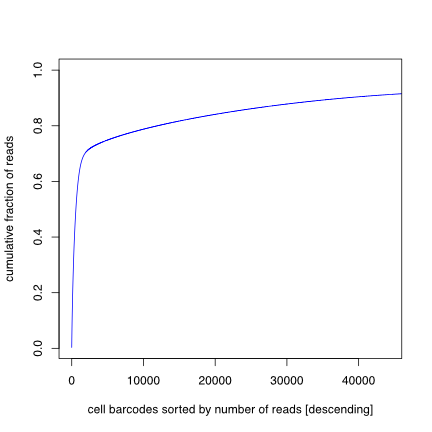

We then drew a line from the origin to the point at which the curve reached 85% of total reads on the y-axis:

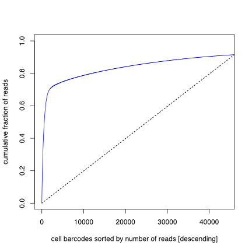

We then found the point on the elbow plot that was farthest from this diagonal. The X-coordinate of this point determined the total number of 'real' cell barcodes in the library:

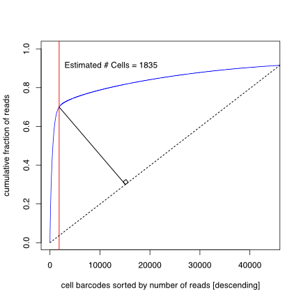

This was done using the following R script:

(*01_mapping/makeElbowPlots.R*)

```R
#!/usr/bin/env Rscript


#distance functions
distancePointLine <- function(x, y, slope, intercept) {
  ## x, y is the point to test.
  ## slope, intercept is the line to check distance.
  ##
  ## Returns distance from the line.
  ##
  ## Returns 9999 on 0 denominator conditions.
  x1 <- x-10
  x2 <- x+10
  y1 <- x1*slope+intercept
  y2 <- x2*slope+intercept
  distancePointSegment(x,y, x1,y1, x2,y2)
}

distancePointSegment <- function(px, py, x1, y1, x2, y2) {
  ## px,py is the point to test.
  ## x1,y1,x2,y2 is the line to check distance.
  ##
  ## Returns distance from the line, or if the intersecting point on the line nearest
  ## the point tested is outside the endpoints of the line, the distance to the
  ## nearest endpoint.
  ##
  ## Returns 9999 on 0 denominator conditions.
  lineMagnitude <- function(x1, y1, x2, y2) sqrt((x2-x1)^2+(y2-y1)^2)
  ans <- NULL
  ix <- iy <- 0   # intersecting point
  lineMag <- lineMagnitude(x1, y1, x2, y2)
  if( lineMag < 0.00000001) {
    warning("short segment")
    return(9999)
  }
  u <- (((px - x1) * (x2 - x1)) + ((py - y1) * (y2 - y1)))
  u <- u / (lineMag * lineMag)
  if((u < 0.00001) || (u > 1)) {
    ## closest point does not fall within the line segment, take the shorter distance
    ## to an endpoint
    ix <- lineMagnitude(px, py, x1, y1)
    iy <- lineMagnitude(px, py, x2, y2)
    if(ix > iy)  ans <- iy
    else ans <- ix
  } else {
    ## Intersecting point is on the line, use the formula
    ix <- x1 + u * (x2 - x1)
    iy <- y1 + u * (y2 - y1)
    ans <- lineMagnitude(px, py, ix, iy)
  }
  ans
}

distancePointLineTest <- function() {
  if(abs(distancePointSegment(  5,   5,  10, 10, 20, 20) - 7.07106781186548)>.0001)
    stop("error 1")
  if(abs(distancePointSegment( 15,  15,  10, 10, 20, 20) - 0)>.0001)
    stop("error 2")
  if(abs(distancePointSegment( 15,  15,  20, 10, 20, 20) - 5)>.0001)
    stop("error 3")
  if(abs(distancePointSegment(  0,  15,  20, 10, 20, 20) - 20)>.0001)
    stop("error 4")
  if(abs(distancePointSegment(  0,  25,  20, 10, 20, 20) - 20.6155281280883)>.0001)
    stop("error 5")
  if(abs(distancePointSegment(-13, -25, -50, 10, 20, 20) - 39.8808224589213)>.0001)
    stop("error 6")
  if(abs(distancePointSegment(  0,   3,   0, -4,  5,  0) - 5.466082)>.0001)
    stop("error 7")
  if(abs(distancePointSegment(  0,   9,   0, -4,  0, 15) - 0)>.0001)
    stop("error 8")
  if(abs(distancePointSegment(  0,   0,   0, -2,  2,  0)^2 - 2)>.0001)
    stop("error 9")
  return(TRUE)
}

inF <- list.files(pattern='out_cell_readcounts.txt.gz',full.names = T, recursive = T)

inF <- inF[!is.na(inF)]

for(i in 1:length(inF)) {
  a=read.table(inF[i], header=F, stringsAsFactors=F)
  x=cumsum(a$V1)
  x=x/max(x)

  #get slope
  checkVal <- min(which(x > 0.85))

  inSlope <- x[checkVal]/checkVal

  testDF <- data.frame(x = 1:checkVal, y = x[1:checkVal])

  testDF$res <- 0

  for(j in 1:nrow(testDF)){
    testDF$res[j] <-  distancePointLine(testDF[j,'x'],testDF[j,'y'],inSlope,0)
  }

  cutoff <- which.max(testDF$res)

  dirName=gsub('[.]/(.*)/.*','\\1',inF[i])

  newName=paste0(dirName,'/',dirName,'.pdf')

  pdf(newName, width = 6, height = 6)

  plot(1:length(x), x, type='l', col="blue", xlab="cell barcodes sorted by number of reads [descending]", ylab="cumulative fraction of reads",xlim=c(1,checkVal*2))

  abline(v=cutoff)

  text(checkVal,0.5,paste0('estimated # Cells = ',cutoff))

  dev.off()

  cellCountName <- gsub('.pdf','_cellCount.txt',newName)
  write.table(cutoff,file=cellCountName,col.names = F, row.names = F, quote = F)
}
```

We then passed the estimated cell number determined above to the `DigitalExpression` function from Drop-seq Tools. This function outputs a digital gene expression (DGE) matrix that contains read counts for the specified number of cells. The specific cell barcodes exported into this matrix are determined by read depth, with the highest depth cells being used first, and lowest depth cells being used last.

(*01_mapping/makeDGE.sh*)

```bash
#!/bin/bash
#SBATCH --job-name=makeDGE
#SBATCH -c 1 
#SBATCH -t 60-0
#SBATCH --mem=8G
#SBATCH -p med
#SBATCH --error=makeDGE.err
#SBATCH --output=makeDGE.out

for arg in */final.bam
do
        echo $arg

        outDir="${arg/\/final.bam/}"

        echo $outDir

        cellCount=$(cat $outDir/*cellCount.txt)

        echo $cellCount

        /group/julianolab/analyses/dropseq/Drop-seq_tools-2.4.0/DigitalExpression \
                I=$arg \
                O="$outDir"/"$outDir".dge.txt.gz \
                NUM_CORE_BARCODES="$cellCount"
done
```

The resulting DGE files are formatted as gene-by-cell matrices. These were used as the initial input into the Seurat Analysis below.

## Initial Clustering

We imported the drop-seq data formatted as DGE matrices into Seurat (v4.1.0), did additional filtering to remove low quality cells, removed batch effects in the different libraries, performed Louvain clustering, and generated an initial UMAP plot. All of this (as well as contents of the next section) was done within one large R script (`initGenomeDsSeurat.R`). For the purposes of this document, we have broken this script into chunks to simplify the explanation process.

After some initial setup for the R session, our first step was to import the DGE matrices from each Drop-seq library as individual Seurat objects. During this step, we also performed some additional filtering to remove low quality cells by removing barcodes with fewer than 300 or greater than 7500 unique molecular identifiers (UMIs), or fewer than 500 or greater than 75000 reads. 

(snippet from *02_initClust/initGenomeDsSeurat.R*)

```R
####Initial R session Setup####
library(Seurat)
library(tidyverse)
library(rstudioapi)
library(glmGamPoi)
library(plotly)
library(RColorBrewer)
library(patchwork)
library(plyr)

#utility to convert transcript ID to gene ID
t2g <- function(x){
  vapply(x, function(y) gsub('HVAEP1_T(\\d+)[.]\\d','HVAEP1-G\\1',y),"")
}

setwd(dirname(getActiveDocumentContext()$path))

####Importing Read Tables####

#get list of count matrix files (include path in name)
readMats <- list.files(pattern = 'dge.txt.gz', recursive = T, full.names = T)

#read in each individual read matrix, generate a separate seurat object for each, and do some initial filtering
inDs <- lapply(readMats, function(x) {
  y <- read.delim(x,stringsAsFactors = F,header = T, row.names = 1)
  
  #get batch name from parent folder of read matrix
  libName <- gsub('[.]\\/(D\\d+[^\\/]+)\\/.*','\\1',x)
  
  #apply batch names to cell barcodes to prevent redundant barcodes
  colnames(y) <- paste0(colnames(y),'-',libName)
  
  #add mt IDs
  rownames(y) <- gsub('^NC','MT-NC',rownames(y))
  
  #initialize seurat object
  tmpDS <- CreateSeuratObject(counts = y, project = libName, min.cells = 3, min.features = 200)
  
  #perform preliminary filtering
  subset(tmpDS, subset = nFeature_RNA > 300 & nFeature_RNA < 7500 & nCount_RNA > 500 & nCount_RNA < 75000)
})
```

We then integrated these separate Seurat objects using a reciprocal PCA analysis. This removed most batch effects that could cause cells to cluster because of technical reasons (e.g., differential expression of stress genes).

(snippet from *02_initClust/initGenomeDsSeurat.R*)

```R
####Batch Correction####
#In the next section we align the individual samples and perform batch correction using reciprocal PCA

#normalize data using SCTransform
inDs <- lapply(inDs, FUN = SCTransform, method = "glmGamPoi")

#use reciprocal PCA to perform batch effect correction and integrate the different libraries.
features <- SelectIntegrationFeatures(inDs)

inDs <- PrepSCTIntegration(object.list = inDs, anchor.features = features)

inDs <- lapply(X = inDs, FUN = RunPCA, features = features, verbose = F)

dsAnchors <- FindIntegrationAnchors(object.list = inDs,
                                    normalization.method = "SCT",
                                    anchor.features = features,
                                    dims = 1:35,
                                    reduction = "rpca",
                                    k.anchor = 5)

ds <- IntegrateData(anchorset = dsAnchors, normalization.method = "SCT", dims = 1:35)

rm(dsAnchors,inDs)
```

We next calculated the first 80 principal components of the integrated dataset and plotted the variance explaned by each component. This allowed us to estimate the approximate dimensionality of the dataset.

(snippet from *02_initClust/initGenomeDsSeurat.R*)

```R
#determining the dimensionality of the data
ds <- RunPCA(ds, npcs = 80)

ElbowPlot(ds,ndims = 80)
```


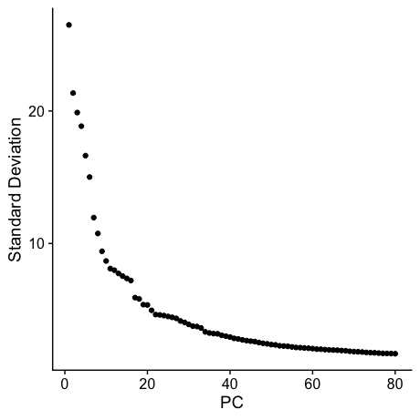

We opted to use a relatively high number of principle components for our initial clustering (60). We used these first 60 PCs to generate a UMAP plot and to find clusters using the Louvain algorithm

(snippet from *02_initClust/initGenomeDsSeurat.R*)

```R
ds <- RunUMAP(ds, reduction = "pca", dims = 1:60, min.dist = 0.2, spread=0.2, seed.use = 521, n.neighbors = 45)
ds <- FindNeighbors(ds, reduction = "pca", dims = 1:60)
ds <- FindClusters(ds, resolution = 1.25, graph.name = 'integrated_snn')

DimPlot(ds,label = T) + NoLegend() + NoAxes()
```

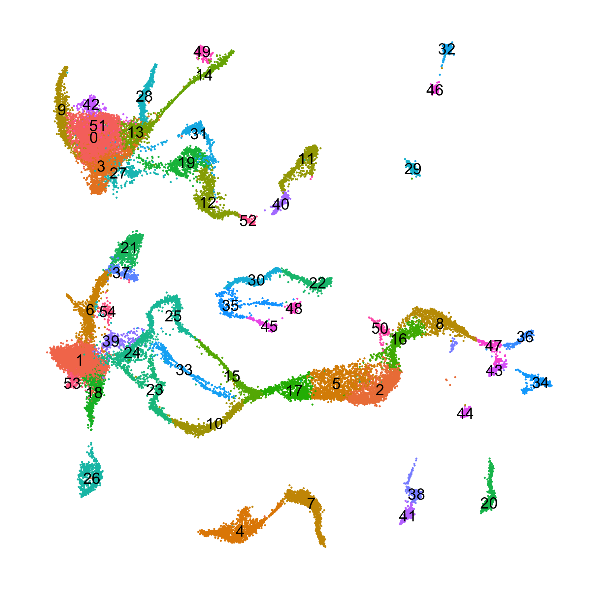

To get a sense of the cellular identity of these clusters, we used a panel of cell type markers (listed in `markerPanel.csv`) that were validated when the *Hydra* atlas was first published.

(snippet from *02_initClust/initGenomeDsSeurat.R*)

```R
#plot markers
markList <-read.csv('markerPanel.csv', header = F)

gg <- FeaturePlot(ds,t2g(markList[1,1]),order = T) + NoLegend() + NoAxes() + labs(subtitle = paste0(markList[1,2],'    ',markList[1,3]))

for(i in 2:nrow(markList)){
  subGG <- FeaturePlot(ds,t2g(markList[i,1]),order = T) + NoLegend() + NoAxes() + labs(subtitle = paste0(markList[i,2],'    ',markList[i,3]))
  gg <- gg + subGG
}

png('initReclustMarks.png',width = 25,height = 25,units = 'in',res = 300)
gg + plot_layout(ncol = 6)
dev.off()
```


Based on the expression patterns of these markers, we then annotated this UMAP by cell type:

```R

clusterNames <- data.frame(clusterNumber=levels(ds$seurat_clusters))

clusterNames$names <- c('En_BodyCol/SC','Ec_BodyCol/SC','I_ISC','En_BodyCol/SC','I_FemGc',
                        'I_EarlyNem','Ec_Head','I_MaleGC','I_Neuro','En_Foot','I_StenoNB',
                        'I_SpumousGl','I_GranularGl','En_Head','En_Tent','I_DesmoNB',
                        'I_Neuro','I_EarlyNem','Ec_Peduncle','I_ZymogenGl','I_Ec2N',
                        'Ec_Battery','I_DesmoNC','I_StenoNB','Ec_NB_Dubs','I_DesmoNB',
                        'Ec_BasalDisk','En_Gl_Dubs','En_Hypo','I_En1N','I_DesmoNC',
                        'I_ZymogenGl','I_En2N','I_IsoNB','I_Ec4N','I_maturingNC',
                        'I_Ec1N','Ec_Battery','I_Ec3N','Ec_NB_Dubs','I_SpumousGl',
                        'I_Ec3N','En_BodyCol/SC','I_Ec1N','I_Ec5N','I_StenoNC',
                        'I_En3N','I_Ec1N','I_IsoNC','En_NC_Dubs','I_GlProgen',
                        'En_BodyCol/SC','I_GranularGl','Ec_SomaticGerm','Ec_NC_Dubs')

set.seed(128)
upal <- sample(c("#d69058","#4071f3","#94b92c","#6f46bf","#47b94b",
                 "#c257d1","#7dad46","#956bed","#c9a72e","#4c64cf",
                 "#e28a25","#5d84f4","#df5425","#4c93e9","#ce4230",
                 "#4dbadd","#dc3748","#55b974","#d248ad","#567725",
                 "#aa6fe2","#ae9338","#7747a9","#a9a558","#bc74d8",
                 "#4b9b72","#e03873","#3eb8ad","#d14086","#7b8c50",
                 "#8582e5","#ba5d1f","#4067be","#db8c43","#5959a3",
                 "#8d5d23","#9b87da","#cb5b46","#5790d3","#d9475d",
                 "#5d74a7","#da9d75","#8c509a","#965e3a","#d38edd",
                 "#a35a5a","#a59dda","#b5495a","#c07eb8","#e08584",
                 "#c15dab","#a14767","#d289b0","#9a4979","#e778a3"))

ds$curatedIdent <- as.character(ds$seurat_clusters)
ds$curatedIdent <- factor(mapvalues(ds$curatedIdent, from = clusterNames$clusterNumber, to = clusterNames$names))

ds@active.ident <- ds$curatedIdent

DimPlot(ds,label = T,repel = T,cols = upal) + NoAxes() + NoLegend()
```


## Identifying Gene Co-Expression Programs Using Non-Negative Matrix Factorization

Non-negative matrix factorization (NMF) is a dimensionality reduction technique that breaks large and complex datasets into a relatively small number of 'parts' that can be combined in an additive fashion to represent any of the individual samples within the original dataset. In the context of gene expression data, NMF describes the transcriptomes of individual samples as a mixture of metagenes (i.e., a group of genes with correlated expression) that, when combined in a particular way, can be used to construct a given sample's specific transcriptional profile. 

To generate this parts-based representation, NMF assumes that a data matrix (in this case a digital gene expression matrix) can be represented as the product of two matrices, called **W** and **H**, that are constrained to only contain positive values. For single-cell RNA expression data, **W** encodes how strongly each gene contributes to each metagene (i.e., gene weights), and **H** encodes how much each metagene contributes to each cell transcriptome (i.e., cell weights). 

If the original dataset is a matrix of *n* rows (genes) and *m* columns (cells), **W** will be a *n* by *k* matrix and **H** will be a *k* by *m* matrix. *k* is the rank value, which determines how many parts the original dataset will be broken into. There is no objectively optimal value of *k*, so *k* needs to be estimated empirically for every dataset by evaluating results across a range of values. 

All that is required as input into the NMF algorithm is a gene expression matrix and a value for *k*. NMF then initializes **W** and **H** matrices and iteratively adjusts the values within each matrix until the product of **W** x **H** produces as close an approximation of the original expression matrix as possible. 

To generate the initial input into the cNMF algorithm, we exported the raw and normalized gene expression matrices from the *Hydra* atlas Seurat object. We also exported the list of variable genes identified by Seurat. The variable gene list is needed because cNMF restricts the actual NMF analysis to only  variable genes to reduce computation time, and then extrapolates the results to the remaining genes. 

(snippet from *02_initClust/initGenomeDsSeurat.R*)

```R
####NMF prep####
rawC <- t(as.matrix(ds@assays$RNA@counts))
write.table(rawC,file="unfilt.whole.raw.counts.tsv",sep = '\t', quote = F)
rm(rawC)

normC <- t(as.matrix(ds@assays$SCT@data))
write.table(normC,file="unfilt.whole.norm.counts.tsv",sep = '\t', quote = F)
rm(normC)

#list of variable genes to look at
write.table(ds@assays$integrated@var.features, file = 'unfilt.whole.genes.tsv', row.names = F, col.names = F, quote = F)
```

### Performing a Course Sweep of *K* Values

As *k* needs to be determined empirically for each dataset, we performed a broad sweep of *k* values from 15-90 in steps of five so we could identify general *k* values that gave good results. We used the `prepare` function within the `cnmf.py` script to set up this initial run:

(*03_cnmf/runPrep.sh*)

```bash
#!/bin/bash
#SBATCH -p med
#SBATCH --job-name=prep
#SBATCH -c 4
#SBATCH -t 60-0
#SBATCH --mem=60G
#SBATCH --error=prep.err
#SBATCH --output=prep.out

source ~/.bash_profile

conda activate cnmf_env

python ../cNMF/cnmf.py prepare --name whole_unfilt_course \
        -c unfilt.whole.raw.counts.tsv \
        -k 15 20 25 30 35 40 45 50 55 60 65 70 75 80 85 90 \
        --n-iter 200 \
        --total-workers 15 \
        --seed 12345 \
        --tpm unfilt.whole.norm.counts.tsv \
        --genes-file unfilt.whole.genes.tsv
```

We then ran the analysis using the following script:

(*03_cnmf/runFactorize.sh*)

```bash
#!/bin/bash
#SBATCH --job-name=factorize
#SBATCH -p med
#SBATCH -c 2
#SBATCH -t 60-0
#SBATCH --array=0-14
#SBATCH --mem=8G
#SBATCH --error=factorize_%a.err
#SBATCH --output=factorize_%a.out

source ~/.bash_profile

conda activate cnmf_env

python ../cNMF/cnmf.py factorize --name whole_unfilt_course --worker-index $SLURM_ARRAY_TASK_ID
```

The results of NMF are sensitive to how the **W** and **H** matrices are initialized. To ensure reproducibility, cNMF performs the NMF analysis for each *k* value multiple times (in the case of this analysis, we set this to 200 runs). This means that the files from each of these independent runs need to be combined for further analysis, which is done with the `combine` function:

(*03_cnmf/runCombine.sh*)

```bash
#!/bin/bash
#SBATCH --job-name=combine
#SBATCH -p bigmemm 
#SBATCH -c 1
#SBATCH -t 60-0
#SBATCH --mem=24G
#SBATCH --error=combine.err
#SBATCH --output=combine.out

source ~/.bash_profile

conda activate cnmf_env

python ../cNMF/cnmf.py combine --name whole_unfilt_course
```

The pooled results can then be evaluated for how well and how reliably each *k* value approximated the original expression data. Plots of such metrics are generated with the `k_selection_plot` function:

(*03_cnmf/runKselect.sh*)

```bash
#!/bin/bash
#SBATCH --job-name=combine
#SBATCH -p bigmemm 
#SBATCH -c 1
#SBATCH -t 60-0
#SBATCH --mem=24G
#SBATCH --error=combine.err
#SBATCH --output=combine.out

source ~/.bash_profile

conda activate cnmf_env

python ../cNMF/cnmf.py k_selection_plot --name whole_unfilt_course
```

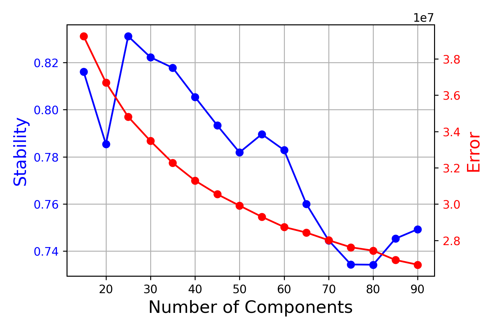

The blue line represents the variability in results, with higher numbers indicating more consistent results from run to run for a given *k* value. The red line indicates how well the NMF results recapitulated the original expression matrix. Generally, lower error values and higher stability values are desirable. 

Often with NMF there are multiple local maxima for the stability metric, essentially representing different possible resolutions for looking at the data. In the case of this analysis, we saw that there were two stability maxima, one for a *k* value of 25 and another for a *k* value of 55. We opted to use the higher resolution analysis for downstream analysis. 

### Performing a Fine Sweep of *k* Values

Because our initial *k* sweep moved in steps of five, we needed to perform a second higher resolution sweep to identify the exact *k* value that gave optimal results. We therefore repeated the cNMF analysis using *k* values from 50-60.

Prepping the analysis:

(*03_cnmf/runPrep2.sh*)

```bash
#!/bin/bash
#SBATCH -p med
#SBATCH --job-name=prep
#SBATCH -c 4
#SBATCH -t 60-0
#SBATCH --mem=60G
#SBATCH --error=prep2.err
#SBATCH --output=prep2.out

source ~/.bash_profile

conda activate cnmf_env

python ../cNMF/cnmf.py prepare --name whole_unfilt_fine_narrow \
        -c unfilt.whole.raw.counts.tsv \
        -k 50 51 52 53 54 55 56 57 58 59 60 \
        --n-iter 200 \
        --total-workers 15 \
        --seed 12345 \
        --tpm unfilt.whole.norm.counts.tsv \
        --genes-file unfilt.whole.genes.tsv
```

Running the NMF analysis:

(*03_cnmf/runFactorize2.sh*)

```bash
#!/bin/bash
#SBATCH --job-name=factorize
#SBATCH -p med
#SBATCH -c 2
#SBATCH -t 60-0
#SBATCH --array=0-14
#SBATCH --mem=8G
#SBATCH --error=factorizeF_%a.err
#SBATCH --output=factorizeF_%a.out

source ~/.bash_profile

conda activate cnmf_env

python ../cNMF/cnmf.py factorize --name whole_unfilt_fine_narrow --worker-index $SLURM_ARRAY_TASK_ID
```

Combining separate run files:

(*03_cnmf/runCombine2.sh*)

```bash
#!/bin/bash
#SBATCH --job-name=combine
#SBATCH -p bigmemm 
#SBATCH -c 1
#SBATCH -t 60-0
#SBATCH --mem=24G
#SBATCH --error=combine.err
#SBATCH --output=combine.out

source ~/.bash_profile

conda activate cnmf_env

python ../cNMF/cnmf.py combine --name whole_unfilt_course
```

Generating the error and stability plot:

(*03_cnmf/runKselect2.sh*)

```bash
#!/bin/bash
#SBATCH --job-name=combine
#SBATCH -p bigmemm 
#SBATCH -c 1
#SBATCH -t 60-0
#SBATCH --mem=24G
#SBATCH --error=combine.err
#SBATCH --output=combine.out

source ~/.bash_profile

conda activate cnmf_env

python ../cNMF/cnmf.py k_selection_plot --name whole_unfilt_fine_narrow
```

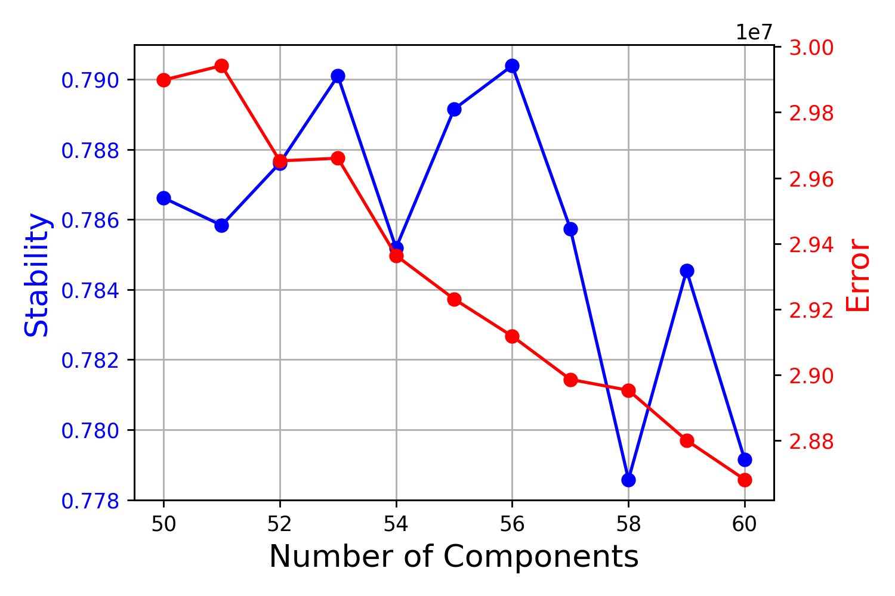

Based on this plot, we selected a *k* value of 56.

The final step of the cNMF analysis is to combine the results from all 200 runs for a desired *k* value to generate consensus results matrices. This step involves filtering out individual outlier results that don't closely resemble the overall consensus. To select the cutoff for removing outliers, we inspected the distribution of a score that measured the distance of the results from one run to the other runs that were most similar to it. We generated a plot to examine this distribution using the `consensus` function, selecting an initial threshold of 2.00 (an arbitrarily high value that wouldn't exclude anything):

(*03_cnmf/runConseunsus2.sh*)

```bash
#!/bin/bash
#SBATCH --job-name=consensus
#SBATCH -p bigmemm
#SBATCH -c 1
#SBATCH -t 60-0
#SBATCH --mem=24G
#SBATCH --error=consensus.err
#SBATCH --output=consensus.out

source ~/.bash_profile

conda activate cnmf_env

python ../cNMF/cnmf.py consensus --name whole_unfilt_fine_narrow --local-density-threshold 2.00 --components 56 --show-clustering
```

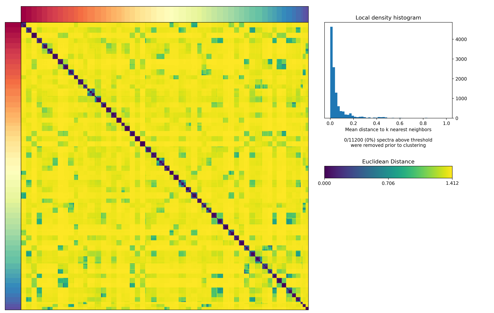

Based on the distribution of distances, we selected a cutoff of 0.13, which captured the bulk of results while excluding the long tail of outliers:

(*03_cnmf/runConseunsus2.sh*)

```bash
#!/bin/bash
#SBATCH --job-name=consensus
#SBATCH -p bigmemm
#SBATCH -c 1
#SBATCH -t 60-0
#SBATCH --mem=24G
#SBATCH --error=consensus.err
#SBATCH --output=consensus.out

source ~/.bash_profile

conda activate cnmf_env

python ../cNMF/cnmf.py consensus --name whole_unfilt_fine_narrow --local-density-threshold 0.13 --components 56 --show-clustering
```

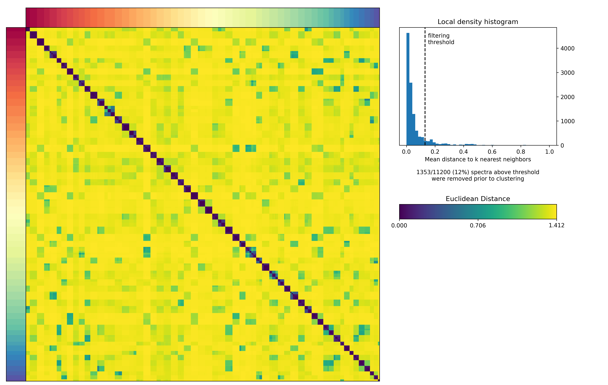 

This script generated a number of results files. These included the **W** matrix `whole_unfilt_fine_narrow.gene_spectra_tpm.k_56.dt_0_13.txt` and the **H** matrix `whole_unfilt_fine_narrow.usages.k_56.dt_0_13.consensus.txt`. The other notable output is the file `whole_unfilt_fine_narrow.gene_spectra_score.k_56.dt_0_13.txt`, which assigns genes Z scores based on how strongly they're associated with each metagene. 

## Identifying Doublets

During our initial annotation of the re-mapped Drop-seq data, we identified several clusters that expressed transcripts known to have mutually exclusive expression patterns. For example, the `EN_NC_Dubs` cluster expresses both *nas14*, which is expressed in endodermal tentacles cells, as well as *nematocilin a*, which is expressed in nematocytes. This dual expression is a hallmark of doublets, a phenomenon that arises when transcripts from two cells end up associated with a single bead. This can happen either for biological or technical reasons. Typically, doublets are removed during standard scRNA-seq data processing; however, in *Hydra*, the inclusion of doublets can in some ways provide greater accuracy. This is because certain cell types, specifically tentacle battery cells, are actually multi-cell complexes, where multiple interstitial cells (both neurons and nematocytes) are embedded within an epithelial cell. For this reason, we provide the Seurat object used to make the above plots for those researchers particularly interested in these naturally occuring multi-cell complexes (found in the file `02_initClust/labeledDubDs.rds`). 

However, for the sake of simplicity and clarity, we opted to remove doublets in the main published version of our AEP-mapped atlas. To identify doublets that needed to be removed, we scored cells based on how highly they expressed different sets of cell-type-specific markers. We then defined a cell as a doublet if they scored highly for two or more of these cell-type-specific gene modules. 

To do this, we first use the Seurat `FindMarkers` function to find markers for ectodermal, endodermal, nematocyte, neuronal, germline, and gland cells. 

(snippet from *02_initClust/initGenomeDsSeurat.R*)

```R
####doublet ID

#get ecto markers
ectoMark <- FindMarkers(ds,ident.1 = c(18,53,1,6,37,26),logfc.threshold = 1,only.pos = T)

ectoMark <- rownames(ectoMark[ectoMark$p_val_adj == 0,])

#get endo markers
endoMark <- FindMarkers(ds,ident.1 = c(28,13,0,9,14),logfc.threshold = 1,only.pos = T)

endoMark <- rownames(endoMark[endoMark$p_val_adj == 0,])

#get nemato markers

nemMark <- c(39,24,23,25,33,15,10)

nemMark <- lapply(nemMark, function(x){
  FindMarkers(ds,ident.1 = x,ident.2=1,logfc.threshold = 1,only.pos = T)
})

nemMark <- lapply(nemMark, function(x){
  rownames(x[x$p_val_adj < 1e-200,])
})

batMark <- FindMarkers(ds,ident.1 = 21,ident.2 = c(37,6),only.pos = T,logfc.threshold = 1)

batMark <- rownames(batMark[batMark$p_val_adj < 1e-180,])

#get neuro markers
ectoC <- c(18,53,1,6,37,26)
endoC <- c(28,13,0,9,14)

neuroSubC <- list(20,c(43,47,36),34,c(41,38),32,46,29,44)

neuroMark <- lapply(neuroSubC, function(x){
  FindMarkers(ds,ident.1 = x,ident.2=c(ectoC,endoC),logfc.threshold = 1,only.pos = T)
})

neuroMark <- lapply(neuroMark, function(x){
  rownames(x[x$p_val_adj == 0,])
})


#get sexy markers
sexyMark <- c(4,7)

sexyMark <- lapply(sexyMark, function(x){
  FindMarkers(ds,ident.1 = x,ident.2=2,logfc.threshold = 1,only.pos = T)
})

sexyMark <- lapply(sexyMark, function(x){
  rownames(x[x$p_val_adj == 0,])
})

#get gland markers
glandMark <- list(c(19,12,52),31,c(41,11))

glandMark <- lapply(glandMark, function(x){
  FindMarkers(ds,ident.1 = x, ident.2 = endoC, logfc.threshold = 1,only.pos = T)
})

glandMark <- lapply(glandMark, function(x){
  rownames(x[x$p_val_adj == 0,])
})
```

We then used the Seurat `AddModuleScore` function to calculate a holistic score for each of set of markers. 

(snippet from *02_initClust/initGenomeDsSeurat.R*)

```R
markList <- list(ectoMark,endoMark,sexyMark[[1]],sexyMark[[2]],batMark)

markList <- append(markList,values = c(neuroMark,glandMark,nemMark))

markNames <- c('ecto','endo','fem','male','nemBat',
               paste0('neur',LETTERS[1:length(neuroMark)]),
               paste0('gland',LETTERS[1:3]),
               paste0('nem',LETTERS[1:7]))

ds <- AddModuleScore(ds,features=markList,
                     name = markNames,
                     assay = 'SCT')

FeaturePlot(ds,paste0(markNames,1:length(markNames)), order=T)
```


We were primarily concerned with epithelial/interstitial doublets, as interstitial/interstitial doublets are comparatively rare. We therefore defined a doublet as any cell with a module score > 0.2 for both an epithelial module and any other gene module. 

(snippet from *02_initClust/initGenomeDsSeurat.R*)

```R
dubs <- ds@meta.data[,paste0(markNames,1:length(markNames))]

dubs <- as.data.frame(dubs > 0.2)

dubs$ectoDub <- apply(dubs[,-2],1,sum)

dubs$ectoDub[!dubs$ecto1] <- 0

dubs$ectoDub <- dubs$ectoDub > 1

dubs$endoDub <- apply(dubs[,-1],1,sum)

dubs$endoDub[!dubs$endo2] <- 0

dubs$endoDub <- dubs$endoDub > 1

dubs$endoEcto <- (dubs$ecto1 + dubs$endo2) > 1

dubs$dubTot <- dubs$ectoDub | dubs$endoDub | dubs$endoEcto

ds@meta.data$dubTest <- as.numeric(dubs$dubTot)

FeaturePlot(ds,c('dubTest')) + NoLegend() + NoAxes()
```

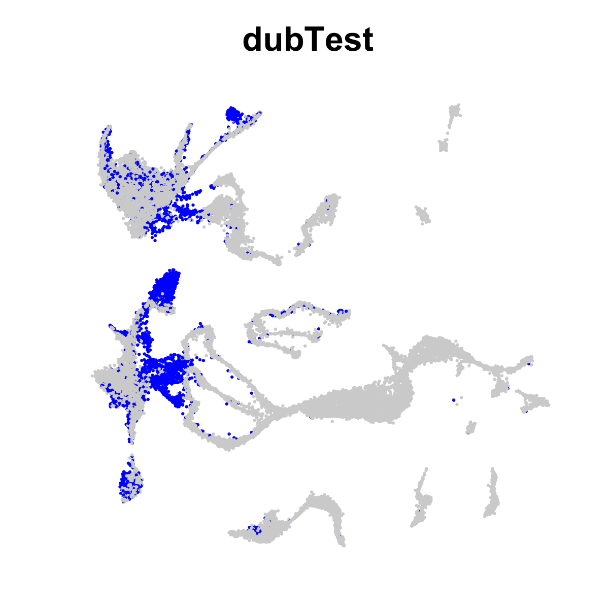

We exported a list of all non-doublet cell IDs for the next data processing step.

(snippet from *02_initClust/initGenomeDsSeurat.R*)

```R
write.table(rownames(ds@meta.data[(!ds@meta.data$dubTest),]), file = 'nondub.tsv',quote = F, row.names = F, col.names = F)
```

## Reclustering the Doublet-Free Dataset

### Removing Some Lingering Problematic Clusters

After removing (most) doublets, we repeated the clustering process from the beginning, using essentially the exact same steps as before; however, we included a step where we removed any previously identified doublet cells from the imported DGE matrices before building the initial Seurat objects. 

(snippet from *04_finalize/nonDub.R*)

```R
library(Seurat)
library(tidyverse)
library(rstudioapi)
library(glmGamPoi)
library(plotly)
library(RColorBrewer)
library(patchwork)
library(ggplot2)

#utility to convert transcript ID to gene ID
t2g <- function(x){
  vapply(x, function(y) gsub('HVAEP1_T(\\d+)[.]\\d','HVAEP1-G\\1',y),"")
}

setwd(dirname(getActiveDocumentContext()$path))

nonDub <- read.delim('../nmf/nonDubIDs.txt')[,1]

#get list of count matrix files (include path in name)
readMats <- list.files(pattern = 'dge.txt.gz', recursive = T, full.names = T)

#read in each individual read matrix, generate a separate seurat object for each, and do some initial filtering
inDs <- lapply(readMats, function(x) {
  y <- read.delim(x,stringsAsFactors = F,header = T, row.names = 1)
  
  #get batch name from parent folder of read matrix
  libName <- gsub('[.]\\/(D\\d+[^\\/]+)\\/.*','\\1',x)
  
  #apply batch names to cell barcodes to prevent redundant barcodes
  colnames(y) <- paste0(colnames(y),'-',libName)
  
  y <- y[,colnames(y) %in% nonDub]
  
  #initialize seurat object
  tmpDS <- CreateSeuratObject(counts = y, project = libName, min.cells = 3, min.features = 200)
  
  #perform preliminary filtering
  subset(tmpDS, subset = nFeature_RNA > 300 & nFeature_RNA < 7500 & nCount_RNA > 500 & nCount_RNA < 75000)
})


#normalize data using SCTransform
inDs <- lapply(inDs, FUN = SCTransform, method = "glmGamPoi")

features <- SelectIntegrationFeatures(inDs,nfeatures = 2000)

inDs <- PrepSCTIntegration(object.list = inDs, anchor.features = features)

inDs <- lapply(X = inDs, FUN = RunPCA, features = features, verbose = F)

dsAnchors <- FindIntegrationAnchors(object.list = inDs,
                                    normalization.method = "SCT",
                                    anchor.features = features,
                                    dims = 1:45,
                                    reduction = "rpca",
                                    k.anchor = 5)

rm(inDs)
gc()

ds <- IntegrateData(anchorset = dsAnchors, normalization.method = "SCT", dims = 1:45)

rm(dsAnchors)


#determining the dimensionality of the data
ds <- RunPCA(ds, npcs = 80)

#generate UMAP projection and perform louvain clustering

ndUse=55
ds <- RunUMAP(ds, reduction = "pca", dims = 1:ndUse, min.dist = 0.3, spread=0.38, seed.use = 600,n.neighbors = 50)
ds <- FindNeighbors(ds, reduction = "pca", dims = 1:ndUse)
ds <- FindClusters(ds, resolution = 0.7, graph.name = 'integrated_snn')

DimPlot(ds,label = T) + NoLegend() + NoAxes()
```


We then plotted our standard panel of markers

(snippet from *04_finalize/nonDub.R*)

```R
####look at markers####
DefaultAssay(ds) <- 'SCT'

markList <-read.csv('markerPanel.csv', header = F)

gg <- FeaturePlot(ds,t2g(markList[1,1]),order = T) + 
  NoAxes() + labs(subtitle = paste0(markList[1,2],'    ',markList[1,3])) + 
  theme(legend.key.height = unit(0.2, 'cm')) + 
  theme(legend.text = element_text(size=8,face = "bold")) + 
  theme(legend.position="bottom")

for(i in 2:nrow(markList)){
  subGG <- FeaturePlot(ds,t2g(markList[i,1]),order = T) + 
    NoAxes() + labs(subtitle = paste0(markList[i,2],'    ',markList[i,3])) + 
    theme(legend.key.height = unit(0.2, 'cm')) + 
    theme(legend.text = element_text(size=8,face = "bold")) + 
    theme(legend.position="bottom")
  gg <- gg + subGG
}

png('nonDubMarks.png',width = 20,height = 24,units = 'in',res = 300)
gg + plot_layout(ncol = 6)
dev.off()
```


We noticed one small cluster of endodermal cells (cluster 41) branching off the main body column/SC cluster that appeared to have high expression of a number of interstitial genes (e.g., periculin and dkk1/2/4a), suggesting it might contain some residual interstitial doublets. To explore this further, we used the `FindMarkers` function to find genes that distinguish clutser 41 from other body column stem cells.

(snippet from *04_finalize/nonDub.R*)

```R
mark41 <- FindMarkers(ds,ident.1 = 41,ident.2 = c(5,7,0),only.pos = T,logfc.threshold = 1,assay = 'integrated')

FeaturePlot(ds,rownames(mark41)[1:9],order = T)
```

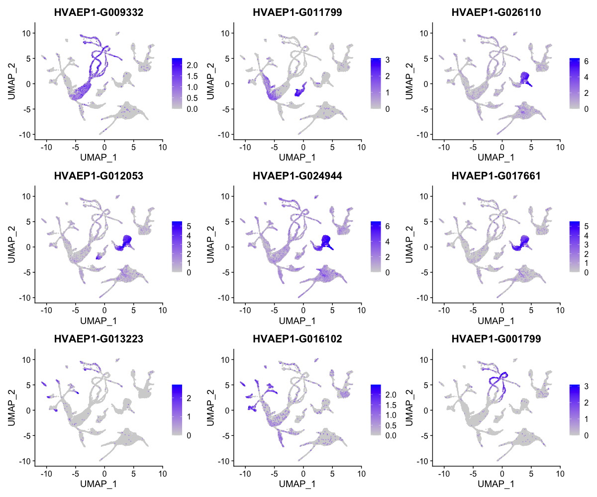

The top nine markers we found were all primarily expressed in interstitial cells, strongly suggesting this cluster is made up of endoderm/interstitial doublets. 

The identity of cluster 37 was less clear, but when we identified markers for the cluster (using the same approach as above), caspase-like and heat shock-like genes were among the output. We therefore hypothesized that this cluster reflected stress-related batch effects. 

Based on this exploration, we decided to drop clusters 37 and 41 from the final object

(snippet from *04_finalize/nonDub.R*)

```R
finalNonDub <- rownames(ds@meta.data[!(ds@meta.data$seurat_clusters %in% c(37,41)),])

ds <- subset(ds,cells = finalNonDub)
```

### Final Clustering and Annotation

After arriving at the final set of cells, we performed one last clustering and UMAP analysis

(snippet from *04_finalize/nonDub.R*)

```R
DefaultAssay(ds) <- 'integrated'

#determining the dimensionality of the data
ds <- RunPCA(ds, npcs = 80)

#generate UMAP projection and perform louvain clustering
ndUse=55
ds <- RunUMAP(ds, reduction = "pca", dims = 1:ndUse, min.dist = 0.2, spread=0.2, seed.use = 963140, n.neighbors = 45)
ds <- FindNeighbors(ds, reduction = "pca", dims = 1:ndUse)
ds <- FindClusters(ds, resolution = 0.7, graph.name = 'integrated_snn')

DefaultAssay(ds) <- 'SCT'

DimPlot(ds,label = T) + NoLegend() + NoAxes()
```

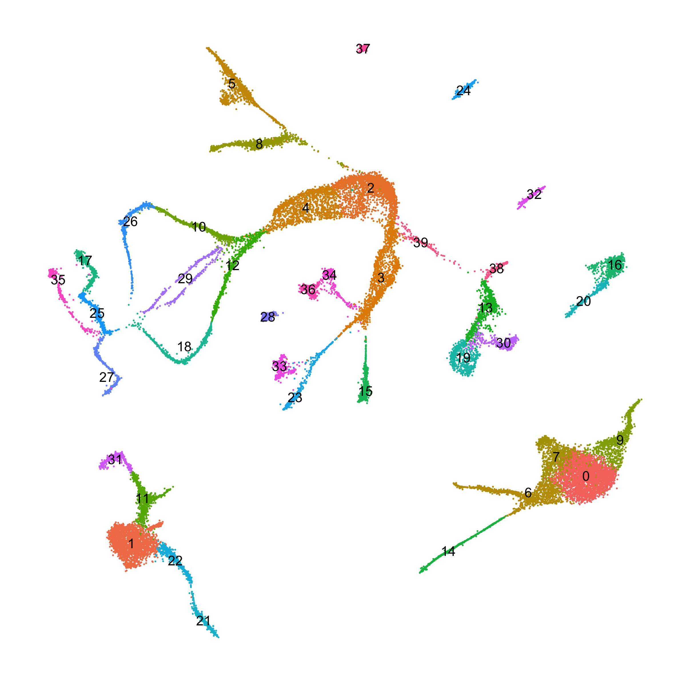

We again plotted our panel of marker genes

(snippet from *04_finalize/nonDub.R*)

```R
 gg <- FeaturePlot(ds,t2g(markList[1,1]),order = T) + NoLegend() + NoAxes() + labs(subtitle = paste0(markList[1,2],'    ',markList[1,3]))

for(i in 2:nrow(markList)){
  subGG <- FeaturePlot(ds,t2g(markList[i,1]),order = T) + NoLegend() + NoAxes() + labs(subtitle = paste0(markList[i,2],'    ',markList[i,3]))
  gg <- gg + subGG
}

gg + plot_layout(ncol = 6)
```


Based on these plots, we annotated the clusters by cell type

(snippet from *04_finalize/nonDub.R*)

```R
clusterNames <- data.frame(clusterNumber=levels(ds$seurat_clusters))

clusterNames$names <- c('En_BodyCol/SC','Ec_BodyCol/SC','I_ISC','I_Neuro','I_EarlyNem',
                        'I_FemGC','En_Head','En_BodyCol/SC','I_MaleGC','En_Foot',
                        'I_StenoNB','Ec_Head','I_DesmoNB','I_GranGl','En_Tentacle',
                        'I_Ec2N','I_SpumMucGl','I_DesmoNC','I_DesmoNB','I_ZymoGl',
                        'I_SpumMucGl','Ec_BasalDisk','Ec_Peduncle','I_Ec1N','I_En1N',
                        'I_DesmoNC','I_StenoNB','I_StenoNC','I_En2N','I_IsoNB',
                        'I_ZymoGl','Ec_Tentacle','I_Ec4N','I_Ec1/5N','I_Ec3N',
                        'I_IsoNC','I_Ec3N','I_En3N','I_GranGl','I_GlProgen')

ds$curatedIdent <- as.character(ds$seurat_clusters)
ds$curatedIdent <- factor(mapvalues(ds$curatedIdent, from = clusterNames$clusterNumber, to = clusterNames$names))

ds@active.ident <- ds$curatedIdent

set.seed(12345)
colsUse <- sample(c("#eba92c","#984eec","#79dc3a","#d248de",
                    "#58ce5f","#d84fc4","#d1d52e","#7766e8",
                    "#9ccd4f","#e4349d","#5bda8f","#ad69d7",
                    "#cbc553","#5581f2","#e64f22","#3be9ca",
                    "#e3407a","#53ad70","#be5aa7","#759027",
                    "#7477da","#89b65d","#9a7ad0","#bf9439",
                    "#3e76cc","#cb7329","#4b96eb","#e04946",
                    "#de8cd8","#d0764d","#d75e95","#da5666"))

DimPlot(ds,label = T,repel = T,cols = colsUse) + NoAxes() + NoLegend()
```

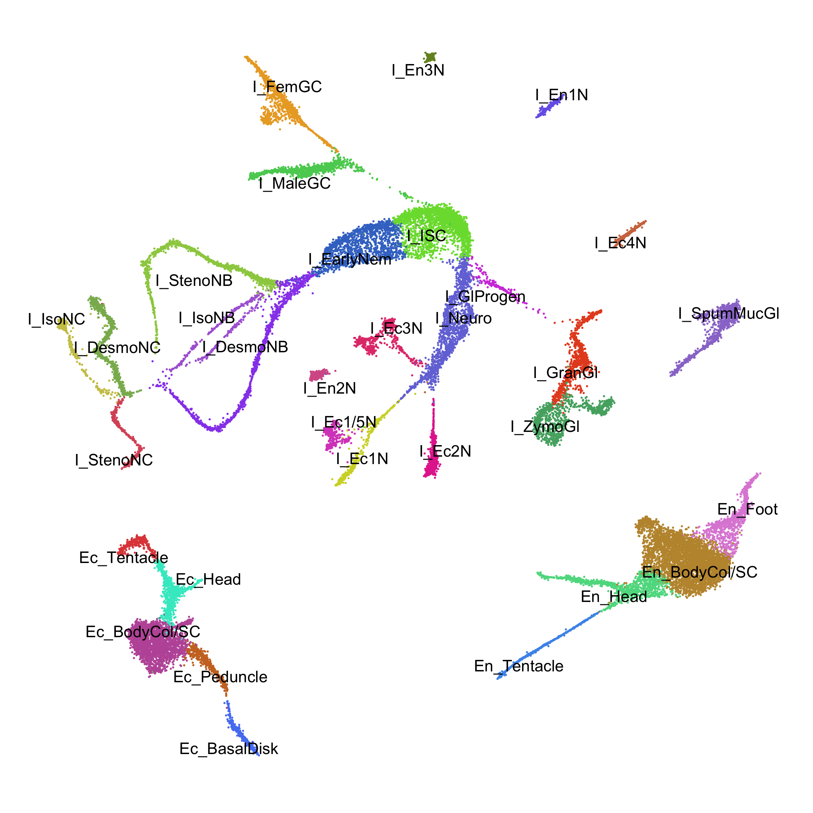

We generated marker lists for these clusters using the following command:

(snippet from *04_finalize/nonDub.R*)

```R
dsMarks <- FindAllMarkers(ds,logfc.threshold = 1, only.pos = T)

write.csv(dsMarks,'nonDubMarkers.csv',row.names = F)
```

### Plotting Metagene Usage in the *Hydra* Atlas

In order to understand the biological function associated with the metagenes from our NMF analysis, we plotted cell score values (from the **H** matrix) on our finalized *Hydra* atlas UMAP.

(*03_cnmf/visNMF.R*)

```R
#import NMF cell scores 
k56.usage <- read.delim('final/whole_unfilt_fine_narrow.usages.k_56.dt_0_13.consensus.txt',row.names = 1)

#normalize cell score values so that the sum of scores for each cell sums to 1
k56.usage <- t(apply(k56.usage,1,function(x) x/sum(x)))

#add the metagene scores to the Seurat object metadata table
md <- ds@meta.data[,1:8]

md$id <- rownames(md)

k56.usage <- as.data.frame(k56.usage)

colnames(k56.usage) <- gsub('X','mg',colnames(k56.usage))

#incorporate descriptions of each metagene into the metagene name
mgD <- read.csv('k56_mg_annot.csv',header = F)

colnames(k56.usage) <- paste(colnames(k56.usage), mgD$V2,sep=' ')

k56.usage$id <- rownames(k56.usage) 

md <- merge(md, k56.usage, by = 'id',all.x = T)

rownames(md) <- md$id

md$id <- NULL

ds@meta.data <- md

#get the names of the metagene columns in the metadata DF
plotMods <- grep('mg',colnames(ds@meta.data),value = T)

#plot all metagene cell scores on the atlas UMAP
gg <- FeaturePlot(ds,plotMods[1],order=T) + NoLegend() + NoAxes()

for(i in 2:length(plotMods)){
  subGG <- FeaturePlot(ds,t2g(plotMods[i]),order=T) + NoLegend() + NoAxes()
  gg <- gg + subGG
}

#how many rows/columns should the plot have?
dims <- sqrt(56)
dims <- c(ceiling(dims),floor(dims))

gg + plot_layout(ncol = dims[1])
```


## Files Associated with This Document


```
05_hydraAtlasReMap/
├── 01_mapping
│   ├── create_Drop-seq_reference_metadata_mod.sh
				Modified shell script from drop-seq tools that preps the AEP 
				transcriptome for the drop-seq tools alignment pipeline.
│   ├── dgeGeneration
				Folder containing the digital gene expression (dge) matrices for each
				drop-seq library (files ending in .dge.txt.gz). The sub-directories
				for each library also contain a pdf of the elbow plot used to determine
				the number of cell barcodes to use from each library as well as a text
				file containing the calculated number of barcodes (files ending in 
				cellCount.txt)
│   │   ├── D01-D1_S1
│   │   │   ├── D01-D1_S1_cellCount.txt
│   │   │   ├── D01-D1_S1.dge.txt.gz
│   │   │   └── D01-D1_S1.pdf
│   │   ├── D01-P2_S4
│   │   │   ├── D01-P2_S4_cellCount.txt
│   │   │   ├── D01-P2_S4.dge.txt.gz
│   │   │   └── D01-P2_S4.pdf
│   │   ├── D02-CO_S2
│   │   │   ├── D02-CO_S2_cellCount.txt
│   │   │   ├── D02-CO_S2.dge.txt.gz
│   │   │   └── D02-CO_S2.pdf
│   │   ├── D02-P1_S3
│   │   │   ├── D02-P1_S3_cellCount.txt
│   │   │   ├── D02-P1_S3.dge.txt.gz
│   │   │   └── D02-P1_S3.pdf
│   │   ├── D02-PB_S4
│   │   │   ├── D02-PB_S4_cellCount.txt
│   │   │   ├── D02-PB_S4.dge.txt.gz
│   │   │   └── D02-PB_S4.pdf
│   │   ├── D03-FM_S3
│   │   │   ├── D03-FM_S3_cellCount.txt
│   │   │   ├── D03-FM_S3.dge.txt.gz
│   │   │   └── D03-FM_S3.pdf
│   │   ├── D03-KI_S1
│   │   │   ├── D03-KI_S1_cellCount.txt
│   │   │   ├── D03-KI_S1.dge.txt.gz
│   │   │   └── D03-KI_S1.pdf
│   │   ├── D03-MA_S2
│   │   │   ├── D03-KI_S1_cellCount.txt
│   │   │   ├── D03-KI_S1.dge.txt.gz
│   │   │   └── D03-KI_S1.pdf
│   │   ├── D06-FM_S1
│   │   │   ├── D06-FM_S1_cellCount.txt
│   │   │   ├── D06-FM_S1.dge.txt.gz
│   │   │   └── D06-FM_S1.pdf
│   │   ├── D06-KI_S4
│   │   │   ├── D06-FM_S1_cellCount.txt
│   │   │   ├── D06-FM_S1.dge.txt.gz
│   │   │   └── D06-FM_S1.pdf
│   │   ├── D06-MA_S3
│   │   │   ├── D06-MA_S3_cellCount.txt
│   │   │   ├── D06-MA_S3.dge.txt.gz
│   │   │   └── D06-MA_S3.pdf
│   │   ├── D11-BU_S2
│   │   │   ├── D11-BU_S2_cellCount.txt
│   │   │   ├── D11-BU_S2.dge.txt.gz
│   │   │   └── D11-BU_S2.pdf
│   │   ├── D11-PO_S1
│   │   │   ├── D11-PO_S1_cellCount.txt
│   │   │   ├── D11-PO_S1.dge.txt.gz
│   │   │   └── D11-PO_S1.pdf
│   │   ├── D12-N1_S1
│   │   │   ├── D12-N1_S1_cellCount.txt
│   │   │   ├── D12-N1_S1.dge.txt.gz
│   │   │   └── D12-N1_S1.pdf
│   │   └── D12-N2_S2
│   │       ├── D12-N2_S2_cellCount.txt
│   │       ├── D12-N2_S2.dge.txt.gz
│   │       └── D12-N2_S2.pdf
│   ├── dropseq_FastqtoSam.sh
				Shell script used to convert the drop-seq library fastq files into a bam 
				format.
│   ├── getCellCounts.sh
				Shell script that generates a table containing the number of reads for 
				each cell in each drop-seq library.
│   ├── HVAEP1.GeneModels.longestIso.gtf
				GTF file containing the coordinates for the longest isoforms for each 
				gene model in the AEP assembly.
│   ├── HVAEP1.tran.final.mito.fasta
				Multi-fasta file containing the nucleotide sequences for the longest 
				isoform from each AEP gene model as well as the sequences for all
				Hydra mitochondrial genes. Used as a reference for drop-seq library
				mapping.
│   ├── HVAEP1.transcriptome.gtf
				GTF file for the AEP transcriptome. Simply lists each transcript as its
				own contig, spanned by a single gene.
│   ├── HVAEP1.transcriptome.mito.gtf
				Modified version of HVAEP1.transcriptome.gtf with mitochondrial genes
				added. Used as a reference for drop-seq library mapping.
│   ├── makeDGE.sh
				Shell script that generates digital gene expression matrices from the 
				aligned reads from each Hydra drop-seq library using the cell counts
				calculated by makeElbowPlots.R.
│   ├── makeElbowPlots.R
				R script that uses the inflection point in the cumulative read count 
				elbow plot for each drop-seq library to determine the number of cell
				barcodes to use for generating digital gene expression matrices.
│   ├── makeTranGtf.R
				R script that reformats HVAEP1.GeneModels.longestIso.gtf into 
				HVAEP1.transcriptome.gtf.
│   ├── slurm_Drop-seq_alignment.sh
				Shell script that uses the Drop-seq_alignment.sh script from drop-seq 
				tools to align each drop-seq library to the AEP transcriptome.
│   └── slurm_metadata_mod.sh
				Shell script that runs create_Drop-seq_reference_metadata_mod.sh
				on a slurm-based computing cluster.
├── 02_initClust
│   ├── initGenomeDsSeurat.R
				R script that performs the initial clustering of the AEP-mapped
				hydra cell atlas, identifies doublets, and preps the input for 
				an NMF analysis.
│   ├── markerPanel.csv
				Table containing gene IDs and descriptions for previously validated
				cell-type-specific markers in hydra.
│   └── labeledDubDs.rds
				R data file containing the initial clustering results for the AEP-mapped 
    		hydra cell atlas with descriptive cell-type labels in a Seurat object format.
├── 03_cnmf
│   ├── runCombine2.sh
				Shell script that pools the individual files created by separate
				parallelized nmf runs generated as part of the fine resolution K 
				parameter sweep.
│   ├── runCombine.sh
				Shell script that pools the individual files created by separate
				parallelized nmf runs generated as part of the broad resolution K 
				parameter sweep.
│   ├── runConseunsus2.sh
				Shell script that calculates factorization matrices based on the 
				consensus of independent replicates for a given K value (in this 
				case, K=56).
│   ├── runFactorize2.sh
				Shell script that performs NMF across a relatively narrow range of 
				K values (K=50-60 by steps of 1). The script performs 200 independent 
				NMF calculations for each specified K value.
│   ├── runFactorize.sh
				Shell script that performs NMF across a relatively broad range of 
				K values (K=15-90 by steps of 5). The script performs 200 independent 
				NMF calculations for each specified K value.
│   ├── runKselect2.sh
				Shell script that calculates and plots both error and stability
				scores for different K values based on the results of runFactorize2.sh
				(K=50-60 by steps of 1). 
│   ├── runKselect.sh
				Shell script that calculates and plots both error and stability
				scores for different K values based on the results of runFactorize.sh
				(K=15-90 by steps of 5).
│   ├── runPrep2.sh
				Shell script that sets up the separate parallelized NMF runs across
				a relatiely narrow range of K values (K=50-60 by steps of 1). 
│   ├── runPrep.sh
				Shell script that sets up the separate parallelized NMF runs across
				a relatiely narrow range of K values (K=15-90 by steps of 5). 
│   ├── unfilt.whole.genes.tsv
				List of variable gene IDs that were used for the NMF analysis of the
				hydra single-cell atlas.
│   ├── unfilt.whole.norm.counts.tsv
				Digital gene expression matrix containing Seurat-normalized read counts
				for the hydra single-cell atlas (taken from initGenDs.rds)
│   ├── unfilt.whole.raw.counts.tsv
				Digital gene expression matrix containing raw read counts for the hydra 
				single-cell atlas (taken from initGenDs.rds)
│   ├── visNMF.R
				R script used to visualize NMF metagene cell scores on the hydra atlas
				UMAP.
│   ├── whole_unfilt_fine_narrow.clustering.k_56.dt_0_13.png
				Output generated by runConseunsus2.sh. Shows the results of a clustering
				analysis grouping together the 200 independent runs from the NMF analysis
				where K was set to 56. Used to select a distance cutoff to remove outlier
				NMF replicates and to generate a final set of consensus matrices.
│   ├── whole_unfilt_fine_narrow.gene_spectra_score.k_56.dt_0_13.txt
				Matrix generated by runConseunsus2.sh that contains metagene Z-scores for
				each gene included in the hydra atlas. A Higher z-scores indicates a 
				stronger associations between a gene and the metagene.
│   ├── whole_unfilt_fine_narrow.gene_spectra_tpm.k_56.dt_0_13.txt
				Matrix generated by runConseunsus2.sh that contains the gene score matrix
				calculated by NMF that, when multiplied by the cell score matrix, approximates
				the values in the normalized expression matrix provided as input
				(unfilt.whole.norm.counts.tsv).
│   ├── whole_unfilt_fine_narrow.spectra.k_56.dt_0_13.consensus.txt
				Matrix generated by runConseunsus2.sh that contains the gene score matrix
				calculated by NMF that, when multiplied by the cell score matrix, approximates
				the values in the raw expression matrix provided as input
				(unfilt.whole.raw.counts.tsv).
│   └── whole_unfilt_fine_narrow.usages.k_56.dt_0_13.consensus.txt
				Matrix generated by runConseunsus2.sh that contains the cell score matrix
				calculated by NMF. Higher values for a metagene in a given cell indicates that
				the metagene in question contributes more strongly to the cell's transcriptional
				profile.
└── 04_finalize
    ├── nonDubLabeledSeurat.rds
    		R data file containing the finalized clustering results for the AEP-mapped 
    		hydra cell atlas with descriptive cell-type labels in a Seurat object format.
    ├── nonDubMarkers.csv
    		Table containing lists of marker genes for all cell types in the 
    		nonDubLabeledSeurat.rds object.
    ├── nonDub.R
    		R script that generates a doublet-free version of the Hydra cell atlas
    └── nondub.tsv
    		Text file listing the cell barcode IDs of all non-doublet cells in the hydra
    		atlas. Used to for generating the doublet-free version of the atlas.
```

