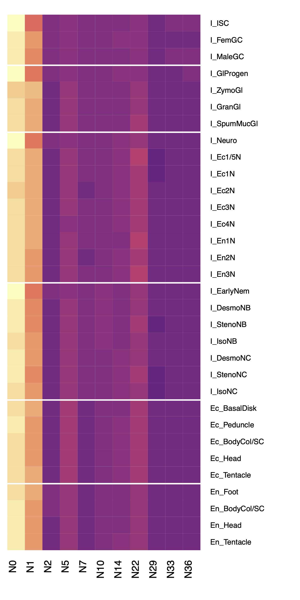
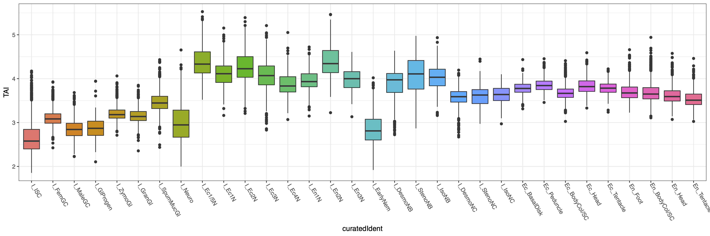

# Characterizing Cell-Type-Specific Variations in the Ages of Transcribed Genes

This document outlines our approach for characterizing the ages of protein coding genes in the AEP genome, with the goal of exploring the ways in which the unique transcriptional signatures of different cell types reflect evolutionary history. This analysis included estimating the age of all AEP genes using the output from an Orthofinder analysis (described in `03_aepGenomeAnnotation.md`), characterizing the differences in the relative proportions of different gene ages in different cell types in our single cell atlas, and calculating a holistic score of transcriptome age at a single-cell resolution.

[TOC]

## Estimating Gene Age

Our first step was to estimate when each gene in the *Hydra* genome originated. To do this, we needed to identify the most recent phylogenetic clade that contained all orthologs of each *Hydra* gene. The age of a gene in question was assumed to be the amount of time that has passed since the most recent common ancestor of that clade existed.

We had previously performed an Orthofinder analysis that included 44 different proteomes spanning diverse metazoan clades. This analysis grouped all the protein sequences in the analysis into orthogroups, which are sets of protein sequences that are all predicted to have originated from a single ancestral gene.

Our goal was to use the orthogroup assignments to identify all species whose proteomes included at least one ortholog of each *Hydra* gene. We could then identify the smallest clade (i.e. the least speciose node in the Orthofinder species tree) that encompassed all orthologs. The node name corresponding to that clade (formatted N#, with smaller numbers indicating more basal nodes) was then used to represent gene age.

To determine which nodes contained which orthologs, we needed to generate a list of species contained within each node. This is not information provided explicitly in the Orthofinder output, so we needed to extract this information ourselves. Orthofinder generates tables of 'Phylogenetic Hierarchical Orthogroups', which convey orthology relationships relative to a specific node. These tables implicitly specify the species contained within the node they are describing, so we used them to generate node species lists for all nodes that contained *Hydra* (11 nodes in total). 

(snippet from *06_geneAge/geneAge.R*)

```R
library(rstudioapi)
library(Seurat)
library(gplots)
library(viridis)
library(plyr)
library(ggplot2)

setwd(dirname(getActiveDocumentContext()$path))

#the transcript IDs for R. esculentum include tabs

#because the orthofinder output is tab delimited
#we can't accurately parse the orthofinder tables
#without first removing these tabs

#the following function calls an accessory script
#that will replace these tabs with an underscore
fixTab <- function(targNode){
  baseCommand <- "bash fixOTab.sh "
  
  runCommand <-paste0(baseCommand,targNode)
  
  system(runCommand)
}

#utility script to convert transcript IDs to gene IDs
#which were used for the drop-seq analysis
t2g <- function(x){
  vapply(x, function(y) gsub('HVAEP1_T(\\d+)[.]\\d','HVAEP1-G\\1',y),"")
}

ds <- readRDS('../ds/dropSeqMapping/nonDubLabeledSeurat.rds')

fixTab('N0')

#import orthogroup assignments based on the root node
ogs <- read.delim('Results_Sep15_1/Phylogenetic_Hierarchical_Orthogroups/N0Mod.tsv',sep='\t')

#specify all nodes in order, starting basally, that contain Hydra
nodeList <- c('N0','N1','N2','N5','N7','N10','N14','N22','N29','N33','N36')

#species not contained within a node will be NA
#so we get the species list for each node
#by getting the colnames for non NA cols
nodeList <- lapply(nodeList, function(x){
  fixTab(x)
  basePath <- 'Results_Sep15_1/Phylogenetic_Hierarchical_Orthogroups/xxxMod.tsv'
  modPath <- gsub('xxx',x,basePath)
  x.tab <- read.delim(modPath,sep = '\t')
  x.tab <- x.tab[,!is.na(x.tab[1,])]
  return(colnames(x.tab[,4:ncol(x.tab)]))
})

names(nodeList) <- c('N0','N1','N2','N5','N7','N10','N14','N22','N29','N33','N36')

nodeList <- rev(nodeList)

#convert species names to column indices
nodeList <- lapply(nodeList,function(x) which(colnames(ogs) %in% x))
```

In the above code, we made use of an accessory script to fix a formatting issue in some of the orthofinder output that caused parsing issues:

(*06_geneAge/fixOTab.sh*)

```bash
#!/bin/bash

gsed 's/\(mRNA\.RE[0-9]\+\)\t/\1_/g' \
	Results_Sep15_1/Phylogenetic_Hierarchical_Orthogroups/"$1".tsv \
	> Results_Sep15_1/Phylogenetic_Hierarchical_Orthogroups/"$1"Mod.tsv
```

Once we had defined all the species included at each level of the phylogenetic hierarchy in our orthofinder analysis, we could then isolate all orthogroups that included a gene from the AEP assembly and identify the youngest node that contained all of that orthogroup's member genes. 

We did this by iteratively subsetting genes in an orthogroup by species, starting with species belonging to the most recent node and then moving outward. Each time we increased the number of species, we checked to see if the number of of total orthologs also increased. The node of origin was identified as the last point in this step-wise outward expansion that added new orthologs. This node of origin was then assigned to all AEP genes belonging to the orthogroup in question.

(snippet from *06_geneAge/geneAge.R*)

```R
#subset to only include OGs that are found in Hydra
ogs <- ogs[ogs$H_vulgarisAEP != '',]

#for each orthogroup move outward, starting with just H vulgaris, to see when new orthologs are no longer found
#return the nodeList index for the smallest node that contains all orthologs
ogAge <- vapply(ogs$HOG, function(x){
  #get all members of a HOG
  og.sub <- ogs[ogs$HOG == x,]
  
  #HOGs are supposedly more accurate than OGs
  #(take phylogenetic position into account I think)
  
  #initialize counters
  totalHits <- 0    #keeps a tally of the running total of orthologs at the current node level
  oldHits <- 0      #place to store the previous totalHits value
  deltaHits <- 1    #keeps track of how many orthologs were added from the previous node level
  hitVec <- numeric(length(nodeList))   #vector to keep track of where ortho members are (equivalent to positions in nodeList)
  
  #start with smallest node and move outward
  for(i in 1:length(nodeList)){
    #extract member species of specified node
    ogs.sub.node <- og.sub[nodeList[[i]]]
    
    #check how many genes within the target node belong to the target HOG
    totalHits <- length(ogs.sub.node[ogs.sub.node != ''])
    
    #check if we have more genes than we did when we used the previous narrower node
    deltaHits <- totalHits - oldHits
    
    #update gene total (for next comparison)
    oldHits <- totalHits
    
    #indicate that the newly added species increased the total number of orthologs
    if(deltaHits > 0){
      hitVec[i] <- 1
    }
  }
  
  #identify the most ancient node that contains all members of the HOG
  oldestOrtho <- max(which(hitVec == 1))
  return(names(nodeList)[oldestOrtho])
},"")

#collapse results into df where each HOG gets assigned the nodeList label determined above
ogAge <- data.frame(HOG=names(ogAge),age=ogAge)

#map ages for orthogroups onto their member genes in AEP
nodeList.genes <- lapply(names(nodeList), function(x) {
  hogs <- ogAge[ogAge$age == x,'HOG']
  hogs <- ogs[ogs$HOG %in% hogs,'H_vulgarisAEP']
  unlist(strsplit(hogs,', '))
})

names(nodeList.genes) <- names(nodeList)

nodeList.genes.labs <- c()
for(i in 1:length(nodeList.genes)){
  nodeList.genes.labs <-c(nodeList.genes.labs,rep(names(nodeList.genes)[i],length(nodeList.genes[[i]])))
}

#dataframe of ages for AEP genes
nodeList.genes <- data.frame(age=nodeList.genes.labs,ID=unlist(nodeList.genes))

nodeList.genes$ID <- t2g(nodeList.genes$ID)

#get node clade descriptions to improve readability
nodeNameTab <- data.frame(nID = c('N0','N1','N2','N5','N7','N10','N14','N22','N29','N33','N36'),
                          nName = c('Choanozoa','Metazoa','Parahoxozoa','Cnidaria + Bilateria','Cnidaria',
                                    'Medusozoa','Hydrozoa','Hydra','Brown Hydra','Hydra vulgaris + Hydra oligactis',
                                    'Hydra vulgaris'))

nodeList.genes.exp <- nodeList.genes

nodeList.genes.exp$clade <- mapvalues(nodeList.genes.exp$age,from=nodeNameTab$nID,to=nodeNameTab$nName)

write.csv(nodeList.genes.exp,file = 'geneAge.csv',row.names = F)
```

## Visualizing Variability in Gene Age Distribution in Different Cell Types

Once we had determined an age (i.e., node of origin) for all the AEP genes that were assigned an orthogroup in our Orthofinder analysis, we investigated the relationship between gene age and cell-type-specific transcription. Specifically, we were interested in exploring if genes of a particular age were overrepresented in certain cell types, possibly indicating a period of innovation during which new genes specific to that cell type arose. To do this, we characterized the distribution of gene ages in the transcriptomes of each cell type in our single-cell atlas. 

First, we identified the genes that were expressed in each cell type by calculating the average transcriptional profile for a cell type and selecting genes that were above an arbitrary, low threshold. We then subset these cell type gene lists to only include genes that were assigned an age through our Orthofinder analysis. We also excluded genes that were ubiquitously expressed, as these would not provide any insight into the transcriptional signatures that make cell types unique. We did this by using the `FindVariableFeatures` function from Seurat, which is designed to find the top N most variable genes in a single-cell data set. We used the function to identify a relatively large number of variable genes (N=7500) in order to retain both highly and moderately variable genes in our downstream analysis.

After identifying the genes expressed in each cell type, we calculated a frequency table of gene ages to determine the odds that a gene expressed in a certain cell type will be of a certain age. We then visualized the differences in these odds across different cell types using a heat map.

When generating the heat map, we noted that if we didn't normalize the odds for a given gene age across all the different cell types, all cell types appeared to have nearly identical distributions that heavily favored ancient genes that predate Metazoa. This likely reflects the essential and deeply conserved functions of ancient genes. It was only after we normalized the data to account for this general trend that cell-type specific patterns emerged.

(snippet from *06_geneAge/geneAge.R*)

```R
#subset gene age df to include only genes in drop-seq dataset
nodeList.genes.ds <- nodeList.genes[nodeList.genes$ID %in% rownames(ds),]

nodeList.genes.ds.tab <- as.data.frame(table(nodeList.genes.ds$age))

nodeList.genes.ds.tab$normFreq <- nodeList.genes.ds.tab$Freq/sum(nodeList.genes.ds.tab$Freq)

#only look at variable genes (ignore highly expressed ubiquitous housekeeping stuff)
ds <- FindVariableFeatures(ds,nfeatures = 7500,assay='RNA')

write.table(ds@assays$RNA@var.features,file='gAgeVarGene.txt',quote = F,row.names = F,col.names = F)

#subset variable genes to include only those that were assigned an age
gUse <- nodeList.genes.ds$ID[nodeList.genes.ds$ID %in% ds@assays$RNA@var.features]

#get average expression of genes of interest, grouped by cell type (cluster)
aveExp <- AverageExpression(ds,features = gUse, assays = 'SCT')[[1]]

ageByIdent <- apply(aveExp,2,function(x){
  #exclude genes below expression threshold
  expG <- which(x>0.05)
  expG <- rownames(aveExp)[expG]
  
  #get ages of expressed genes
  expG.age <- nodeList.genes.ds[nodeList.genes.ds$ID %in% expG,'age']
  
  #collapse ages into table 
  expG.age <- as.data.frame(table(expG.age))
  #expG.age <- expG.age[nodeList.genes.ds.tab$Var1,]
  expG.age$odds <- expG.age$Freq/(sum(expG.age$Freq) - expG.age$Freq)
  #expG.age$probs <- expG.age$Freq/sum(expG.age$Freq)
  return(expG.age)
})

#make a matrix of just the odds values calculated above
ageByIdent.mat <- lapply(ageByIdent, function(x) return(x$odds))

ageByIdent.mat <- do.call(rbind,ageByIdent.mat)

colnames(ageByIdent.mat) <- ageByIdent[[1]]$expG.age

#reordering gene ages
ageByIdent.mat <- ageByIdent.mat[,c('N0','N1','N2','N5','N7','N10','N14','N22','N29','N33','N36')]

#reordering cell types
ageByIdent.mat <- ageByIdent.mat[c("I_ISC","I_FemGC","I_MaleGC","I_GlProgen",
                                   "I_ZymoGl","I_GranGl","I_SpumMucGl","I_Neuro",
                                   "I_Ec1/5N","I_Ec1N","I_Ec2N","I_Ec3N",
                                   "I_Ec4N","I_En1N","I_En2N","I_En3N",
                                   "I_EarlyNem","I_DesmoNB","I_StenoNB","I_IsoNB",
                                   "I_DesmoNC","I_StenoNC","I_IsoNC","Ec_BasalDisk",
                                   "Ec_Peduncle","Ec_BodyCol/SC","Ec_Head","Ec_Tentacle",
                                   "En_Foot","En_BodyCol/SC","En_Head","En_Tentacle"),]
#non-column normalized heatmap
pdf('geneAgeTimelineMatrixNonNorm.pdf',width = 5, height = 10)
heatmap.2(ageByIdent.mat,
          Colv = F,
          Rowv = F,
          scale = 'row',
          dendrogram = 'none',
          col = magma(30),
          trace='none',
          key = F,
          keysize = 0.1,
          margins = c(5,10),
          rowsep = c(3,7,16,23,28))
dev.off()
```



(snippet from *06_geneAge/geneAge.R*)

```R
#generate heatmap of age odds, normalized by age
pdf('geneAgeTimelineMatrix.pdf',width = 5, height = 10)
heatmap.2(ageByIdent.mat,
          Colv = F,
          Rowv = F,
          scale = 'column',
          dendrogram = 'none',
          col = magma(30),
          trace='none',
          key = F,
          keysize = 0.1,
          margins = c(5,10),
          rowsep = c(3,7,16,23,28))
dev.off()
```


## Calculating a Holistic Score for a Cell Type's Transcriptome

As an alternative way of looking at cell-type-specific differences in gene age distribution, we calculated single-cell transcriptomic age index (TAI) scores. The TAI is a weighted average of gene age for a transcripome that adjusts the contribution of a gene's age to the final average based on how highly that gene is expressed (i.e., genes with higher expression are prioritized). Ultimately, the TAI metric is intended to be a holistic measure of the age of a transcriptome, with lower TAI values indicating that the transcripts in a sample skewed towards being more ancient and higher TAI values indicating the transcripts skewed younger. 

In the analysis from the previous section, we described gene age using a node label (N#). Calculating TAI scores required that we convert these to numeric values, which we did by simply numbering the nodes 1 through 11, with 1 being the most basal node and 11 being the youngest. We then implemented the TAI formula for each single cell transcriptome. The formula, as described [here](https://www.nature.com/articles/nature09632#Sec2), is:
$$
TAI_S = \sum_{i=1}^n \frac{\sum_{i=1}^n ps_ie_i}{\sum_{i=1}^n e_i}
$$
"...where ps *i* is an integer that represents the phylostratum of the gene *i* (for example, 1, the oldest; 14, the youngest), *e*i is the [level of gene expression] of the gene *i* that acts as weight factor and *n* is the total number of genes analysed"

We then visualized our single-cell TAI scores using the atlas UMAP.

(snippet from *06_geneAge/geneAge.R*)

```R
####TAI implementation for scRNA-seq data####

#extract normalized expression values from seurat object
expDat <- ds@assays$SCT@data

#subset to include only genes with a calculated age
expDat <- expDat[rownames(expDat) %in% nodeList.genes.ds$ID,]

#subset to only include variable genes (exclude housekeepers)
expDat <- expDat[rownames(expDat) %in% ds@assays$RNA@var.features,]

#each node level gets assigned a number, with 1 being the oldest and 11 being the youngest
conTable = data.frame(label=c('N0','N1','N2','N5','N7','N10','N14','N22','N29','N33','N36'),num=1:11)

#convert node labels to age scores
nodeList.genes.ds$ageN <- mapvalues(nodeList.genes.ds$age, from = conTable$label, to = conTable$num, warn_missing = F)
ageVec <- as.numeric(mapvalues(rownames(expDat), from = nodeList.genes.ds$ID, to = nodeList.genes.ds$ageN,warn_missing = F))

#calculate TAI for all cells
TAI <- apply(expDat,2,function(x) sum(x*ageVec)/sum(x))

TAI <- as.data.frame(TAI)

write.csv(TAI,'taiScores.csv')

#add tai as a metadata column for plotting
ds@meta.data$TAI <- as.numeric(mapvalues(rownames(ds@meta.data), from = rownames(TAI), to = TAI$TAI,warn_missing = F))

pdf('tai.pdf',width=8,height = 8)
FeaturePlot(ds,'TAI')
dev.off()
```


Finally, we grouped cells by cell type and visualized the distribution of TAI scores across our the different clusters in the atlas.

(snippet from *06_geneAge/geneAge.R*)

```R
#get average TAI scores for each cluster
tai.clust.plot <- ds@meta.data[,c('curatedIdent','TAI')]

#reorder factor levels
tai.clust.plot$curatedIdent <- factor(tai.clust.plot$curatedIdent, levels = c("I_ISC","I_FemGC","I_MaleGC","I_GlProgen",
                                                                         "I_ZymoGl","I_GranGl","I_SpumMucGl","I_Neuro",
                                                                         "I_Ec1/5N","I_Ec1N","I_Ec2N","I_Ec3N",
                                                                         "I_Ec4N","I_En1N","I_En2N","I_En3N",
                                                                         "I_EarlyNem","I_DesmoNB","I_StenoNB","I_IsoNB",
                                                                         "I_DesmoNC","I_StenoNC","I_IsoNC","Ec_BasalDisk",
                                                                         "Ec_Peduncle","Ec_BodyCol/SC","Ec_Head","Ec_Tentacle",
                                                                         "En_Foot","En_BodyCol/SC","En_Head","En_Tentacle"))

ggplot(tai.clust.plot,aes(x=curatedIdent,y=TAI,fill=curatedIdent)) + 
  geom_boxplot() + 
  #geom_jitter(height = 0, width = 0.1, size = 0.1,alpha=0.4) +
  theme_bw() +
  theme(legend.position="none") +
  theme(axis.text.x = element_text(angle = 300, vjust = 0, hjust=0.05))
ggsave('taiBox.pdf',width = 15,height = 5)
```




## Files Associated with This Document


```
06_geneAge/
├── fixOTab.sh
		Shell script that removes tabs from gene IDs in the orthofinder Phylogenetic 
		Hierarchical Orthogroup tables
├── gAgeVarGene.txt
		List of variable genes used for single-cell gene age calculations.
├── geneAge.csv
		Table containing the estimated clade of origin for Hydra AEP gene models.
├── geneAge.R
		R script used to calculate cell-type-specific gene age distributions and TAI scores.
└── taiScores.csv
		Table containing the TAI score assigned to each cell in the Hydra atlas.
```

