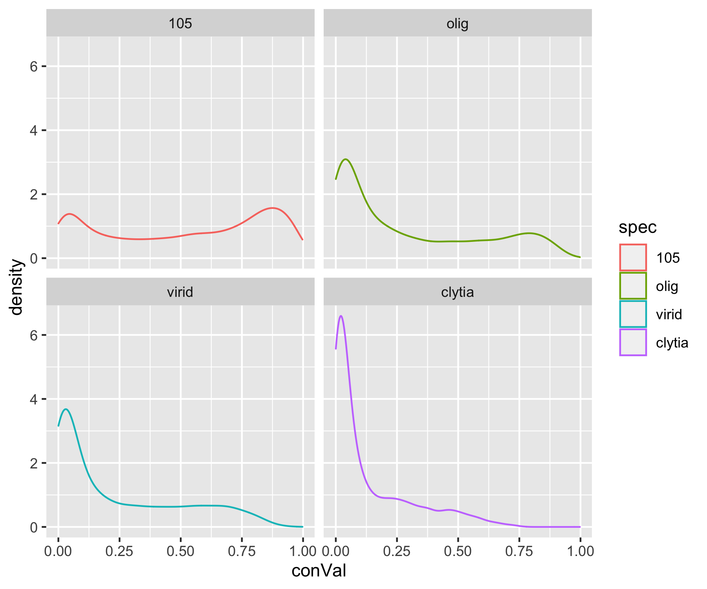
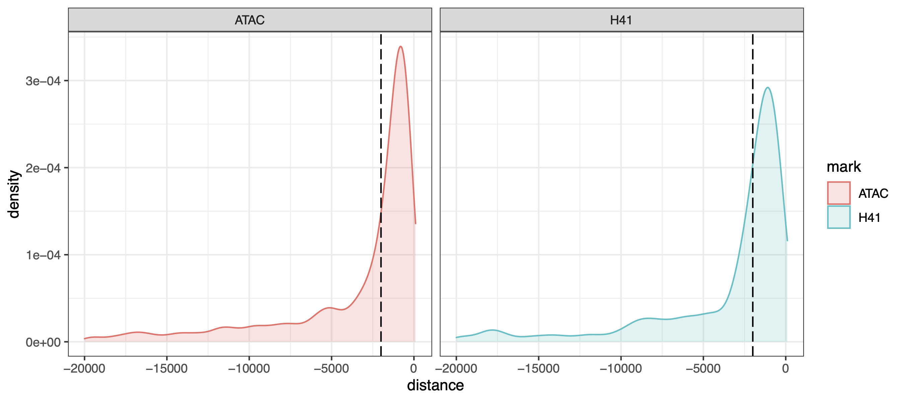

# Characterizing *Hydra* Genome Sequence Conservation

This document covers our approach to analyzing sequence conservation in the strain AEP *H. vulgaris* genome assembly. This process entailed collecting and prepping five hydrozoan genomes, aligning them with the progressive cactus whole-genome alignment pipeline, generating sequence conservation data tracks, and identifying conserved transcription factor binding motifs and cis-regulatory elements. 

[TOC]

## Prepping Input Sequences for Alignment

Repetitive regions are intrinsically difficult to align. Therefore, softmasking repeats in the genomes being aligned can improve results. Softmasking prevents a region from seeding alignments, but allows alignments to extend into the masked region. We had already masked the AEP assembly as part of our annotation pipeline (see `02_repeatMasking.md` for details). During that analysis we had also generated a repeat masked version of the strain 105 genome. In addition, softmasked versions of the *Clytia* and *H. viridissima* genomes were already available. For *Clytia* we used the file `Clytia_hemisphaerica_gca902728285.GCA902728285v1.dna_sm.toplevel.fa.gz` (available for download [here](http://ftp.ensemblgenomes.org/pub/metazoa/release-52/fasta/clytia_hemisphaerica_gca902728285/dna/)), which we renamed to `clytia.fa`. For *H. viridissima* we used the file `hvir_genome_hm2_250116_renamed.fa` (available for download [here](https://marinegenomics.oist.jp/hydra_viridissima_a99/viewer/download?project_id=82)), which we renamed to `virid.fa`.

### Masking Repeats in the *H. oligactis* Assembly

When the whole-genome alignment was performed, we had not yet generated *oligactis* specific repeat libraries for masking repeats (described in `02_repeatMasking.md`). We therefore simply used a combination of the strain AEP *H. vulgaris* repeatmodeler and Dfam eumetazoa repeat family libraries. Using this approach resulted in some repetitive regions going unmasked. Nonetheless, we were still able to capture the majority of the repetitive sequence in the *oligactis* genome. 

To identify and mask repeats in *oligactis*, we first ran repeatmasker using the repeat families identified for the AEP assembly:

(*01_alignment/runOligMask.sh*)

```bash
#! /bin/bash
#SBATCH -p med
#SBATCH --job-name=RMask
#SBATCH -c 24
#SBATCH -t 60-0
#SBATCH --mem=0
#SBATCH --error=RMask_%j.err
#SBATCH --output=RMask_%j.out

module load singularity

singularity exec -B /home/jacazet/reference/makerAnnotations/aepAnnot/repMask ~/maker-plus_3.01.03.sif RepeatMasker -pa 24 -lib aep-families.fa olig_genome.fa
```

We then did another repeatmasker run using the Dfam eumetazoa repeat library:

(*01_alignment/runOligMaskEuk.sh*)

```bash
#! /bin/bash
#SBATCH -p med
#SBATCH --job-name=RMask
#SBATCH -c 24
#SBATCH -t 60-0
#SBATCH --mem=0
#SBATCH --error=RMask_%j.err
#SBATCH --output=RMask_%j.out

module load singularity

singularity exec -B /home/jacazet/reference/makerAnnotations/aepAnnot/repMask ~/maker-plus_3.01.03.sif RepeatMasker -pa 8 -species eumetazoa olig_genome.fa
```

We then pooled those two repeat predictions:

`zcat olig_AEPMAsk/olig_genome.fa.cat.gz oligEuk/olig_genome.fa.cat.gz > fullOligMask.cat`

and generated a finalized set of repeat coordinates

(*01_alignment/runOligMaskEuk.sh*)

```bash
#! /bin/bash
#SBATCH -p med
#SBATCH --job-name=procRep
#SBATCH -c 4
#SBATCH -t 60-0
#SBATCH --mem=0
#SBATCH --error=process.err
#SBATCH --output=process.out

../../RepeatMasker/ProcessRepeats -a -species eumetazoa -gff fullOligMask.cat
```

This created the following repeat summary table:

(snippet from *01_alignment/fullOligMask.tbl*)

```bash
==================================================
file name: fullOligMask
sequences:         16314
total length: 1274417049 bp  (1274416349 bp excl N/X-runs)
GC level:        Unknown %
bases masked:  720905829 bp ( 56.57 %)
==================================================
               number of      length   percentage
               elements*    occupied  of sequence
--------------------------------------------------
Retroelements       479876    194203444 bp   15.24 %
   SINEs:            47590      4952222 bp    0.39 %
   Penelope          84031     25882244 bp    2.03 %
   LINEs:           398519    170803522 bp   13.40 %
    CRE/SLACS          902       457155 bp    0.04 %
     L2/CR1/Rex     239618    121557797 bp    9.54 %
     R1/LOA/Jockey     524        42132 bp    0.00 %
     R2/R4/NeSL       2490       382548 bp    0.03 %
     RTE/Bov-B       47755     10107949 bp    0.79 %
     L1/CIN4          2209       121333 bp    0.01 %
   LTR elements:     33767     18447700 bp    1.45 %
     BEL/Pao          3908      3891312 bp    0.31 %
     Ty1/Copia        3834       585175 bp    0.05 %
     Gypsy/DIRS1     21157     13524719 bp    1.06 %
       Retroviral     3265       157584 bp    0.01 %

DNA transposons     1839991    387695945 bp   30.42 %
   hobo-Activator   655990    147523867 bp   11.58 %
   Tc1-IS630-Pogo   156424     37217650 bp    2.92 %
   En-Spm                0            0 bp    0.00 %
   MuDR-IS905            0            0 bp    0.00 %
   PiggyBac           6629      2420433 bp    0.19 %
   Tourist/Harbinger  9194      2005113 bp    0.16 %
   Other (Mirage,   128684     26086097 bp    2.05 %
    P-element, Transib)

Rolling-circles      37426      7814077 bp    0.61 %

Unclassified:       259396     55006308 bp    4.32 %

Total interspersed repeats:   636905697 bp   49.98 %


Small RNA:           45462      4830468 bp    0.38 %

Satellites:           3808       745656 bp    0.06 %
Simple repeats:     832876     68080392 bp    5.34 %
Low complexity:     137832      7101564 bp    0.56 %
==================================================
```

We then used these repeat predictions to generate a soft masked version of the *oligactis* assembly that was used as input into the genome alignment pipeline:

```bash
bedtools maskfasta -fi olig_genome.fa -bed fullOligMask.out.gff -fo olig.sm.fa -soft
```

## Generating a Cross-Species Whole-Genome Alignment

After prepping the repeat masked genome sequences, we placed them in a subfolder called `seqs`, and renamed the fastas in the following way:

```bash
olig.fa	#this file was renamed from olig.sm.fa
virid.fa	#this file was renamed from hvir_genome_hm2_250116_renamed.fa
clytia.fa #this file was renamed from Clytia_hemisphaerica_gca902728285.GCA902728285v1.dna_sm.toplevel.fa
105.fa	#this file was renamed from 105.fullsoft.fa
aep.fa	#this file was renamed from aep.genome.fullsoft.fa
```

We then prepared a config file required by cactus (called `evolverVulgaris.txt`). The first line of this file is a species tree describing the relationships among the five genomes in the alingment in newick format. The distances were derived from a species tree generated by a preliminary Orthofinder analysis that included proteomes from each of the species in this alignment. The remaining lines specify prefixes for each genome and the path to the appropriate fasta file.

(*01_alignment/evolverVulgaris.txt*)

```bash
(((virid:0.15735,((aep:0.02449,105:0.03419):0.06057,olig:0.08281):0.16061):0.4047,clytia:0.64829):0.84056);
*aep seqs/aep.fa
105 seqs/105.fa
virid seqs/virid.fa
olig seqs/olig.fa
clytia seqs/clytia.fa
```

We then ran the progressive cactus aligner using the following script:

(*01_alignment/vulgarisCactus.sh*)

```bash
#!/bin/bash
#SBATCH --nodes=1
#SBATCH --mem=0
#SBATCH --exclusive
#SBATCH --time=60-0
#SBATCH --partition=bigmemm
#SBATCH --error=cactus.err
#SBATCH --output=cactus.out
#SBATCH --job-name=cactus

source venv/bin/activate

cactus jobstore evolverVulgaris.txt evolverHydra.hal --realTimeLogging
```

This generated the alignment file `evolverHydra.hal`, which was used for subsequent analysis.

## Generating AEP Genome Conservation Data Tracks

One of the goals of generating a whole-genome alignment was to generate genome data tracks of sequence conservation. This would allow researchers to look at sequence conservation at their locus of interest and quickly identify candidate functional regions. We opted to use a fairly straightforward approach to generate these data tracks, which simply involved quantifying the amount of conserved sequence in aligned regions (i.e., which nucleotides were identical across different species). This functionality isn't built into the suite of tools provided with the cactus aligner or any other related software, so we implemented our own solution.

We first converted the hal alignment file into a maf format, which is generally a more widely supported format for multiple sequence alignments. maf files are formated to use one of the aligned sequences as a primary reference. We used the AEP assembly because this was the genome we were ultimately going to generate data tracks for. To aid in parallelization at later steps we generated a single maf file for each chromosome in the AEP assembly.

(*02_conservationTracks/makeMafs.sh*)

```bash
#!/bin/bash
#SBATCH --job-name=makeMaf
#SBATCH -p med
#SBATCH -c 1
#SBATCH -t 60-0
#SBATCH --array=1-15
#SBATCH --mem=8G
#SBATCH --error=makeMaf_%a.err
#SBATCH --output=makeMaf_%a.out

source ../venv/bin/activate

arg=$SLURM_ARRAY_TASK_ID

echo "$arg"

hal2maf --onlyOrthologs --noAncestors --noDupes --refSequence chr-"$arg" --refGenome aep evolverHydra.hal cactus.chr"$arg".maf
```

We then used the following custom python script to count the number of other hydrozoan genomes that had the same nucleotide as the AEP assembly at each position in the AEP genome. We then applied a 100bp moving window to smooth these values, and then exported the results to a bedgraph file.

(*02_conservationTracks/mafWindows.py*)

```python
#!/usr/bin/env python3
# -*- coding: utf-8 -*-
"""
Created on Sat Sep 11 18:31:26 2021

@author: Jcazet
"""
from Bio import AlignIO
import numpy as np
import pandas as pd
import glob

files = glob.glob('../*.maf')

for file in files:
    #creates a generator
    alignment = AlignIO.parse(file, "maf")

    #initialize empty results table
    conDF = []

    i = 0

    #go through each chunk of the maf file
    for subA in alignment:

        i += 1

        if i % 1000 == 0:
            print(i)

        #get the list the species for each row
        species = [sq.id.split(sep='.')[0] for sq in subA._records]

        if i == 1:
          chrName = [sq.id.split(sep='.')[1] for sq in subA._records][0]

        #if AEP is the only sequence in the chunk, just write all zeros and move on
        if len(species) == 1:
            outL = subA.get_alignment_length()
            align_array = [0] * outL
            #print(align_array)
            conDF.extend(align_array)
                        continue

        #convert alignment to character array
        align_array = np.array([list(rec) for rec in subA], np.str)

        #make all characters uppercase (so softmasking doesn't mess with checking for a match)
        align_array = np.char.upper(align_array)

        #check which bases match the AEP sequence
        align_array = pd.DataFrame(align_array[0,:] == align_array[1:,:])

        #get the species names for the match matrix
        align_array['species'] = species[1:]

        #in cases where multiple sequences from a species are in a chunk,
        #just look to see if there is any match at a given spot
        #This allows us to collapse species into single rows
        align_array = align_array.groupby('species',0).any()

        #count the number of species that matched at each position
        align_array = align_array.sum(0).tolist()

        #print(align_array)

        #add to results dataframe
        conDF.extend(align_array)

    conBG = pd.DataFrame(data={'chrom': chrName,
                               'start': range(len(conDF)),
                               'end': range(1,len(conDF) + 1),
                               'score' : conDF
                               }
                         )

    # conBG.to_csv(chrName + '.cactus.bedgraph',sep='\t',header=False,index=False)
    
    conBG_roll = conBG.copy()

    conBG_roll['score'] = conBG_roll['score'].rolling(window=100,min_periods=1).mean()

    conBG_roll.to_csv(chrName + '.rolling100.cactus.bedgraph',sep='\t',header=False,index=False)
```

Note the commented line `conBG.to_csv(chrName + '.cactus.bedgraph',sep='\t',header=False,index=False)`. Uncommenting this line enables the production of a bedgraph without the 100 bp smoothing window (just raw conservation counts, written to the file `aepCon.bedgraph` that was then converted to `aepCon.bw`). We used this version of the output for characterizing conservation patterns around genes (see next section)

We executed this python script on a computing cluster using the following script:

(*02_conservationTracks/runWindows.sh*)

```bash
#!/bin/bash -l
#SBATCH --job-name=window
#SBATCH -p med
#SBATCH -c 1
#SBATCH -t 7-0
#SBATCH --mem=16G
#SBATCH --error=window.err
#SBATCH --output=window.out

python mafWindows.py
```

We then pooled the bedgraph files from each chromosome into a single file and converted it into the more compact bigwig format. 

(*02_conservationTracks/runBW.sh*)

```bash
#!/bin/bash -l
#SBATCH --job-name=bg2bw
#SBATCH -p bigmemm 
#SBATCH -c 1
#SBATCH -t 7-0
#SBATCH --mem=360G
#SBATCH --error=bg2bw.err
#SBATCH --output=bg2bw.out

cat *rolling100* > aepCon100.bedgraph

bedSort aepCon100.bedgraph aepCon100.sort.bedgraph

bedGraphToBigWig aepCon100.sort.bedgraph aep.genome aepCon100.bw
```

Note the file `aep.genome`, which simply lists the chromosome sizes in the AEP assembly. This file was generated using the following command:

```bash
samtools faidx aep.fa
cut -f 1,2 aep.fa.fai > aep.genome
```

Our initial python script counted the number of identical bases across all non-AEP genomes. We also generated additional modified versions of the `mafWindows.py` script to look only at pairwise alignments between the AEP assembly and each of the other genomes. 

The following is the output of the command `diff mafWindows.py mafWindows105.py`, highlighting the differences between the original script and the version that only looked at pairwise conservation between the AEP and 105 assemblies.

```
39c39,40
<         if len(species) == 1:
---
>         #or if 105 is not in species list
>         if len(species) == 1 or '105' not in species:
47c48
<         align_array = np.array([list(rec) for rec in subA], np.str)
---
>         align_array = np.array([list(rec) for rec in subA], str)
56a58,60
>         
>         #drop non-105 hits
>         align_array = align_array.loc[lambda df: df['species'] == '105', :]
78c82
<     # conBG.to_csv(chrName + '.cactus.bedgraph',sep='\t',header=False,index=False)
---
>     conBG.to_csv(chrName + '.105.cactus.bedgraph',sep='\t',header=False,index=False)
85c89
<     conBG_roll.to_csv(chrName + '.rolling100.cactus.bedgraph',sep='\t',header=False,index=False)
---
>     conBG_roll.to_csv(chrName + '.105.rolling10.cactus.bedgraph',sep='\t',header=False,index=False)
```

The following is the output of the command `diff mafWindows.py mafWindowsOlig.py`, highlighting the differences between the original script and the version that only looked at pairwise conservation between the AEP and *oligactis* assemblies.

```
39c39,40
<         if len(species) == 1:
---
>         #or if olig is not in species list
>         if len(species) == 1 or 'olig' not in species:
47c48
<         align_array = np.array([list(rec) for rec in subA], np.str)
---
>         align_array = np.array([list(rec) for rec in subA], str)
56a58,60
>         
>         #drop non-olig hits
>         align_array = align_array.loc[lambda df: df['species'] == 'olig', :]
78c82
<     # conBG.to_csv(chrName + '.cactus.bedgraph',sep='\t',header=False,index=False)
---
>     conBG.to_csv(chrName + '.olig.cactus.bedgraph',sep='\t',header=False,index=False)
85c89
<     conBG_roll.to_csv(chrName + '.rolling100.cactus.bedgraph',sep='\t',header=False,index=False)
---
>     conBG_roll.to_csv(chrName + '.olig.rolling10.cactus.bedgraph',sep='\t',header=False,index=False)
```

The following is the output of the command `diff mafWindows.py mafWindowsVirid.py`, highlighting the differences between the original script and the version that only looked at pairwise conservation between the AEP and *viridissima* assemblies.

```
39c39,40
<         if len(species) == 1:
---
>         #or if virid is not in species list
>         if len(species) == 1 or 'virid' not in species:
47c48
<         align_array = np.array([list(rec) for rec in subA], np.str)
---
>         align_array = np.array([list(rec) for rec in subA], str)
56a58,60
>         
>         #drop non-virid hits
>         align_array = align_array.loc[lambda df: df['species'] == 'virid', :]
78c82
<     # conBG.to_csv(chrName + '.cactus.bedgraph',sep='\t',header=False,index=False)
---
>     conBG.to_csv(chrName + '.virid.cactus.bedgraph',sep='\t',header=False,index=False)
85c89
<     conBG_roll.to_csv(chrName + '.rolling100.cactus.bedgraph',sep='\t',header=False,index=False)
---
>     conBG_roll.to_csv(chrName + '.virid.rolling10.cactus.bedgraph',sep='\t',header=False,index=False)
```

The following is the output of the command `diff mafWindows.py mafWindowsClytia.py`, highlighting the differences between the original script and the version that only looked at pairwise conservation between the AEP and *Clytia* assemblies.

```
39c39,40
<         if len(species) == 1:
---
>         #or if clytia is not in species list
>         if len(species) == 1 or 'clytia' not in species:
47c48
<         align_array = np.array([list(rec) for rec in subA], np.str)
---
>         align_array = np.array([list(rec) for rec in subA], str)
56a58,60
>         
>         #drop non-clytia hits
>         align_array = align_array.loc[lambda df: df['species'] == 'clytia', :]
78c82
<     # conBG.to_csv(chrName + '.cactus.bedgraph',sep='\t',header=False,index=False)
---
>     conBG.to_csv(chrName + '.clytia.cactus.bedgraph',sep='\t',header=False,index=False)
85c89
<     conBG_roll.to_csv(chrName + '.rolling100.cactus.bedgraph',sep='\t',header=False,index=False)
---
>     conBG_roll.to_csv(chrName + '.clytia.rolling10.cactus.bedgraph',sep='\t',header=False,index=False)
```

We executed all of these modified scripts on a computing cluster using the following script:

(*02_conservationTracks/runSpecWindows.sh*)

```bash
#!/bin/bash -l
#SBATCH --job-name=window
#SBATCH -p med
#SBATCH -c 1
#SBATCH -t 7-0
#SBATCH --mem=16G
#SBATCH --error=window.err
#SBATCH --output=window.out

python mafWindows105.py
python mafWindowsVirid.py
python mafWindowsOlig.py
python mafWindowsClytia.py
```

We then pooled and converted the output files from each of these scripts into bigwig files.

(*02_conservationTracks/runBWbySpec.sh*)

```bash
#!/bin/bash -l
#SBATCH --job-name=bw
#SBATCH -p bigmemm 
#SBATCH -c 1
#SBATCH -t 7-0
#SBATCH --mem=0
#SBATCH --error=bw.err
#SBATCH --output=bw.out

cat *olig.rolling* > olig.rolling100.cactus.bedgraph
bedSort olig.rolling100.cactus.bedgraph olig.rolling100.cactus.sort.bedgraph
bedGraphToBigWig olig.rolling100.cactus.sort.bedgraph ../../aep.genome olig.rolling100.cactus.bw

cat *virid.rolling* > virid.rolling100.cactus.bedgraph
bedSort virid.rolling100.cactus.bedgraph virid.rolling10.cactus.sort.bedgraph
bedGraphToBigWig virid.rolling100.cactus.sort.bedgraph ../../aep.genome virid.rolling100.cactus.bw

cat *105.rolling* > 105.rolling100.cactus.bedgraph
bedSort 105.rolling10.cactus.bedgraph 105.rolling100.cactus.sort.bedgraph
bedGraphToBigWig 105.rolling100.cactus.sort.bedgraph ../../aep.genome 105.rolling100.cactus.bw

cat *clytia.rolling* > clytia.rolling100.cactus.bedgraph
bedSort clytia.rolling100.cactus.bedgraph clytia.rolling10.cactus.sort.bedgraph
bedGraphToBigWig clytia.rolling100.cactus.sort.bedgraph ../../aep.genome clytia.rolling100.cactus.bw
```

## Calculating Conservation Patterns Near Genes

One question we wanted to explore using our sequence conservation data involved the size of promoter-proximal regulatory regions in *Hydra*. More specifically, we wanted to determine the typical distribution of conserved sequence in the regions upstream of gene transcription start sites to determine if 2 Kb upstream was sufficient to capture most promoter sequence in *Hydra* (as had been proposed by some researchers).

We used the `computeMatrix` function from the DeepTools package to quantify sequence conservation around each of the gene models in the AEP assemby. This function removed intronic sequences and scaled each gene to be equivalent to 750 bases. It also provided sequence conservation data on the 10 Kb up and downstream of each gene.

(*compWideGeneCon.sh*)

```bash
#!/bin/bash

computeMatrix scale-regions \
        -R HVAEP1.GeneModels.gtf \
        -S aepCon.bw \
        -o broadConGeneMatrix.txt \
        --outFileNameMatrix broadConGeneMatrix.names.txt \
        --outFileSortedRegions broadConGeneMatrix.regions.txt \
        -m 750 \
        -b 10000 \
        -a 10000 \
        --missingDataAsZero \
        -p 6 \
        --metagene
```

We then took the matrix generated by this command and used a custom R script to determine the size of the conservation footprint around genes. That is, we asked how far up and downstream of a gene do you typically have to go before conservation rates falls back to baseline levels. We also used this script to determine how far up and downstream you have to go before you encompass 50% or 90% of the total conservation signal (i.e., the area under the curve from the TSS to the point where conservation returned to baseline levels). Finally, the script generated a plot to summarize these results.

(*03_promConservation/conCutOffPlot.R*)

```R
library(rstudioapi)
library(ggplot2)
library(mixtools)
library(dplyr)

setwd(dirname(getActiveDocumentContext()$path))

#import conservation matrix (rows are genes, columns are bins/position relative to gene)
#need to import header separately because of parsing problems
conMat <- read.delim('broadConGeneMatrix.names.txt',skip = 3, sep = '\t',header = F)

conMatCol <- t(read.delim('broadConGeneMatrix.names.txt',skip = 2, nrows = 1, sep = '\t',header = F))[-1]

#fix colnames issue
colnames(conMat) <- conMatCol

#calcualte the average conservation for each bin (average conservation profile for all genes)
conMat.ave <- colMeans(conMat,na.rm = T)

conMat.ave <- data.frame(pos=seq(from=0,to=20740,by=10),val=conMat.ave)

#determine the baseline conservation level (average at +/- 10 Kb from genes)
end5 <- mean(conMat.ave[conMat.ave$pos < 1000,'val'])
end3 <- mean(conMat.ave[conMat.ave$pos > 19075,'val'])

#determine the most up and downstream regions from genes that have a conservation values above the baseline
con5 <- max(conMat.ave[conMat.ave$val < end5 & conMat.ave$pos < 10000,'pos'])
con3 <- min(conMat.ave[conMat.ave$val < end3 & conMat.ave$pos > 10000,'pos'])

library(MESS)

#within the region of elevated conservation, calculate the area under the curve
#relative to distance from the TSS or TTS
#that is, how far upstream (for instance) do you have to go from the TSS to encompass
#50% of the total upstream conservation signal

#first look upstream
upAuc <- conMat.ave[conMat.ave$pos >= con5 & conMat.ave$pos <= 10000,]
upAuc <- upAuc[rev(1:nrow(upAuc)),]

upAuc$pos <- abs(upAuc$pos - 10000)

upAuc$auc <- vapply(upAuc$pos, function(x){
  
  auc(x=upAuc$pos,
      y=upAuc$val,
      from=0,
      to = x,
      type = 'spline',
      absolutearea = T)
  
},numeric(1))

#convert auc to percent of total auc
upAuc$auc.p <- upAuc$auc/max(upAuc$auc)

#get position of half auc of upstream chunk
upHalf <- max(upAuc[upAuc$auc.p <= 0.5,'pos'])

#get position of 90% auc of upstream chunk
upNinety <- max(upAuc[upAuc$auc.p <= 0.9,'pos'])

#now look downstream
downAuc <- conMat.ave[conMat.ave$pos <= con3 & conMat.ave$pos >= 10750,]
#downAuc <- downAuc[rev(1:nrow(downAuc)),]

downAuc$pos <- abs(downAuc$pos - 10750)

downAuc$auc <- vapply(downAuc$pos, function(x){
  
  auc(x=downAuc$pos,
      y=downAuc$val,
      from=0,
      to = x,
      type = 'spline',
      absolutearea = T)
  
},numeric(1))

downAuc$auc.p <- downAuc$auc/max(downAuc$auc)

downHalf <- max(downAuc[downAuc$auc.p <= 0.5,'pos'])
downNinety <- max(downAuc[downAuc$auc.p <= 0.9,'pos'])

#generate plot with AUC colored according to chunks calculated above

conMat.ave$fill <- 'null'
#conMat.ave[conMat.ave$pos > con5 & conMat.ave$pos <= 10000,'fill'] <- 'upAll'
conMat.ave[conMat.ave$pos > 10000-upNinety & conMat.ave$pos <= 10000,'fill'] <- 'upNinety'
conMat.ave[conMat.ave$pos > 10000-upHalf & conMat.ave$pos <= 10000,'fill'] <- 'upFifty'
#conMat.ave[conMat.ave$pos < con3 & conMat.ave$pos >= 10750,'fill'] <- 'downAll'
conMat.ave[conMat.ave$pos < 10750+downNinety & conMat.ave$pos >= 10750,'fill'] <- 'downNinety'
conMat.ave[conMat.ave$pos < 10750+downHalf & conMat.ave$pos >= 10750,'fill'] <- 'downFifty'
conMat.ave[conMat.ave$pos > 10000 & conMat.ave$pos < 10750,'fill'] <- 'gene'
conMat.ave[conMat.ave$pos >= con3,'fill'] <- 'null2'

ggplot(conMat.ave,aes(x=pos,y=val)) + 
  theme_bw() + 
  geom_line(color='red',size=2) + 
  geom_vline(xintercept = con5,size=1) + 
  geom_vline(xintercept = con3,size=1) + 
  scale_x_continuous(breaks = c(0,con5,10000,10750,con3,20750),minor_breaks = NULL,labels = c('-10 Kb',paste0('-',10000-con5),'TSS','TTS',paste0('+',10750-con3),'+10 Kb')) + 
  theme(axis.text.x = element_text(face="bold",size=11, angle=315,color='black'),axis.text.y = element_text(face="bold", size=11,color='black')) +
  theme(panel.grid.major = element_blank(), panel.grid.minor = element_blank())

ggsave('conservationCutoff.pdf',width = 5,height=5)  


ggplot(conMat.ave,aes(x=pos,y=val)) + 
  theme_bw() + 
  geom_area(aes(fill = fill), position = 'identity',alpha=0.8) + 
  geom_line(color='red',size=2) + 
  geom_vline(xintercept = con5,size=1) + 
  geom_vline(xintercept = con3,size=1) + 
  scale_x_continuous(breaks = c(0,con5,10000-upNinety,10000-upHalf,10000,10750,10750 + downHalf,10750 + downNinety,con3,20750),minor_breaks = NULL,
                     labels = c('-10 Kb',paste0('-',10000-con5),-upNinety,-upHalf,'TSS',
                                'TTS',paste0('+',downHalf),paste0('+',downNinety),paste0('+',con3-10750),'+10 Kb')) + 
  theme(axis.text.x = element_text(face="bold",size=11, angle=300,color='black'),axis.text.y = element_text(face="bold", size=11,color='black')) +
  theme(panel.grid.major = element_blank(), panel.grid.minor = element_blank()) +
  theme(legend.position = "none")

ggsave('conservationCutoffFilled.pdf',width = 5,height=5)  
```


## Identifying Conserved Transcription Factor Binding Sites in the AEP Genome

### Predicting Conserved Binding Sites Using JASPAR Motif Sequences

We next used our genome alignments to identify putative conserved transcription factor binding sites (TFBS) in the AEP genome. One of the most useful aspects of a whole-genome alignement is that it allows you to convert coordinates from one genome in the alignment to another. We took advantage of this to identify conserved TFBS by separately identifying putative TFBS in each genome and then converting the coordinates to their equivalent coordinates in the AEP assembly. Then we could look for cases where the same TFBS was predicted in the same location in multiple genomes in the alignment. 

To predict TFBS in our genomes, we needed a database of experimentally validated binding motifs. We used the JASPAR database for this purpose. Specifically, we used binding motifs from their non-redundant vertebrate (`JASPAR2020_CORE_vertebrates_non-redundant_pfms_jaspar.txt`), insect (`JASPAR2020_CORE_insects_non-redundant_pfms_jaspar.txt`), and nematode (`JASPAR2020_CORE_nematodes_non-redundant_pfms_jaspar.txt`) databases (downloaded [here](https://jaspar.genereg.net/download/data/2020/CORE/)). We pooled these three files to make a unified database

`cat *jaspar.txt > pooledJasparNR.txt`

We then used FIMO from the meme suite of software tools to identify predicted binding sites for all motifs in our database in each of the *Hydra* genomes in our whole-genome alignment. We opted to exclude the *Clytia* genome because very little non-coding sequence is conserved from *Hydra* to *Clytia*. To prepare for running FIMO, we generated a markov model of base frequencies in *Hydra*. Because base composition is generally quite similar among *Hydra* genomes, we just used the AEP model for all four genomes.

`fasta-get-markov aep.final.genome.fa > genome.markov.txt`

To reduce the search space for TFBS, we hard masked repetitive regions so they wouldn't be considered as part of the analysis. We did this by simply converting lower case bases in the soft masked genome fasta files to Ns.

```bash
sed '/^>/!s/[actg]/N/g' aep.fa > aep.hm.fa 
sed '/^>/!s/[actg]/N/g' 105.fa > 105.hm.fa 
sed '/^>/!s/[actg]/N/g' olig.fa > olig.hm.fa 
sed '/^>/!s/[actg]/N/g' virid.fa > virid.hm.fa 
```

Finally, we had to convert the JASPAR-formatted motifs into MEME-formatted motifs using a utility script included as part of meme suite:

`jaspar2meme -bundle pooledJasparNR.txt > pooledJasparNR.meme.txt'`

We then ran FIMO on each of the four *Hydra* genomes

(*04_motConservation/findHits.sh*)

```bash
#!/bin/bash -l
#SBATCH --job-name=fimo
#SBATCH -p med
#SBATCH -c 1
#SBATCH -t 7-0
#SBATCH --array=0-3
#SBATCH --mem=16G
#SBATCH --error=fimo_%a.err
#SBATCH --output=fimo_%a.out

conda activate meme

array=(aep 105 olig virid)

specUse=${array[$SLURM_ARRAY_TASK_ID]}

echo $specUse

fimo -bfile genome.markov.txt \
        --max-strand \
        --skip-matched-sequence \
        pooledJasparNR.meme.txt seqs/$specUse.hm.fa > $specUse.mots.tsv
```

We then reformatted the tsv output from fimo into bed files. For non-AEP results, we used the liftover functionality provided by the progressive cactus alignment suite of software tools to convert the TFBS coordinates into their equivalent values in the AEP genome.

(*04_motConservation/tsv2Bed.sh*)

```bash
#!/bin/bash -l
#SBATCH --job-name=makeBed
#SBATCH -p med
#SBATCH -c 1
#SBATCH -t 7-0
#SBATCH --mem=16G
#SBATCH --error=bed.err
#SBATCH --output=bed.out

for arg in *mots.tsv
do
        newName=${arg/tsv/bed}
        awk 'BEGIN {OFS="\t"}; {if (NR!=1) {print($3,$4-1,$5,$1,$8,$6)}}' $arg > $newName
done

source ~/reference/alignments/venv/bin/activate

halLiftover evolverHydra.hal olig olig.mots.bed aep oligMotifsAEP.bed
halLiftover evolverHydra.hal 105 105.mots.bed aep 105MotifsAEP.bed
halLiftover evolverHydra.hal virid virid.mots.bed aep viridMotifsAEP.bed
```

After all TFBS predictions had been placed in the same coordinate space, we needed to find cases where a TFBS prediction from a non-AEP species overlapped a predicted TFBS in the AEP assembly. However, we wanted to first exclude TFBS that either fell outside of an ATAC-seq peak or that fell inside a protein coding region. Both of these exclusions were intended to increase the likelihood that the remaining TFBS predictions fell within functional cis regulatory elements. We had already generated our ATAC-seq peak coordinates (`consensusAEP.bed`), but we needed to also create a bed file with CDS coordinates. We generated this file from the our AEP gene models gff3 file:

`grep -P '\tCDS\t' HVAEP1.GeneModels.gff3 | gff2bed --do-not-sort - > HVAEP1.cds.bed `

We then used the bedtools `intersect` function to eliminate TFBS predictions that did not overlap peaks in `consensusAEP.bed` or that did orverlap features in `HVAEP1.cds.bed`. After this filtering, we found all instances where a non-AEP TFBS prediction overlapped an AEP TFBS prediction, again using bedtools `intersect`. These intersections were then filtered so that the final output included only intersections that occured between two instances of the same binding motif.

(*04_motConservation/filterHits.sh*)

```bash
#!/bin/bash -l
#SBATCH --job-name=filt
#SBATCH -p med
#SBATCH -c 1
#SBATCH -t 7-0
#SBATCH --mem=0
#SBATCH --error=filt.err
#SBATCH --output=filt.out

bedtools intersect -f 1 -u -a aep.mots.bed -b consensusAEP.bed > aepMotifsATAC.bed
bedtools intersect -v -a aepMotifsATAC.bed -b HVAEP1.cds.bed > aepMotifsATACnCDS.bed

bedtools intersect -f 1 -u -a viridMotifsAEP.bed -b consensusAEP.bed > viridMotifsAepAtac.bed
bedtools intersect -v -a viridMotifsAepAtac.bed -b HVAEP1.cds.bed > viridMotifsAepAtacNcds.bed

bedtools intersect -f 1 -u -a 105MotifsAEP.bed -b consensusAEP.bed > 105MotifsAepAtac.bed
bedtools intersect -v -a 105MotifsAepAtac.bed -b HVAEP1.cds.bed > 105MotifsAepAtacNcds.bed

bedtools intersect -f 1 -u -a oligMotifsAEP.bed -b consensusAEP.bed > oligMotifsAepAtac.bed
bedtools intersect -v -a oligMotifsAepAtac.bed -b HVAEP1.cds.bed > oligMotifsAepAtacNcds.bed

sort -k1,1 -k2,2n viridMotifsAEP.bed > viridMotifsAEP.sort.bed
sort -k1,1 -k2,2n 105MotifsAEP.bed > 105MotifsAEP.sort.bed
sort -k1,1 -k2,2n oligMotifsAEP.bed > oligMotifsAEP.sort.bed
sort -k1,1 -k2,2n aepMotifsATACnCDS.bed > aepMotifsATACnCDS.sort.bed


bedtools intersect -r -f 0.8 -s -wa -wb -sorted -a aepMotifsATACnCDS.sort.bed -b viridMotifsAEP.sort.bed > viridAepOlap.bed
bedtools intersect -r -f 0.8 -s -wa -wb -sorted -a aepMotifsATACnCDS.sort.bed -b oligMotifsAEP.sort.bed > oligAepOlap.bed
bedtools intersect -r -f 0.8 -s -wa -wb -sorted -a aepMotifsATACnCDS.sort.bed -b 105MotifsAEP.sort.bed > 105AepOlap.bed

awk 'BEGIN {OFS="\t"}; {if ($4 == $10) {print}}' 105AepOlap.bed > 105AepOlapCon.bed
awk 'BEGIN {OFS="\t"}; {if ($4 == $10) {print}}' oligAepOlap.bed > oligAepOlapCon.bed
awk 'BEGIN {OFS="\t"}; {if ($4 == $10) {print}}' viridAepOlap.bed > viridAepOlapCon.bed

```

### Generating a Control Motif Dataset Using Shuffled JASPAR Motifs

In order to determine if a particular binding motif was conserved, we needed to demonstrate that the rate at which a particular sequence remained intact over the course of *Hydra* evolution was higher than would be expected by chance. In order to estimate the expected baseline rate of conservation for any given binding motif we chose to characterize conservation frequencies for a shuffled version of that motif. The rationale being that shuffling a motif should disrupt its function without affecting any of it's intrinsic sequence characteristics (mainly length and GC content). 

To execute this approach, we needed to generate a shuffled version of each motif in our database. We wrote a custom R script for this purpose. This script iterated through each motif in our database and randomly reorganized the nucleotides that made up the motif. To make sure this reorganization didn't inadvertantly create a motif that resembled some other functional motif, we used the meme suite tool tomtom to compare our shuffled motif to our collection of JASPAR motifs to make sure the shuffled motif had no significant similarity to any bona fide binding motifs. If the shuffled motif did resemble another motif, it was shuffled again, repeating the process until the shuffled motif was sufficiently dissimilar (E value ≥ 5). In some cases, the motif being shuffled was too simple/short to get an E-value ≥ 5. Therefore, we wrote the script to halve the dissimilarity threshold after 20 consecutive unsuccessful shuffling attempts. The shuffled motifs were then written to the file `shuffledJasparMotifs.txt`

(*04_motConservation/motifShuffle.R*)

```R
library(rstudioapi)
setwd(dirname(getActiveDocumentContext()$path))

#jaspar motif file

jm <- data.frame(V1=readLines('pooledJasparNR.txt'))

jm <- split(jm,rep(1:(nrow(jm)/5),each=5))

jm.names <- vapply(jm,function(x) x[1,1],"")

jm <- lapply(jm,function(x){
  newDF <- x[-1,]
  newDF <- gsub('.*\\[','',newDF)
  newDF <- gsub('\\].*','',newDF)
  newDF <- gsub(' +',' ',newDF)
  newDF <- gsub('^ | $','',newDF)
  newDF <- strsplit(newDF,split=' ')
  newDF <- do.call(rbind,newDF)
  rownames(newDF) <- c('A','C','G','T')
  return(newDF)
})

lapply(1:length(jm), function(x){

  motName <- names(jm)[x]
  
  motTest <- jm[[x]]
  
  motL <- ncol(motTest)
  
  cutoff <- 5
  
  while(T){
    
    for(i in 1:20){
      motTest <- motTest[,sample(ncol(motTest))]
      
      motTest <- apply(motTest,1,paste,collapse=' ')
      
      motTest <- vapply(motTest, function(x) paste0('[ ',x, ' ] '),'')
      
      motTest <- data.frame(base=c('A','C','T','G'),freq=motTest)
      
      motTest <- apply(motTest,1,paste, collapse= ' ')
      
      motTest <- c(motName,motTest)
      
      writeLines(motTest,'shufMot.txt')
      
      system('/Users/Jcazet/meme/libexec/meme-5.4.1/jaspar2meme -bundle shufMot.txt > shufMot.meme.txt')
      
      system('/Users/Jcazet/meme/bin/tomtom -thresh 1 -text shufMot.meme.txt pooledJasparNR.meme.txt > shufMotScore.txt')
      
      matchRes <- read.delim('shufMotScore.txt')
      
      matchRes <- matchRes[complete.cases(matchRes),]
      
      if(min(matchRes$E.value) >= cutoff){
        break
      }
      
      print('Motif too similar. Retrying.')
      
      motTest <- jm[[x]]
      
    }
    
    if(min(matchRes$E.value) >= cutoff){
      break
    }
    
    print('Lowering cutoff to:')
    
    cutoff <- cutoff/2
    
    print(cutoff)
    
  }
  
  system('cat shufMot.txt >> shuffledJasparMotifs.txt')
  
})
```

The next steps were essentially identical to those in the previous section, except we used our shuffled motif file  instead of the database of genuine motifs.

We first converted the JASPAR-formatted motif list to a MEME-formatted motif list:

`jaspar2meme -bundle pooledJasparNR.txt > pooledJasparNR.meme.txt`

We then predicted motifs across all four *Hydra* genomes:

(*04_motConservation/findHitsShuf.sh*)

```bash
#!/bin/bash -l
#SBATCH --job-name=fimo
#SBATCH -p med
#SBATCH -c 1
#SBATCH -t 7-0
#SBATCH --array=0-3
#SBATCH --mem=16G
#SBATCH --error=fimo_%a.err
#SBATCH --output=fimo_%a.out

conda activate meme

array=(aep 105 olig virid)

specUse=${array[$SLURM_ARRAY_TASK_ID]}

echo $specUse

fimo -bfile genome.markov.txt \
        --max-strand \
        --skip-matched-sequence \
        shuffledJasparMotifs.meme.txt seqs/$specUse.hm.fa > $specUse.shufMots.tsv
```

We converted the FIMO output to bed, and converted non-AEP coordinates to AEP coordinates:

(*04_motConservation/tsv2BedShuf.sh*)

```bash
#!/bin/bash -l
#SBATCH --job-name=makeBed
#SBATCH -p med
#SBATCH -c 1
#SBATCH -t 7-0
#SBATCH --mem=16G
#SBATCH --error=bed.err
#SBATCH --output=bed.out

for arg in *Mots.tsv
do
        newName=${arg/tsv/bed}
        awk 'BEGIN {OFS="\t"}; {if (NR!=1) {print($3,$4-1,$5,$1,$8,$6)}}' $arg > $newName
done

source ~/reference/alignments/venv/bin/activate

halLiftover evolverHydra.hal olig olig.shufMots.bed aep oligShufMotifsAEP.bed
halLiftover evolverHydra.hal 105 105.shufMots.bed aep 105ShufMotifsAEP.bed
halLiftover evolverHydra.hal virid virid.shufMots.bed aep viridShufMotifsAEP.bed
```

We filtered motif predictions so that they fell inside ATAC-seq peaks and didn't intersect coding sequence. Then we filtered non-AEP hits if they didn't overlap with an identical motif hit in the AEP genome:

(*04_motConservation/filterHitsShuf.sh*)

```bash
#!/bin/bash -l
#SBATCH --job-name=filt
#SBATCH -p med
#SBATCH -c 1
#SBATCH -t 7-0
#SBATCH --mem=0
#SBATCH --error=filt.err
#SBATCH --output=filt.out

bedtools intersect -f 1 -u -a aep.shufMots.bed -b consensusAEP.bed > aepShufMotifsATAC.bed
bedtools intersect -v -a aepShufMotifsATAC.bed -b HVAEP1.cds.bed > aepShufMotifsATACnCDS.bed

bedtools intersect -f 1 -u -a viridShufMotifsAEP.bed -b consensusAEP.bed > viridShufMotifsAepAtac.bed
bedtools intersect -v -a viridShufMotifsAepAtac.bed -b HVAEP1.cds.bed > viridShufMotifsAepAtacNcds.bed

bedtools intersect -f 1 -u -a 105ShufMotifsAEP.bed -b consensusAEP.bed > 105ShufMotifsAepAtac.bed
bedtools intersect -v -a 105ShufMotifsAepAtac.bed -b HVAEP1.cds.bed > 105ShufMotifsAepAtacNcds.bed

bedtools intersect -f 1 -u -a oligShufMotifsAEP.bed -b consensusAEP.bed > oligShufMotifsAepAtac.bed
bedtools intersect -v -a oligShufMotifsAepAtac.bed -b HVAEP1.cds.bed > oligShufMotifsAepAtacNcds.bed

sort -k1,1 -k2,2n viridShufMotifsAEP.bed > viridShufMotifsAEP.sort.bed
sort -k1,1 -k2,2n 105ShufMotifsAEP.bed > 105ShufMotifsAEP.sort.bed
sort -k1,1 -k2,2n oligShufMotifsAEP.bed > oligShufMotifsAEP.sort.bed
sort -k1,1 -k2,2n aepShufMotifsATACnCDS.bed > aepShufMotifsATACnCDS.sort.bed


bedtools intersect -r -f 0.8 -s -wa -wb -sorted -a aepShufMotifsATACnCDS.sort.bed -b viridShufMotifsAEP.sort.bed > viridShufAepOlap.bed
bedtools intersect -r -f 0.8 -s -wa -wb -sorted -a aepShufMotifsATACnCDS.sort.bed -b oligShufMotifsAEP.sort.bed > oligShufAepOlap.bed
bedtools intersect -r -f 0.8 -s -wa -wb -sorted -a aepShufMotifsATACnCDS.sort.bed -b 105ShufMotifsAEP.sort.bed > 105ShufAepOlap.bed

awk 'BEGIN {OFS="\t"}; {if ($4 == $10) {print}}' 105ShufAepOlap.bed > 105ShufAepOlapCon.bed
awk 'BEGIN {OFS="\t"}; {if ($4 == $10) {print}}' oligShufAepOlap.bed > oligShufAepOlapCon.bed
awk 'BEGIN {OFS="\t"}; {if ($4 == $10) {print}}' viridShufAepOlap.bed > viridShufAepOlapCon.bed
```

### Identifying Conserved Motifs and Comparing Conservation Rates of Different Motif Sequences

To classify an individual TFBS prediction as conserved, we looked for instances where the TFBS was present in the AEP assembly, the 105 assembly, and at least one non-*vulgaris* assembly. That is, a TFBS needed to be present in  `105AepOlapCon.bed` and either `oligAepOlapCon.bed` or `viridAepOlapCon.bed`. 

We wanted to then compare the frequency with which different motif sequences met these criteria to the frequency obtained when using a shuffled version of the same motif. This would give us some insight into whether a particular JASPAR motif was indeed functional in *Hydra*.

To perform these comparisons we used the following R script. This script also generated a plot showing the log odds ratio of the conservation rate of genuine motifs compared to their shuffled controls.

(*04_motConservation/motifConservationAnalysis.R*)

```R
library(rstudioapi)
library(ggplot2)
library(gridExtra)
library(plyr)
library(plotly)

setwd(dirname(getActiveDocumentContext()$path))

#aep motifs that were in an ATAC peak and didn't intersect coding sequence
allA <- read.delim('motifDB/aepMotifsATACnCDS.sort.bed',header = F)

#suffled equivalent
allA.S <- read.delim('motifDB/aepShufMotifsATACnCDS.sort.bed',header = F)

#get file list of conserved motif bed files
mFiles <- list.files(path='motifDB/', pattern = 'OlapCon.bed',recursive = T, full.names = T)

#shuffled subset
smFiles <- mFiles[grepl('Shuf',mFiles)]

#non-shuffled subset
mFiles <- mFiles[!grepl('Shuf',mFiles)]

#import motif hits
realMots <- lapply(mFiles,read.delim,header=F)

shufMots <- lapply(smFiles,read.delim,header=F)


#generate list of unique IDs for each motif hit
realMotID <- lapply(realMots,function(x){
  apply(x[,1:4],1,paste,collapse='_')
})

shufMotID <- lapply(shufMots,function(x){
  apply(x[,1:4],1,paste,collapse='_')
})

#get motifs that are conserved from AEP to 105 and as well as in either viridissima or oligactis
realMotIDCon <- which(realMotID[[1]] %in% unlist(realMotID[2:3]))

shufMotIDCon <- which(shufMotID[[1]] %in% unlist(shufMotID[2:3]))

#make table of conserved motifs
realMotCon <- realMots[[1]][realMotIDCon,]

shufMotCon <- shufMots[[1]][shufMotIDCon,]

#get conservation frequencies for each motif 
realMotConTab <- as.data.frame(table(realMotCon$V4))

shufMotConTab <- as.data.frame(table(shufMotCon$V4))

#get frequencies for all motif instances in the AEP genome (not just conserved)
realMotTab <- as.data.frame(table(allA$V4))

shufMotTab <- as.data.frame(table(allA.S$V4))

#drop motifs that aren't in the other motifs
#some motifs had no hits and some shuffled motif had no hits
#so the two lists aren't perfectly identical
motUse <- union(shufMotTab$Var1,realMotTab$Var1)

#combine all tables
#or each motif it summarizes:
#the number of conserved sites in the AEP genome
#the number of conserved sites in the AEP genome for the shuffled version
#the total number of sites in the AEP genome
#the total number of in the AEP genome for the shuffled version 
allTab <- lapply(list(realMotConTab,shufMotConTab,realMotTab,shufMotTab), function(x){
  x[match(motUse,x[,1]),2]
})

allTab <- as.data.frame(do.call(cbind,allTab))

colnames(allTab) <- c('conReal','conShuf','allReal','allShuf')

rownames(allTab) <- motUse

#calculate the odds that an instance of the genuine motif is conserved
allTab$realOds <- allTab$conReal/(allTab$allReal - allTab$conReal)

#calculate the odds that an instance of the shuffled motif is conserved
allTab$shufOdds <- allTab$conShuf/(allTab$allShuf - allTab$conShuf)

#compare the odds and calculate the log odds ratio
allTab$lor <- log(allTab$realOds/allTab$shufOdds)

allTab <- allTab[complete.cases(allTab),]

#load motif names/information
motInfo <- read.csv('MotifDB/motifInfo.csv', row.names = 1)

allTab$name <- mapvalues(rownames(allTab),from=motInfo$ID,to=motInfo$name,warn_missing = F)

allTab$fam <- mapvalues(rownames(allTab),from=motInfo$ID,to=motInfo$family,warn_missing = F)

#order by log odds ratio, with the highest values being ranked first
allTab <- allTab[order(-allTab$lor),]

#index column to encode rank of each motif
allTab$idx <- 1:nrow(allTab)

#function to perform chi-square test to determine if conservation frequency 
#is different between the shuffled and real motif
doChiTest <- function(x){
  conTab <- matrix(as.numeric(x[1:4]),nrow = 2, byrow = T)
  chiRes <- chisq.test(conTab)
  return(chiRes$p.value)
}

#test for enrichment depletion
allTab$pval <- apply(allTab,1,doChiTest)

#adjust for multiple testing
allTab$fdr <- p.adjust(allTab$pval,method = 'fdr')

#classify motifs as enriched, neutral, or depleted
allTab$res <- 'neutral'

allTab[allTab$lor > 0 & allTab$fdr <= 0.01,'res'] <- 'enriched'

allTab[allTab$lor < 0 & allTab$fdr <= 0.01,'res'] <- 'depleted'

#generate plot of log odds ratio values for motifs
ggplot(allTab,aes(x=idx,y=lor,color=res,name=name)) + geom_point() + theme_bw()
ggsave('conMotPlot.pdf',width=6,height=5)

#highlight particular motifs of interest in the plot
highlightList <- c('NEUROD1','FOXA2','PAX1','MYC','POU4F3','TCF7L1','Smad2::Smad3','Su(H)','SOX4','TCF7')
highlightList <- highlightList[match(allTab$name,highlightList)]
highlightList <- highlightList[!is.na(highlightList)]

allTab$highlight <- allTab$name %in% highlightList

allTab[allTab$name %in% highlightList,'res'] <- 'highlight'

allTab <- allTab[order(allTab$highlight),]

allTab$highlight[allTab$highlight] <- 0.6
allTab$highlight[allTab$highlight ==0] <- 0.5

ggplot() + geom_point(data = allTab,aes(x=idx,y=lor,color=res,name=name,size=highlight)) + theme_bw() + scale_size(range = c(2,3))
ggsave('conMotPlotHighlight.pdf',width=6,height=5)


#export conservation results
write.csv(allTab,'motifConservationStats.csv',row.names = T)

#export list of conserved motif instances in the AEP genome
write.table(realMotCon[,1:6],'conMotsATAC.bed',col.names = F,row.names = F,sep = '\t',quote = F)
write.table(shufMotCon[,1:6],'conShufMotsATAC.bed',col.names = F,row.names = F,sep = '\t',quote = F)
```


Note: the generation of the file `motifInfo.csv` used in the above script is described in `10_hydraRegulators.md`

## Identifying Conserved Cis-Regulatory Elements

We next wanted to use our sequence conservation data to identify putative AEP regulatory elements that were conserved in other hydrozoan species. To do this we first used the `computeMatrix` function from DeepTools to generate a matrix of conservation scores for all Cut&Tag and ATAC-seq peaks, with each pairwise alignment between the AEP genome and all non-AEP references in our alignment being given it's own set of conservation scores in the matrix.

Note: Generation of the Cut&Tag and ATAC-seq peak sets is described in `08_creIdentification.md`

Calculating H3K27me3 peak conservation scores:

(*05_creConservation/conBySpecH273.sh*)

```bash
#!/bin/bash

computeMatrix scale-regions \
	-R consensusH273.bed \
	-S 105.cactus.bw olig.cactus.bw virid.cactus.bw clytia.cactus.bw \
	-o geneMatrix.h273.specCon.txt \
	--outFileNameMatrix geneMatrix.h273.specCon.names.txt \
	--outFileSortedRegions geneMatrix.h273.specCon.regions.txt \
	-m 1000 \
	-b 5000 \
	-a 5000 \
	--missingDataAsZero \
	-p 4
```

Calculating H3K4me3 peak conservation scores:

(*05_creConservation/conBySpecH43*)

```bash
#!/bin/bash

computeMatrix scale-regions \
	-R consensusH43.bed \
	-S 105.cactus.bw olig.cactus.bw virid.cactus.bw clytia.cactus.bw \
	-o geneMatrix.h43.specCon.txt \
	--outFileNameMatrix geneMatrix.h43.specCon.names.txt \
	--outFileSortedRegions geneMatrix.h43.specCon.regions.txt \
	-m 1000 \
	-b 5000 \
	-a 5000 \
	--missingDataAsZero \
	-p 4
```

Calculating H3K4me1 peak conservation scores:

(*05_creConservation/conBySpecH41*)

```bash
#!/bin/bash

computeMatrix scale-regions \
	-R consensusH41.bed \
	-S 105.cactus.bw olig.cactus.bw virid.cactus.bw clytia.cactus.bw \
	-o geneMatrix.h41.specCon.txt \
	--outFileNameMatrix geneMatrix.h41.specCon.names.txt \
	--outFileSortedRegions geneMatrix.h41.specCon.regions.txt \
	-m 1000 \
	-b 5000 \
	-a 5000 \
	--missingDataAsZero \
	-p 4
```

Calculating ATAC-seq peak conservation scores:

(*05_creConservation/conBySpecATAC.sh*)

```bash
#!/bin/bash

computeMatrix scale-regions \
	-R ../ATAC/consensusAEP.bed \
	-S 105.cactus.bw olig.cactus.bw virid.cactus.bw clytia.cactus.bw \
	-o geneMatrix.ATAC.specCon.txt \
	--outFileNameMatrix geneMatrix.ATAC.specCon.names.txt \
	--outFileSortedRegions geneMatrix.ATAC.specCon.regions.txt \
	-m 1000 \
	-b 5000 \
	-a 5000 \
	--missingDataAsZero \
	-p 4
```

To translate these scores into predictions of cross-species conservation, we made use of the observation that the distribution of conservation scores for peaks often appeared to be bimodal. For example, here is a conservation score distribution plot for H3K4me3 peaks generated as part of the R script included below (x-axis indicates % identity between AEP peak and aligned non-AEP sequence):


We interpreted this as an indication that the conservation score distribution was capturing two populations, conserved and non-conserved peaks. We therefore performed k-means clustering to partition conservation scores into high and low populations. We defined a peak as conserved if it belonged to the high-scoring conserved population for at least two pairwise inter-species comparisons. The script below performs this analysis and outputs the conserved peaks as a new subsetted bed file (`ATAC.conPeaks.bed`,`h41.conPeaks.bed`,`H43.conPeaks.bed`, and `H273.conPeaks.bed`)

(*05_creConservation/conClassify.R*)

```R
library(rstudioapi)
library(ggplot2)
library(dplyr)

setwd(dirname(getActiveDocumentContext()$path))

getConPeaks <- function(markName){
  
  #import conservation score matrix from deeptools
  valueMat <- paste0('geneMatrix.',markName,'.specCon.names.txt')
  
  #(need to import header separately because of formatting problems)
  conMat <- read.delim(valueMat,skip = 3, sep = '\t',header = F)
  
  conMatCol <- t(read.delim(valueMat,skip = 2, nrows = 1, sep = '\t',header = F))[-1]
  
  colnames(conMat) <- conMatCol
  
  #this second matrix includes peak names and coordinates
  #which we'll need for exporting the results
  #again nead to import the header separately
  nameMat <- paste0('geneMatrix.',markName,'.specCon.regions.txt')
  
  conMatRow <- read.delim(nameMat, sep = '\t')
  
  rownames(conMat) <- conMatRow$name
  
  #split the conservation matrix by species (1100 columns per species)
  conMat <- lapply(list(c(1,1100),c(1101,2200),c(2201,3300),c(3301,4400)),function(x){
    return(conMat[,x[1]:x[2]])
  })
  
  #each matrix includes flanking regions we don't need,
  #so we just drop those
  conMat.peak <- lapply(conMat,function(x) x[,501:600])
  
  #calculate the average conservation across each peak
  conMat.peak.cnsvd <- lapply(conMat.peak,function(x) apply(x,1,mean))
  
  #combine the average scores from each species into a single table
  conMat.peak.cnsvd <- do.call(cbind,conMat.peak.cnsvd)
  
  #make a plot of conservation score distribution
  #general basis for classification approach
  conMat.peak.cnsvd.plot <- data.frame(conVal = as.numeric(conMat.peak.cnsvd),
                                       spec = rep(c('105','olig','virid','clytia'),rep(nrow(conMat.peak.cnsvd),4)))
  
  conMat.peak.cnsvd.plot$spec <- factor(conMat.peak.cnsvd.plot$spec, levels = c("105", "olig", "virid","clytia"))
  
  conMat.peak.cnsvd.plot <- conMat.peak.cnsvd.plot[conMat.peak.cnsvd.plot$conVal > 0,]
  
  print(ggplot(conMat.peak.cnsvd.plot,aes(x=conVal,col=spec)) + 
    geom_density() + 
    #scale_y_continuous(trans='log2') + 
    facet_wrap(.~spec))
  ggsave(paste0(markName,'.conDist.png'),width=6,height=5,dpi=300)
  
  #perform K-means clustering to partition scores into two populations
  #then return only the members of the higher score population
  conMat.clust <- apply(conMat.peak.cnsvd,2,function(x){
    kRes <- kmeans(x,2)
    cUse <- which.max(kRes$centers)
    return(kRes$cluster == cUse)
  })
  
  #subset our peak list to include only those peaks that were in the 'conserved'
  #population in at least two pairwise comparisons
  conMat.clust <- cbind(as.data.frame(conMat.clust),con=(rowSums(conMat.clust) > 1))
  
  conMat.clust$mark <- markName
  
  conMat.clust.pos <- conMat.clust[conMat.clust[,5],]
  
  conMat.peak.cnsvd.exp <- conMatRow[conMatRow$name %in% rownames(conMat.clust.pos),]
  
  outName <- paste0(markName,'.conPeaks.bed')
  
  write.table(conMat.peak.cnsvd.exp[,1:6],outName,sep = '\t',quote = F, col.names = F, row.names = F)
  
  return(conMat.clust)
}

conRes <- lapply(c('CDS','H41','H43','H273','ATAC'),function(x) getConPeaks(x))
```

These are the remaining sequence conservation score distributions:

(H3K4me1)



(H3K27me3)


(ATAC-seq)


After we identified conserved peaks, we wanted to visualize their distribution around genes. Specifically, we wanted determine the portion of putative conserved enhancer-like regions that were likely to engage in long-distance (≥ 10 Kb) interactions with their target promoter. 

To identify candidate enhancer-like regions, we used our conserved H3K4me1 and ATAC-seq peak sets. We used UROPA to calculate the distance from each conserved peak in our H3K4me1 and ATAC-seq data to the nearest TSS. 

We specified the parameters of the UROPA run for the conserved H3K4me1 peak set using the following configuration file:

(*05_creConservation/conPeakAnnotH41.json*)

```json
{
"queries":[
    {"distance": [100000, 100000], "feature": ["transcript"], "feature_anchor": ["start"], "name": "query_1", "relative_location": ["Downstream", "Upstream", "OverlapStart", "FeatureInsidePeak", "PeakInsideFeature", "OverlapEnd"], "strand": "ignore"}
          ],
"show_attributes": ["gene_id"],
"priority": "False",
"gtf": "HVAEP1.GeneModels.rmod.gtf",
"bed": "h41.conPeaks.bed",
"prefix": "conPeaksH41",
"outdir": "uropaOut",
"threads": "1",
"output_by_query": "False"
}
```

We also generated an equivalent configuration file for the conserved ATAC-seq peak set, which was identical to the text above except for the following changes (output generated by `diff conPeakAnnotH41.json conPeakAnnotATAC.json`)

```
8,9c8,9
< "bed": "h41.conPeaks.bed",
< "prefix": "conPeaksH41",
---
> "bed": "ATAC.conPeaks.bed",
> "prefix": "conPeaksATAC",
```

We then ran the UROPA annotation pipeline for both peak sets:

```bash
uropa -i conPeakAnnotATAC.json
uropa -i conPeakAnnotH41.json
```

To mitigate the risk of inadvertently including core-promoters in our putative enhancer peaks, we filtered both the ATAC-seq and the H3K4me1 data to remove any peaks that intersected with an H3K4me3 peak (a mark enriched specifically in core promoters).

```bash
bedtools intersect -wa -v -a h41.conPeaks.bed -b consensusH41.bed > h41.conPeaks.en.bed
bedtools intersect -wa -v -a ATAC.conPeaks.bed -b consensusATAC.bed > ATAC.conPeaks.en.bed
```

We then used the following R script to plot the distribution of conserved enhancer-like peaks around TSS. This revealed a sizable portion of peaks located ≥ 10 Kb from the nearest TSS.

(*05_creConservation/conEnPlot.R*)

```R
library(rstudioapi)
library(ggplot2)
setwd(dirname(getActiveDocumentContext()$path))

#import list of conserved H3K4me1 peaks
#this file includes how far each peak is from the nearest TSS
enAnnot.h41 <- read.delim('uropaOut/conPeaksH41_finalhits.txt')

#import list of conserved H3K4me1 peaks that did not intersect with a H3K4me3 peak
enAnnot.h41.nonh43 <- read.delim('h41.conPeaks.en.bed',header=F)

#drop H3K4me1 peaks that overlapped H3K4me3 peaks (likely core promoter regions)
enAnnot.h41 <- enAnnot.h41[enAnnot.h41$peak_id %in% enAnnot.h41.nonh43$V4,]

#only focus on peaks that did not fall within a gene
enAnnot.h41 <- enAnnot.h41[enAnnot.h41$relative_location %in% c('Downstream','Upstream'),]

#for upstream genes, set distance to negative
enAnnot.h41[enAnnot.h41$relative_location == 'Upstream','distance'] <- -enAnnot.h41[enAnnot.h41$relative_location == 'Upstream','distance']

#ggplot(enAnnot.h41,aes(distance)) + geom_density() + geom_vline(xintercept = -2000) + xlim(-5e4,5e4)


#repeat the same basic process for ATAC-seq peaks
enAnnot.ATAC <- read.delim('uropaOut/conPeaksATAC_finalhits.txt')

enAnnot.ATAC.nonh43 <- read.delim('ATAC.conPeaks.en.bed',header=F)

enAnnot.ATAC <- enAnnot.ATAC[enAnnot.ATAC$peak_id %in% enAnnot.ATAC.nonh43$V4,]

enAnnot.ATAC <- enAnnot.ATAC[enAnnot.ATAC$relative_location %in% c('Downstream','Upstream'),]

enAnnot.ATAC[enAnnot.ATAC$relative_location == 'Upstream','distance'] <- -enAnnot.ATAC[enAnnot.ATAC$relative_location == 'Upstream','distance']

#ggplot(enAnnot.ATAC,aes(distance)) + geom_density() + geom_vline(xintercept = -2000) + xlim(-5e4,5e4)

#combine H41 and ATAC data into a single table for plotting
enAnnot.h41$mark <- 'H41'

enAnnot.ATAC$mark <- 'ATAC'

#plot the distribution of the furthest conserved peak per gene (upstream only)

enAnnot.ATAC.l <- enAnnot.ATAC[enAnnot.ATAC$distance < 0,]

enAnnot.ATAC.l <- split(enAnnot.ATAC.l,enAnnot.ATAC.l$gene_id)

enAnnot.ATAC.l <- lapply(enAnnot.ATAC.l, function(x) x[x$distance == max(x$distance),])

enAnnot.ATAC.l <- do.call(rbind, enAnnot.ATAC.l)


enAnnot.h41.l <- enAnnot.h41[enAnnot.h41$distance < 0,]

enAnnot.h41.l <- split(enAnnot.h41.l,enAnnot.h41.l$gene_id)

enAnnot.h41.l <- lapply(enAnnot.h41.l, function(x) x[x$distance == max(x$distance),])

enAnnot.h41.l <- do.call(rbind, enAnnot.h41.l)

enAnnot.both.l <- rbind(enAnnot.h41.l,enAnnot.ATAC.l)

ggplot(enAnnot.both.l,aes(distance,color=mark,fill=mark)) + 
  geom_density(alpha=0.2) + 
  geom_vline(xintercept = -2000,linetype='longdash') +
  xlim(-2e4,100) + 
  theme_bw() + facet_wrap(.~mark)
ggsave('enDistributionL.pdf',width = 9,height=4)
```



We also calculated some basic summary statistics for distances from peaks to TSS, which revealed that a sizable portion of peaks located > 2 Kb from the nearest TSS.

```R
#basic stats on conserved distal peaks
> summary(abs(enAnnot.ATAC.l$distance))
   Min. 1st Qu.  Median    Mean 3rd Qu.    Max. 
    103     732    1551    5249    5622   91174 
> length(which(abs(enAnnot.ATAC.l$distance) > 2e3))
[1] 916
> length(which(abs(enAnnot.ATAC.l$distance) > 2e3))/nrow(enAnnot.ATAC.l)
[1] 0.4345351
> length(which(abs(enAnnot.h41.l$distance) > 2e3))
[1] 150
> length(which(abs(enAnnot.h41.l$distance) > 2e3))/nrow(enAnnot.h41.l)
[1] 0.4477612
```


## Files Associated with This Document


```
07_genomeConservation/
├── 01_alignment
│   ├── evolverHydra.hal
				HAL formatted multiple alignment file of the H. vulgaris strain AEP,
				H. vulgaris strain 105, H. oligactis, H. viridissima, and C. 
				hemisphaerica genomes. Generated using the progressive cactus
				alignment pipeline.
│   ├── evolverVulgaris.txt
				Configuration file required for running the progressive cactus
				alignment pipeline. Includes the species tree for the five
				hydrozoan species used in this study as well as the paths
				to the fasta files for each genome.
│   ├── fullOligMask.cat
				Combined repeatmasker output from runOligMaskEuk.sh and runOligMask.sh.
				Targets all repeats in the H. oligactis genome. Note: this masking was
				done using H. vulgaris repeat families and misses some oligactis-
				specific repeats.
│   ├── fullOligMask.out.gff
				Genome coordinates for all repeat families in the H. oligactis genome.
				Note: this masking was done using H. vulgaris repeat families and misses 
				some oligactis-specific repeats.
│   ├── fullOligMask.tbl
				Repeat masking report detailing the repeat makeup of the H. oligactis
				genome. Note: this masking was done using H. vulgaris repeat families 
				and misses some oligactis-specific repeats.
│   ├── runOligMaskEuk.sh
				Shell script that uses the Dfam eumetazoa repeat families to identify 
				and mask all repeats in the H. oligactis genome.
│   ├── runOligMask.sh
				Shell script that uses the strain AEP H. vulgaris RepeatModeler2 repeat 
				families to identify and mask all repeats in the H. oligactis genome.
│   ├── seqs
				Folder containing the genome fasta files used for the progressive cactus 
				cross-species whole-genome alignment. Repeats have been soft-masked.
│   │   ├── 105.fa
│   │   ├── aep.fa
│   │   ├── clytia.fa
│   │   ├── olig.fa
│   │   └── virid.fa
│   └── vulgarisCactus.sh
				Shell script that uses the progressive cactus pipeline to generate a
				cross-species whole-genome alignment of the strain AEP H. vulgaris,
				strain 105 H. vulgaris, H. oligactis, H. viridissima, and C. 
				hemisphaerica genomes.
├── 02_conservationTracks
│   ├── aep.genome
				File specifying the chromosome lengths in the strain AEP h. vulgaris
				genome assembly.
│   ├── bigWigs
				Folder containing the bigwig genome browser tracks of sequence
				conservation rates in the strain AEP H. vulgaris genome when
				compared to various other hydrozoan genomes.
│   │   ├── 105.rolling100.cactus.bw
						Bigwig genome browser track quantifying sequence conservation
						in the strain AEP H. vulgaris genome when compared to the strain
						105 H. vulgaris genome. The data has been smoothed using a 100 bp
						moving window.
│   │   ├── 105.rolling10.cactus.bw
						Bigwig genome browser track quantifying sequence conservation
						in the strain AEP H. vulgaris genome when compared to the strain
						105 H. vulgaris genome. The data has been smoothed using a 10 bp
						moving window.
│   │   ├── 105.cactus.bw
						Bigwig genome browser track quantifying sequence conservation
						in the strain AEP H. vulgaris genome when compared to the strain
						105 H. vulgaris genome.
│   │   ├── aepCon100.bw
						Bigwig genome browser track quantifying sequence conservation
						in the strain AEP H. vulgaris genome when compared to the strain
						105 H. vulgaris, H. oligactis, H. viridissima, and C. hemisphaerica
						genomes. The data has been smoothed using a 100 bp moving window.
│   │   ├── aepCon10.bw
						Bigwig genome browser track quantifying sequence conservation
						in the strain AEP H. vulgaris genome when compared to the strain
						105 H. vulgaris, H. oligactis, H. viridissima, and C. hemisphaerica
						genomes. The data has been smoothed using a 10 bp moving window.
│   │   ├── aepCon.bw
						Bigwig genome browser track quantifying sequence conservation
						in the strain AEP H. vulgaris genome when compared to the strain
						105 H. vulgaris, H. oligactis, H. viridissima, and C. hemisphaerica
						genomes.
│   │   ├── clytia.cactus.bw
						Bigwig genome browser track quantifying sequence conservation
						in the strain AEP H. vulgaris genome when compared to the C.
						hemisphaerica genome.
│   │   ├── clytia.rolling100.cactus.bw
						Bigwig genome browser track quantifying sequence conservation
						in the strain AEP H. vulgaris genome when compared to the C.
						hemisphaerica genome. The data has been smoothed using a 100 bp
						moving window.
│   │   ├── clytia.rolling10.cactus.bw
						Bigwig genome browser track quantifying sequence conservation
						in the strain AEP H. vulgaris genome when compared to the C.
						hemisphaerica genome. The data has been smoothed using a 10 bp
						moving window.
│   │   ├── olig.cactus.bw
						Bigwig genome browser track quantifying sequence conservation
						in the strain AEP H. vulgaris genome when compared to the H.
						oligactis genome.
│   │   ├── olig.rolling100.cactus.bw
						Bigwig genome browser track quantifying sequence conservation
						in the strain AEP H. vulgaris genome when compared to the H.
						oligactis genome. The data has been smoothed using a 100 bp
						moving window.
│   │   ├── olig.rolling10.cactus.bw
						Bigwig genome browser track quantifying sequence conservation
						in the strain AEP H. vulgaris genome when compared to the H.
						oligactis genome. The data has been smoothed using a 10 bp
						moving window.
│   │   ├── virid.cactus.bw 
						Bigwig genome browser track quantifying sequence conservation
						in the strain AEP H. vulgaris genome when compared to the H.
						viridissima genome.
│   │   ├── virid.rolling100.cactus.bw
						Bigwig genome browser track quantifying sequence conservation
						in the strain AEP H. vulgaris genome when compared to the H.
						viridissima genome. The data has been smoothed using a 100 bp
						moving window.
│   │   └── virid.rolling10.cactus.bw
						Bigwig genome browser track quantifying sequence conservation
						in the strain AEP H. vulgaris genome when compared to the H.
						viridissima genome. The data has been smoothed using a 10 bp
						moving window.
│   ├── mafs
				Folder containing individual multiple alignment format files 
				for each chromosome in the strain AEP H. vulgaris assembly. 
				Generated from evolverHydra.hal. Contains all five species from the 
				original aligment. The AEP assembly is treated as the reference
				sequence.
│   │   ├── cactus.chr10.maf
│   │   ├── cactus.chr11.maf
│   │   ├── cactus.chr12.maf
│   │   ├── cactus.chr13.maf
│   │   ├── cactus.chr14.maf
│   │   ├── cactus.chr15.maf
│   │   ├── cactus.chr1.maf
│   │   ├── cactus.chr2.maf
│   │   ├── cactus.chr3.maf
│   │   ├── cactus.chr4.maf
│   │   ├── cactus.chr5.maf
│   │   ├── cactus.chr6.maf
│   │   ├── cactus.chr7.maf
│   │   ├── cactus.chr8.maf
│   │   └── cactus.chr9.maf
│   ├── mafWindows105.py
				Python script that generates a bedgraph genome browser data track
				quantifying sequence conservation rates in the strain AEP H. vulgaris
				genome assembly when compared to the strain 105 H. vulgaris assembly.
│   ├── mafWindowsClytia.py
				Python script that generates a bedgraph genome browser data track
				quantifying sequence conservation rates in the strain AEP H. vulgaris
				genome assembly when compared to the C. hemisphaerica assembly.
│   ├── mafWindowsOlig.py
				Python script that generates a bedgraph genome browser data track
				quantifying sequence conservation rates in the strain AEP H. vulgaris
				genome assembly when compared to the H. oligactis assembly.
│   ├── mafWindows.py
				Python script that generates a bedgraph genome browser data track
				quantifying sequence conservation rates in the strain AEP H. vulgaris
				genome assembly when compared to the strain 105 H. vulgaris, H. 
				oligactis, H. viridissima, and C. hemisphaerica genome assemblies.
│   ├── mafWindowsVirid.py
				Python script that generates a bedgraph genome browser data track
				quantifying sequence conservation rates in the strain AEP H. vulgaris
				genome assembly when compared to the H. viridissima assembly.
│   ├── makeMafs.sh
				Shell script that converts the genome alignment in evolverHydra.hal
				into maf files. Generates one file per chromosome in the AEP assembly.
				MAF files use the AEP assembly as the reference.
│   ├── runBWbySpec.sh
				Shell script that converts the bedgraph files generated by 
				mafWindows105.py, mafWindowsOlig.py, mafWindowsVirid.py, and 
				mafWindowsClytia.py into bigwig files.
│   ├── runBW.sh
				Shell script that converts the bedgraph file generated by 
				mafWindows.py into bigwig a file.
│   ├── runSpecWindows.sh
				Shell script that runs mafWindows105.py, mafWindowsOlig.py, 
				mafWindowsVirid.py, and mafWindowsClytia.py on a slurm-based
				computing cluster.
│   └── runWindows.sh
				Shell script that runs mafWindows105.py, mafWindows.py, on a slurm-
				based computing cluster.
├── 03_promConservation
│   ├── broadConGeneMatrix.names.txt
				Matrix generated by deeptools computematrix function that quantifies
				sequence conservation around genes in the AEP genome.
│   ├── compWideGeneCon.sh
				Shell script that runs the deeptools computematrix to generate 
				broadConGeneMatrix.names.txt.
│   └── conCutOffPlot.R
				R script that uses broadConGeneMatrix.names.txt to identify the size
				of the conservation footprint around coding regions in the AEP genome.
├── 04_motConservation
│   ├── 105AepOlap.bed
				Bed genome coordinates file containing predicted transcription factor
				binding sites in the strain 105 H. vulgaris genome whose coordinates have 
				been converted into their equivalent position in the strain AEP H. vulgaris
				genome. This bed file only contains motifs from the strain 105 assembly
				that overlapped with an identical motif prediction in the strain AEP
				assembly, fell within an ATAC-seq peak, and did not overlap with coding
				sequence.
│   ├── 105MotifsAepAtacNcds.bed
				Bed genome coordinates file containing predicted transcription factor
				binding sites in the strain 105 H. vulgaris genome whose coordinates have 
				been converted into their equivalent position in the strain AEP H. vulgaris
				genome. This bed file only contains motifs from the strain 105 assembly
				that fell within an ATAC-seq peak and did not overlap with coding
				sequence.
│   ├── 105MotifsAEP.bed
				Bed genome coordinates file containing predicted transcription factor
				binding sites in the strain 105 H. vulgaris genome whose coordinates have 
				been converted into their equivalent position in the strain AEP H. vulgaris
				genome.
│   ├── 105.mots.bed
				Bed genome coordinates file containing predicted transcription factor
				binding sites in the strain 105 H. vulgaris genome.
│   ├── 105ShufAepOlap.bed
				Bed genome coordinates file containing the predicted instances of
				shuffled (presumed non-functional) transcription factor binding sites
				in the strain 105 H. vulgaris genome whose coordinates have been
				converted into their equivalent position in the strain AEP H. vulgaris
				genome. This bed file only contains motifs from the strain 105 assembly
				that overlapped with an identical motif prediction in the strain AEP
				assembly, fell within an ATAC-seq peak, and did not overlap with coding
				sequence.
│   ├── 105ShufMotifsAepAtacNcds.bed
				Bed genome coordinates file containing the predicted instances of
				shuffled (presumed non-functional) transcription factor binding sites
				in the strain 105 H. vulgaris genome whose coordinates have been
				converted into their equivalent position in the strain AEP H. vulgaris
				genome. This bed file only contains motifs from the strain 105 assembly
				that fell within an ATAC-seq peak and did not overlap with coding
				sequence.
│   ├── 105ShufMotifsAEP.bed
				Bed genome coordinates file containing the predicted instances of
				shuffled (presumed non-functional) transcription factor binding sites
				in the strain 105 H. vulgaris genome whose coordinates have been
				converted into their equivalent position in the strain AEP H. vulgaris
				genome.
│   ├── 105.shufMots.bed
				Bed genome coordinates file containing the predicted instances of
				shuffled (presumed non-functional) transcription factor binding sites
				in the strain 105 H. vulgaris genome.
│   ├── aepMotifsATACnCDS.bed
				Bed genome coordinates file containing predicted transcription factor
				binding sites in the strain AEP H. vulgaris genome. This bed file only
				contains motifs that fell within an ATAC-seq peak and did not overlap 
				with coding sequence.
│   ├── aep.mots.bed
				Bed genome coordinates file containing predicted transcription factor
				binding sites in the strain AEP H. vulgaris genome.
│   ├── aepShufMotifsATACnCDS.bed
				Bed genome coordinates file containing the predicted instances of
				shuffled (presumed non-functional) transcription factor binding sites
				in the strain AEP H. vulgaris genome. This bed file only contains motifs
				that fell within an ATAC-seq peak and did not overlap with coding sequence.
│   ├── aep.shufMots.bed
				Bed genome coordinates file containing the predicted instances of
				shuffled (presumed non-functional) transcription factor binding sites
				in the strain AEP H. vulgaris genome.
│   ├── conMotsATAC.bed
				Bed genome coordinates file containing all predicted transcription factor
				binding sites in the AEP genome that were conserved in the strain 105 
				assembly and at least one other Hydra genome.
│   ├── conShufMotsATAC.bed
				Bed genome coordinates file containing the predicted instances of
				shuffled (presumed non-functional) transcription factor binding sites 
				in the AEP genome that were conserved in the strain 105 assembly and 
				at least one other Hydra genome.
│   ├── filterHits.sh
				Shell script that subsets motif predictions in the AEP genome (including
				predictions that have been lifted over from other genomes) to include only
				those that fall within an ATAC-seq peak and don't overlap coding sequence.
				This script also filters lifted over binding site predictions to only include
				those that overlapped an identical (non-lifted over) prediction in the AEP 
				genome.
│   ├── filterHitsShuf.sh
				Shell script that subsets shuffled motif predictions in the AEP genome 
				(including predictions that have been lifted over from other genomes) to 
				include only those that fall within an ATAC-seq peak and don't overlap coding 
				sequence. This script also filters lifted over binding site predictions to only 
				include those that overlapped an identical (non-lifted over) prediction in the 
				AEP genome.
│   ├── findHits.sh
				Shell script that uses fimo to predict transcription factor binding sites in 
				the strain AEP H. vulgaris, strain 105 H. vulgaris, H. oligactis, and H.
				viridissima genomes.
│   ├── findHitsShuf.sh
				Shell script that uses fimo to predict instances of shuffled (presumed 
				non-functional) transcription factor binding sites in the strain AEP 
				H. vulgaris, strain 105 H. vulgaris, H. oligactis, and H. viridissima 
				genomes.
│   ├── genome.markov.txt
				File containing the base frequencies in the AEP genome. Used for running
				fimo in findHits.sh and findHitsShuf.sh.
│   ├── HVAEP1.cds.bed
				Bed file containing the coordinates of all coding regions in the AEP 
				genome.
│   ├── motifConservationAnalysis.R
				R script that identifies predicted binding transcription factor binding
				motifs in the strain AEP H. vulgaris genome that are conserved in the
				strain 105 H. vulgaris genome as well as at least one other Hydra genome.
				It also identifies transcription factor motifs that show evidence of
				conservation when compared to shuffled control motifs.
│   ├── motifConservationStats.csv
				Table generated by motifConservationAnalysis.R that reports the extent
				to which every motif in pooledJasparNR.txt showed higher conservation rates
				than shuffled control motifs.
│   ├── motifShuffle.R
				R script used to generate shuffled versions of the motifs in 
				pooledJasparNR.txt.
│   ├── oligAepOlap.bed
				Bed genome coordinates file containing predicted transcription factor
				binding sites in the H. oligactis genome whose coordinates have been 
				converted into their equivalent position in the strain AEP H. vulgaris
				genome. This bed file only contains motifs from the H. oligactis assembly
				that overlapped with an identical motif prediction in the strain AEP
				assembly, fell within an ATAC-seq peak, and did not overlap with coding
				sequence.
│   ├── oligMotifsAepAtacNcds.bed
				Bed genome coordinates file containing predicted transcription factor
				binding sites in the H. oligactis genome whose coordinates have been 
				converted into their equivalent position in the strain AEP H. vulgaris
				genome. This bed file only contains motifs from the H. oligactis assembly
				that fell within an ATAC-seq peak and did not overlap with coding
				sequence.
│   ├── oligMotifsAEP.bed
				Bed genome coordinates file containing predicted transcription factor
				binding sites in the H. oligactis genome whose coordinates have been 
				converted into their equivalent position in the strain AEP H. vulgaris
				genome.
│   ├── olig.mots.bed
				Bed genome coordinates file containing predicted transcription factor
				binding sites in the H. oligactis genome.
│   ├── oligShufAepOlap.bed
				Bed genome coordinates file containing the predicted instances of
				shuffled (presumed non-functional) transcription factor binding sites
				in the H. oligactis genome whose coordinates have been converted into 
				their equivalent position in the strain AEP H. vulgaris genome. This 
				bed file only contains motifs from the H. oligactis assembly that 
				overlapped with an identical motif prediction in the strain AEP assembly, 
				fell within an ATAC-seq peak, and did not overlap with coding sequence.
│   ├── oligShufMotifsAepAtacNcds.bed
				Bed genome coordinates file containing the predicted instances of
				shuffled (presumed non-functional) transcription factor binding sites
				in the H. oligactis genome whose coordinates have been converted into 
				their equivalent position in the strain AEP H. vulgaris genome. This 
				bed file only contains motifs from the H. oligactis assembly that 
				fell within an ATAC-seq peak and did not overlap with coding sequence.
│   ├── oligShufMotifsAEP.bed
				Bed genome coordinates file containing the predicted instances of
				shuffled (presumed non-functional) transcription factor binding sites
				in the H. oligactis genome whose coordinates have been converted into 
				their equivalent position in the strain AEP H. vulgaris genome.
│   ├── olig.shufMots.bed
				Bed genome coordinates file containing the predicted instances of
				shuffled (presumed non-functional) transcription factor binding sites
				in the H. oligactis genome.
│   ├── pooledJasparNR.meme.txt
				MEME-formatted Custom motif database generated by pooling the JASPAR 
				non-redundant vertebrate, insect, and nematode databases.
│   ├── pooledJasparNR.txt
				JASPAR-formatted Custom motif database generated by pooling the JASPAR 
				non-redundant vertebrate, insect, and nematode databases.
│   ├── seqs
				Folder containing the genome fasta files used for predicting transcription
				factor binding sites. Repeats have been hard-masked.
│   │   ├── 105.hm.fa
│   │   ├── aep.hm.fa
│   │   ├── olig.hm.fa
│   │   └── virid.hm.fa
│   ├── shuffledJasparMotifs.meme.txt
				MEME-formatted motif database containing shuffled versions of the motifs
				contained in pooledJasparNR.meme.txt.
│   ├── shuffledJasparMotifs.txt
				JASPAR-formatted motif database containing shuffled versions of the motifs
				contained in pooledJasparNR.txt.
│   ├── tsv2Bed.sh
				Shell script that converts the tab delimited fimo output from findHits.sh
				into bed files. For the strain 105 H. vulgaris, H. oligactis, and H.
				viridissima genomes, the coordinates in the bed file are then lifted over
				to their strain AEP genome assembly equivalents.
│   ├── tsv2BedShuf.sh
				Shell script that converts the tab delimited fimo output from findHitsShuf.sh
				into bed files. For the strain 105 H. vulgaris, H. oligactis, and H.
				viridissima genomes, the coordinates in the bed file are then lifted over
				to their strain AEP genome assembly equivalents.
│   ├── viridAepOlap.bed
				Bed genome coordinates file containing predicted transcription factor
				binding sites in the H. viridissima genome whose coordinates have been 
				converted into their equivalent position in the strain AEP H. vulgaris
				genome. This bed file only contains motifs from the H. viridissima assembly
				that overlapped with an identical motif prediction in the strain AEP
				assembly, fell within an ATAC-seq peak, and did not overlap with coding
				sequence.
│   ├── viridMotifsAepAtacNcds.bed
				Bed genome coordinates file containing predicted transcription factor
				binding sites in the H. viridissima genome whose coordinates have been 
				converted into their equivalent position in the strain AEP H. vulgaris
				genome. This bed file only contains motifs from the H. viridissima assembly
				that fell within an ATAC-seq peak and did not overlap with coding sequence.
│   ├── viridMotifsAEP.bed
				Bed genome coordinates file containing predicted transcription factor
				binding sites in the H. viridissima genome whose coordinates have been 
				converted into their equivalent position in the strain AEP H. vulgaris
				genome.
│   ├── virid.mots.bed
				Bed genome coordinates file containing predicted transcription factor
				binding sites in the H. viridissima genome.
│   ├── viridShufAepOlap.bed
				Bed genome coordinates file containing the predicted instances of
				shuffled (presumed non-functional) transcription factor binding sites
				in the H. viridissima genome whose coordinates have been converted into 
				their equivalent position in the strain AEP H. vulgaris genome. This 
				bed file only contains motifs from the H. viridissima assembly that 
				overlapped with an identical motif prediction in the strain AEP assembly, 
				fell within an ATAC-seq peak, and did not overlap with coding sequence.
│   ├── viridShufMotifsAepAtacNcds.bed
				Bed genome coordinates file containing the predicted instances of
				shuffled (presumed non-functional) transcription factor binding sites
				in the H. viridissima genome whose coordinates have been converted into 
				their equivalent position in the strain AEP H. vulgaris genome. This 
				bed file only contains motifs from the H. viridissima assembly that 
				fell within an ATAC-seq peak and did not overlap with coding sequence.
│   ├── viridShufMotifsAEP.bed
				Bed genome coordinates file containing the predicted instances of
				shuffled (presumed non-functional) transcription factor binding sites
				in the H. viridissima genome whose coordinates have been converted into 
				their equivalent position in the strain AEP H. vulgaris genome.
│   └── virid.shufMots.bed
				Bed genome coordinates file containing the predicted instances of
				shuffled (presumed non-functional) transcription factor binding sites
				in the H. viridissima genome.
└── 05_creConservation
    ├── ATAC.conPeaks.bed
    		Bed genome coordinates file containing all ATAC-seq peaks that were
    		conserved in at least two other hydrozoan genomes.
    ├── ATAC.conPeaks.en.bed
    		Bed genome coordinates file containing all ATAC-seq peaks that were
    		conserved in at least two other hydrozoan genomes and that did not
    		overlap with an H3K4me3 peak.
    ├── ATAC_finalhits.txt
    		Table containing the UROPA peak annotation results for the peaks in
    		ATAC.conPeaks.bed. Used to calculate each peak's distance to the 
    		nearest TSS.
    ├── conBySpecATAC.sh
    		Shell script that runs the deeptools computematrix function to 
    		quantify rates of sequence conservation for ATAC-seq peaks in the
    		strain AEP H. vulgaris genome using pairwise comparisons to the 
    		strain 105 H. vulgaris, H. oligactis, H. viridissima, and C.
    		hemisphaerica genomes.
    ├── conBySpecH273.sh
    		Shell script that runs the deeptools computematrix function to 
    		quantify rates of sequence conservation for H3K27me3 CUT&Tag peaks 
    		in the strain AEP H. vulgaris genome using pairwise comparisons to 
    		the strain 105 H. vulgaris, H. oligactis, H. viridissima, and C.
    		hemisphaerica genomes.
    ├── conBySpecH41.sh
    		Shell script that runs the deeptools computematrix function to 
    		quantify rates of sequence conservation for H3K4me1 CUT&Tag peaks 
    		in the strain AEP H. vulgaris genome using pairwise comparisons to 
    		the strain 105 H. vulgaris, H. oligactis, H. viridissima, and C.
    		hemisphaerica genomes.
    ├── conBySpecH43.sh
    		Shell script that runs the deeptools computematrix function to 
    		quantify rates of sequence conservation for H3K4me3 CUT&Tag peaks 
    		in the strain AEP H. vulgaris genome using pairwise comparisons to 
    		the strain 105 H. vulgaris, H. oligactis, H. viridissima, and C.
    		hemisphaerica genomes.
    ├── conClassify.R
    		R script that identifies CUT&Tag and ATAC-seq peaks in the strain 
    		AEP H. vulgaris genome that are conserved in at least two other 
    		hydrozoan genomes. 
    ├── conEnPlot.R
    		R script that visualizes the distribution of conserved ATAC-seq and 
    		H3K4me1 CUT&Tag peaks around transcription start sites.
    ├── conPeakAnnotATAC.json
    		JSON-formated configuration file for the UROPA peak annotation analysis
    		of ATAC.conPeaks.bed.
    ├── conPeakAnnotH41.json
    		JSON-formated configuration file for the UROPA peak annotation analysis
    		of h41.conPeaks.bed.
    ├── geneMatrix.ATAC.specCon.names.txt
    		Matrix generated by deeptools computematrix function that quantifies
				sequence conservation in ATAC-seq peaks in the AEP genome.
    ├── geneMatrix.ATAC.specCon.regions.txt
    		Table providing peak information (such as names and coordinates) for
    		the rows in the geneMatrix.ATAC.specCon.names.txt matrix.
    ├── geneMatrix.h273.specCon.names.txt
    		Matrix generated by deeptools computematrix function that quantifies
				sequence conservation in CUT&Tag H3K27me3 peaks in the AEP genome.
    ├── geneMatrix.h273.specCon.regions.txt
    		Table providing peak information (such as names and coordinates) for
    		the rows in the geneMatrix.h273.specCon.names.txt matrix.
    ├── geneMatrix.h41.specCon.names.txt
    		Matrix generated by deeptools computematrix function that quantifies
				sequence conservation in CUT&Tag H3K4me1 peaks in the AEP genome.
    ├── geneMatrix.h41.specCon.regions.txt
    		Table providing peak information (such as names and coordinates) for
    		the rows in the geneMatrix.h41.specCon.names.txt matrix.
    ├── geneMatrix.h43.specCon.names.txt
    		Matrix generated by deeptools computematrix function that quantifies
				sequence conservation in CUT&Tag H3K4me3 peaks in the AEP genome.
    ├── geneMatrix.h43.specCon.regions.txt
    		Table providing peak information (such as names and coordinates) for
    		the rows in the geneMatrix.h43.specCon.names.txt matrix.
    ├── H273.conPeaks.bed
    		Bed genome coordinates file containing all CUT&Tag H3K27me3 peaks that 
    		were conserved in at least two other hydrozoan genomes.
    ├── h41.conPeaks.bed
    		Bed genome coordinates file containing all CUT&Tag H3K4me1 peaks that 
    		were conserved in at least two other hydrozoan genomes.
    ├── h41.conPeaks.en.bed
    		Bed genome coordinates file containing all CUT&Tag H3K4me1 peaks that 
    		were conserved in at least two other hydrozoan genomes and that did not
    		overlap with an H3K4me3 peak.
    ├── h41_finalhits.txt
    		Table containing the UROPA peak annotation results for the peaks in
    		h41.conPeaks.bed. Used to calculate each peak's distance to the 
    		nearest TSS.
    └── h43.conPeaks.bed
    		Bed genome coordinates file containing all CUT&Tag H3K4me3 peaks that 
    		were conserved in at least two other hydrozoan genomes.
```

