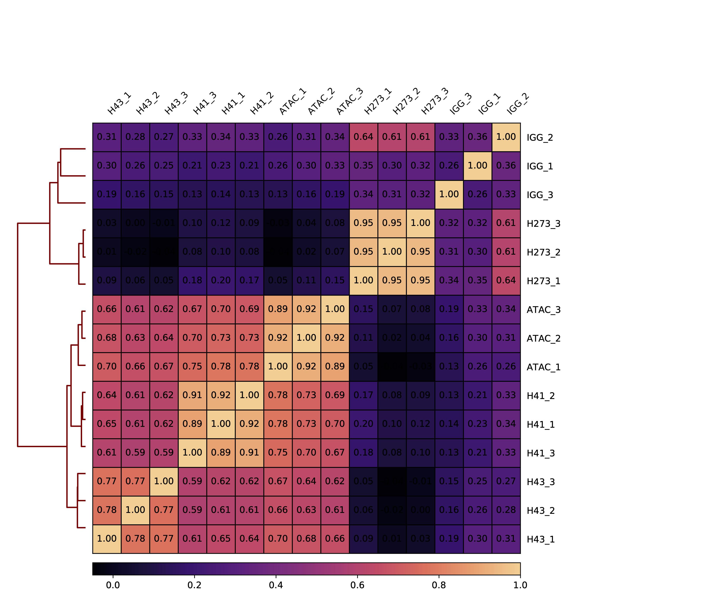

# Identifying Cis-Regulatory Regions in the AEP Genome Using ATAC-seq and CUT&Tag

This document covers the mapping, filtering, peak calling, and plotting of whole-animal ATAC-seq and Cut&Tag data to identify cis-regulatory elements in the strain AEP *H.vulgaris* genome.

[TOC]

## Mapping ATAC-seq data to the AEP Assembly

To analyze our whole-animal ATAC-seq data for the AEP strain of *H. vulgaris*, we begun by aligning each of the three biological replicates to the AEP assembly. The mapping process we used was as follows: we first used Trimmomatic (v0.36) to remove low quality base calls and contaminating adapter sequences. We also generated FASTQC (v0.11.4) reports before and after the Trimmomatic step to ensure the filtering was successful. 

We next mapped the filtered reads to both the AEP assembly as well as the *Hydra* mitochondrial genome (downloaded from [here](https://www.ncbi.nlm.nih.gov/nucleotide/BN001179.1?report=genbank&log$=nucltop&blast_rank=1&RID=YKRSV99F013) and [here](https://www.ncbi.nlm.nih.gov/nucleotide/NC_011221.1?report=genbank&log$=nucltop&blast_rank=2&RID=YKRUER0W013)) using bowtie 2 (v2.2.6). The ATAC-seq protocol targets all DNA, including mitochondrial DNA. This means that often a sizable portion of ATAC-seq reads are mitochondrial reads that provide no insight into chromatin accessibility in the nuclear genome. We therefore removed all reads from our AEP assembly-mapped alignment file that aligned to the mitochondrial genome. 

We then performed some filtering of the aligned reads to remove unmapped or ambiguously mapped reads using samtools (v1.12) and Picard Tools (v2.17.8). Finally, we removed PCR duplicate sequences to prevent PCR biases introduced when amplifying the ATAC-seq libraries from interfering with the quantitative analysis of read counts. 

The final output from this step was three bam files (`AEP1_final.bam`, `AEP2_final.bam`, and `AEP3_final.bam`), one for each biological replicate, containing all non-mitochondrial dedupliated uniquely mapped ATAC-seq reads.

Prior to running the mapping pipeline we first had to prepare bowtie references for both the mitochondrial and AEP assembly fasta files:

```bash
bowtie2-build 105_mitochondrial_genome.fa hydra_mito

bowtie2-build HAVEP1_genome.fa hydra_genome
```

We then used the following script for the alignment pipeline:

(*01_atacPeaks/ATAC_Mapping_Pipeline.sh*)

```bash
#! /bin/bash

# This code takes raw ATAC-seq reads in a fastq.gz format and generates a BAM file
# This BAM file contains only unambiguously mapped, unique, non-mitochondrial reads
# These BAM files are then used for downstream peak calling

########################


# The only argument needed for this script is the unique sample ID
prefix="$1"

# create an initial fastqc report of both forward and reverse reads
# we'll compare this to the filtered reads to ensure that trimming 
# was effective 
echo "initial fastqc report"
fastqc -o . -t 2 resources/"$prefix"_ATAC_R*.fastq.gz

mv "$prefix"_ATAC_R1_fastqc.html "$prefix"_ATAC_R1_unfiltered_fastqc.html
mv "$prefix"_ATAC_R2_fastqc.html "$prefix"_ATAC_R2_unfiltered_fastqc.html

mv "$prefix"_ATAC_R1_fastqc.zip "$prefix"_ATAC_R1_unfiltered_fastqc.zip
mv "$prefix"_ATAC_R2_fastqc.zip "$prefix"_ATAC_R2_unfiltered_fastqc.zip

# use trimmomatic to remove adapter sequences and
# stretches of low quality base calls.
# It also sets the minimum read size to 32
echo "filtering reads"
java -jar resources/trimmomatic-0.36.jar PE -threads 16 -phred33 \
	resources/"$prefix"_ATAC_R1.fastq.gz resources/"$prefix"_ATAC_R2.fastq.gz \
	"$prefix"_ATAC_R1_trim_P.fastq.gz "$prefix"_ATAC_R1_trim_UP.fastq.gz \
	"$prefix"_ATAC_R2_trim_P.fastq.gz "$prefix"_ATAC_R2_trim_UP.fastq.gz \
	ILLUMINACLIP:resources/NexteraPE-PE.fa:2:30:10:2:true TRAILING:3 \
	SLIDINGWINDOW:4:15 MINLEN:32
	
rm "$prefix"*trim_UP.fastq.gz
	
# create a fastqc report of filtered reads
# this ensures filtering worked well

# you should see: high phred scores across the entire
# read length, a read length distribution that reflects
# expectations for ATAC-seq data, and no overrepresented sequences

# looking at the GC distribution can also give you a
# sense of bacterial contamination (curvibacter GC% is around 60)
echo "post-filtering fastqc report" 
fastqc -o . -t 2 "$prefix"_ATAC_R*_trim_P.fastq.gz

# map the filtered reads to the H. mag 105 genome assembly (dovetail 1.0)
# here I'm opting for quite sensitive, but relatively slow mapping

# This will require that you generate a bowtie2 reference in the
# resources folder using the H. mag 105 reference genome
# That can be found here:
# research.nhgri.nih.gov/hydra/download/?dl=asl
echo "mapping to genome reference"
bowtie2 -X 1000 --very-sensitive-local --mm --threads 16 -S "$prefix"_genome \
	-x resources/hydra_genome \
	-1 "$prefix"_ATAC_R1_trim_P.fastq.gz -2 "$prefix"_ATAC_R2_trim_P.fastq.gz
	
cat "$prefix".log "$prefix"_genome.metfile

rm "$prefix"_genome.metfile

# because the H. mag genome has mitochondrial sequence contamination,
# we need to map reads separately to the mitochondrial reference
# this let's us identify which reads are mitochondrial, so they
# can be removed downstream

# we only need the read IDs, so we just pull the mapped read 
# IDs and disregard all other output
echo "mapping to mitochondrial reference"
bowtie2 -X 1000 --very-sensitive-local --mm --threads 12 -x resources/hydra_mito \
	-1 "$prefix"_ATAC_R1_trim_P.fastq.gz -2 "$prefix"_ATAC_R2_trim_P.fastq.gz | \
	samtools view -S -F 4 - | cut -f 1 | sort | uniq > "$prefix"_mito_IDs.txt
	
cat "$prefix".log "$prefix"_mito.metfile

rm "$prefix"_mito.metfile

# We then filter out mitochondrial reads from the genome mapped reads
# using the read IDs we generated above
echo "removing mitochondrial reads"
java -Xmx16g -jar resources/picard.jar FilterSamReads \
        I="$prefix"_genome \
        O="$prefix"_genome_MF.sam \
        READ_LIST_FILE="$prefix"_mito_IDs.txt \
        FILTER=excludeReadList

# Here we filter reads to only include mapped read pairs with a 
# mapping quality of 3 or greater 

# We then sort them by name, which is required for the fixmate command
# we're performing next
echo "filtering ambiguous mappers and incoherent read pairs"
samtools view -Su -F 524 -q 3 "$prefix"_genome_MF.sam | samtools sort -n -T "$prefix" -o "$prefix".bam

# fixmate fills in information about read pairs, such as the distance 
# between R1 and R2
samtools fixmate -r "$prefix".bam "$prefix".fix.tmp.bam

# We'll again filter, this time removing improperly paired reads
# We then sort by coordinate
samtools view -u -F 524 -f 2 "$prefix".fix.tmp.bam | samtools sort -T "$prefix".fix -o "$prefix".fix.bam

rm "$prefix".fix.tmp.bam "$prefix".bam "$prefix"_genome \
	"$prefix"_mito_IDs.txt "$prefix"_genome_MF.sam

# We'll then use picard to mark perfectly duplicated read pairs
# so that they can be removed later
echo "marking PCR duplicates"
java -Xmx50g -jar resources/picard.jar MarkDuplicates \
        I="$prefix".fix.bam \
        O="$prefix"_markedDup.bam \
        M="$prefix"_markedDup_metrics.txt \
        ASSUME_SORT_ORDER=coordinate
        
# the code below  creates a report giving you a sense of how many PCR duplicates
# were found in the data
# these metrics were established by ENCODE and give a sense of how
# much bottlenecking occured during the library prep

# this code is taken from the ENCODE ATAC pipeline (v1)
# it can be found here:
# encodeproject.org/pipelines/ENCPL792NWO/

# the table is formated as such:
# TotalReadPairs [tab] DistinctReadPairs [tab] OneReadPair [tab] 
# TwoReadPairs [tab] NRF=Distinct/Total [tab] PBC1=OnePair/Distinct [tab] 
# PBC2=OnePair/TwoPair

# for more info on these metrics, see:
# encodeproject.org/atac-seq/#standards
echo "generating PBC report"
bedtools bamtobed -i "$prefix"_markedDup.bam \
        | awk 'BEGIN{OFS="\t"}{print $1,$2,$3,$6}' \
        | sort \
        | uniq -c \
        | awk 'BEGIN{mt=0;m0=0;m1=0;m2=0} ($1==1){m1=m1+1} ($1==2){m2=m2+1} {m0=m0+1} {mt=mt+$1} END{printf "%d\t%d\t%d\t%d\t%f\t%f\t%f\n",mt,m0,m1,m2,m0/mt,m1/m0,m1/m2}' > "$prefix"_PBC.txt

# We then create the final bam for downstream analysis by removing PCR duplicates
echo "removing PCR duplicates"
samtools view -F 1804 -b -o "$prefix"_final.bam "$prefix"_markedDup.bam

rm "$prefix"_markedDup.bam "$prefix".fix.bam

echo "done"
```

We executed the above pipeline on a computing cluster using this script:

(*01_atacPeaks/slurmMap.sh*)

```bash
#!/bin/bash -l
#SBATCH --job-name=ATAC_Pipeline
#SBATCH -p med
#SBATCH -c 16
#SBATCH -t 7-0
#SBATCH --array=0-2
#SBATCH --mem=0
#SBATCH --error=ATAC_Pipeline_%a.err
#SBATCH --output=ATAC_Pipeline_%a.out

module load bowtie2
module load samtools
module load fastqc/0.11.4
module load bedtools
module load java/1.8

array=(AEP1 AEP2 AEP3)

./resources/ATAC_Mapping_Pipeline.sh ${array[$SLURM_ARRAY_TASK_ID]}
```

## Calling ATAC-seq Peaks

To identify candidate CRE coordinates from our aligned ATAC-seq data. We used Macs2 (v2.2.7.1) to call peaks for each of our ATAC-seq biological replicates. We then used the IDR python package (v2.0.3) to make pairwise comparisons between the peak calling results of different biological replicates to calculate three sets of irreproducible discovery rate (IDR) scores, which reflect the likelihood that a given peak was reproducible across two biological replicates. We use these IDR scores in a subsequent step to generate our consensus peak set. 

As part of our peak calling pipeline, we also generated a merged version of the data that combined all three biological replicates. We called peaks on this merged dataset as well, which served as the starting point for generating our consensus peak set (see below). Finally, we used deepTools (v3.5.0) generated bigwig files to facilitate viewing ATAC-seq read density in a genome browser. 

(*01_atacPeaks/ATAC_Peak_Pipeline.sh*)

```bash
#! /bin/bash -l

shopt -s nullglob

# The only argument needed for this script is the unique sample ID
prefix="$1"

conda activate deepEnv

#index bam files
echo "indexing bam files"
for arg in "$prefix"[^_]*_final.bam;
do
	echo "$arg"
	samtools index "$arg"
done

echo "done"

#namesort bam files
echo "shifting reads"

for arg in "$prefix"[^_]*_final.bam;
do
	rep="${arg/_final.bam/}"
	echo "$rep"

	alignmentSieve -b "$arg" -o "$rep"_final_shift.bam -p 16 --ATACshift

	echo "resorting shifted reads"

	samtools sort -T "$rep".sort -o "$rep"_final_shift.sort.bam "$rep"_final_shift.bam

	mv "$rep"_final_shift.sort.bam "$rep"_final_shift.bam

	samtools index "$rep"_final_shift.bam
done

echo "done"

#make self pseudoreplicates
echo "making self-pseudoreplicates"

for arg in "$prefix"[^_]*_final_shift.bam;
do
	rep="${arg/_final_shift.bam/}"
	echo "$rep"

	echo "generating first psuedoreplicate"
	samtools view -s 1234.5 -b -@ 16 -o "$rep"_PR1_final_shift.bam "$arg"

	echo "generating second psuedoreplicate"
	samtools view "$rep"_PR1_final_shift.bam | cut -f 1 > "$rep"_PR1_qname.txt

	java -Xmx32g -jar resources/picard.jar FilterSamReads \
		I="$arg" \
		O="$rep"_PR2_final_shift.bam \
		READ_LIST_FILE="$rep"_PR1_qname.txt \
		VALIDATION_STRINGENCY=SILENT \
		FILTER=excludeReadList \
		QUIET=true

	rm "$rep"_PR1_qname.txt

done

#pool replicates

echo "pooling replicates"

samtools merge "$prefix"_MG_final_shift.bam "$prefix"[1-9]_final_shift.bam
samtools index "$prefix"_MG_final_shift.bam


#split pooled rep into psuedoreps (same number as total reps)

echo "generating pseudoreplicates from pooled counts"

numReps=("$prefix"[^_]*_final.bam)
numReps=${#numReps[@]}

echo "splitting into $numReps files"

count=1

cp "$prefix"_MG_final_shift.bam "$prefix"_MG_final_shift.sub.bam

while [ $numReps -gt 1 ]
do

	subSampleValue="$(Rscript resources/generateSubsampleValue.R $numReps | cut -f 2)"
	echo "$numReps"
	echo "$count"
	echo "$subSampleValue"
	samtools view -s "$subSampleValue" -b -@ 16 \
		-o "$prefix"_MG_PR"$count"_final_shift.bam "$prefix"_MG_final_shift.sub.bam

	samtools view "$prefix"_MG_PR"$count"_final_shift.bam | cut -f 1 > "$prefix"_PR_qname.txt


	java -Xmx32g -jar resources/picard.jar FilterSamReads \
		I= "$prefix"_MG_final_shift.sub.bam \
		O= "$prefix"_MG_final_shift.sub.tmp.bam \
		READ_LIST_FILE="$prefix"_PR_qname.txt \
		VALIDATION_STRINGENCY=SILENT \
		FILTER=excludeReadList \
		QUIET=true

	rm "$prefix"_MG_final_shift.sub.bam

	mv "$prefix"_MG_final_shift.sub.tmp.bam "$prefix"_MG_final_shift.sub.bam

	count=$(( $count + 1 ))
	numReps=$(( $numReps - 1 ))

done

mv "$prefix"_MG_final_shift.sub.bam "$prefix"_MG_PR"$count"_final_shift.bam

rm "$prefix"_PR_qname.txt

echo "Calling peaks"

for arg in "$prefix"*_final_shift.bam;
do
	rep="${arg/_final_shift.bam/}"
	echo "$rep"
	macs2 callpeak \
		-t "$arg" -f BAMPE -n "$rep" -g 9e8 -p 0.1 \
		--nomodel --keep-dup all

	sort -k 8gr,8gr "$rep"_peaks.narrowPeak \
		| awk 'BEGIN{OFS="\t"}{$4="Peak_"NR ; print $0}' > "$rep".narrowPeak

	rm -f "$rep"_peaks.narrowPeak "$rep"_peaks.xls

done

rm *summits*

echo "done"

#perform idr for all reps
echo "Performing IDR on biological replicates"

for i in "$prefix"[1-9].narrowPeak
do
	for j in "$prefix"[1-9].narrowPeak
	do
		if [[ "$i" < "$j" ]]; then
			echo "$i"
			echo "$j"

			inputFile1="$i"
			prefix1="${inputFile1/.narrowPeak/}"

			inputFile2="$j"
			prefix2="${inputFile2/.narrowPeak/}"

			idr --samples "$i" "$j" \
				--peak-list "$prefix"_MG.narrowPeak --input-file-type narrowPeak \
				--output-file "$prefix1"_"$prefix2".idr --rank p.value --soft-idr-threshold 0.1

			IDR_THRESH_TRANSFORMED=$(awk -v p=0.1 'BEGIN{print -log(p)/log(10)}')

			awk 'BEGIN{OFS="\t"} $12>='"${IDR_THRESH_TRANSFORMED}"' \
				{print $1,$2,$3,$4,$5,$6,$7,$8,$9,$10}' "$prefix1"_"$prefix2".idr | \
					sort | \
					uniq | \
					sort -k7n,7n > "$prefix1"_"$prefix2".IDR.narrowPeak
		fi
	done
done

echo "done"

#perform idr for all self-pseudoreps
echo "Perfoming IDR on self-pseudoreplicates"

for arg in "$prefix"[1-9]_final_shift.bam
do
	rep="${arg/_final_shift.bam/}"
	echo "$rep"

	inputFile1="$rep"_PR1.narrowPeak
	prefix1="${inputFile1/.narrowPeak/}"

	inputFile2="$rep"_PR2.narrowPeak
	prefix2="${inputFile2/.narrowPeak/}"

	idr --samples "$inputFile1" "$inputFile2" \
		--peak-list "$rep".narrowPeak --input-file-type narrowPeak \
		--output-file "$prefix1"_"$prefix2".idr --rank p.value --soft-idr-threshold 0.1

	IDR_THRESH_TRANSFORMED=$(awk -v p=0.1 'BEGIN{print -log(p)/log(10)}')

	awk 'BEGIN{OFS="\t"} $12>='"${IDR_THRESH_TRANSFORMED}"' \
		{print $1,$2,$3,$4,$5,$6,$7,$8,$9,$10}' "$prefix1"_"$prefix2".idr | \
			sort | \
			uniq | \
			sort -k7n,7n > "$prefix1"_"$prefix2".IDR.narrowPeak
done

echo "done"

#perform idr for all pooled pseudoreps
echo "Perfoming IDR on pooled pseudoreplicates"

for i in "$prefix"_MG_PR*.narrowPeak
do
	for j in "$prefix"_MG_PR*.narrowPeak
	do
		if [[ "$i" < "$j" ]]; then
			echo "$i"
			echo "$j"

			inputFile1="$i"
			prefix1="${inputFile1/.narrowPeak/}"

			inputFile2="$j"
			prefix2="${inputFile2/.narrowPeak/}"

			idr --samples "$i" "$j" \
				--peak-list "$prefix"_MG.narrowPeak --input-file-type narrowPeak \
				--output-file "$prefix1"_"$prefix2".idr --rank p.value --soft-idr-threshold 0.1

			IDR_THRESH_TRANSFORMED=$(awk -v p=0.1 'BEGIN{print -log(p)/log(10)}')

			awk 'BEGIN{OFS="\t"} $12>='"${IDR_THRESH_TRANSFORMED}"' \
				{print $1,$2,$3,$4,$5,$6,$7,$8,$9,$10}' "$prefix1"_"$prefix2".idr | \
					sort | \
					uniq | \
					sort -k7n,7n > "$prefix1"_"$prefix2".IDR.narrowPeak
		fi
	done
done

echo "done"

conda activate deepEnv

#generate bigwig files
echo "Generating bigwig tracks"

for arg in "$prefix"[1-9]_final_shift.bam
do
	echo "$arg"
	bamCoverage -b "$arg" -o "${arg/.bam/.bw}" \
		-of "bigwig" -bs 10 -p 16 --normalizeUsing "CPM"
done

echo "$prefix"_MG_final_shift.bam
bamCoverage -b "$prefix"_MG_final_shift.bam -o "$prefix"_MG_final_shift.bw \
	-of "bigwig" -bs 10 -p 16 --normalizeUsing "CPM"

echo "done"

echo "cleaning up"

rm regions_"$prefix"*ATAC.bed Values_"$prefix"*.txt "$prefix"*matrix.gz "$prefix"*.idr

echo "done"
```

The peak pipeline script using the following accessory R script to generate seed values for subsetting bam files:

(*01_atacPeaks/generateSubsampleValue.R*)

```R
options(digits=10)
args <- commandArgs(trailingOnly=TRUE)
subSampleValue <-sample(1:9999,1)
subSampleValue <- subSampleValue + (1/as.numeric(args[1]))
cat(subSampleValue)
```

We executed the peak calling pipeline on a computing cluster using the following script:

(*01_atacPeaks/slurmPeak.sh*)

```bash
#! /bin/bash -l
#SBATCH --job-name=ATAC_Peaks
#SBATCH -p med
#SBATCH -c 16
#SBATCH -t 7-0
#SBATCH --mem=0
#SBATCH --error=ATAC_Peaks.err
#SBATCH --output=ATAC_Peaks.out

conda activate deepEnv

resources/ATAC_Peak_Pipeline.sh AEP
```

When calculating the IDR score, we removed any peaks that had a score > 0.1. To generate our consensus set of reproducible peaks, we used BedTools (v2.29.2) to identify peaks from the merged ATAC-seq data set (`AEP_MG.narrowPeak`) that overlapped with peaks from each of our pairwise IDR comparisons.

```bash
bedtools intersect -e -f 0.5 -F 0.5 -c -a AEP_MG.narrowPeak -b AEP1_AEP2.IDR.narrowPeak > 12Int.bed
bedtools intersect -e -f 0.5 -F 0.5 -c -a AEP_MG.narrowPeak -b AEP1_AEP3.IDR.narrowPeak > 13Int.bed
bedtools intersect -e -f 0.5 -F 0.5 -c -a AEP_MG.narrowPeak -b AEP2_AEP3.IDR.narrowPeak > 23Int.bed
```

We then used the following R script to subset the `AEP_MG.narrowPeak` peak list to include only those peaks that intersected with a peak from at least two of the IDR peak sets. The output from this script (`consensusAEP.bed`) was our consensus ATAC-seq peak set that we used for subsequent analyses. 

(*01_atacPeaks/getCon.R*)

```R
int12 <- read.delim("/Volumes/Data/Cut&Stuff/ATAC/12Int.bed",header = F, sep = "\t")
int13 <- read.delim("/Volumes/Data/Cut&Stuff/ATAC/13Int.bed",header = F, sep = "\t")
int23 <- read.delim("/Volumes/Data/Cut&Stuff/ATAC/23Int.bed",header = F, sep = "\t")
consensus <- int12[(int12[,11] + int13[,11] + int23[,11]) > 1,1:6]
write.table(consensus, file = "/Volumes/Data/Cut&Stuff/ATAC/consensusAEP.bed", sep = '\t', quote = F, col.names = F, row.names = F)
```

## Mapping CUT&Tag data to the AEP Assembly

Our CUT&Tag mapping approach was quite similar to the one we used for our ATAC-seq data. We filtered reads using Trimmomatic and verified the output using FASTQC. We then mapped the filtered reads to the AEP assembly. Finally, we removed duplicate reads from the resulting alignment file.

(*02_cutAndTagPeaks/mapPipe.sh*)

```bash
#!/bin/bash

source ~/.bash_profile

prefix="$1"
echo "$prefix"

[ ! -d "fastqc_raw" ] && mkdir fastqc_raw

echo "initial fastqc report"
fastqc -o fastqc_raw -t 2 resources/reads/raw/"$prefix"_R*.fastq.gz

echo "filtering reads"
java -jar resources/trimmomatic-0.36.jar PE -threads 24 -phred33 \
	resources/reads/raw/"$prefix"_R1.fastq.gz \
	resources/reads/raw/"$prefix"_R2.fastq.gz \
	resources/reads/trim/"$prefix"_R1_trim_P.fastq.gz \
	resources/reads/trim/"$prefix"_R1_trim_UP.fastq.gz \
	resources/reads/trim/"$prefix"_R2_trim_P.fastq.gz \
	resources/reads/trim/"$prefix"_R2_trim_UP.fastq.gz \
	ILLUMINACLIP:resources/NexteraPE-PE.fa:2:30:10:2:keepBothReads \
	TRAILING:3 \
	LEADING:3 \
	SLIDINGWINDOW:4:15 \
	MINLEN:32

rm resources/reads/trim/"$prefix"*trim_UP.fastq.gz

[ ! -d "fastqc_filt" ] && mkdir fastqc_filt

echo "post-filtering fastqc report" 
fastqc -o fastqc_filt -t 2 resources/reads/trim/"$prefix"_R*_trim_P.fastq.gz

echo "mapping to genome reference"
bowtie2 -X 700 \
	-I 10 \
	--very-sensitive-local \
	--threads 22 \
	--no-mixed \
	--no-discordant \
	-x resources/hydra_genome \
	-1 resources/reads/trim/"$prefix"_R1_trim_P.fastq.gz \
	-2 resources/reads/trim/"$prefix"_R2_trim_P.fastq.gz | samtools view -b -o "$prefix".gen.bam -
	
samtools view -Su -F 524 -q 2 "$prefix".gen.bam |
	samtools sort -n -T "$prefix" -o "$prefix"_allMapped.tmp.bam

echo "removing duplicates"
samtools fixmate -@ 24 -r -m "$prefix"_allMapped.tmp.bam "$prefix".fix.tmp.bam

samtools sort -T "$prefix" -@ 24 -o "$prefix".fix.sort.tmp.bam "$prefix".fix.tmp.bam

samtools markdup -@ 24 -T "$prefix" -r -s "$prefix".fix.sort.tmp.bam "$prefix".final.bam > "$prefix".dupStats.txt

samtools index "$prefix".final.bam

rm "$prefix"*.tmp.bam

echo "done"
```

We executed this mapping pipeline on a computing cluster using the following script:

(*02_cutAndTagPeaks/slurmMapPipe.sh*)

```bash
#!/bin/bash
#SBATCH --job-name=CnT_Map
#SBATCH -c 24
#SBATCH -p med
#SBATCH -t 60-0
#SBATCH --array=0-11
#SBATCH --mem=0
#SBATCH --error=CnT_Map_%a.err
#SBATCH --output=CnT_Map_%a.out

module load fastqc/0.11.4
module load java/1.8

array=( H273_1 H273_2 H273_3 \
H41_1 H41_2 H41_3 \
H43_1 H43_2 H43_3 \
IGG_1 IGG_2 IGG_3 )

./resources/mapPipe.sh ${array[$SLURM_ARRAY_TASK_ID]}
```

## Calling CUT&Tag Peaks

Our peak calling approach with CUT&Tag differed from our ATAC-seq approach because our CUT&Tag data included negative controls that could be used as a baseline. Instead of Macs2, we opted to use SEACR (v1.3) to call peaks on our CUT&Tag data, as it was specifically designed to work well with CUT&Tag data. 

SEACR requires read depth data in a bedgraph format. Because we needed to prep the negative control IgG samples before we could process any other samples, we used the following script to generate the necessary negative control files prior to running the main peak calling script.

(*02_cutAndTagPeaks/iggProcessing.sh*)

```bash
#! /bin/bash -l

shopt -s nullglob

echo "pooling replicates"

samtools merge -f IGG_MG.final.bam IGG_[1-9].final.bam
samtools index IGG_MG.final.bam

for arg in 1 2 3 "MG"
do
        samtools sort -T IGG.sort -n -o IGG_"$arg".final.ns.bam IGG_"$arg".final.bam

        bedtools bamtobed -bedpe -i IGG_"$arg".final.ns.bam > IGG.bed

        cut -f 1,2,6 IGG.bed | \
                sort -k1,1 -k2,2n -k3,3n > IGG.fragments.bed

        bedtools genomecov -bg -i IGG.fragments.bed -g resources/aep.genome > IGG_"$arg".bg

        rm IGG.bed IGG.fragments.bed IGG_"$arg".final.ns.bam
done
```

For the peak calling, we used SEACR to call peaks on each bam file generated in the previous section, as well as on merged replicate bam files generated. Each SEACR command used the sample-matched negative control IgG data (e.g., IgG replicate 1 is derived from the same experiment as H3K4me1 replicate 1).

We opted to run SEACR in permissive mode, and then use the same IDR approach we used for our ATAC-seq data to ensure that the resulting consensus peak sets contained reproducible peaks. 

(*02_cutAndTagPeaks/peakPipe.sh*)

```bash
#! /bin/bash -l

shopt -s nullglob

# The only argument needed for this script is the unique sample ID
prefix="$1"

#pool replicates

echo "pooling replicates"

samtools merge -f "$prefix"_MG.final.bam "$prefix"_[1-9].final.bam
samtools index "$prefix"_MG.final.bam


echo "generating bigwigs"

conda activate deepEnv

for arg in "$prefix"_[0-9].final.bam
do
	rep="${arg/.final.bam/}"
	echo "$rep"

	bamCoverage -b "$arg" \
		-o "$rep".bw \
		-of "bigwig" \
		-bs 10 \
		-p 24 \
		--normalizeUsing CPM \
		--exactScaling
done

bamCoverage -b "$prefix"_MG.final.bam \
	-o "$prefix"_MG.bw \
	-of "bigwig" \
	-bs 10 \
	-p 24 \
	--normalizeUsing CPM \
	--exactScaling \

conda deactivate

echo "Calling peaks"

for arg in 1 2 3 "MG" 
do
		rep="$prefix"_"$arg"
		echo "$rep"

		samtools sort -T $rep.sort -n -o $rep.ns.bam "$rep".final.bam

		bedtools bamtobed -bedpe -i $rep.ns.bam > $rep.bed

		cut -f 1,2,6 $rep.bed | \
			sort -k1,1 -k2,2n -k3,3n > $rep.fragments.bed

		bedtools genomecov -bg -i $rep.fragments.bed -g resources/aep.genome > $rep.bg

		rm $rep.bed $rep.fragments.bed $rep.ns.bam

		bash resources/SEACR/SEACR_1.3.sh $rep.bg IGG_"$arg".bg norm relaxed $rep

		bash resources/SEACR/SEACR_1.3.sh $rep.bg IGG_"$arg".bg norm stringent $rep

		Rscript resources/refBed.R "$rep".relaxed.bed

		Rscript resources/refBed.R "$rep".stringent.bed

		rm "$rep".relaxed.bed "$rep".stringent.bed

		mv "$rep".relaxed.rfmt.bed "$rep".relaxed.bed

		mv "$rep".stringent.rfmt.bed "$rep".stringent.bed

	done

echo "done"

conda activate deepEnv

#perform idr for all reps

echo "Performing IDR on biological replicates"

for i in "$prefix"_[0-9].relaxed.bed
do
	for j in "$prefix"_[0-9].relaxed.bed
	do
		if [[ "$i" < "$j" ]]; then
			echo "$i"
			echo "$j"

			inputFile1="$i"
			prefix1="${inputFile1/.relaxed.bed/}"

			inputFile2="$j"
			prefix2="${inputFile2/.relaxed.bed/}"

			idr --samples "$i" "$j" \
				--peak-list "$prefix"_MG.relaxed.bed --input-file-type bed \
				--output-file "$prefix1"_"$prefix2".idr \
				-i 0.1 --rank 5

			bedtools intersect -e -f 0.25 -F 0.25 -c \
				-a "$prefix"_MG.relaxed.bed \
				-b "$prefix1"_"$prefix2".idr > "$prefix1"_"$prefix2".int.bed

		fi
	done
done

echo "done"

conda deactivate

#generating consensus peaklists

Rscript resources/getCon.R "$prefix" "$prefix"*_[0-9].int.bed

echo "# of peaks in biologically reproducible peak set:"

wc -l consensus"$prefix".bed

echo "done"
```

Below is an auxiliary R script used within the peak calling pipeline. It reformats SEACR's output into a standard bed format.

(*02_cutAndTagPeaks/refBed.R*)

```R
args = commandArgs(trailingOnly=TRUE)

inBed <- read.delim(args[1],sep = "\t",header = F)

inBed[,6] <- "."

inBed[,5] <- inBed[,4]

inBed[,4] <- 1:nrow(inBed)

newCols <- data.frame(V1 = rep(0,nrow(inBed)), V2 = rep(0,nrow(inBed)), V3 = rep(0,nrow(inBed)))

outBed <- cbind(inBed,newCols)

write.table(outBed, file = gsub(".bed",".rfmt.bed",args[1]), quote = F, row.names = F, col.names = F, sep = "\t")
```

Below is an auxiliary R script used within the peak calling pipeline. It generates a consensus peak set by determining which peaks in the merged replicate peak set passed the IDR threshold in at least two pairwise comparisons of biological replicates.

(*02_cutAndTagPeaks/getCon.R*)

```R
args <-  commandArgs(trailingOnly=TRUE)

prefix <- args[1]

intRes <- lapply(args[-1],read.delim,header=F,sep='\t')

intRes.sub <- lapply(intRes,function(x) x[,ncol(x)])

intRes.sub <- do.call(cbind,intRes.sub)

intRes.sub <- apply(intRes.sub,1,sum)

consensus <- intRes[[1]][intRes.sub > 1,1:6]

# consensus$V4 <- gsub('.*_MG_','',consensus$V4)

write.table(consensus, file = paste0("consensus",prefix,".bed"), sep = '\t', quote = F, col.names = F, row.names = F)
```

Note that the CUT&Tag peak pipeline also uses the  `generateSubsampleValue.R` script first mentioned in the ATAC-seq peak calling pipeline.

The peak pipeline was run on a computing cluster using this script:

(*02_cutAndTagPeaks/slurmPeakPipe.sh*)

```bash
#!/bin/bash
#SBATCH --job-name=CnT_Peak
#SBATCH -c 24
#SBATCH -p med
#SBATCH -t 60-0
#SBATCH --mem=0
#SBATCH --error=CnT_Peak.err
#SBATCH --output=CnT_Peak.out

echo "processing IGG samples"
./resources/iggProcessing.sh

echo "running peak pipeline"
./resources/peakPipe.sh H41

./resources/peakPipe.sh H43

./resources/peakPipe.sh H273
```

## Annotating Peaks by Their Nearest Gene

To link peaks to their potential target genes, we used UROPA (v4.0.2) to identify the nearest gene model to each peak in our H3K4me1, H3K4me3, and ATAC-seq peak sets (i.e., peaks associated with active regulatory elements), with the maximum allowed distance being 100 Kb.

UROPA uses a config file in JSON format to set relevant parameters. This was the parameter file for annotating our ATAC-seq peaks:

(*03_characterizeCREs/peakAnnotATAC.json*)

```json
{
"queries":[
    {"distance": [100000, 100000], "feature": ["transcript"], "feature_anchor": ["start"], "name": "query_1", "relative_location": ["Downstream", "Upstream", "OverlapStart", "FeatureInsidePeak", "PeakInsideFeature", "OverlapEnd"], "strand": "ignore"}
          ],
"show_attributes": ["gene_id"],
"priority": "False",
"gtf": "HVAEP1.GeneModels.gtf",
"bed": "../ATAC/consensusAEP.bed",
"prefix": "ATAC",
"outdir": "uropaOut",
"threads": "1",
"output_by_query": "False"
}
```

The parameter file for the other two peak sets were largely identical to the one above. For the H3K4me1 peak set annotation, we made the following changes (text is output from `diff` command comparing ATAC-seq and H3K4me1 config files)

```
8,9c8,9
< "bed": "../ATAC/consensusAEP.bed",
< "prefix": "ATAC",
---
> "bed": "consensusH41.bed",
> "prefix": "H41",
```

For the H3K4me3 peak set annotation, we made the following changes (text is output from `diff` command comparing ATAC-seq and H3K4me3 config files)

```
8,9c8,9
< "bed": "../ATAC/consensusAEP.bed",
< "prefix": "ATAC",
---
> "bed": "consensusH43.bed",
> "prefix": "H43",
```

We then ran UROPA using the following commands:

```bash
uropa -i peakAnnotH43.json	#H3K4me3 config
uropa -i peakAnnotH41.json	#H3K4me1 config
uropa -i peakAnnotATAC.json	#ATAC-seq config
```

## Calculating Correlation Scores for CUT&Tag and ATAC-seq Biological Replicates

In order to evaluate the reproducibility of our ATAC-seq and CUT&Tag data, and to determine if the different types of data had the expected distribution across the genome relative to each other (e.g., open chromatin should be positively correlated with activating histone modifications), we calculated global correlation scores amongst all of our ATAC-seq and CUT&Tag replicates. 

We used the DeepTools `multiBigwigSummary` function to calculate the correlation scores:

(*03_characterizeCREs/multiBWComp.sh*)

```bash
#!/bin/bash

multiBigwigSummary bins -b H41_1.bw H41_2.bw H41_3.bw \
        H43_1.bw H43_2.bw H43_3.bw \
        H273_1.bw H273_2.bw H273_3.bw \
        IGG_1.bw IGG_2.bw IGG_3.bw \
        ../ATAC/AEP1_final_shift.bw \
        ../ATAC/AEP2_final_shift.bw \
        ../ATAC/AEP3_final_shift.bw \
        -o corplot.npz \
        -l H41_1 H41_2 H41_3 H43_1 H43_2 H43_3 \
        H273_1 H273_2 H273_3 IGG_1 IGG_2 IGG_3 \
        ATAC_1 ATAC_2 ATAC_3 \
        -p 6
```

We then plotted the results using the following script:

(*03_characterizeCREs/plotCorrelation.sh*)

```bash
#!/bin/bash

plotCorrelation -in corplot.npz \
        -c spearman \
        -p heatmap \
        -o corPlot.pdf \
        -min -0.05 \
        --plotNumbers \
        --colorMap magma
```



The hierarchical clustering grouped together biological replicates, a good indication of reproducibility. We also saw positive correlation between datasets associated with activating marks (ATAC-seq, H3K4me1, and H3K4me3), whereas there was little to no correlation between activating marks and the repressive mark H3K27me3 or the negative controls.

## Visualizing Read ATAC-seq and CUT&Tag read Distribution Around Genes

Because chromatin accessibility and certain histone modifications have clear expected distribution patterns around transcription start sites, we visualized the read distribution of our CUT&Tag and ATAC-seq data around the AEP gene models to further validate the data. 

H3K4me3 should be strongly enriched at transcription start sites and H3K4me1 should be be found around expressed genes, but should not be strongly associated with transcription start sites. ATAC-seq is expected to be associated both with transcription start sites and more distal regulatory elements. H3K27me3 should be depleted near actively transcribed genes, but it can be found in silenced genes.

### Systematically Characterizing Read Distribution Around Genes

We supplemented our analysis with RNA-seq data, allowing us to verify which genes were actively transcribed. For this we used the file `NS_RNA.bw`, which is a bigwig file containing read depth information for genome-mapped RNA-seq data from whole adult *Hydra* polyps. Specifically, the alignment data was generated by merging the bam files `NS1_RNA.genome.bam`, `NS2_RNA.genome.bam`, and `NS3_RNA.genome.bam` from the alignment benchmarking analysis described in `03_aepGenomeAnnotation.md`. 

We also included data on sequence conservation using the file `aepCon.bw`, which was generated by the analysis described in `07_genomeConservation.md`.

We combined all of these data and calculated their average profiles across the AEP assembly gene models using the DeepTools `computeMatrix` function:

(*03_characterizeCREs/compGeneMatrix.sh*)

```bash
#!/bin/bash

computeMatrix scale-regions \
        -R HVAEP1.GeneModels.gtf \
        -S aepCon.bw NS_RNA.bw ../ATAC/AEP_MG_final_shift.bw IGG_MG.bw H43_MG.bw H41_MG.bw H273_MG.bw \
        -o geneMatrix.txt \
        --outFileNameMatrix geneMatrix.names.txt \
        --outFileSortedRegions geneMatrix.regions.txt \
        -m 500 \
        -b 5000 \
        -a 5000 \
        --missingDataAsZero \
        -p 6 \
        --metagene
```

We then plotted the results using this script:

(*03_characterizeCREs/plotGeneHeatmap.sh*)

```bash
#!/bin/bash

plotHeatmap -m geneMatrix.txt \
        -o geneBodyHeatmap.pdf \
        --colorMap magma \
        -max 1.5 1 0.6 0.6 0.6 0.6 0.6 \
        --yMax 1.5 4.5 1.75 1.75 1.75 1.75 1.75
```


### Generating Representative Plots for ATAC-seq, CUT&Tag, and Sequence Conservation Centered on Individual Genes

To show individual examples of the correspondence between our various methods of identifying regulatory elements, we plotted each of the genome-wide data tracks we generated for ATAC-seq, CUT&Tag, and sequence conservation centered on specific genes in the genome using the R script below.

However, prior to running the plotting script, we had to fix an issue where CDS phases were improperly formatted in the AEP gene model gff3 file that prevented the gene models from being properly imported. We did this using the following command:

```bash
agat_sp_fix_cds_phases.pl -g HVAEP1.GeneModels.gff3 -fa HVAEP1_genome.fa -o HVAEP1.GeneModels.pfix.gff3
```

(*03_characterizeCREs/plotTrackData.R*)

```R
library(Gviz)
library(rstudioapi)
library(GenomicRanges)
library(GenomicFeatures)
library(rtracklayer)
library(grDevices)

setwd(dirname(getActiveDocumentContext()$path))

genomeInfo <- read.table("../../genome/aep.final.genome.fa.fai", stringsAsFactors = F)[,1:2]

chrominfo <- data.frame(chrom=genomeInfo$V1, length=genomeInfo$V2, is_circular=rep(FALSE,length(genomeInfo$V1)))
txDb.mi <- makeTxDbFromGFF(file="HVAEP1.GeneModels.pfix.gff3", format="gff", dataSource="Gene Models", organism ="Hydra vulgaris", chrominfo=chrominfo)

options(ucscChromosomeNames=F)

pal <- colorRampPalette(c('#3FB8AF','#7FC7AF','#DAD8A7','#FF9E9D','#FF3D7F'),bias=1)

palCols <- pal(8)

AtacPlot <- function(chr, height, left, right, buffer=0,fpath = "plot.pdf", minCon=0) {
  chrID <- chr
  
  #This specifies the maximum value on the y-axis
  z <- height
  
  #chromosome map
  gtrack <- GenomeAxisTrack(name = chrID,add53=T, add35 = T, fontsize = 13, fontcolor.title = "black", 
                            fontsize.title = 13, showTitle = F, rotation.title = 0, grid = T,
                            cex = 0.6, labelPos = "below")
  #gene models
  grtrack <- GeneRegionTrack(txDb.mi, chromosome=chrID, name="Genes", transcriptAnnotation = "gene", 
                             col = "black", fontsize.group = 13, fontcolor.group = "black", fill = "black", 
                             fontsize=25, rotation.title = 0, background.title = "white", col.line = "black",
                             just.group = "below", collapseTranscripts = "longest")
  
  reptrack <- AnnotationTrack(range = '../../genome/repeats/bothMaskFull.out.sorted.gff', name = 'repeats',
                              chromosome = chrID,shape = "box",col = "black",background.title = "white",
                              fill = "black",cex=0)
  
  magCon <- DataTrack(range = "105.rolling100.cactus.bw", 
                    type = "polygon", col = "black", lwd.mountain = 0, fill.mountain = c(palCols[5],palCols[5]), 
                    chromosome = chrID, name = "Control", fontsize = 13, showAxis = T, ylim=c(minCon,1), 
                    background.title = "white", fontcolor.title = "black", col.axis = "black", 
                    span = 0.5, lwd = 0, showTitle = F, cex.axis = 0.6)
  oligCon <- DataTrack(range = "olig.rolling100.cactus.bw", 
                      type = "polygon", col = "black", lwd.mountain = 0, fill.mountain = c(palCols[6],palCols[6]), 
                      chromosome = chrID, name = "Control", fontsize = 13, showAxis = T, ylim=c(minCon,1), 
                      background.title = "white", fontcolor.title = "black", col.axis = "black", 
                      span = 0.5, lwd = 0, showTitle = F, cex.axis = 0.6)
  viridCon <- DataTrack(range = "virid.rolling100.cactus.bw", 
                       type = "polygon", col = "black", lwd.mountain = 0, fill.mountain = c(palCols[7],palCols[7]), 
                       chromosome = chrID, name = "Control", fontsize = 13, showAxis = T, ylim=c(minCon,1), 
                       background.title = "white", fontcolor.title = "black", col.axis = "black", 
                       span = 0.5, lwd = 0, showTitle = F, cex.axis = 0.6)
  clytiaCon <- DataTrack(range = "clytia.rolling100.cactus.bw", 
                       type = "polygon", col = "black", lwd.mountain = 0, fill.mountain = c(palCols[8],palCols[8]), 
                       chromosome = chrID, name = "Control", fontsize = 13, showAxis = T, ylim=c(minCon,1), 
                       background.title = "white", fontcolor.title = "black", col.axis = "black", 
                       span = 0.5, lwd = 0, showTitle = F, cex.axis = 0.6)
  ATAC <- DataTrack(range = "../ATAC/AEP_MG_final_shift.bw", 
                       type = "polygon", col = "black", lwd.mountain = 0, fill.mountain = c(palCols[1],palCols[1]), 
                       chromosome = chrID, name = "Control", fontsize = 13, showAxis = T, ylim=c(0,z[1]), 
                       background.title = "white", fontcolor.title = "black", col.axis = "black", 
                       span = 0.5, lwd = 0, showTitle = F, cex.axis = 0.6)
  H41 <- DataTrack(range = "H41_MG.bw", 
                    type = "polygon", col = "black", lwd.mountain = 0, fill.mountain = c(palCols[2],palCols[2]), 
                    chromosome = chrID, name = "Control", fontsize = 13, showAxis = T, ylim=c(0,z[2]), 
                    background.title = "white", fontcolor.title = "black", col.axis = "black", 
                    span = 0.5, lwd = 0, showTitle = F, cex.axis = 0.6)
  H43 <- DataTrack(range = "H43_MG.bw", 
                   type = "polygon", col = "black", lwd.mountain = 0, fill.mountain = c(palCols[3],palCols[3]), 
                   chromosome = chrID, name = "Control", fontsize = 13, showAxis = T, ylim=c(0,z[3]), 
                   background.title = "white", fontcolor.title = "black", col.axis = "black", 
                   span = 0.5, lwd = 0, showTitle = F, cex.axis = 0.6)
  H273 <- DataTrack(range = "H273_MG.bw", 
                   type = "polygon", col = "black", lwd.mountain = 0, fill.mountain = c(palCols[4],palCols[4]), 
                   chromosome = chrID, name = "Control", fontsize = 13, showAxis = T, ylim=c(0,z[4]), 
                   background.title = "white", fontcolor.title = "black", col.axis = "black", 
                   span = 0.5, lwd = 0, showTitle = F, cex.axis = 0.6)
  
  
  pdf(file = fpath, width=7, height=7)
  plotTracks(list(ATAC,H41,H43,H273,
                  grtrack,gtrack,reptrack,magCon,
                  oligCon,viridCon,clytiaCon), 
             from=(left - buffer), to=(right + buffer), title.width = 0.7, margin = 0, sizes = c(rep(5,4),3,3,1,rep(5,4)))
  dev.off()
}

AtacPlot("chr-3",c(3,7,5,2),40525583,40580186,0, "brachyurySample.pdf")
AtacPlot("chr-4",c(5,16,3,4),17489011,17570761,0, "bmp5-8cSample.pdf")

#conservation plots
AtacPlot("chr-6",c(3,7,5,2),9544624,9546772,0, "wnt3ConSample.pdf",minCon = 0.5)
AtacPlot("chr-6",c(5,16,3,4),24222683,24225675,0, "sp5ConSample.pdf",minCon=0.5)
```


The following two plots were subsetted to just focus on the *viridissima* and *oligactis* conservation tracks for comparing our systematic genome alignment to the results of manual alignments done by Vogg et al. (2019).


When we tried to use the above script to generate example plots that showed the individual biological replicates we found that Gviz didn't do a good job of handling the individual CUT&Tag replicates. It's unclear what caused the issue, but the resulting plots looked block-y and didn't accurately represent the data. 

We therefore used pyGenomeTracks (v3.6) to plot the data instead. Below is the config file used to generate the plot of individual replicates for the CUT&Tag and ATAC-seq data centered around the *brachyury1* gene:

(*03_characterizeCREs/repTracks.ini*)

```python
[bigwig file test]
file = ../ATAC/AEP1_final_shift.bw
# height of the track in cm (optional value)
height = 2
title = ATAC-seq Rep 1
min_value = 0
max_value = 4
color = #8FD744FF

[bigwig file test]
file = ../ATAC/AEP2_final_shift.bw
# height of the track in cm (optional value)
height = 2
title = ATAC-seq Rep 2
min_value = 0
max_value = 4
color = #8FD744FF

[bigwig file test]
file = ../ATAC/AEP2_final_shift.bw
# height of the track in cm (optional value)
height = 2
title = ATAC-seq Rep 3
min_value = 0
max_value = 4
color = #8FD744FF

[spacer]

[bigwig file test]
file = h41_1.bw
# height of the track in cm (optional value)
height = 2
title = H3K4me1 CUT&Tag Rep 1
min_value = 0
max_value = 10
color = #35B779FF

[bigwig file test]
file = h41_2.bw
# height of the track in cm (optional value)
height = 2
title = H3K4me1 CUT&Tag Rep 2
min_value = 0
max_value = 10
color = #35B779FF

[bigwig file test]
file = h41_3.bw
# height of the track in cm (optional value)
height = 2
title = H3K4me1 CUT&Tag Rep 3
min_value = 0
max_value = 10
color = #35B779FF

[spacer]

[bigwig file test]
file = h43_1.bw
# height of the track in cm (optional value)
height = 2
title = H3K4me3 CUT&Tag Rep 1
min_value = 0
max_value = 10
color = #21908CFF

[bigwig file test]
file = h43_2.bw
# height of the track in cm (optional value)
height = 2
title = H3K4me3 CUT&Tag Rep 2
min_value = 0
max_value = 10
color = #21908CFF

[bigwig file test]
file = h43_3.bw
# height of the track in cm (optional value)
height = 2
title = H3K4me3 CUT&Tag Rep 3
min_value = 0
max_value = 10
color = #21908CFF

[spacer]

[bigwig file test]
file = h273_1.bw
# height of the track in cm (optional value)
height = 2
title = H3K27me3 CUT&Tag Rep 1
min_value = 0
max_value = 2
color = #31688EFF

[bigwig file test]
file = h273_2.bw
# height of the track in cm (optional value)
height = 2
title = H3K27me3 CUT&Tag Rep 2
min_value = 0
max_value = 2
color = #31688EFF

[bigwig file test]
file = h273_3.bw
# height of the track in cm (optional value)
height = 2
title = H3K27me3 CUT&Tag Rep 3
min_value = 0
max_value = 2
color = #31688EFF

[spacer]

[bigwig file test]
file = IGG_1.bw
# height of the track in cm (optional value)
height = 2
title = IgG CUT&Tag Rep 1
min_value = 0
max_value = 7
color = #443A83FF

[bigwig file test]
file = IGG_2.bw
# height of the track in cm (optional value)
height = 2
title = IgG CUT&Tag Rep 2
min_value = 0
max_value = 7
color = #443A83FF

[bigwig file test]
file = IGG_3.bw
# height of the track in cm (optional value)
height = 2
title = IgG CUT&Tag Rep 3
min_value = 0
max_value = 7
color = #443A83FF

[spacer]

[test gtf]
file = HVAEP1.GeneModels.rmod.gtf
height = 1
title = genes
fontsize = 12
file_type = gtf
color=#440154FF

[spacer]

[x-axis]
where = bottom
```

The plot was generated using the script below:

(*03_characterizeCREs/makeRepPlot.sh*)

```bash
#!/bin/bash
pyGenomeTracks --tracks repTracks.ini --region chr-3:40498685-40606817 --outFileName repPlot.pdf --dpi 300
```


## Files Associated with This Document


```
08_creIdentification/
├── 01_atacPeaks
│   ├── 12Int.bed
				Bed genome coordinate file containing peaks that passed an IDR
				threshold of 0.1 when comparing the AEP ATAC-seq biological 
				replicates 1 and 2.
│   ├── 13Int.bed
				Bed genome coordinate file containing peaks that passed an IDR
				threshold of 0.1 when comparing the AEP ATAC-seq biological 
				replicates 1 and 3.
│   ├── 23Int.bed
				Bed genome coordinate file containing peaks that passed an IDR
				threshold of 0.1 when comparing the AEP ATAC-seq biological 
				replicates 2 and 3.
│   ├── ATAC_Mapping_Pipeline.sh
				Shell script containing the pipeline used to map the AEP ATAC-seq
				data. This pipeline trims and filters the reads using trimmomatic
				and maps the reads using Bowtie2. The pipeline also removes all
				mitochondrial reads and PCR duplicates from the final bam file.
│   ├── ATAC_Peak_Pipeline.sh
				Shell script used to identify biologically reproducible peaks in
				the AEP ATAC-seq data. This pipeline calls peaks using MACS2 and
				assesses variability using IDR. Peaks are defined as reproducible
				if they pass an IDR threshold of 0.1 in at least 2 pairwise 
				comparisons of biological replicates. This pipeline also generates
				bigwig files for easy visualization of the data using a genome
				browser.
│   ├── bigwigs
				Folder containing the bigwig genome browser tracks of ATAC-seq
				read density for the strain AEP H. vulgaris genome.
│   │   ├── AEP1_final_shift.bw
						Bigwig genome browser track quantifying read density for biological 
						replicate 1 of the AEP ATAC-seq data.
│   │   ├── AEP2_final_shift.bw
						Bigwig genome browser track quantifying read density for biological 
						replicate 2 of the AEP ATAC-seq data.
│   │   ├── AEP3_final_shift.bw
						Bigwig genome browser track quantifying read density for biological 
						replicate 3 of the AEP ATAC-seq data.
│   │   └── AEP_MG_final_shift.bw
						Bigwig genome browser track quantifying the combined read density 
						for all three AEP ATAC-seq biological replicates.
│   ├── consensusAEP.bed
				Bed genome coordinate file containing the consensus peak set of all 
				biologically reproducible ATAC-seq peaks in the AEP genome.
│   ├── generateSubsampleValue.R
				Utility R script that generates a random seed value for subsetting bam
				files using samtools.
│   ├── getCon.R
				R script that identifies ATAC-seq peaks that passed an IDR threshold 
				of 0.1 in at least two pairwise comparisons and generates a final 
				consensus peak set. 
│   ├── slurmMap.sh
				Shell script that executes ATAC_Mapping_Pipeline.sh on a slurm-based
				computing cluster.
│   └── slurmPeak.sh
				Shell script that executes ATAC_Peak_Pipeline.sh on a slurm-based
				computing cluster.
├── 02_cutAndTagPeaks
│   ├── bigwigs
				Folder containing the bigwig genome browser tracks of CUT&Tag
				read density for the strain AEP H. vulgaris genome.
│   │   ├── H273_1.bw
						Bigwig genome browser track quantifying read density for biological 
						replicate 1 of the AEP H3K27me3 CUT&Tag data.
│   │   ├── H273_2.bw
						Bigwig genome browser track quantifying read density for biological 
						replicate 2 of the AEP H3K27me3 CUT&Tag data.
│   │   ├── H273_3.bw
						Bigwig genome browser track quantifying read density for biological 
						replicate 3 of the AEP H3K27me3 CUT&Tag data.
│   │   ├── H273_MG.bw
						Bigwig genome browser track quantifying the combined read density 
						for all three AEP H3K27me3 CUT&Tag biological replicates.
│   │   ├── H41_1.bw
						Bigwig genome browser track quantifying read density for biological 
						replicate 1 of the AEP H3K4me1 CUT&Tag data.
│   │   ├── H41_2.bw
						Bigwig genome browser track quantifying read density for biological 
						replicate 2 of the AEP H3K4me1 CUT&Tag data.
│   │   ├── H41_3.bw
						Bigwig genome browser track quantifying read density for biological 
						replicate 3 of the AEP H3K4me1 CUT&Tag data.
│   │   ├── H41_MG.bw
						Bigwig genome browser track quantifying the combined read density 
						for all three AEP H3K4me1 CUT&Tag biological replicates.
│   │   ├── H43_1.bw
						Bigwig genome browser track quantifying read density for biological 
						replicate 1 of the AEP H3K4me3 CUT&Tag data.
│   │   ├── H43_2.bw
						Bigwig genome browser track quantifying read density for biological 
						replicate 2 of the AEP H3K4me3 CUT&Tag data.
│   │   ├── H43_3.bw
						Bigwig genome browser track quantifying read density for biological 
						replicate 3 of the AEP H3K4me3 CUT&Tag data.
│   │   ├── H43_MG.bw
						Bigwig genome browser track quantifying the combined read density 
						for all three AEP H3K4me3 CUT&Tag biological replicates.
│   │   ├── IGG_1.bw
						Bigwig genome browser track quantifying read density for biological 
						replicate 1 of the AEP IgG CUT&Tag data.
│   │   ├── IGG_2.bw
						Bigwig genome browser track quantifying read density for biological 
						replicate 2 of the AEP IgG CUT&Tag data.
│   │   ├── IGG_3.bw
						Bigwig genome browser track quantifying read density for biological 
						replicate 3 of the AEP IgG CUT&Tag data.
│   │   ├── IGG_MG.bw
						Bigwig genome browser track quantifying the combined read density 
						for all three AEP IgG CUT&Tag biological replicates.
│   │   └── NS_RNA.bw
						Bigwig genome browser track quantifying the combined read density 
						for three whole-animal strain AEP H. vulgaris RNA-seq data aligned
						to the AEP genome.
│   ├── consensusH273.bed
				Bed genome coordinate file containing the consensus peak set of all 
				biologically reproducible CUT&Tag H3K27me3 peaks in the AEP genome.
│   ├── consensusH41.bed
				Bed genome coordinate file containing the consensus peak set of all 
				biologically reproducible CUT&Tag H3K4me1 peaks in the AEP genome.
│   ├── consensusH43.bed
				Bed genome coordinate file containing the consensus peak set of all 
				biologically reproducible CUT&Tag H3K4me3 peaks in the AEP genome.
│   ├── getCon.R
				R script that identifies ATAC-seq peaks that passed an IDR threshold 
				of 0.1 in at least two pairwise comparisons and generates a final 
				consensus peak set.
│   ├── H273_1_H273_2.int.bed
				Bed genome coordinate file containing peaks that passed an IDR
				threshold of 0.1 when comparing the AEP H3K27me3 CUT&Tag biological 
				replicates 1 and 2.
│   ├── H273_1_H273_3.int.bed
				Bed genome coordinate file containing peaks that passed an IDR
				threshold of 0.1 when comparing the AEP H3K27me3 CUT&Tag biological 
				replicates 1 and 3.
│   ├── H273_2_H273_3.int.bed
				Bed genome coordinate file containing peaks that passed an IDR
				threshold of 0.1 when comparing the AEP H3K27me3 CUT&Tag biological 
				replicates 2 and 3.
│   ├── H41_1_H41_2.int.bed
				Bed genome coordinate file containing peaks that passed an IDR
				threshold of 0.1 when comparing the AEP H3K4me1 CUT&Tag biological 
				replicates 1 and 2.
│   ├── H41_1_H41_3.int.bed
				Bed genome coordinate file containing peaks that passed an IDR
				threshold of 0.1 when comparing the AEP H3K4me1 CUT&Tag biological 
				replicates 1 and 3.
│   ├── H41_2_H41_3.int.bed
				Bed genome coordinate file containing peaks that passed an IDR
				threshold of 0.1 when comparing the AEP H3K4me1 CUT&Tag biological 
				replicates 2 and 3.
│   ├── H43_1_H43_2.int.bed
				Bed genome coordinate file containing peaks that passed an IDR
				threshold of 0.1 when comparing the AEP H3K4me3 CUT&Tag biological 
				replicates 1 and 2.
│   ├── H43_1_H43_3.int.bed
				Bed genome coordinate file containing peaks that passed an IDR
				threshold of 0.1 when comparing the AEP H3K4me3 CUT&Tag biological 
				replicates 1 and 3.
│   ├── H43_2_H43_3.int.bed
				Bed genome coordinate file containing peaks that passed an IDR
				threshold of 0.1 when comparing the AEP H3K4me3 CUT&Tag biological 
				replicates 2 and 3.
│   ├── iggProcessing.sh
				Shell script that calls peaks for the control CUT&Tag IgG samples.
│   ├── mapPipe.sh
				Shell script that trims and filters CUT&Tag reads using trimmomatic
				and aligns reads to the AEP genome using bowtie2. It also removes
				PCR duplicates following mapping.
│   ├── peakPipe.sh
				Shell script that calls peaks for the non-IgG CUT&Tag data and performs
				IDR to identify biologically reproducible peaks across samples. Peaks 
				are defined as reproducible if they pass an IDR threshold of 0.1 in 
				at least 2 pairwise comparisons of biological replicates. The script
				also generates read coverage bigwig files.
│   ├── refBed.R
				R script that reformats the output from the peak calling software
				(SEACR) into standard bed format.
│   ├── slurmMapPipe.sh
				Shell script that executes mapPipe.sh on a slurm-based computing cluster.
│   └── slurmPeakPipe.sh
				Shell script that executes iggProcessing.sh and peakPipe.sh on a slurm-
				based computing cluster.
└── 03_characterizeCREs
    ├── aep.final.genome.fa.fai
				Fasta index file for the AEP genome assembly generated by samtools.
				Used when generating plots of ATAC-seq, CUT&Tag, and sequence 
				conservation data in plotTrackData.R.
    ├── ATAC_finalhits.txt
				Table containing the UROPA peak annotation results for the peaks in
    		consensusAEP.bed. Identifies the nearest gene to each peak.
    ├── bothMaskFull.out.sorted.gff
				Sorted version of bothMaskFull.out.sorted.gff (described in 
				02_repeatMasking.md). Used when generating plots of ATAC-seq, CUT&Tag,
				and sequence conservation data in plotTrackData.R.
    ├── compGeneMatrix.sh
				Shell script that uses the deeptools calculate matrix to quantify RNA-seq,
				CUT&Tag, and ATAC-seq read density as well as sequence conservation in and
				around genes in the AEP assembly.
    ├── corplot.npz
				Compressed correlation matrix results written as output by the deeptools 
				multiBigwigSummary function for all AEP CUT&Tag and ATAC-seq samples.
				Generated by multiBWComp.sh.
    ├── geneMatrix.txt
				Results file written as output by the deeptools computeMatrix function. 
				Quatifies RNA-seq, CUT&Tag, and ATAC-seq read density as well as sequence 
				conservation in and around genes in the AEP assembly. Generated by 
				compGeneMatrix.sh.
    ├── H41_finalhits.txt
				Table containing the UROPA peak annotation results for the peaks in
    		consensusH41.bed. Identifies the nearest gene to each peak.
    ├── H43_finalhits.txt
				Table containing the UROPA peak annotation results for the peaks in
    		consensusH43.bed. Identifies the nearest gene to each peak.
    ├── HVAEP1.GeneModels.pfix.gff3
				Modified version of HVAEP1.GeneModels.gff3 where CDS phase issues have
				been corrected using agat_sp_fix_cds_phases. Used when generating plots 
				of ATAC-seq, CUT&Tag, and sequence conservation data in plotTrackData.R.
		├──	makeRepPlot.sh
				Shell script that uses pyGenomeTracks to generate a plot depicting mapped 
				read densities for each of the individual CUT&Tag and ATAC-seq centered 
				around the brachyury1 gene locus.
    ├── multiBWComp.sh
				Shell script that uses the deeptools multiBigwigSummary function to calculate
				global read density correlation scores for all ATAC-seq and CUT&Tag libraries.
    ├── peakAnnotATAC.json
				JSON-formated configuration file for the UROPA peak annotation analysis
    		of consensusAEP.bed.
    ├── peakAnnotH41.json
				JSON-formated configuration file for the UROPA peak annotation analysis
    		of consensusH41.bed.
    ├── peakAnnotH43.json
				JSON-formated configuration file for the UROPA peak annotation analysis
    		of consensusH43.bed.
    ├── plotCorrelation.sh
				Shell script that uses the deeptools plotCorrelation function to generate
				a heatmap visualizing global read density correlation scores for all ATAC-seq 
				and CUT&Tag libraries.
    ├── plotGeneHeatmap.sh
				Shell script that uses the deeptools plotHeatmap function to visualize 
				RNA-seq, CUT&Tag, and ATAC-seq read density as well as sequence conservation 
				in and around genes in the AEP assembly.
    ├── plotTrackData.R
				R script that plots ATAC-seq, CUT&Tag, and sequence conservation data for 
				individual loci of interest within the AEP genome.
		└── repTracks.ini
				pyGenomeTracks config file used by makeRepPlot.sh to generate a plot
				depicting mapped read densities for each of the individual CUT&Tag and 
				ATAC-seq centered around the brachyury1 gene locus.
```

