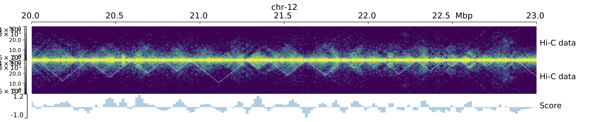

# Characterizing Chromatin Interaction Domains in *Hydra*

This document provides details on our analysis of 3D genome architecture in the AEP genome assembly. This entailed aligning the raw Hi-C reads to the finalized genome assembly, normalizing contact frequencies, and predicting and characterizing chromatin contact domains.

[TOC]

## Re-Mapping the AEP Hi-C Data to the Finalized Genome Assembly

Because we made additional modifications to the AEP genome assembly after the Hi-C scaffolding step (described in `01_aepGenomeAssembly.md`), we had to re-map our Hi-C reads to the finalized assembly before we could further characterize chromatin interactions. We used the same mapping approach as when we performed the initial Hi-C scaffolding. 

We first predicted restriction enzyme cutsites in the AEP assembly using the  `generate_site_positions.py` script included as part of the Juicer pipeline.

(*01_mapping/getCutsFinal.sh*)

```bash
#! /bin/bash
#SBATCH -p med
#SBATCH --job-name=cutS
#SBATCH -c 1
#SBATCH -t 60-0
#SBATCH --mem=16G
#SBATCH --error=cutS_%j.err
#SBATCH --output=cutS_%j.out

python ../juicer/misc/generate_site_positions.py Arima final \
        ../../aep.final.genome.fa
```

We then mapped the Hi-C reads using a slightly modified Juicer pipeline script (modifications described in `01_aepGenomeAssembly.md`)

(*01_mapping/runJuicerfinal.sh*)

```bash
#! /bin/bash
#SBATCH -p med
#SBATCH --job-name=jLaunch
#SBATCH -c 1
#SBATCH -t 60-0
#SBATCH --mem=8G
#SBATCH --error=jLaunch_%j.err
#SBATCH --output=jLaunch_%j.out

./scripts/juicerMod.sh \
        -g final -z ../resources/references/final/aep.final.genome.fa \
        -p ../aep.final.genome \
        -q med -Q 60-0 -l med -L 60-0 -t 8 \
        -D /home/jacazet/reference/aepAssembly/06_HiC \
        -d /home/jacazet/reference/aepAssembly/06_HiC/work
```

Note that the above script had to be run twice because of a batch scheduling error in the Juicer pipeline script. Re-executing the pipeline after the initial run failed allowed us to successfully recover the analysis and generate the necessary mapped read files.

## Identifying and Visualizing Chromatin Contact Domains Using Hi-C Data

### Converting and Normalizing the Hi-C Contact Frequency Data

The tools we used for downstream analysis of our mapped Hi-C reads (HiCExplorer) use the `.cool` format, as opposed to the `.hic` format used by Juicer. In addition, the tools that generate `.cool` files are also not compatible with `.hic` files. We therefore used the `merged_nodup2pairs.pl` utility script from [pairix](https://github.com/4dn-dcic/pairix) to convert the mapped read output from Juicer (`merged_nodups.txt`) to a read pairs file.

(*01_mapping/juiceOut2Pairs.sh*)

```bash
#! /bin/bash -l
#SBATCH -p med
#SBATCH --job-name=con
#SBATCH -c 8
#SBATCH -t 60-0
#SBATCH --mem=16G
#SBATCH --error=con.err
#SBATCH --output=con.out

merged_nodup2pairs.pl -m 29 -s 6 work/aligned/merged_nodups.txt aep.genome aep
```

The pairs file was then be used to generate `.cool` files. When generating this file, you need to specify the resolution of the data by picking the bin size used to pool contact data. We used a bin size of 8 Kb for visualizing the data, and a bin size of 16 Kb for domain calling.

We first generated the 8 kb bin `.cool` file from the read pairs file:

(*01_mapping/pair2Cool8k.sh*)

```bash
#!/bin/bash

cooler cload pairix -p 6 aep.genome:8000 aep.bsorted.pairs.gz aepHic.8k.cool
```

We then normalized the contact frequency data using `hicCorrectMatrix` from HiCExplorer. This involved generating a diagnostic plot showing the distribution of contact frequencies for all bins in the genome at the specified bin size: 

(*01_mapping/correctionPlot8k.sh*)

```bash
#!/bin/bash

hicCorrectMatrix diagnostic_plot -m aepHic.8k.cool -o correctionPlot.png
```


This plot provides guidance for selecting cutoff thresholds for removing low and high contact frequency outliers that could skew the normalization. We selected a cutoff of -1.75 and 2.5 for the 8 Kb bin size.

(*01_mapping/runCorrection8k.sh*)

```bash
#!/bin/bash

hicCorrectMatrix correct -m aepHic.8k.cool --filterThreshold -1.75 2.5 -o hic_corrected8k.cool
```

We then performed similar conversion and normalization steps for a 16 Kb bin size. 

We first converted the read pairs data to contact frequency data with a 16 Kb resolution:

(*01_mapping/pair2Cool16k.sh*)

```bash
#!/bin/bash

cooler cload pairix -p 6 aep.genome:16000 aep.bsorted.pairs.gz aepHic.16k.cool
```

We next generated a diagnostic contact frequency distribution plot:

(*01_mapping/correctionPlot16k.sh*)

```bash
#!/bin/bash

hicCorrectMatrix diagnostic_plot -m aepHic.16k.cool -o correctionPlot.png
```


We normalized the data using cutoff values of -2 and 4:

(*01_mapping/runCorrection16k.sh*)

```bash
#!/bin/bash

hicCorrectMatrix correct -m aepHic.16k.cool --filterThreshold -2 4 -o hic_corrected16k.cool
```

### Predicting and Visualizing Chromatin Contact Domains

We predicted chromatin contact domains using the 16 Kb bin size contact frequency data. We used the HiCExplorer `hicFindTADs` function to predict domain boundaries. `--minDepth` was set to 3x the bin size and `--maxDepth` to 10x the bin size as per the recommendations in the function's documentation. Domain boundaries were identified using a FDR threshold of 0.05.

(*02_domains/findTadsAep16k.sh*)

```bash
#!/bin/bash

hicFindTADs -m hic_corrected16k.cool --outPrefix aep16k --correctForMultipleTesting fdr \
        --minDepth 48000 --maxDepth 160000 --step 16000 -p 4 --thresholdComparisons 0.05
```

This generated several output files, most notably `aep16k_domains.bed`, which contains coordinates for the predicted contact domains in the AEP genome; `aep16k_boundaries.bed`, which contains coordinates for the boundaries of the predicted contact domains; and `aep16k_score.bedgraph`, which contains insulation scores as a data track for the AEP genome. The insulation score is the basis for the domain boundary prediction, which are marked by rapid shifts in local chromatin contact frequency.

We visualized an example of the contact frequency and domain prediction results used the HiCExplorer `hicPlotTADs` function.

(*02_domains/makeTadPlot.sh*)

```bash
#!/bin/bash

hicPlotTADs --tracks tadTestPlot.ini -o hic_track_chr12.pdf \
        --region chr-12:20000000-23000000 --dpi 300 --height 8
```



The parameters for the above plot were specified using the following file:

(`02_domains/tadTestPlot.ini`)

```
[x-axis]
where = top

[hic matrix]
file = hic_corrected8k.cool
title = Hi-C data
# depth is the maximum distance plotted in bp. In Hi-C tracks
# the height of the track is calculated based on the depth such
# that the matrix does not look deformed
depth = 500000
transform = log1p
file_type = hic_matrix
colormap = viridis
min_value = 5
max_value = 50

[hic matrix]
file = hic_corrected8k.cool
title = Hi-C data
# depth is the maximum distance plotted in bp. In Hi-C tracks
# the height of the track is calculated based on the depth such
# that the matrix does not look deformed
depth = 500000
transform = log1p
file_type = hic_matrix
colormap = viridis
min_value = 5
max_value = 50
orientation = inverted

[tads]
file = aep16k_domains.bed
file_type = domains
border_color = white
color = none
# the tads are overlay over the hic-matrix
# the share-y options sets the y-axis to be shared
# between the Hi-C matrix and the TADs.
orientation = inverted
overlay_previous = share-y

[bigwig file test]
file = aep16k_score.bedgraph
# height of the track in cm (optional value)
height = 2
title = Score
#min_value = 0
#max_value = 4
```

## Characterizing Genomic Features at Contact Domain Boundaries

Bilaterian TAD boundaries are typically located in conserved regions of euchromatin. To determine if this was also the case for the domain boundaries we predicted in the AEP assembly using our Hi-C data. Specifically, we characterized the localization of the repressive histone mark H3K27me3 along with sequence conservation at predicted domain boundaries using the deeptools function `computeMatrix`. We focused on the 16 kb regions that were predicted to contain a domain boundary (the resolution of the boundary region prediction is limited by the bin size used for the analysis). We also included flanking regions 100 kb up- and downstream of the domain boundaries.

(*02_domains/calcBoundMat_hetCon.sh*)

```bash
#!/bin/bash

computeMatrix scale-regions -S '../../../Cut&Stuff/CnT/H273_MG.bw' \
	../../alignment_conservation/windows/aepCon.bw \
	-R /Volumes/Data/genome/hic/aep16k_boundaries.bed \
	-o boundMat_hetCon.gz \
	-m 30000 -b 100000 -a 100000 \
	--missingDataAsZero -p 6
```

We visualized the results using the deeptools `plotHeatmap` function:

(*plotBoundHeat_hetCon.sh*)

```bash
#!/bin/bash

plotHeatmap -m boundMat_hetCon.gz -o boundHeat_hetCon.pdf \
	--colorMap magma --yMax 0.2 0.4 --zMax 0.6 2.0
```


## Investigating a Role for Contact Domains in Transcriptional Regulation

We next wanted to determine if chromatin contact domains influence transcriptional regulation in *Hydra*. Our approach for testing this was to use the single-cell *Hydra* atlas to determine if genes that fell within the same contact domain tended to have more similar expression patterns than genes that were not within the same contact domain. 

To explore this question, we needed to assign each AEP gene model to a chromatin contact domain. We extracted gene coordinates from the `HVAEP1.GeneModels.gtf` file and converted them into a bed file.

```bash
awk 'BEGIN { OFS = "\t" ; FS = "\t" } ; $3 ~ /gene/ {print $1,$4-1,$5,$9,0,$7}' HVAEP1.GeneModels.gtf | sed 's/ID "//g;s/";.*\t0/\t0/g' | gsort -k1,1 -k2,2n > HVAEP1.genes.sorted.bed

gsort -k1,1 -k2,2n aep16k_boundaries.bed > aep16k_boundaries.sorted.bed
```

We then used the bedtools `closest` function to find the contact domain boundary that was closest to each AEP gene model. The output `genesCloseTads.bed` included the name and coordinates of the closest boundary as well as its distance to the target gene.

(*02_domains/getCloseTads.sh*)

```bash
#!/bin/bash

bedtools closest -D ref -a HVAEP1.genes.sorted.bed -b aep16k_boundaries.sorted.bed > genesCloseTads.bed
```

The output from bedtools `closest` was then used for a custom R script. This script identified sets of three consecutive genes that spanned a domain boundary. We excluded all triplets where the central gene fell within the predicted boundary coordinates, which left triplets where two of the genes were in the same domain and one of the genes was in a different domain. We could then generate two different consecutive gene pairs: an inter-domain pair and a intra-domain pair:


We then imported the NMF gene scores for the *Hydra* single-cell atlas (generated in `05_hydraAtlasReMap.md`) and used them to determine if inter-domain gene pairs had more or less correlated expression patterns than intra-domain pairs.

(*02_domains/boundaryCor.R*)

```R
library(rstudioapi)
library(ggplot2)

setwd(dirname(getActiveDocumentContext()$path))

#import information on the nearest HIC boundary for each gene
tadLink <- read.delim('genesCloseTads.bed', header = F)

#drop any genes that fall within a boundary
tadLink <- tadLink[tadLink$V13 != 0,]

#save original df to use later
tadLink.orig <- tadLink

#split genes by their nearest TAD
tadLink <- split(tadLink,tadLink$V10)


crossPairs <- lapply(tadLink, function(x){
  #get all genes that lie downstream of the domain boundary
  rightG <- x[x$V13 < 0,]               #weirdly, bedtools gave downstream genes negative distance values
  
  #pick the downstream gene that is closest to the domain boundary
  rightG <- rightG[which.max(rightG$V13),'V4']
  
  #get numeric equivalent of gene ID (to check if left and right genes are consecutive)
  rightG.n <- as.numeric(gsub('HVAEP1_G','',rightG))
  
  #get all genes that lie upstream of the domain boundary 
  leftG <- x[x$V13 > 0,]
  
  #pick the upstream gene that is closest to the domain boundary
  leftG <- leftG[which.min(leftG$V13),'V4']
  
  #get numeric equivalent of gene ID
  leftG.n <- as.numeric(gsub('HVAEP1_G','',leftG))
  
  #if the two genes flanking a boundary are consecutive, return the gene pair
  #otherwise do nothing
  if(length(rightG.n) > 0 & length(leftG.n) > 0){
    if((rightG.n - leftG.n) == 1){
      return(c(leftG,rightG))
    }
  }
})

#drop empty results
crossPairs <- crossPairs[sapply(crossPairs,length) > 0]

#collapse into table
crossPairs <- do.call(rbind,crossPairs)

#import NMF gene scores
gScore <- read.delim('../../ds/nmf/final/whole_unfilt_fine_broad.gene_spectra_score.k_28.dt_0_2.txt',row.names = 1)

gScore <- t(gScore)

#fix gene name formatting
rownames(gScore) <- gsub('[.]','_',rownames(gScore))

#drop gene pairs that don't have gene scores
crossPairs <- as.data.frame(crossPairs[crossPairs[,1] %in% rownames(gScore) &
                           crossPairs[,2] %in% rownames(gScore),])

#generate gene ID for genes that are downstream of the righthand genes in the crosspairs list
#these genes will be in the same domain as the righthand crosspairs gene
cisPairs <- as.numeric(substr(crossPairs[,2],9,14)) + 1

cisPairs <- formatC(cisPairs, width = 6, format = "d", flag = "0")

cisPairs <- paste0('HVAEP1_G',cisPairs)

cisPairs <- data.frame(g1 = crossPairs[,2],g2=cisPairs)

#make sure cispairs both have gscores
cisPairs <- as.data.frame(cisPairs[cisPairs[,1] %in% rownames(gScore) &
                                     cisPairs[,2] %in% rownames(gScore),])

#check and make sure the two cispair genes are indeed in the same domain
cisPairs <- cisPairs[cisPairs$g2 %in% tadLink.orig$V4,]

cisPairs$g1Bid <- tadLink.orig[match(cisPairs$g1, tadLink.orig$V4),'V10']
cisPairs$g2Bid <- tadLink.orig[match(cisPairs$g2, tadLink.orig$V4),'V10']

cisPairs <- cisPairs[cisPairs$g1Bid == cisPairs$g2Bid,]

#limit the crosspairs to only those genes that also had a valid cis pair
crossPairs <- crossPairs[crossPairs$V2 %in% cisPairs$g1,]

#compare gene scores across metagenes for crosspairs
xPairCor <- apply(crossPairs,1,function(x){
  cor(gScore[x[1],],gScore[x[2],])
})

#compare gene scores across metagenes for cispairs
cisPairCor <- apply(cisPairs,1,function(x){
  cor(gScore[x[1],],gScore[x[2],])
})

#generate dataframe of correlation scores for plotting
plotDF <- data.frame(corVal = c(cisPairCor,xPairCor), lab = as.factor(rep(c('cis','cross'),c(nrow(cisPairs),nrow(cisPairs)))))

#define cross as first level of factors (specifying plotting order)
plotDF$lab <- relevel(plotDF$lab, "cross")

ggplot(plotDF,aes(x=lab,y=corVal,fill=lab)) + geom_boxplot
```


The distribution of correlation scores suggested that consecutive gene pairs that fell within the same contact domain had more similar expression patterns than consecutive gene pairs that spanned a contact domain. To determine if this difference was significant, we used a standard student's t-test:

```R
#use t-test to see if cispairs have significantly higher correlation scores than crosspairs
t.test(x=cisPairCor,y=xPairCor,alternative = 't',var.equal = F)
```

```
	Welch Two Sample t-test

data:  cisPairCor and xPairCor
t = 4.0072, df = 591.5, p-value = 6.929e-05
alternative hypothesis: true difference in means is not equal to 0
95 percent confidence interval:
 0.05699933 0.16657721
sample estimates:
mean of x mean of y 
0.2223149 0.1105267 
```

## Files Associated with This Document


```
09_3dChromatin/
├── 01_mapping
│   ├── aepHic.16k.cool
				cooler-formatted file containing chromatin contact frequency data for the 
				AEP genome. Uses a 16 Kb bin size.
│   ├── aepHic.8k.cool
				cooler-formatted file containing chromatin contact frequency data for the 
				AEP genome. Uses an 8 Kb bin size.
│   ├── correctionPlot16k.sh
				Shell script that generates a plot of the contact frequency distribution
				for the AEP Hi-C data using a 16 Kb bin size. Used for tuning parameters
				when performing normalization.
│   ├── correctionPlot8k.sh
				Shell script that generates a plot of the contact frequency distribution
				for the AEP Hi-C data using a 8 Kb bin size. Used for tuning parameters
				when performing normalization.
│   ├── getCutsFinal.sh
				Shell script that predicts cut sites in the AEP assembly for the restriction
				enzymes used to generate the AEP Hi-C library, which is required for running
				the Juicer mapping pipeline.
│   ├── hic_corrected16k.cool
				cooler-formatted file containing normalized chromatin contact frequency data 
				for the AEP genome. Uses a 16 Kb bin size.
│   ├── hic_corrected8k.cool
				cooler-formatted file containing normalized chromatin contact frequency data 
				for the AEP genome. Uses an 8 Kb bin size.
│   ├── inter_30.hic
				Juicer-formatted file containing chromatin contact frequency data for the 
				AEP genome. This file caculates contact frequency only using reads with a 
				MAPQ of 30 or greater.
│   ├── inter.hic
				Juicer-formatted file containing chromatin contact frequency data for the 
				AEP genome.
│   ├── juiceOut2Pairs.sh
				Shell script that converts the Juicer-formatted Hi-C mapped read file into
				the pairix format. Needed to use Juicer-mapped data with HiCExplorer.
│   ├── pair2Cool16k.sh
				Shell script that generates a .cool file of chromatin contact frequency
				from a pairix file using a 16 Kb bin size.
│   ├── pair2Cool8k.sh
				Shell script that generates a .cool file of chromatin contact frequency
				from a pairix file using a 8 Kb bin size.
│   ├── runCorrection16k.sh
				Shell script that normalizes the chromatin contact frequency data in 
				aepHic.16k.cool. Generates hic_corrected16k.cool.
│   ├── runCorrection8k.sh
				Shell script that normalizes the chromatin contact frequency data in 
				aepHic.8k.cool. Generates hic_corrected8k.cool.
│   └── runJuicerfinal.sh
				Shell script that uses the Juicer alignment pipeline to map the AEP Hi-C
				data to the final AEP genome assembly.
└── 02_domains
    ├── aep16k_boundaries.sorted.bed
    		Coordinate sorted bed file containing the locations of all chromatin 
    		contact domain boundaries predicted by findTadsAep16k.sh.
    ├── aep16k_domains.bed
    		Bed file containing the locations of all chromatin contact domains 
    		predicted by findTadsAep16k.sh.
    ├── aep16k_score.bedgraph
    		Bedgraph file containing insulation scores for the AEP genome. The insulation
    		score is a sliding window measure of chromatin contact frequency. Low/negative 
    		insulation scores are distinctive of contact domain boundaries.
    ├── boundaryCor.R
    		R script that uses the Hydra single cell atlas to compare the expression patterns 
    		of consecutive gene pairs in the AEP genome that either fall within a single 
    		chromatin contact domain (intra-domain pairs) or span two contact domains (inter-
    		domain pairs) to determine if contact domains in Hydra influence gene expression.
    ├── calcBoundMat_hetCon.sh
    		Shell script that uses the deeptools computeMatrix function to characterize
    		sequence conservation and H3K27me3 CUT&Tag read distribution around chromatin
    		contact domain boundaries.
    ├── findTadsAep16k.sh
    		Shell script that uses the HiCExplorer hicFindTADs function to predict chromatin
    		contact domain boundaries using a 16 Kb bin size.
    ├── genesCloseTads.bed
    		Bed genome coordinate file that includes the nearest chromatin contact domain
    		boundary for each AEP gene model.
    ├── getCloseTads.sh
    		Shell script that uses bedtools to identify the nearest chromatin contact domain
    		boundary to each AEP gene model.
    ├── HVAEP1.genes.sorted.bed
    		Bed genome coordinate file that includes the coordinates for all AEP gene models.
    ├── makeTadPlot.sh
    		Shell script that generates a reprentative plot of chromatin contact frequency, 
    		domain predictions, and insulation scores.
    ├── plotBoundHeat_hetCon.sh
    		Shell script that plots the results of calcBoundMat_hetCon.sh to show trends in 
    		sequence conservation and CUT&Tag H3K27me3 read density around predicted chromatin
    		contact domain boundaries.
    └── tadTestPlot.ini
    		Config file used to generate the representative plot from makeTadPlot.sh.
```

