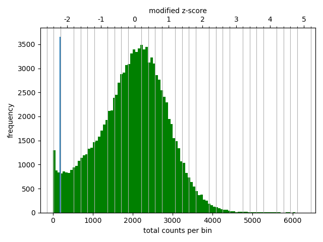
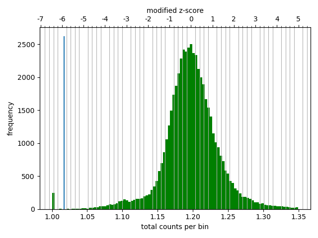
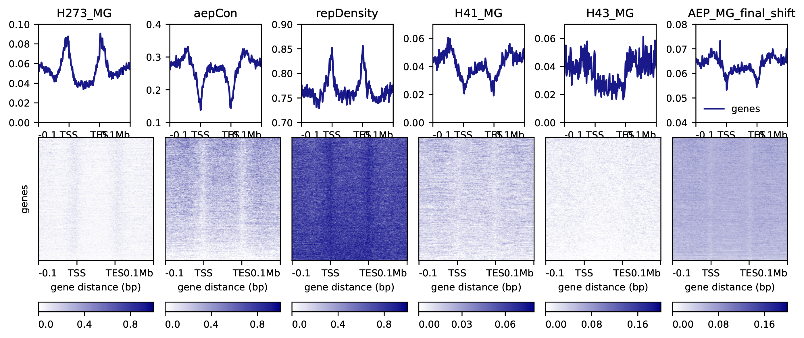
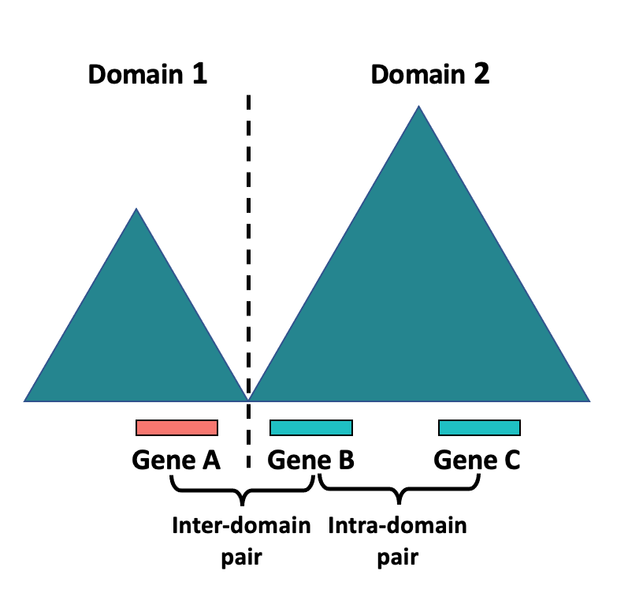
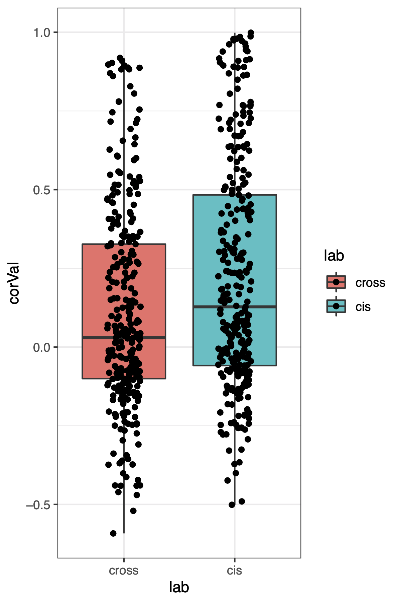
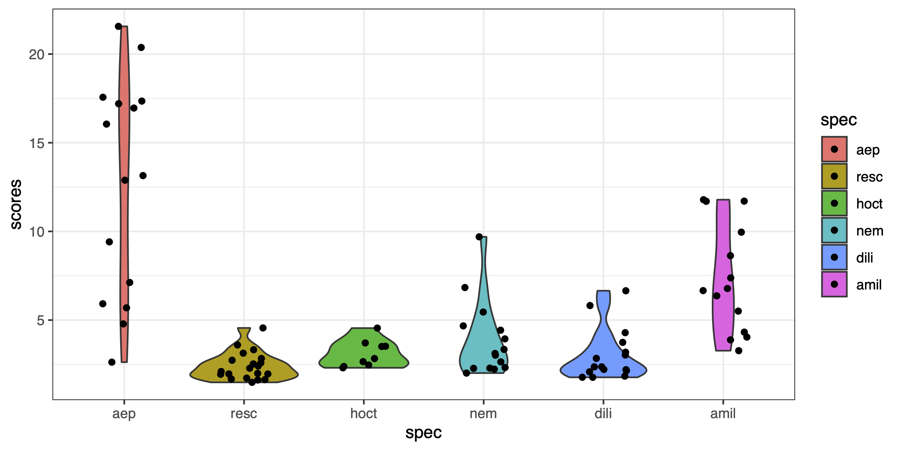
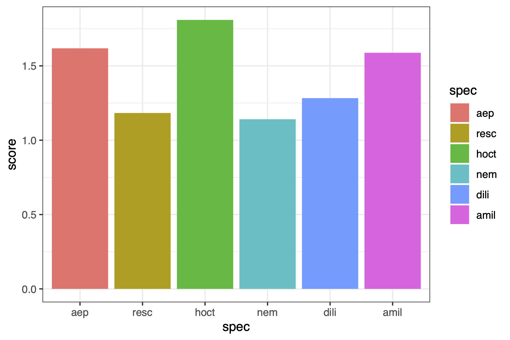

# Characterizing Chromatin Interaction Domains in *Hydra*

This document provides details on our analysis of 3D genome architecture in the AEP genome assembly. This entailed aligning the raw Hi-C reads to the finalized genome assembly, normalizing contact frequencies, and predicting and characterizing chromatin contact domains.

[TOC]

## Re-Mapping the AEP Hi-C Data to the Finalized Genome Assembly

Because we made additional modifications to the AEP genome assembly after the Hi-C scaffolding step (described in `01_aepGenomeAssembly.md`), we had to re-map our Hi-C reads to the finalized assembly before we could further characterize chromatin interactions. We used the same mapping approach as when we performed the initial Hi-C scaffolding. 

We first predicted restriction enzyme cutsites in the AEP assembly using the  `generate_site_positions.py` script included as part of the Juicer pipeline.

(*01_mapping/getCutsFinal.sh*)

```bash
#! /bin/bash
#SBATCH -p med
#SBATCH --job-name=cutS
#SBATCH -c 1
#SBATCH -t 60-0
#SBATCH --mem=16G
#SBATCH --error=cutS_%j.err
#SBATCH --output=cutS_%j.out

python ../juicer/misc/generate_site_positions.py Arima final \
        ../../aep.final.genome.fa
```

We then mapped the Hi-C reads using a slightly modified Juicer pipeline script (modifications described in `01_aepGenomeAssembly.md`)

(*01_mapping/runJuicerfinal.sh*)

```bash
#! /bin/bash
#SBATCH -p med
#SBATCH --job-name=jLaunch
#SBATCH -c 1
#SBATCH -t 60-0
#SBATCH --mem=8G
#SBATCH --error=jLaunch_%j.err
#SBATCH --output=jLaunch_%j.out

./scripts/juicerMod.sh \
        -g final -z ../resources/references/final/aep.final.genome.fa \
        -p ../aep.final.genome \
        -q med -Q 60-0 -l med -L 60-0 -t 8 \
        -D /home/jacazet/reference/aepAssembly/06_HiC \
        -d /home/jacazet/reference/aepAssembly/06_HiC/work
```

Note that the above script had to be run twice because of a batch scheduling error in the Juicer pipeline script. Re-executing the pipeline after the initial run failed allowed us to successfully recover the analysis and generate the necessary mapped read files.


## Identifying and Visualizing Chromatin Contact Domains Using Hi-C Data

### Converting and Normalizing the Hi-C Contact Frequency Data

The tools we used for downstream analysis of our mapped Hi-C reads (HiCExplorer) use the `.cool` format, as opposed to the `.hic` format used by Juicer. In addition, the tools that generate `.cool` files are also not compatible with `.hic` files. We therefore used the `merged_nodup2pairs.pl` utility script from [pairix](https://github.com/4dn-dcic/pairix) to convert the mapped read output from Juicer (`merged_nodups.txt`) to a read pairs file.

(*01_mapping/juiceOut2Pairs.sh*)

```bash
#! /bin/bash -l
#SBATCH -p med
#SBATCH --job-name=con
#SBATCH -c 8
#SBATCH -t 60-0
#SBATCH --mem=16G
#SBATCH --error=con.err
#SBATCH --output=con.out

merged_nodup2pairs.pl -m 29 -s 6 work/aligned/merged_nodups.txt aep.genome aep
```

The pairs file was then be used to generate `.cool` files. When generating this file, you need to specify the resolution of the data by picking the bin size used to pool contact data. We used a bin size of 8 Kb for visualizing the data, and a bin size of 16 Kb for domain calling.

We first generated the 8 kb bin `.cool` file from the read pairs file:

(*01_mapping/pair2Cool8k.sh*)

```bash
#!/bin/bash

cooler cload pairix -p 6 aep.genome:8000 aep.bsorted.pairs.gz aepHic.8k.cool
```

We then normalized the contact frequency data using `hicCorrectMatrix` from HiCExplorer. This involved generating a diagnostic plot showing the distribution of contact frequencies for all bins in the genome at the specified bin size: 

(*01_mapping/correctionPlot8k.sh*)

```bash
#!/bin/bash

hicCorrectMatrix diagnostic_plot -m aepHic.8k.cool -o correctionPlot.png
```



This plot provides guidance for selecting cutoff thresholds for removing low and high contact frequency outliers that could skew the normalization. We selected a cutoff of -1.75 and 2.5 for the 8 Kb bin size.

(*01_mapping/runCorrection8k.sh*)

```bash
#!/bin/bash

hicCorrectMatrix correct -m aepHic.8k.cool --filterThreshold -1.75 2.5 -o hic_corrected8k.cool
```

We then performed similar conversion and normalization steps for a 16 Kb bin size. 

We first converted the read pairs data to contact frequency data with a 16 Kb resolution:

(*01_mapping/pair2Cool16k.sh*)

```bash
#!/bin/bash

cooler cload pairix -p 6 aep.genome:16000 aep.bsorted.pairs.gz aepHic.16k.cool
```

We next generated a diagnostic contact frequency distribution plot:

(*01_mapping/correctionPlot16k.sh*)

```bash
#!/bin/bash

hicCorrectMatrix diagnostic_plot -m aepHic.16k.cool -o correctionPlot.png
```



We normalized the data using cutoff values of -2 and 4:

(*01_mapping/runCorrection16k.sh*)

```bash
#!/bin/bash

hicCorrectMatrix correct -m aepHic.16k.cool --filterThreshold -2 4 -o hic_corrected16k.cool
```

### Predicting and Visualizing Chromatin Contact Domains

We predicted chromatin contact domains using the 16 Kb bin size contact frequency data. We used the HiCExplorer `hicFindTADs` function to predict domain boundaries. `--minDepth` was set to 3x the bin size and `--maxDepth` to 10x the bin size as per the recommendations in the function's documentation. Domain boundaries were identified using a FDR threshold of 0.05.

(*02_domains/findTadsAep16k.sh*)

```bash
#!/bin/bash

hicFindTADs -m hic_corrected16k.cool --outPrefix aep16k --correctForMultipleTesting fdr \
        --minDepth 48000 --maxDepth 160000 --step 16000 -p 4 --thresholdComparisons 0.05
```

This generated several output files, most notably `aep16k_domains.bed`, which contains coordinates for the predicted contact domains in the AEP genome; `aep16k_boundaries.bed`, which contains coordinates for the boundaries of the predicted contact domains; and `aep16k_score.bedgraph`, which contains insulation scores as a data track for the AEP genome. The insulation score is the basis for the domain boundary prediction, which are marked by rapid shifts in local chromatin contact frequency.

We visualized contact frequency and domain prediction results using JuiceBox.

## Characterizing Genomic Features at Contact Domain Boundaries

Bilaterian TAD boundaries are typically located in conserved regions of euchromatin. We therefore sought to determine if this was also the case for the domain boundaries we predicted in the AEP assembly using our Hi-C data. To do this, we characterized the distribution of both repressive (H3K27me3) and activating (H3K4me1 and H3K4me3) histone marks, chromatin accessibility, sequence conservation, and repetitive elements relative to predicted chromatin domain boundaries using the deeptools function `computeMatrix`. We also included flanking regions 100 kb up- and downstream of the domain boundaries. 

The CUT&Tag and ATAC-seq bigwigs used for these plots (e.g., `AEP_MG_final_shift.bw`,  `H41_MG.bw`, etc.) were generated in `08_creIdentification.md`. The sequence conservation bigwig (`aepCon.bw`) was generated in `07_genomeConservation.md`. The repeat density bigwig (`repDensity.bw`) was generated in `02_repeatMasking.md`.

(*02_domains/calcTADMat_hetCon.sh*)

```bash
#!/bin/bash

computeMatrix scale-regions -S '../../../Cut&Stuff/CnT/H273_MG.bw' \
	../../alignment_conservation/windows/aepCon.bw \
	../../repeats/repDensity.bw \
	'../../../Cut&Stuff/CnT/H41_MG.bw' \
	'../../../Cut&Stuff/CnT/H43_MG.bw' \
	'../../../Cut&Stuff/ATAC/AEP_MG_final_shift.bw' \
	-R /Volumes/Data/genome/hic/aep16k_domains.bed \
	-o tadMat_hetCon.gz \
	-m 100000 -b 100000 -a 100000 \
	--averageTypeBins median \
	-bs 1000 \
	--missingDataAsZero -p 6
```

We visualized the results using the deeptools `plotHeatmap` function:

(*02_domains/plotBoundHeat_hetCon.sh*)

```bash
#!/bin/bash

plotHeatmap -m tadMat_hetCon.gz -o tadHeat_hetCon.pdf \
	--colorList "white,darkblue" \
	--heatmapHeight 5 \
	--yMax 0.1 0.4 0.9 0.07 0.07 0.08 \
	--yMin 0 0.1 0.7 0 0 0.04 \
	--zMax 1 1 1 0.08 0.2 0.2
```




## Investigating a Role for Contact Domains in Transcriptional Regulation

We next wanted to determine if chromatin contact domains influence transcriptional regulation in *Hydra*. Our approach for testing this was to use the single-cell *Hydra* atlas to determine if genes that fell within the same contact domain tended to have more similar expression patterns than genes that were not within the same contact domain. 

To explore this question, we needed to assign each AEP gene model to a chromatin contact domain. We extracted gene coordinates from the `HVAEP1.GeneModels.gtf` file and converted them into a bed file.

```bash
awk 'BEGIN { OFS = "\t" ; FS = "\t" } ; $3 ~ /gene/ {print $1,$4-1,$5,$9,0,$7}' HVAEP1.GeneModels.gtf | sed 's/ID "//g;s/";.*\t0/\t0/g' | gsort -k1,1 -k2,2n > HVAEP1.genes.sorted.bed

gsort -k1,1 -k2,2n aep16k_boundaries.bed > aep16k_boundaries.sorted.bed
```

We then used the bedtools `closest` function to find the contact domain boundary that was closest to each AEP gene model. The output `genesCloseTads.bed` included the name and coordinates of the closest boundary as well as its distance to the target gene.

(*02_domains/getCloseTads.sh*)

```bash
#!/bin/bash

bedtools closest -D ref -a HVAEP1.genes.sorted.bed -b aep16k_boundaries.sorted.bed > genesCloseTads.bed
```

The output from bedtools `closest` was then used for a custom R script. This script identified sets of three consecutive genes that spanned a domain boundary. We excluded all triplets where the central gene fell within the predicted boundary coordinates, which left triplets where two of the genes were in the same domain and one of the genes was in a different domain. We could then generate two different consecutive gene pairs: an inter-domain pair and a intra-domain pair:



We then imported the NMF gene scores for the *Hydra* single-cell atlas (generated in `05_hydraAtlasReMap.md`) and used them to determine if inter-domain gene pairs had more or less correlated expression patterns than intra-domain pairs.

(*02_domains/boundaryCor.R*)

```R
library(rstudioapi)
library(ggplot2)

setwd(dirname(getActiveDocumentContext()$path))

#import information on the nearest HIC boundary for each gene
tadLink <- read.delim('genesCloseTads.bed', header = F)

#drop any genes that fall within a boundary
tadLink <- tadLink[tadLink$V13 != 0,]

#save original df to use later
tadLink.orig <- tadLink

#split genes by their nearest TAD
tadLink <- split(tadLink,tadLink$V10)


crossPairs <- lapply(tadLink, function(x){
  #get all genes that lie downstream of the domain boundary
  rightG <- x[x$V13 < 0,]               #weirdly, bedtools gave downstream genes negative distance values
  
  #pick the downstream gene that is closest to the domain boundary
  rightG <- rightG[which.max(rightG$V13),'V4']
  
  #get numeric equivalent of gene ID (to check if left and right genes are consecutive)
  rightG.n <- as.numeric(gsub('HVAEP1_G','',rightG))
  
  #get all genes that lie upstream of the domain boundary 
  leftG <- x[x$V13 > 0,]
  
  #pick the upstream gene that is closest to the domain boundary
  leftG <- leftG[which.min(leftG$V13),'V4']
  
  #get numeric equivalent of gene ID
  leftG.n <- as.numeric(gsub('HVAEP1_G','',leftG))
  
  #if the two genes flanking a boundary are consecutive, return the gene pair
  #otherwise do nothing
  if(length(rightG.n) > 0 & length(leftG.n) > 0){
    if((rightG.n - leftG.n) == 1){
      return(c(leftG,rightG))
    }
  }
})

#drop empty results
crossPairs <- crossPairs[sapply(crossPairs,length) > 0]

#collapse into table
crossPairs <- do.call(rbind,crossPairs)

#import NMF gene scores
gScore <- read.delim('../../ds/nmf/final/whole_unfilt_fine_broad.gene_spectra_score.k_28.dt_0_2.txt',row.names = 1)

gScore <- t(gScore)

#fix gene name formatting
rownames(gScore) <- gsub('[.]','_',rownames(gScore))

#drop gene pairs that don't have gene scores
crossPairs <- as.data.frame(crossPairs[crossPairs[,1] %in% rownames(gScore) &
                           crossPairs[,2] %in% rownames(gScore),])

#generate gene ID for genes that are downstream of the righthand genes in the crosspairs list
#these genes will be in the same domain as the righthand crosspairs gene
cisPairs <- as.numeric(substr(crossPairs[,2],9,14)) + 1

cisPairs <- formatC(cisPairs, width = 6, format = "d", flag = "0")

cisPairs <- paste0('HVAEP1_G',cisPairs)

cisPairs <- data.frame(g1 = crossPairs[,2],g2=cisPairs)

#make sure cispairs both have gscores
cisPairs <- as.data.frame(cisPairs[cisPairs[,1] %in% rownames(gScore) &
                                     cisPairs[,2] %in% rownames(gScore),])

#check and make sure the two cispair genes are indeed in the same domain
cisPairs <- cisPairs[cisPairs$g2 %in% tadLink.orig$V4,]

cisPairs$g1Bid <- tadLink.orig[match(cisPairs$g1, tadLink.orig$V4),'V10']
cisPairs$g2Bid <- tadLink.orig[match(cisPairs$g2, tadLink.orig$V4),'V10']

cisPairs <- cisPairs[cisPairs$g1Bid == cisPairs$g2Bid,]

#limit the crosspairs to only those genes that also had a valid cis pair
crossPairs <- crossPairs[crossPairs$V2 %in% cisPairs$g1,]

#compare gene scores across metagenes for crosspairs
xPairCor <- apply(crossPairs,1,function(x){
  cor(gScore[x[1],],gScore[x[2],])
})

#compare gene scores across metagenes for cispairs
cisPairCor <- apply(cisPairs,1,function(x){
  cor(gScore[x[1],],gScore[x[2],])
})

#generate dataframe of correlation scores for plotting
plotDF <- data.frame(corVal = c(cisPairCor,xPairCor), lab = as.factor(rep(c('cis','cross'),c(nrow(cisPairs),nrow(cisPairs)))))

#define cross as first level of factors (specifying plotting order)
plotDF$lab <- relevel(plotDF$lab, "cross")

ggplot(plotDF,aes(x=lab,y=corVal,fill=lab)) + geom_boxplot
```



The distribution of correlation scores suggested that consecutive gene pairs that fell within the same contact domain had more similar expression patterns than consecutive gene pairs that spanned a contact domain. To determine if this difference was significant, we used a standard student's t-test:

```R
#use t-test to see if cispairs have significantly higher correlation scores than crosspairs
t.test(x=cisPairCor,y=xPairCor,alternative = 't',var.equal = F)
```

```
	Welch Two Sample t-test

data:  cisPairCor and xPairCor
t = 4.0072, df = 591.5, p-value = 6.929e-05
alternative hypothesis: true difference in means is not equal to 0
95 percent confidence interval:
 0.05699933 0.16657721
sample estimates:
mean of x mean of y 
0.2223149 0.1105267 
```


## Comparative analysis of chromosome-level 3D genome architecture in cnidarians

### Compiling and re-analyzing previously published cnidarian Hi-C data

To contextualize the 3D organization of the Hydra genome relative to other cnidarian genomes, we downloaded previously released Hi-C data for six other cnidarian chromosome-level genome assemblies. The table below provides information on the specific SRA datasets we accessed.

| **Species**       | **SRA Accession #'s**                                        | **Genome Reference**                                         | **Restriction Enzyme** |
| ----------------- | ------------------------------------------------------------ | ------------------------------------------------------------ | ---------------------- |
| *A. millepora*    | `SRR13361157 SRR13361158 SRR13361159 SRR13361156 SRR13361160 SRR13361155 SRR13361154 SRR13361162 SRR13361163` | `GSM5182734` (GEO Accession)                                 | MboI                   |
| *D. lineata*      | `ERR6688655`                                                 | `GCA_918843875.1` (GenBank Accession)                        | Arima                  |
| *H. octoradiatus* | `ERR6745733`                                                 | `GCA_916610825.1` (GenBank Accession)                        | Arima                  |
| *N. vectensis*    | `SRR12775957`                                                | [SIMRBASE Link](https://genomes.stowers.org/starletseaanemone) | DpnII                  |
| *R. esculentum*   | `SRR11649085`                                                | `GCA_013076305.1` (GenBank Accession)                        | DpnII                  |

We downloaded the raw reads files for these datasets from SRA using the SRA Tools `fasters-dump` function.

`fasterq-dump <list of accession #'s for a dataset of interest>`

As with the AEP Hi-C data, we then used the Juicer pipeline to align the Hi-C data and generate contact maps for each genome. This entailed first predicting restriction enzyme cutsites using the  `generate_site_positions.py` script included as part of the Juicer pipeline. Note that for the next several scripts, a single species is used as an example. The scripts for the other species use the same commands, but with the relevant changes in files and restriction enzymes.

*(03_compare/getCutsAmil.sh)*

```bash
#! /bin/bash
#SBATCH -p med
#SBATCH --job-name=cutS
#SBATCH -c 1
#SBATCH -t 60-0
#SBATCH --mem=16G
#SBATCH --error=cutS_%j.err
#SBATCH --output=cutS_%j.out

python ../juicer/misc/generate_site_positions.py MboI amil \
        ../amil.fa
```

We then generated a `.genome` file of contig sizes.

```bash
samtools faidx amil.fa
cut -f 1,2 amil.fa.fai > amil.genome
```

The genome was also indexed for mapping using bwa.

`bwa index amil.fa`

Finally, we ran the modified Juicer pipeline (described in `01_aepGenomeAssembly.md`) to generate the contact frequency maps for each species.

*(03_compare/runJuicerAmil.sh)*

```bash
#! /bin/bash
#SBATCH -p med
#SBATCH --job-name=jLaunch
#SBATCH -c 1
#SBATCH -t 30-0
#SBATCH --mem=8G
#SBATCH --error=jLaunch_%j.err
#SBATCH --output=jLaunch_%j.out

./scripts/juicerMod.sh \
        -g amil -z amil.fa \
        -p amil.genome \
				-s MboI \
        -A jacazet -q med -Q 30-0 -l med -L 30-0 -t 8 \
        -D /home/jacazet/reference/revision/hic \
        -d /home/jacazet/reference/revision/hic/work
```

### Quantifying telomere interaction frequencies using Aggregate Chromosome Analysis (ACA)

A previous publication (Hoencamp et al., 2021) established an unbiased quantitative framework–called aggregate chromosome analysis, or ACA–for systematically comparing inter- and intra-chromasomal interactions across different species. ACA is based around generating a representative chromosome interaction profile for a given species by averaging length-normalized interaction maps of individual chromosomes. After this representative profile is generated, a number of metrics are calculated in order to characterize the rate at with different chromosome regions interact both in *cis* and in *trans*. Specifically, ACA calculates metrics for telomere-to-telomere, telomere-to-centromere, and centromere-to-centromere interactions. 

Quantifying 3D chromatin interactions at centromeres requires knowing the centromere coordinates. Apart from *Hydra*, such information is not currently available for cnidarian genome assemblies. Thus, we were unable to use ACA for quantifying centromere interactions. However, the telomere-to-telomere metric does not depend on having accurate centromere coordinates, so we ran the ACA using 'dummy' centromere coordinates and used only the telomere-to-telomere interaction quantification results.

To perform the ACA, we first filtered out any non-chromosome scaffolds from the assembly using `seqkit` 

(The code examples below show only a single species, but the same basic steps were applied to all species in the analysis.)

`seqkit sort -l -r amil.fa | seqkit head -n 14 - > amil.chroms.fa`

This required that we regenerate the `.genome` file for each assembly.

```bash
samtools faidx amil.chroms.fa
cut -f 1,2 amil.chroms.fa.fai > amil.chroms.genome
```

We then used the `build-aca-hic.sh` script from the `3d-dna` package to perform the ACA. Prior to running this script, we generated dummy coordinates for 10 kb centromeres in the center of each psuedo-chromosome in the assembly. The input for this script also included the `merged_nodups.txt` file generated for each genome by the Juicer mapping pipeline. 

*(03_compare/pseudoACA.sh)*

```bash
#! /bin/bash

specUse="$1"

specDir="$2"

awk  -v OFMT='%f' -F '\t' '{print $1, int($2/2), int($2/2)+10000}' "$specUse".chroms.genome > "$specUse".pseudochroms.bed

./aidenlab-3d-dna-cb63403/supp/build-aca-hic.sh \
        "$specUse".chroms.genome \
        "$specUse".pseudochroms.bed \
        "$specDir"/aligned/merged_nodups.txt
```

To run the ACA across each genome in our compiled dataset, we used the following wrapper script:

*(03_compare/runPseudoACA.sh)*

```bash
#!/bin/bash
#SBATCH -p med
#SBATCH --job-name=ACA
#SBATCH --exclusive
#SBATCH -t 30-0
#SBATCH --mem=0
#SBATCH --error=ACA.err
#SBATCH --output=ACA.out

dirAr=( workAEP workAmil workHoct workResc workDili workNvec200 )
specAr=( aep amil hoct resc dili Nvec200 )


for i in {1..6..1}; do
	dirUse=${dirAr[$i]}
	specUse=${specAr[$i]}
	echo "$dirUse" "$specUse"
	./pseudoACA.sh "$specUse" "$dirUse"
done
```

The `build-aca-hic.sh` produced a `.hic` file containing the representative chromosome interaction profile. We used the `score-aca.sh` script from the `3d-dna` pipeline to calculate the telomere-to-telomere interaction score (among other metrics) for each species:

*(03_compare/getPseudoAcaScores.sh)*

```bash
#!/bin/bash
#SBATCH -p med
#SBATCH --job-name=ACAscores
#SBATCH -c 1
#SBATCH -t 30-0
#SBATCH --mem=20G
#SBATCH --error=ACAscore.err
#SBATCH --output=ACAscore.out

for i in *chroms.genome.aca.hic; do
	echo "$i"
	./aidenlab-3d-dna-cb63403/supp/score-aca.sh "$i"
done
```

This produced the following output:

(*03_compare/ACAscore.out*)

```bash
aep.chroms.genome.aca.hic
4.294	1.012	0.988	1.618
amil.chroms.genome.aca.hic
1.939	1.027	1.011	1.588
dili.chroms.genome.aca.hic
2.795	0.988	0.961	1.283
hoct.chroms.genome.aca.hic
2.593	0.992	1.080	1.809
nem.chroms.genome.aca.hic
4.861	1.041	0.982	0.923
Nvec200.chroms.genome.aca.hic
6.434	0.998	1.006	1.141
resc.chroms.genome.aca.hic
4.489	1.013	1.019	1.183
```

The telomere-to-telomere interaction metric is the forth and last number outputted for each species. These values were used for generating plots in the section below

### Quantifying centromere interaction frequencies

Because we were unable to use the centromere interaction metrics from the ACA pipeline, we developed a novel method for quantifying centromere-to-centromere interactions that did not rely on previous knowledge of centromere coordinates. The concept behind this approach was that strong inter-centromeric interactions should be discernible as highly localized regions with elevated rates of inter-chromosomal interactions compared to other regions within a given chromosome; however, such localized enrichment should be absent in species with low levels of inter-centromeric interactivity. 

To calculate a metric that captures this localized enrichment signature in an unbiased fashion, we first used Juicer Tools to output Knight and Ruiz normalized interaction matrices with a 100 kb bin-size for all inter-chromosomal scaffold pairs (i.e., chr-1 interactions with chr-2 but not chr-1 interactions with chr-1) using the Juicer-derived `.hic` files we generated above for each cnidarian species of interest. This required the `.genome` files for the chromosome-only version of each assembly that were generated as part of the ACA (see above).

(*03_compare/crossChromDump.sh*)

```bash
#!/bin/bash

cd "$1"

while read -ra array; do
  ar1+=("${array[0]}")
  ar2+=("${array[1]}")
done < "$1".genome

for i in "${ar1[@]}"; do
	for j in "${ar1[@]}"; do
		if [[ "$i" != "$j" ]]; then

			java -Xms512m -Xmx2048m -jar ../juicer_tools.jar \
				dump observed KR inter.*hic "$i" "$j" \
				BP 100000 > "$i"_"$j".txt
		fi
	done
done
```

The above script was executed for each species as follows:

```bash
./crossChromDump.sh aep
./crossChromDump.sh amil
./crossChromDump.sh resc
./crossChromDump.sh dili
./crossChromDump.sh nvec200
./crossChromDump.sh hoct
```

After generating the interaction matrices, we then quantified the extent to which each chromosome in the assembly possessed a localized region with greatly elevated rates of inter-chromosomal interaction. To do this, we first calculated the median number of normalized inter-chromosomal contacts for each 100 kb bin along the length of each scaffold across all possible inter-chromosomal scaffold pairs. We then removed the top and bottom tenth of each chromosome (to remove the telomere interaction signal), and converted the remaining values into z-scores. The inter-centromeric interaction score for each chromosome was defined as the highest z-score value along the length of a given scaffold. We then plotted the distribution for this score across all species for all chromosomes.

(*03_compare/chromCalcs.R*)

```bash
library(ggplot2)
library(zoo)

#####cross chrom cent search#####

centCrossCheck <- function(specCheck,chrCheck){
  print(chrCheck)
  
  chrSize <- cSizes[cSizes$V1 == chrCheck,'V2']
  
  
  crossChrs <- list.files(path=specCheck,pattern = paste0(chrCheck,'_.*txt'), full.names = T)
  
  crossChrs <- lapply(crossChrs, read.delim, header=F, skip=1)
  
  names(crossChrs) <- list.files(path=specCheck,pattern = paste0(chrCheck,'_.*txt'))
  
  colUse <- lapply(crossChrs, function(x) sapply(x, function(y) abs(max(y) - chrSize)))
  
  colUse <- sapply(colUse, function(x) which.min(x))
  
  crossChrs.sp <- lapply(1:length(crossChrs), function(x) {
    split(crossChrs[[x]],crossChrs[[x]][,colUse[x]])
  })
  
  crossChrs.sp <- lapply(crossChrs.sp, function(x) sapply(x, function(y) sum(y$V3)))
  
  print(sapply(crossChrs.sp,length))
  
  crossChrs.df <- do.call(cbind,crossChrs.sp)
  
  crossChrs.df <- crossChrs.df[rowSums(is.na(crossChrs.df)) != ncol(crossChrs.df),]
  
  crossChrs.ave <- apply(crossChrs.df,1,median, na.rm = T)
  
  crossChrs.ave.trim <- crossChrs.ave[floor(length(crossChrs.ave)/10):floor(length(crossChrs.ave) - length(crossChrs.ave)/10)]
  
  crossChrs.zs <- (crossChrs.ave.trim - mean(crossChrs.ave.trim))/sd(crossChrs.ave.trim)
  
  plot(1:length(crossChrs.ave.trim), crossChrs.zs, type = 'l')
  
  print(max(crossChrs.zs))
}

specCheck <- 'aep'

cSizes <- read.delim(paste0(specCheck,'/', specCheck,'.genome'), header=F)

aepScores <- sapply(cSizes$V1, function(x) centCrossCheck(specCheck,x))

specCheck <- 'dili'

cSizes <- read.delim(paste0(specCheck,'/', specCheck,'.genome'), header=F)

diliScores <- sapply(cSizes$V1, function(x) centCrossCheck(specCheck,x))

specCheck <- 'hoct'

cSizes <- read.delim(paste0(specCheck,'/', specCheck,'.genome'), header=F)

hoctScores <- sapply(cSizes$V1, function(x) centCrossCheck(specCheck,x))

specCheck <- 'nvec200'

cSizes <- read.delim(paste0(specCheck,'/', specCheck,'.genome'), header=F)

nemScores <- sapply(cSizes$V1, function(x) centCrossCheck(specCheck,x))

specCheck <- 'resc'

cSizes <- read.delim(paste0(specCheck,'/', specCheck,'.genome'), header=F)

rescScores <- sapply(cSizes$V1, function(x) centCrossCheck(specCheck,x))

specCheck <- 'amil'

cSizes <- read.delim(paste0(specCheck,'/', specCheck,'.genome'), header=F)

amilScores <- sapply(cSizes$V1, function(x) centCrossCheck(specCheck,x))

plotDF <- data.frame(spec = rep(c('aep','dili','hoct','nem','resc','amil'),c(15,16,9,15,21,14)), 
                     scores = c(aepScores,diliScores,hoctScores,nemScores,rescScores,amilScores))

plotDF$spec <- factor(plotDF$spec, levels=c('aep', 'resc', 'hoct', 'nem', 'dili','amil'))

ggplot(plotDF, aes(x = spec, y = scores, fill=spec)) + geom_violin() + geom_jitter(width = 0.2) + theme_bw()
ggsave('interCentScores.pdf',width = 8, height = 4)
```



This analysis suggested that the *H. vulgaris* assembly has a markedly higher levels of inter-centromeric interaction than other cnidarian genomes. To determine if this difference was significant, we used Tukey’s Honest Significant Difference method to perform a post-hoc significance test on an ANOVA calculated on all inter-centromeric contact scores for all species.

(*03_compare/chromCalcs.R*)

```bash
#significance test
cent.lm <- lm(scores ~ spec, data = plotDF)

cent.av <- aov(cent.lm)

tukey.test <- TukeyHSD(cent.av)

tukey.test
```

This generated the following result:

```R
  Tukey multiple comparisons of means
    95% family-wise confidence level

Fit: aov(formula = cent.lm)

$spec
                 diff         lwr       upr     p adj
resc-aep  -10.1648942 -13.1385824 -7.191206 0.0000000
hoct-aep   -9.4723729 -13.1812137 -5.763532 0.0000000
nem-aep    -8.6903094 -11.9022598 -5.478359 0.0000000
dili-aep   -9.5561526 -12.7175179 -6.394787 0.0000000
amil-aep   -5.2912110  -8.5600144 -2.022408 0.0001324
hoct-resc   0.6925213  -2.8120038  4.197046 0.9923268
nem-resc    1.4745848  -1.4991034  4.448273 0.6988178
dili-resc   0.6087416  -2.3102354  3.527719 0.9901689
amil-resc   4.8736833   1.8386755  7.908691 0.0001529
nem-hoct    0.7820635  -2.9267773  4.490904 0.9896589
dili-hoct  -0.0837797  -3.7488998  3.581340 0.9999998
amil-hoct   4.1811620   0.4229774  7.939346 0.0202573
dili-nem   -0.8658432  -4.0272085  2.295522 0.9669727
amil-nem    3.3990985   0.1302950  6.667902 0.0367072
amil-dili   4.2649417   1.0458298  7.484054 0.0029111
```

This indicates that the AEP inter-centromeric interaction scores were significantly higher than all other cnidarian genomes considered in the analysis.

In this script, we also generated plots for the inter-telomeric interaction scores generated using the ACA method.

(*03_compare/chromCalcs.R*)

```R
#ACA telomere scores

tScores <- data.frame(spec = c('aep','amil','dili','hoct','nem','resc'), 
                      score = c(1.618,1.588,1.283,1.809,1.141,1.183))

tScores$spec <- factor(tScores$spec, levels=c('aep', 'resc', 'hoct', 'nem', 'dili','amil'))

ggplot(tScores, aes(x=spec,y=score, fill=spec)) + geom_col() + theme_bw()
```



These results suggest that there is little variation in the levels of inter-telomeric interactions among cnidarians, and that *H. vulgaris* is not markedly different from the other species considered in this analysis.

## Files Associated with This Document


```
09_3dChromatin/
├── 01_mapping
│   ├── aepHic.16k.cool
				cooler-formatted file containing chromatin contact frequency data for the 
				AEP genome. Uses a 16 Kb bin size.
│   ├── aepHic.8k.cool
				cooler-formatted file containing chromatin contact frequency data for the 
				AEP genome. Uses an 8 Kb bin size.
│   ├── correctionPlot16k.sh
				Shell script that generates a plot of the contact frequency distribution
				for the AEP Hi-C data using a 16 Kb bin size. Used for tuning parameters
				when performing normalization.
│   ├── correctionPlot8k.sh
				Shell script that generates a plot of the contact frequency distribution
				for the AEP Hi-C data using a 8 Kb bin size. Used for tuning parameters
				when performing normalization.
│   ├── getCutsFinal.sh
				Shell script that predicts cut sites in the AEP assembly for the restriction
				enzymes used to generate the AEP Hi-C library, which is required for running
				the Juicer mapping pipeline.
│   ├── hic_corrected16k.cool
				cooler-formatted file containing normalized chromatin contact frequency data 
				for the AEP genome. Uses a 16 Kb bin size.
│   ├── hic_corrected8k.cool
				cooler-formatted file containing normalized chromatin contact frequency data 
				for the AEP genome. Uses an 8 Kb bin size.
│   ├── inter_30.hic
				Juicer-formatted file containing chromatin contact frequency data for the 
				AEP genome. This file caculates contact frequency only using reads with a 
				MAPQ of 30 or greater.
│   ├── inter.hic
				Juicer-formatted file containing chromatin contact frequency data for the 
				AEP genome.
│   ├── juiceOut2Pairs.sh
				Shell script that converts the Juicer-formatted Hi-C mapped read file into
				the pairix format. Needed to use Juicer-mapped data with HiCExplorer.
│   ├── pair2Cool16k.sh
				Shell script that generates a .cool file of chromatin contact frequency
				from a pairix file using a 16 Kb bin size.
│   ├── pair2Cool8k.sh
				Shell script that generates a .cool file of chromatin contact frequency
				from a pairix file using a 8 Kb bin size.
│   ├── runCorrection16k.sh
				Shell script that normalizes the chromatin contact frequency data in 
				aepHic.16k.cool. Generates hic_corrected16k.cool.
│   ├── runCorrection8k.sh
				Shell script that normalizes the chromatin contact frequency data in 
				aepHic.8k.cool. Generates hic_corrected8k.cool.
│   └── runJuicerfinal.sh
				Shell script that uses the Juicer alignment pipeline to map the AEP Hi-C
				data to the final AEP genome assembly.
├── 02_domains
│   ├── aep16k_boundaries.sorted.bed
    		Coordinate sorted bed file containing the locations of all chromatin 
    		contact domain boundaries predicted by findTadsAep16k.sh.
│   ├── aep16k_domains.bed
    		Bed file containing the locations of all chromatin contact domains 
    		predicted by findTadsAep16k.sh.
│   ├── aep16k_score.bedgraph
    		Bedgraph file containing insulation scores for the AEP genome. The insulation
    		score is a sliding window measure of chromatin contact frequency. Low/negative 
    		insulation scores are distinctive of contact domain boundaries.
│   ├── boundaryCor.R
    		R script that uses the Hydra single cell atlas to compare the expression patterns 
    		of consecutive gene pairs in the AEP genome that either fall within a single 
    		chromatin contact domain (intra-domain pairs) or span two contact domains (inter-
    		domain pairs) to determine if contact domains in Hydra influence gene expression.
│   ├── calcTADMat_hetCon.sh
    		Shell script that uses the deeptools computeMatrix function to characterize
    		sequence conservation, repeat density, ATAC-seq, H3K4me1, H3K4me3, and H3K27me3
        distribution around chromatin contact domains.
│   ├── findTadsAep16k.sh
    		Shell script that uses the HiCExplorer hicFindTADs function to predict chromatin
    		contact domain boundaries using a 16 Kb bin size.
│   ├── genesCloseTads.bed
    		Bed genome coordinate file that includes the nearest chromatin contact domain
    		boundary for each AEP gene model.
│   ├── getCloseTads.sh
    		Shell script that uses bedtools to identify the nearest chromatin contact domain
    		boundary to each AEP gene model.
│   ├── HVAEP1.genes.sorted.bed
    		Bed genome coordinate file that includes the coordinates for all AEP gene models.
│   ├── makeTadPlot.sh
    		Shell script that generates a reprentative plot of chromatin contact frequency, 
    		domain predictions, and insulation scores.
│   └── ploTADHeat_hetCon.sh
    		Shell script that plots the results of calcBoundMat_hetCon.sh using the deeptools
        plotHeatmap function to show trends in sequence conservation, repeat density, 
        ATAC-seq, H3K4me1, H3K4me3, and H3K27me3 around predicted chromatin contact domains.
└── 03_compare
    ├── ACAscore.out
    		Output file containing the four ACA scores for six different cnidarian species.
    		Generated by getPseudoAcaScores.sh. Note that the two metrics quantifying 
    		centromeric interactions (the second and third values on each line) are invalid,
    		as false centromere coordinates were used for this analysis.
    ├── Nvec200.chroms.genome.aca.hic
    		ACA interaction map for N. vectensis. Generated by runPseudoACA.sh. In part,
    		serves as the basis for the ACA metrics generated by getPseudoAcaScores.sh.
    ├── aep
    		Directory used for generating inter-chromosomal interaction matrices for the 
    		strain AEP H. vulgaris genome assembly.
    │   ├── aep.genome
    		Text file containing the lengths of each chromosomal scaffold in the reference
    		assembly.
    │   └── inter.hic
    		Binary file containing the Juicer-derived Hi-C interaction frequencies. Generated 
    		by runJuicerfinal.sh.
    ├── aep.chroms.genome.aca.hic
    		ACA interaction map for H. vulgaris, strain AEP. Generated by runPseudoACA.sh. 
    		In part, serves as the basis for the ACA metrics generated by getPseudoAcaScores.sh.
    ├── amil
    		Directory used for generating inter-chromosomal interaction matrices for the 
    		A. millepora genome assembly.
    │   ├── amil.genome
    		Text file containing the lengths of each chromosomal scaffold in the reference
    		assembly.
    │   └── inter.hic
    		Binary file containing the Juicer-derived Hi-C interaction frequencies. Generated 
    		by runJuicerAmil.sh
    ├── amil.chroms.genome.aca.hic
    		ACA interaction map for A. millepora. Generated by runPseudoACA.sh. In part, 
    		serves as the basis for the ACA metrics generated by getPseudoAcaScores.sh.
    ├── chromCalcs.R
    		R script that uses the normalized interaction frequency matrices generated by 
    		crossChromDump.sh to calculate inter-centromeric interaction metrics. Also
    		includes a statistical comparison of the results across different cnidarian 
    		species and generates plots.
    ├── crossChromDump.sh
    		Shell script that outputs Knight and Ruiz normalized interaction matrices 
    		for all inter-chromosomal scaffold pairs for a species of interest using a 
    		100 kb window size. The matrix for each chromosome pair is written as a 
    		separate text file.
    ├── dili
    		Directory used for generating inter-chromosomal interaction matrices for the 
    		D. lineata genome assembly.
    │   ├── dili.genome
    		Text file containing the lengths of each chromosomal scaffold in the reference
    		assembly.
    │   └── inter.hic
    		Binary file containing the Juicer-derived Hi-C interaction frequencies. Generated 
    		by runJuicerDili.sh.
    ├── dili.chroms.genome.aca.hic
    		ACA interaction map for D. lineata. Generated by runPseudoACA.sh. In part, 
    		serves as the basis for the ACA metrics generated by getPseudoAcaScores.sh.
    ├── getCutsAmil.sh
    		Shell script that uses the generate_site_positions.py script provided with 
    		the Juicer pipeline to predict MboI cut sites in the A. millepora genome 
    		assembly.
    ├── getCutsDili.sh
    		Shell script that uses the generate_site_positions.py script provided with 
    		the Juicer pipeline to predict cut sites generated by the Arima Hi-C kit in 
    		the D. lineata genome assembly.
    ├── getCutsHoct.sh
    		Shell script that uses the generate_site_positions.py script provided with 
    		the Juicer pipeline to predict cut sites generated by the Arima Hi-C kit in 
    		the H. octoradiatus genome assembly.
    ├── getCutsNem.sh
    		Shell script that uses the generate_site_positions.py script provided with 
    		the Juicer pipeline to predict DpnII cut sites in the N. vectensis genome 
    		assembly.
    ├── getCutsResc.sh
    		Shell script that uses the generate_site_positions.py script provided with 
    		the Juicer pipeline to predict DpnII cut sites in the R. esculentum genome 
    		assembly.
    ├── getPseudoAcaScores.sh
    		Shell script that runs the score-aca.sh script provided with the 3d-dna package
    		on the .hic files generated by the runPseudoACA.sh script. ACA scores are written
    		to the ACAscore.out file.
    ├── hoct
    		Directory used for generating inter-chromosomal interaction matrices for the 
    		H. octoradiatus genome assembly.
    │   ├── hoct.genome
    		Text file containing the lengths of each chromosomal scaffold in the reference
    		assembly.
    │   └── inter.hic
    		Binary file containing the Juicer-derived Hi-C interaction frequencies. Generated 
    		by runJuicerHoct.sh.
    ├── hoct.chroms.genome.aca.hic
    		ACA interaction map for H. octoradiatus. Generated by runPseudoACA.sh. In part, 
    		serves as the basis for the ACA metrics generated by getPseudoAcaScores.sh.
    ├── nvec200
    		Directory used for generating inter-chromosomal interaction matrices for the 
    		N. vectensis genome assembly.
    │   ├── inter.hic
    		Binary file containing the Juicer-derived Hi-C interaction frequencies. Generated 
    		by runJuicerNem.sh.
    │   └── nvec200.genome
    		Text file containing the lengths of each chromosomal scaffold in the reference
    		assembly.
    ├── pseudoACA.sh
    		Shell script that first generates pseudo-centromere coordinates and then uses 
    		those coordinates for ACA by calling the build-aca-hic.sh script provided with
    		the 3d-dna package. Uses the merged_nodups.txt file generated by the Juicer
    		pipeline.
    ├── resc
    		Directory used for generating inter-chromosomal interaction matrices for the 
    		R. esculentum genome assembly.
    │   ├── inter.hic
    		Binary file containing the Juicer-derived Hi-C interaction frequencies. Generated 
    		by runJuicerResc.sh.
    │   └── resc.genome
    		Text file containing the lengths of each chromosomal scaffold in the reference
    		assembly.
    ├── resc.chroms.genome.aca.hic
    		ACA interaction map for R. esculentum. Generated by runPseudoACA.sh. In part, 
    		serves as the basis for the ACA metrics generated by getPseudoAcaScores.sh.
    ├── runJuicerAmil.sh
    		Shell script that runs the Juicer pipeline on the A. millepora genome assembly.
    ├── runJuicerDili.sh
    		Shell script that runs the Juicer pipeline on the D. lineata genome assembly.
    ├── runJuicerHoct.sh
    		Shell script that runs the Juicer pipeline on the H. octoradiatus genome assembly.
    ├── runJuicerNem.sh
    		Shell script that runs the Juicer pipeline on the N. vectensis genome assembly.
    ├── runJuicerResc.sh
    		Shell script that runs the Juicer pipeline on the R. esculentum genome assembly.
    └── runPseudoACA.sh
    		Wrapper shell script that runs the pseudoACA.sh script on six different cnidarian
    		genome assemblies.
```

