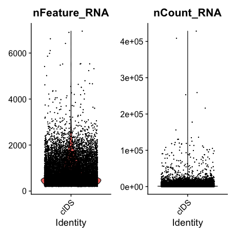
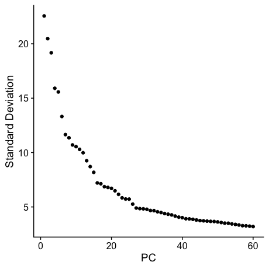
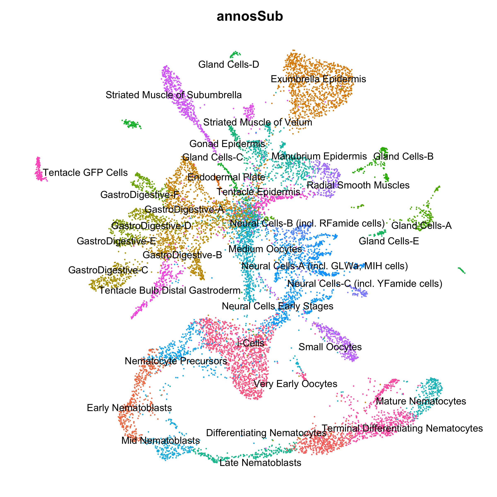
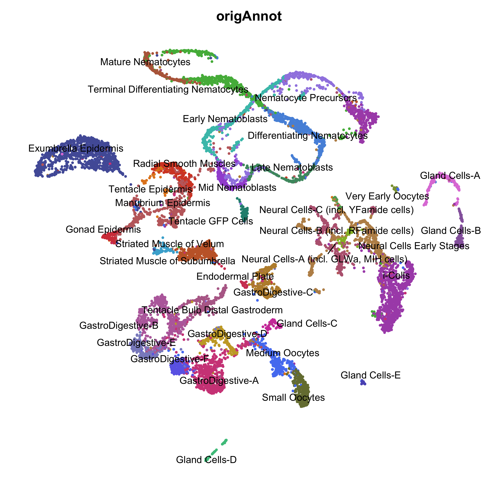
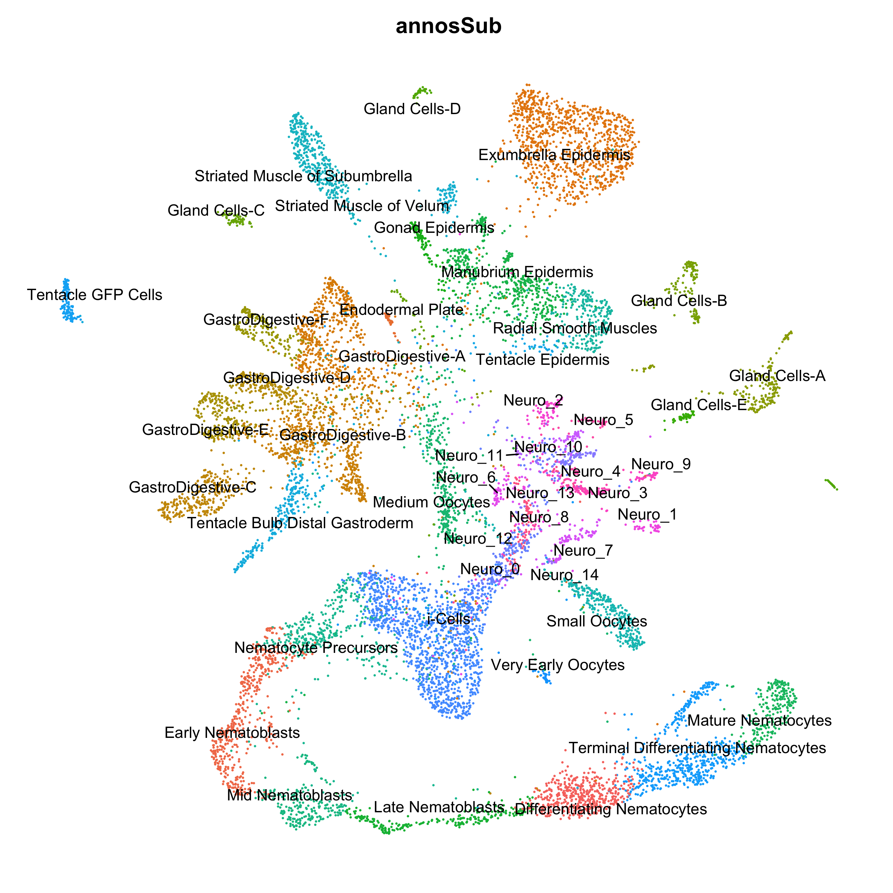
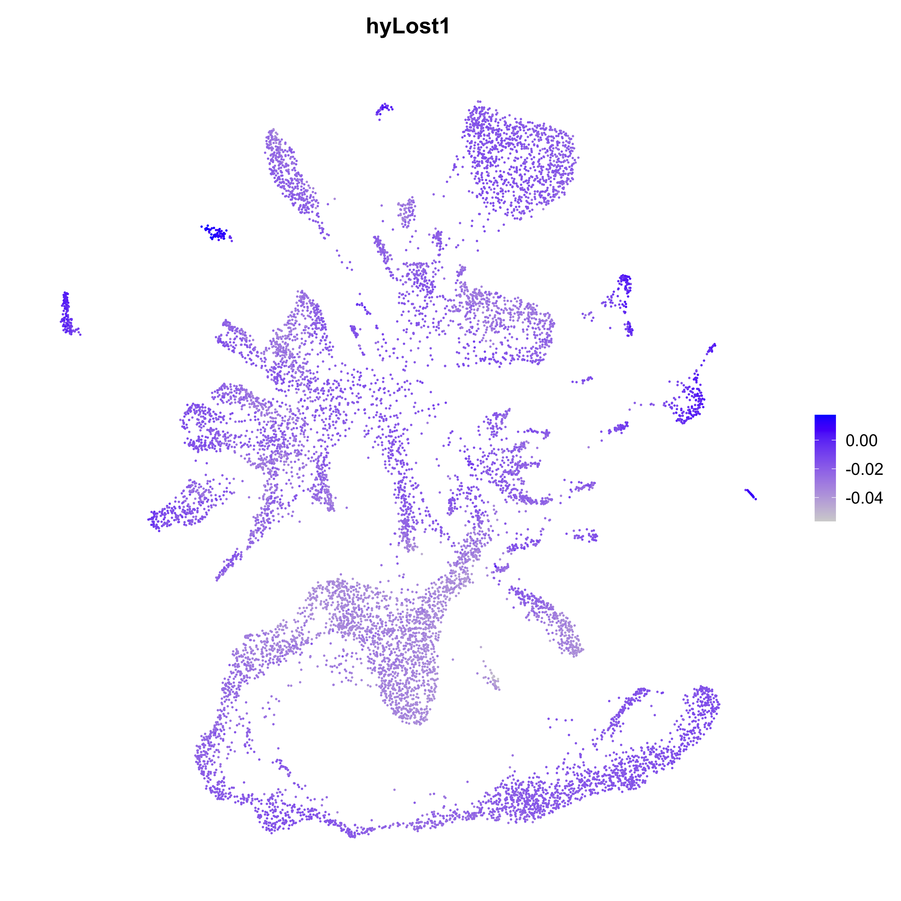
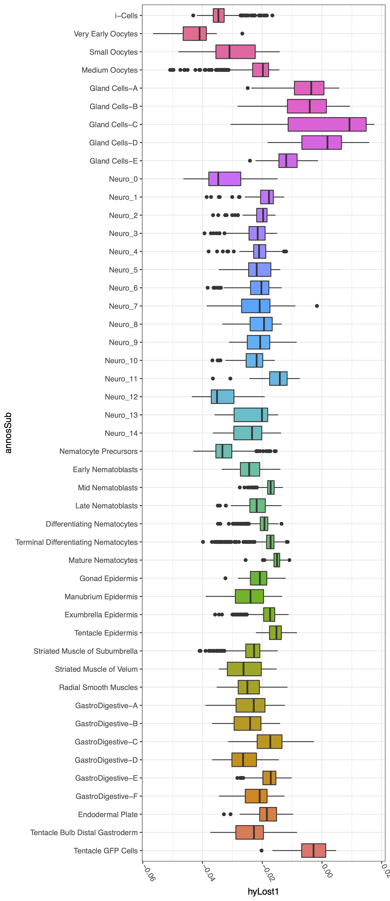

# Aligning and Processing *Clytia* Single Cell Data

This document covers our re-mapping of the *Clytia hemisphaerica* medusa single-cell atlas. This entailed generating a new set of gene models for the most recent *Clytia* genome assembly, mapping the raw reads to the new gene models, generating new cell-type clusters and UMAP plot, and visualizing the expression patterns of *Clytia* genes that were lost in the *Hydra* lineage. 

[TOC]

## Generating a New Set of *Clytia* Gene Models

The original *Clytia* single cell atlas publication created a new set of gene models for mapping their scRNA-seq data by generating a new de novo transcriptome using Trinity, merging those transcripts with transcripts from the original *Clytia* genome annotation, and then mapping the merged transcripts to the v1 *Clytia* genome with GMAP. However, we used an updated, more contiguous version of the *Clytia* genome for our whole-genome alignments (described in `07_genomeConservation.md`). Because we wanted to use the same *Clytia* reference genome throughout the study, this motivated us to use gene models for this updated assembly. Gene models are available for the updated genome, but they have relatively low BUSCO scores (81.1%). We wanted to combine multiple sources of gene predictions to try and maximize gene model completeness.  

To do this, we started with the Trinity transcriptome from the *Clytia* single-cell paper (called ``transcripts_TRINITY_20201021.fa`, downloaded [here](https://data.caltech.edu/records/1825)) and the v1 transcript models from the initial *Clytia* genome annotation (called `transcripts.fa`, downloaded [here](http://marimba.obs-vlfr.fr/downloads?field_download_organism_value=1)). We combined these two reference files:

```bash
cat transcripts.fa transcripts_TRINITY_20201021.fa > clytia.oldNames.fa

#fixing any duplicated IDs
seqkit rename clytia.oldNames.fa > clytia.fa
```

We then aligned the resulting fasta file to the updated *Clytia* genome (file renamed to `clytiaG.fa`, downloaded from [here](https://metazoa.ensembl.org/Clytia_hemisphaerica_gca902728285/Info/Index?db=core)) using PASA. This required that we first prep the sequence file using the PASA `seqclean` command:

(*01_newGenes/runCleanup.sh*)

```bash
#! /bin/bash -l
#SBATCH -p med
#SBATCH --job-name=pasaC
#SBATCH -c 1
#SBATCH -t 60-0
#SBATCH --mem=16G
#SBATCH --error=pasaC.err
#SBATCH --output=pasaC.out

module load singularity

singularity exec -B /home/jacazet/reference/makerAnnotations/aepAnnot/pasa/clPasaRedo \
        ~/pasa.sif /usr/local/src/PASApipeline/bin/seqclean clytia.fa
```

We then ran the standard PASA annotation pipeline:

(*01_newGenes/runPipeline.sh*)

```bash
#! /bin/bash -l
#SBATCH -p med
#SBATCH --job-name=pasaP
#SBATCH -c 24
#SBATCH -t 60-0
#SBATCH --mem=0
#SBATCH --error=pasaP.err
#SBATCH --output=pasaP.out

module load singularity

singularity exec -B /home/jacazet/reference/makerAnnotations/aepAnnot/pasa/clPasaRedo \
        ~/pasa.sif /usr/local/src/PASApipeline/Launch_PASA_pipeline.pl \
        -c alignAssembly.config -C -R --CPU 12 \
        --ALIGNER gmap,blat -g clytiaG.fa -t clytia.fa.clean \
        -T -u clytia.fa --TRANSDECODER \
        -d
```

The PASA pipeline mainly just aligned the transcripts we provided to the genome and tried to resolve those aligned transcripts into model 'assemblies' of transcribed regions across the genome. To get candidate ORFs from these assemblies we ran the following command:

(*01_newGenes/runCDS.sh*)

```bash
#! /bin/bash -l
#SBATCH -p med
#SBATCH --job-name=cds
#SBATCH -c 1
#SBATCH -t 60-0
#SBATCH --mem=8G
#SBATCH --error=cds.err
#SBATCH --output=cds.out

module load singularity

singularity exec -B /home/jacazet/reference/makerAnnotations/aepAnnot/pasa/clPasaRedo \
        ~/pasa.sif /usr/local/src/PASApipeline/scripts/pasa_asmbls_to_training_set.dbi \
        --pasa_transcripts_fasta clPasa.sqlite.assemblies.fasta \
        --pasa_transcripts_gff3 clPasa.sqlite.pasa_assemblies.gff3
```

The output from this step was a bit messy. The problem appeared to arise from the fact that in some cases PASA predicted multiple overlapping ORFs from a single assembly, and instead of treating them like different isoforms of the same gene, labeled them as separate genes in the gff. These resulted in cases where two genes would have the same root name, but with different suffixes (e.g., asmbl_100.p1 and asmbl_100.p2). For the sake of simplicity, we just wanted to collapse these alternate ORFs into a single gene with a single unique identifier. 

We attempted to clean up this problem using AGAT:

```bash
#fix any general GFF3 formating issues
agat_convert_sp_gxf2gxf.pl -gvi 3 -gvo 3 -g clPasa.sqlite.assemblies.fasta.transdecoder.genome.gff3 -o clPasa.gff3

#this is meant to merge genes with overlapping CDS into a single gene with multiple isoforms
agat_sp_fix_overlaping_genes.pl -f clPasa.gff3 -o clPasa.merge.gff3

#Remove any secondary isoforms for each gene
agat_sp_keep_longest_isoform.pl --gff clPasa.merge.gff3 -o clPasa.merge.longestIso.gff3
```

However, we found that this approach didn't work very well and still left us with multiple redundant, overlapping genes. We therefore created a custom R script to address the issue:

(*01_newGenes/pasaGffFix.R*)

```R
library(rstudioapi)

setwd(dirname(rstudioapi::getActiveDocumentContext()$path))

inGff <- read.delim('clPasa.merge.longestIso.gff3',sep = '\t', header = F, skip = 1)

#pull out the root assembly ID (and isoform number) for each gene model
inGff$aID <- gsub('.*(asmbl_\\d+[.]p\\d+).*','\\1',inGff$V9)

#make a new object, where we'll find the problematic overlapping genes
idProb <- inGff[inGff$V3 == 'gene',]

#drop the p# isoform suffix
idProb$aIDsub <- gsub('[.]p\\d+','',idProb$aID)

#find all cases where an assembly name is duplicated
idProb <- idProb[idProb$aIDsub %in% idProb[duplicated(idProb$aIDsub),'aIDsub'],]

#for all assembly #'s that are duplicated, calculate the total
#length of coding sequence for each isoform 
idProb$len <- vapply(idProb$aID, function(x) {
  codRow <- inGff[inGff$aID == x & inGff$V3 == 'CDS',4:5]
  codRow$len <- codRow$V5 - codRow$V4
  return(sum(codRow$len))
},numeric(1))

#break up DF into sub DFs grouped by assembly #
idProb.list <- split(idProb,idProb$aIDsub)

#flag any isoform that isn't the longest for that assembly #
idProb.list <- lapply(idProb.list, function(x){
  x$drop <- (x$len != max(x$len)) | (x$len == 0)
  return(x)
})

#sometimes there are ties, so just arbitrarily pick
#one of the longest ones to keep
idProb.list <- lapply(idProb.list, function(x){
  if(length(which(x$drop == F)) > 1){
    x <- x[order(-x$len),]
    x$drop <- T
    x$drop[1] <- F
  }
  return(x)
})

idProb.df <- do.call(rbind,idProb.list)

#get the ID for all isoforms that we'll be dropping
dropThese <- idProb.df[idProb.df$drop,'aID']

#remove all redundant isoform rows
inGff <- inGff[!(inGff$aID %in% dropThese),]

write.table(inGff[,c(1:9)],file = 'clPasa.merge.longestIso.lr.gff3',sep = '\t',quote = F, row.names = F, col.names = F)

```

Finally, we also brought in the publicly available gene models for the updated assembly (called `Clytia_hemisphaerica_gca902728285.GCA902728285v1.51.gff3`, available [here](https://metazoa.ensembl.org/Clytia_hemisphaerica_gca902728285/Info/Index?db=core)) to try and maximize the completeness of our hybrid gene models. 

```bash
cat Clytia_hemisphaerica_gca902728285.GCA902728285v1.51.gff3 clPasa.merge.longestIso.lr.gff3 > clFinal.gff3
agat_sp_fix_overlaping_genes.pl -f clFinal.gff3 -o clFinal.merge.gff3
agat_sp_keep_longest_isoform.pl --gff clFinal.merge.gff3 -o clFinal.merge.longestIso.gff3

#drop comment/metadata lines
sed '/^##/d;/^#!/d' clFinal.merge.longestIso.gff3 > clFinal.merge.longestIso.rfmt.gff3

#give all linked features a shared tag (gene_id)
agat_sq_add_locus_tag.pl --li "ID" -p "gene" --lo "gene_id" --of 3 --gff clFinal.merge.longestIso.rfmt.gff3 -o clFinal.merge.longestIso.rfmt.tag.gff3

#covert to gtf from gff3
agat_convert_sp_gxf2gxf.pl -c 'gene_id' -g clFinal.merge.longestIso.rfmt.tag.gff3 --gvi 3 --gvo 2.5 -o clFinal.merge.longestIso.rfmt.tag.gtf
```

We then used a custom R script to drop non-coding features from the merged gtf file (mainly from the Ensembl GFF) and simplify the gene names:

(*01_newGenes/clGffFix.R*)

```R
library(rstudioapi)

setwd(dirname(rstudioapi::getActiveDocumentContext()$path))

inGff <- read.delim('clFinal.merge.longestIso.rfmt.tag.gtf',sep = '\t', header = F, skip = 1)

#drop non-coding gene entries
inGff <- inGff[inGff$V3 != 'region',]
inGff <- inGff[inGff$V3 != 'tRNA',]
inGff <- inGff[inGff$V3 != 'ncRNA_gene',]

#give the gene ID a simpler format
inGff$gID <- gsub('.*gene_id ([^;]*).*','\\1',inGff$V9)

inGff$gID <- gsub('GENE.(.*)~~.*','\\1',inGff$gID)
inGff$gID <- gsub('gene:','',inGff$gID)

inGff$gID <- gsub(' +$','',inGff$gID)

inGff <- inGff[!grepl('rank \\d+$',inGff$gID),]

inGff <- inGff[inGff$V3 %in% c('gene','mRNA','exon','CDS','five_prime_UTR','three_prime_UTR'),]


inGff$gID <- paste0('gene_id "',inGff$gID,'" ; gene_name "',inGff$gID,'" ; transcript_id "',inGff$gID,'" ; transcript_name "',inGff$gID,'"')

write.table(inGff[,c(1:8,10)],file = 'clFinal.merge.longestIso.rename.gtf',sep = '\t',quote = F, row.names = F, col.names = F)
```

We then exported the transcript and protein sequences from these gene models:

```bash
gffread -y clFinal.longestIso.prot.fa -g clytiaG.fa clFinal.merge.longestIso.rename.gtf
gffread -w clFinal.longestIso.tran.fa -g clytiaG.fa clFinal.merge.longestIso.rename.gtf
```

The resulting BUSCO stats of these gene models were pretty good, about 6% more complete BUSCOs than the currently available gene models for the updated genome:

```bash
	--------------------------------------------------
	|Results from dataset metazoa_odb10               |
	--------------------------------------------------
	|C:87.0%[S:83.0%,D:4.0%],F:3.1%,M:9.9%,n:954      |
	|830	Complete BUSCOs (C)                       |
	|792	Complete and single-copy BUSCOs (S)       |
	|38	Complete and duplicated BUSCOs (D)        |
	|30	Fragmented BUSCOs (F)                     |
	|94	Missing BUSCOs (M)                        |
	|954	Total BUSCO groups searched               |
```

## Mapping scRNA-seq Data to the Updated Clytia Genome

As we did for our *H. vulgaris* scRNA-seq analysis, we opted to use transcripome sequence for mapping the scRNA-seq data. This required that we prep a modified gtf file for the mapping pipeline (this file treat each transcript in the transcriptome as a contig that has a single gene on it that spans the entire sequence). We did this with the following R script:

(*02_remapping/makeTranGtf.R*)

```R
library(rstudioapi)
library(Biostrings)
library(plyr)

setwd(dirname(rstudioapi::getActiveDocumentContext()$path))

tranSeq <- readDNAStringSet('clFinal.longestIso.tran.fa')

tranSeq.dim <- data.frame(ID = names(tranSeq), length = nchar(tranSeq))

tranSeq.dim$ID <- gsub(' .*','',tranSeq.dim$ID)

inGtf <- read.delim('clFinal.merge.longestIso.rename.gtf',header = F, skip = 1)

inGtf <- inGtf[inGtf$V3 == 'mRNA',]

inGtf$V1 <- gsub('.*gene_id ([^ ]+).*','\\1',inGtf$V9)

inGtf$V5 <- mapvalues(inGtf$V1, from = tranSeq.dim$ID, to = tranSeq.dim$length)

inGtf$V4 <- 1

inGtf$V7 <- '+'

inGtf$V3 <- 'exon'

inGtf$new9 <- inGtf$V9


inGtf$new9 <- gsub('([^;]) ([^;])','\\1 "\\2',inGtf$new9)
inGtf$new9 <- gsub(' ;','" ;',inGtf$new9)
inGtf$new9 <- gsub(' $','"',inGtf$new9)

inGtf$V9 <- inGtf$new9

write.table(inGtf[,1:9], file = 'clFinal.transcriptome.gtf', row.names = F, col.names = F, quote = F, sep = '\t')
```

For mapping, we used the cell ranger pipeline (v6.0.2). First, we prepped the reference metadata prior to running the actual mapping pipeline:

(*02_remapping/runMakeRef.sh*)

```Bash
#! /bin/bash
#SBATCH -p med
#SBATCH --job-name=cRanger
#SBATCH -c 1
#SBATCH -t 60-0
#SBATCH --mem=16G
#SBATCH --error=cRanger_mkref.err
#SBATCH --output=cRanger_mkref.out

cellranger-6.0.2/cellranger mkref --genome=clytiaTran --fasta=clFinal.longestIso.tran.fa --genes=clFinal.transcriptome.gtf
```

The *Clytia* data was sequenced over two lanes, and each lane needed to be initially mapped separately. Lane 1 was comprised of samples FT-SA16888 ([read1](https://data.caltech.edu/records/1840) and [read2](https://data.caltech.edu/records/1841)), FT-SA16889 ([read1](https://data.caltech.edu/records/1842) and [read2](https://data.caltech.edu/records/1843)), FT-SA16890 ([read1](https://data.caltech.edu/records/1844) and [read2](https://data.caltech.edu/records/1845)), and FT-SA16891 ([read1](https://data.caltech.edu/records/1846) and [read2](https://data.caltech.edu/records/1847)) and lane 2 was comprised of samples FT-SA16892 ([read1](https://data.caltech.edu/records/1848) and [read2](https://data.caltech.edu/records/1849)), FT-SA16893 ([read1](https://data.caltech.edu/records/1850) and [read2](https://data.caltech.edu/records/1851)), FT-SA16894 ([read1](https://data.caltech.edu/records/1852) and [read2](https://data.caltech.edu/records/1853)), and FT-SA16895 ([read1](https://data.caltech.edu/records/1854) and [read2](https://data.caltech.edu/records/1855)). 

We used this script to map lane 1 reads:

(*02_remapping/runCount1.sh*)

```bash
#!/bin/bash -l
#SBATCH --job-name=clCount1
#SBATCH -p bigmemm
#SBATCH -c 8
#SBATCH -t 60-0
#SBATCH --mem=64G
#SBATCH --error=clCount_1.err
#SBATCH --output=clCount_1.out

cellranger-6.0.2/cellranger count \
        --id=lane1 \
        --fastqs=raw/lane1 \
        --transcriptome=clytiaTran \
        --sample=FT-SA16888,FT-SA16889,FT-SA16890,FT-SA16891 \
        --chemistry=SC3Pv2 \
        --localcores=8 \
        --localmem=64
```

And this script to map lane 2 reads:

(*02_remapping/runCount2.sh*)

```bash
#!/bin/bash -l
#SBATCH --job-name=clCount2
#SBATCH -p bigmemm
#SBATCH -c 8
#SBATCH -t 60-0
#SBATCH --mem=64G
#SBATCH --error=clCount_2.err
#SBATCH --output=clCount_2.out

cellranger-6.0.2/cellranger count \
        --id=lane2 \
        --fastqs=raw/lane2 \
        --transcriptome=clytiaTran \
        --sample=FT-SA16892,FT-SA16893,FT-SA16894,FT-SA16895 \
        --chemistry=SC3Pv2 \
        --localcores=8 \
        --localmem=64
```

To pool the samples after mapping, we prepared the file `aggr.csv`, which included the paths to the read counts produced by the initial mapping steps:

(*02_remapping/aggr.csv*)

```bash
sample_id,molecule_h5
lane1,lane1/outs/molecule_info.h5
lane2,lane2/outs/molecule_info.h5
```

We then aggregated the single cell expression matrices

(*02_remapping/runAggr.sh*)

```bash
#!/bin/bash
#SBATCH --job-name=aggr
#SBATCH -p bigmemm 
#SBATCH -c 1
#SBATCH -t 60-0
#SBATCH --mem=16G
#SBATCH --error=aggr.err
#SBATCH --output=aggr.out

cellranger-6.0.2/cellranger aggr \
        --id=clAggr \
        --csv=aggr.csv \
        --normalize=none \
        --nosecondary
```

This produced the file `raw_feature_bc_matrix.h5` containing the gene-by-cell read count matrix that was used for subsequent analyses.

## Initial Clustering Analysis

In the original *Clytia* scRNA-seq publication, the authors conducted an extensive analysis to identify and exclude low quality cells. We opted to reuse the results from that analysis by simply retaining the cells that were present in the processed dataset from the original publication (available [here](https://data.caltech.edu/records/1797)) in our re-mapped data. After dropping the previously identified problematic cells, we initialized a Seurat object and performed some additional filtering:

(*snippet from 03_clustering/initClRemapSeurat.R*)

```R
library(Seurat)
library(SeuratDisk)
library(plyr)
library(tidyverse)
library(rstudioapi)
library(glmGamPoi)
library(plotly)
library(RColorBrewer)
library(reticulate)
library(Matrix)

setwd(dirname(getActiveDocumentContext()$path))

#convert annData object from Clytia scRNA-seq publication to make it easier to import into Seurat
#only need to run once
#Convert("bus_fs_combo_raw.h5ad", dest = "h5seurat", overwrite = TRUE)

#load clustering analysis object from Clytia scRNA-seq paper
clPP <- LoadH5Seurat('bus_fs_combo_raw.h5seurat')

#import newly mapped Clytia gene expression matrix
inMat <- Read10X_h5('raw_feature_bc_matrix.h5')

#drop any cell IDs that aren't in the published clustering data object
inMat <- inMat[,colnames(inMat) %in% rownames(clPP@meta.data)]

#create seurat object
#drop genes expressed in fewer than 3 cells and cells with fewer than 200 genes
cl <- CreateSeuratObject(counts = inMat, project = 'clDS', min.cells = 3, min.features = 200)

VlnPlot(cl, features = c("nFeature_RNA", "nCount_RNA"))
```



 Based on this distribution we dropped cells with more than 4000 UMIs, 500 or fewer reads, or greater than 100000 reads.

(*snippet from 03_clustering/initClRemapSeurat.R*)

```R
cl <- subset(cl, nFeature_RNA < 4000 & nCount_RNA > 500 & nCount_RNA < 100000)
```

We then ran the standard normalization, clustering, and plotting steps

(*snippet from 03_clustering/initClRemapSeurat.R*)

```R
cl <- SCTransform(cl, method = "glmGamPoi")

cl <- RunPCA(cl, npcs = 60, verbose = FALSE)

ElbowPlot(cl,ndims = 60)
```



We used 45 PCs for clustering and plotting:

(*snippet from 03_clustering/initClRemapSeurat.R*)

```R
cl <- RunUMAP(cl, dims = 1:45, min.dist = 0.38,verbose = FALSE, seed.use = 12345)

cl <- FindNeighbors(cl, dims = 1:45, verbose = FALSE)
cl <- FindClusters(cl, resolution = 0.5, verbose = FALSE)

saveRDS(cl,file = 'initSeurat.rds')

DimPlot(cl) + NoLegend()
```


We wanted to validate that our re-mapping and re-clustering recapitulated the results from the original atlas publication, so we imported the fully processed and annotated single cell data from the original publication (available [here](https://data.caltech.edu/records/1796)) and converted it to a Seurat object (easier to work with in R, the initial analysis was done in Python).

(*snippet from 03_clustering/initClRemapSeurat.R*)

```R
use_condaenv("rScanpy", required = T)

sc <- import("scanpy")

adata <- sc$read_h5ad('fedStarved_withUMAPPaga.h5ad')

exprs <- t(adata$X)
colnames(exprs) <- adata$obs_names$to_list()
rownames(exprs) <- adata$var_names$to_list()
# Create the clPP object
clPP <- CreateSeuratObject(exprs)
# Set the expression assay
clPP <- SetAssayData(clPP, "data", exprs)
# Add observation metadata
clPP <- AddMetaData(clPP, adata$obs)
# Add embedding
embedding <- adata$obsm["X_umap"]
rownames(embedding) <- adata$obs_names$to_list()
colnames(embedding) <- c("umap_1", "umap_2")
clPP[["umap"]] <- CreateDimReducObject(embedding, key = "umap_")

#save reformatted object for use later
saveRDS(clPP,'annotatedCl.rds')

DimPlot(clPP,group.by = 'annosSub', label = T, repel = T) + NoLegend() + NoAxes()
```



We propagated the cell cluster labels from the original publication clusters to our newly clustered data

(*snippet from 03_clustering/initClRemapSeurat.R*)

```R
cl@meta.data$origAnnot <- mapvalues(rownames(cl@meta.data), from=rownames(clPP@meta.data), to = as.character(clPP@meta.data$annosSub), warn_missing = F)

set.seed(12345)
umapPal <- sample(c("#b76749","#6d6be8","#94b92c","#a358d6","#52b648","#cf43a8",
                    "#4ac38b","#ab52b7","#59a85a","#5c58c0","#c9a72e","#5581f2",
                    "#e28624","#5693dd","#d6482c","#45c1b8","#d44248","#47afd4",
                    "#c56633","#a187e3","#8b9e41","#df82da","#4c976f","#d14a87",
                    "#238e7e","#d24461","#767d3e","#525ea7","#bc8d39","#9565ab",
                    "#bc8f57","#8b8dc7","#c26b6c","#b96daa","#b96580","#b66c96"))

DimPlot(cl,group.by = 'origAnnot', label = T,repel = T,cols = umapPal,pt.size=0.8) + NoLegend() + NoAxes()
```



The previous cell type labels largely recapitulated our own clustering results, indicating that our analysis effectively recapitulated the results from the original publication, validating our approach. 

## Visualizing Expression of Genes Lost in *Hydra*

The *Hydra* genus is notable for it's simplified life cycle, lacking the planula and medusa stages found in other hydrozoans such as *Clytia*. This has been correlated with substantial gene loss in the *Hydra* lineage, but the function of these lost genes is not well understood. We combined our Orthofinder analysis (described in `03_aepGenomeAnnotation.md`) with the *Clytia* medusa single-cell atlas to determine where genes lost in *Hydra* are expressed.

We first identified genes that were lost in the *Hydra* genus. We identified such genes using two criteria: 1) the genes needed to be absent from all *Hydra* proteomes in our OrthoFinder analysis (*H. viridissima*, *H. circumcincta*, *H. oligactis*, *H. vulgaris* strain 105, and *H. vulgaris* strain AEP), and 2) the genes needed to be present in both the *Hydractinia echinata* and *Clytia hemispherica* proteomes.

(*snippet from 04_geneLoss/geneLoss.R*)

```R
library(rstudioapi)
library(Seurat)
library(plyr)
library(patchwork)
library(ggplot2)
library(reticulate)

setwd(dirname(getActiveDocumentContext()$path))

#import orthologs resolved at the level of hydrozoa
hydTab <- read.delim('Results_Sep15_1/Phylogenetic_Hierarchical_Orthogroups/N10Mod.tsv')

#drop any empty columns (species not in clade) 
hydTab <- hydTab[,!is.na(hydTab[1,])]

#drop AEP transcriptome (redundant)
hydTab <- hydTab[,-14]

#because cruxmelitensis has duplicated gene IDs we need to drop it from this analysis
hydTab <- hydTab[,-5]

#look just at orthologs within Hydra genus
hydraSpec <- c('H_circumcincta','H_oligactis','H_viridissima','H_vulgaris105','H_vulgarisAEP')

hydTab.hyd <- hydTab[,hydraSpec]

#find orthogroups that are completely absent from Hydra genus
hydTab.hyd.test <- apply(hydTab.hyd,1,function(x) length(which(x != "")) > 0)

hydTab.lost <- hydTab[!hydTab.hyd.test,]

#make sure the genes lost in Hydra are present in other hydrozoans (more than one)

hydTab.lost <- hydTab.lost[hydTab.lost$H_echinata != '' |
                             hydTab.lost$C_hemisphaerica != '',]

#specifically look at things lost in Hydra but retained in clytia

hydTab.lost.cl <- hydTab.lost[hydTab.lost$C_hemisphaerica != '',]

hydTab.lost.cl <- unlist(strsplit(hydTab.lost.cl$C_hemisphaerica, split = ", "))

write.table(hydTab.lost.cl,'clytiaLostInHydra.txt',row.names = F, col.names = F, quote = F)
```

After we generated our list of lost genes, we wanted to determine where they were expressed in *Clytia* medusae. Because we used our new *Clytia* gene models for the Orthofinder analysis, we needed to use our re-mapped version of the *Clytia* atlas, but we also wanted to make use of the original atlas publication's UMAP and cell type annotations. To do this, we incorporated the UMAP and cluster annotations from the original publication into our re-mapped Seurat object. To have a more resolved view of the neuronal subpopulation, we also incorporated the cluster annotations from the neuronal sub-clustering analysis in the original publication (downloaded [here](https://data.caltech.edu/records/1804)).

(*snippet from 04_geneLoss/geneLoss.R*)

```R
####Lost Hydra gene expression in Clytia####

#import remapped clytia single cell data
cl <- readRDS('../ds/cl/remap/initSeurat.rds')

#convert neuronal subclustering object from clytia paper into seurat object
#only needs to be run once
use_condaenv("rScanpy", required = T)

sc <- import("scanpy")

adata <- sc$read_h5ad('../cl/remap/neuron_subpops_fs.h5ad')

exprs <- t(adata$X)
colnames(exprs) <- adata$obs_names$to_list()
rownames(exprs) <- adata$var_names$to_list()
# Create the Seurat object
seurat <- CreateSeuratObject(exprs)
# Set the expression assay
seurat <- SetAssayData(seurat, "data", exprs)
# Add observation metadata
seurat <- AddMetaData(seurat, adata$obs)
# Add embedding
embedding <- adata$obsm["X_umap"]
rownames(embedding) <- adata$obs_names$to_list()
colnames(embedding) <- c("umap_1", "umap_2")
seurat[["umap"]] <- CreateDimReducObject(embedding, key = "umap_")

#save converted object to save time later
saveRDS(seurat,'annotatedNeuroCl.rds')

#import annotations from preprint (also use their umap)
cl.annot <- readRDS('../ds/cl/remap/annotatedCl.rds')

cl.neuro <- readRDS('annotatedNeuroCl.rds')

#save the publication UMAP coords
cl.umap <- cl.annot@reductions$umap

#save publication metadata (includes cell identities)
cl.annot <- cl.annot@meta.data

#drop any cells not in the remapped dataset
cl.annot <- cl.annot[rownames(cl.annot) %in% colnames(cl),]

#make sure cell order is the same
cl.annot <- cl.annot[match(rownames(cl.annot),colnames(cl)),]

#only keep the cell annotations from the publication metadata
cl.annot <- cl.annot[,c('annos','annosSub')]

#drop whole-animal annotations of neuronal cells
cl.annot <- cl.annot[!(rownames(cl.annot) %in% colnames(cl.neuro)),]

#extract neuronal analysis metadata
cl.annot.n <- cl.neuro@meta.data

#drop any cells not in the remapped dataset
cl.annot.n <- cl.annot.n[rownames(cl.annot.n) %in% colnames(cl),]

cl.annot.n.rn <- rownames(cl.annot.n)

#subset metadata to just include neuron cell identities
cl.annot.n <- data.frame(annos='Neuron',annosSub=paste0('Neuro_',cl.annot.n$louvain_neur))

rownames(cl.annot.n) <- cl.annot.n.rn

#combine neuronal and whole-animal annotations
cl.annot <- rbind(cl.annot,cl.annot.n)

#make sure cell order in the new metadata table is the same as the seurat object 
cl.annot <- cl.annot[colnames(cl),]

#add cell type annotations to remapped dataset
cl@meta.data <- cbind(cl@meta.data,cl.annot[,c('annos','annosSub')])

#add publication umap to remapped data
cl@reductions$oldUmap <- cl.umap

DimPlot(cl,group.by='annosSub',reduction = 'oldUmap',label=T,repel = T) + NoLegend() + NoAxes()
ggsave('fullLabClUMAP.png',width = 9,height = 9,dpi = 300)
```



We then passed the list of genes lost in *Hydra* to the Seurat `AddModuleScore` function to calculate a holistic score representing how highly these lost genes are expressed in each *Clytia* cell transcritome.

(*snippet from 04_geneLoss/geneLoss.R*)

```R
#convert underscores to dash for gene names (seurat formatting requirement)
hydTab.lost.cl.ds <- gsub('_','-',hydTab.lost.cl)

#drop genes that aren't in clytia seurat object
hydTab.lost.cl.ds <- hydTab.lost.cl.ds[hydTab.lost.cl.ds %in% rownames(cl)]

#calculate holistic score for expression of lost genes
cl <- AddModuleScore(cl,list(hydTab.lost.cl.ds),name='hyLost')

FeaturePlot(cl,'hyLost1',reduction = 'oldUmap') + NoAxes()
ggsave('clLostGeneScores.png',width = 9,height = 9,dpi = 300)
```



To more clearly visualize how the lost gene module score varied across different cell types, we also generated a box plot that grouped module scores by cell type.

(*snippet from 04_geneLoss/geneLoss.R*)

```R
lostPlot <- cl@meta.data[,c(9,10)]

lostPlot$annosSub <- factor(lostPlot$annosSub,
                            levels = rev(c("i-Cells","Very Early Oocytes","Small Oocytes",
                                           "Medium Oocytes","Gland Cells-A","Gland Cells-B",
                                           "Gland Cells-C","Gland Cells-D","Gland Cells-E",
                                           "Neuro_0","Neuro_1","Neuro_2","Neuro_3","Neuro_4",
                                           "Neuro_5","Neuro_6","Neuro_7","Neuro_8","Neuro_9",
                                           "Neuro_10","Neuro_11","Neuro_12","Neuro_13","Neuro_14",
                                           "Nematocyte Precursors","Early Nematoblasts",
                                           "Mid Nematoblasts","Late Nematoblasts","Differentiating Nematocytes",
                                           "Terminal Differentiating Nematocytes","Mature Nematocytes",
                                           "Gonad Epidermis","Manubrium Epidermis","Exumbrella Epidermis",
                                           "Tentacle Epidermis","Striated Muscle of Subumbrella","Striated Muscle of Velum",
                                           "Radial Smooth Muscles","GastroDigestive-A","GastroDigestive-B",
                                           "GastroDigestive-C","GastroDigestive-D","GastroDigestive-E",
                                           "GastroDigestive-F","Endodermal Plate","Tentacle Bulb Distal Gastroderm",
                                           "Tentacle GFP Cells")))

ggplot(lostPlot,aes(y=annosSub,x=hyLost1,fill=annosSub)) + 
  geom_boxplot() + 
  #geom_jitter(height = 0, width = 0.1, size = 0.1,alpha=0.4) +
  theme_bw() +
  theme(legend.position="none") +
  theme(axis.text.x = element_text(angle = 300, vjust = 0, hjust=0.05))
ggsave('lostScores.pdf',width = 6.5,height = 15)
```




## Files Associated with This Document


```
11_clytiaAtlasReMap/
├── 01_newGenes
│   ├── clFinal.longestIso.prot.fa
				Fasta file containing the Clytia hemisphaerica protein models generated 
				in this study by combining previously released Clytia trancritpomes and 
				gene models.
│   ├── clFinal.longestIso.tran.fa
				Fasta file containing the Clytia hemisphaerica transcript models generated 
				in this study by combining previously released Clytia trancritpomes and 
				gene models.
│   ├── clFinal.merge.longestIso.rename.gtf
				GTF coordinate file containing the finalized Clytia gene models generated 
				in this study.
│   ├── clFinal.merge.longestIso.rfmt.tag.gtf
				GTF coordinate file containing an intermediate version of the Clytia gene
				models generated in this study. This version merges the Ensembl Clytia 
				gene models with the reformated PASA annotations from 
				clPasa.merge.longestIso.lr.gff3.
│   ├── clGffFix.R
				R script that drops non-coding genes and simplifies gene ID formating in
				clFinal.merge.longestIso.rfmt.tag.gtf to generate 
				clFinal.merge.longestIso.rename.gtf.
│   ├── clPasa.merge.longestIso.gff3
				GFF3 coordinate file containing an intermediate version of the Clytia gene
				models generated in this study. This version contains the PASA-derived
				gene models generated by using both the v1 Clytia gene models and the
				Trinity transcriptome from the original Clytia atlas publication.
│   ├── clPasa.merge.longestIso.lr.gff3
				GFF3 coordinate file containing an intermediate version of the Clytia gene
				models generated in this study. It has additionally been processed to have 
				low redundancy by removing overlapping gene models that were present in the 
				initial PASA output.
│   ├── clPasa.sqlite.assemblies.fasta
				FASTA file containing PASA-derived predictions of transcript assembly
				sequences in the Clytia genome generated using both the v1 Clytia gene
				models and the Trinity transcriptome from the original Clytia atlas
				publication.
│   ├── clPasa.sqlite.assemblies.fasta.transdecoder.genome.gff3
				GFF3 coordinate file containing the PASA-derived gene models for the Clytia
				genome. Following the standard PASA-pipeline, this version of the gene models
				were additionally processed using transdecoder to identify ORFs in each 
				predicted transcript sequence.
│   ├── clPasa.sqlite.pasa_assemblies.gff3
				GFF3 coordinate file containing the PASA-derived gene models for the Clytia
				genome.
│   ├── clytia.fa
				Fasta file containing combined transcript sequences from both the v1 Clytia
				genome gene models and the Trinity transcriptome generated as part of the
				original Clytia atlas publication. The fasta headers in this file have
				been processed to fix any duplicated sequence IDs.
│   ├── pasaGffFix.R
				R script that collapses multiple overlapping ORF predictions in the PASA-
				generated gene models into the single longest isoform for each gene.
│   ├── runCDS.sh
				Shell script that uses a PASA utility script to predict ORFs in the PASA
				transcript assemblies generated by runPipeline.sh.
│   ├── runCleanup.sh
				Shell script that preps clytia.fa for the PASA genome alignment pipeline.
│   └── runPipeline.sh
				Shell script that uses the PASA pipeline to align clytia.fa to the Clytia
				genome and generate transcript/gene models.
├── 02_remapping
│   ├── aggr.csv
				Config file used by runAggr.sh to combine the read counts from the lane 1
				and lane 2 Clytia 10X libraries.
│   ├── clFinal.transcriptome.gtf
				GTF coordinate file for the Clytia transcriptome (clFinal.longestIso.tran.fa). 
				Simply lists each transcript as its own contig, spanned by a single gene 
				(named after the transcript).
│   ├── makeTranGtf.R
				R script used to generate clFinal.transcriptome.gtf from 
				clFinal.merge.longestIso.rename.gtf.
│   ├── raw_feature_bc_matrix.h5
				H5 binary file containing the digital gene expression matrix for the Clytia
				single-cell atlas aligned to the transcripts in clFinal.longestIso.tran.fa.
│   ├── runAggr.sh
				Shell script that combines the digital gene expression matrices calculated
				for each lane of sequencing for the Clytia atlas into a final pooled matrix
				(raw_feature_bc_matrix.h5).
│   ├── runCount1.sh
				Shell script that uses the cellranger pipeline to align and process the 
				Clytia 10X reads from lane 1 to the clFinal.longestIso.tran.fa transcriptome.
│   ├── runCount2.sh
				Shell script that uses the cellranger pipeline to align and process the 
				Clytia 10X reads from lane 2 to the clFinal.longestIso.tran.fa transcriptome.
│   └── runMakeRef.sh
				Shell script that preps the clFinal.longestIso.tran.fa transcriptome for 
				the cellranger mapping pipeline.
├── 03_clustering
│   ├── annotatedCl.rds
				R binary file containing a Seurat-formatted version of the fully annotated
				Clytia atlas from the original publication.
│   ├── bus_fs_combo_raw.h5seurat
				H5 binary file containing a Seurat-formatted version of the raw, un-annotated
				Clytia atlas from the original publication.
│   ├── initClRemapSeurat.R
				R script that performs the initial clustering and visualization of the re-
				mapped version of the Clytia single cell atlas and compares the results
				to the annotations from the original atlas publication.
│   └── initSeurat.rds
				R binary file containing a Seurat object with the clustered and annotated
				version of the Clytia atlas that was aligned to the clFinal.longestIso.tran.fa 
				transcriptome.
└── 04_geneLoss
    ├── annotatedNeuroCl.rds
    		R binary file containing a Seurat-formatted version of the annotated neuronal
    		subclustering analysis from the original Clytia atlas publication.
    ├── clytiaLostInHydra.txt
    		Text file listing the IDs of Clytia genes that have been lost in the Hydra lineage.
    ├── geneLoss.R
    		R script that identifies Clytia genes that have been lost in the Hydra lineage and
    		then characterizes trends in the expression patterns of those lost genes in the Clytia
    		single-cell atlas.
    └── neuroLabGeneLossCl.rds
    		R binary file containing an updated version of initSeurat.rds that incorporates neuronal
    		subtype annotations from annotatedNeuroCl.rds. The Seurat object also contains a metadata
    		column with a module score that represents how highly each cell expresses the set of Clytia
    		genes lost in the Hydra lineage.
```

