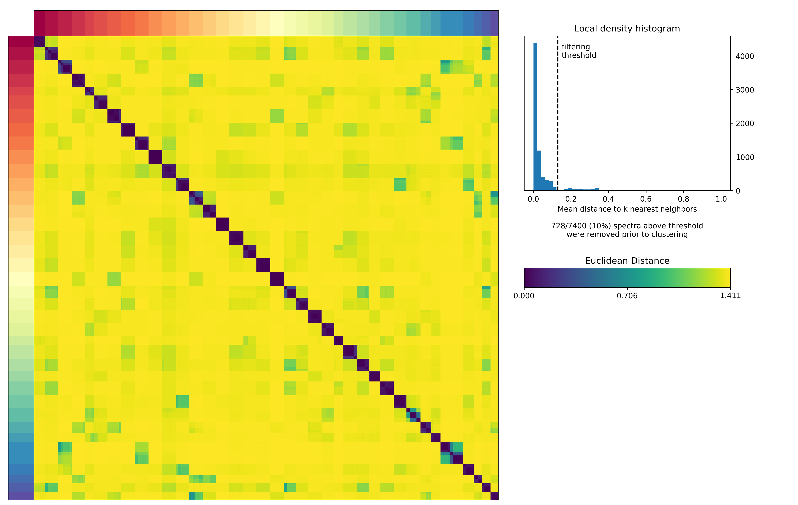
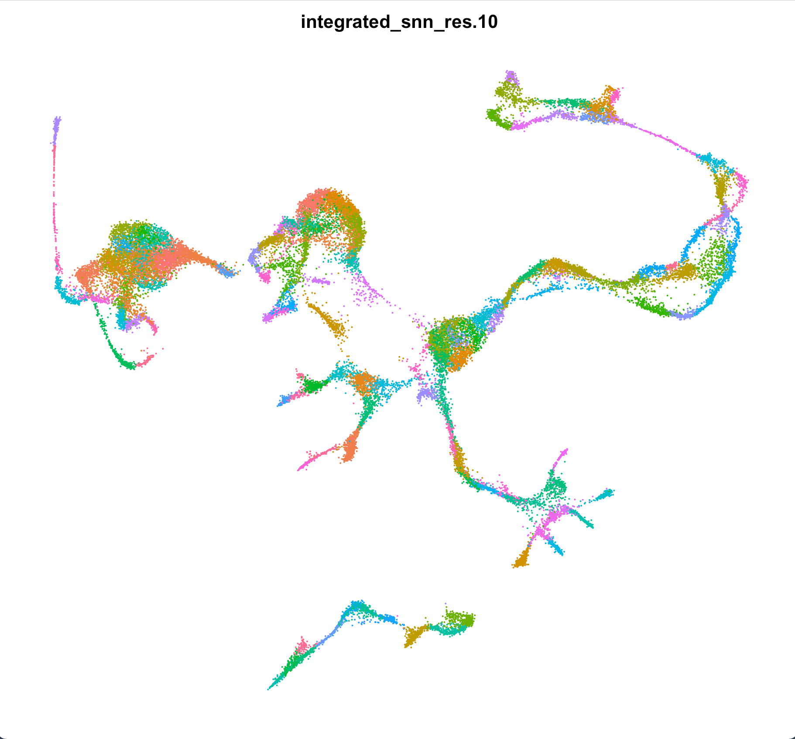
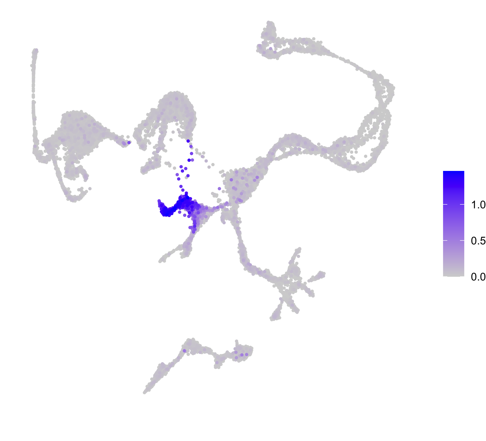
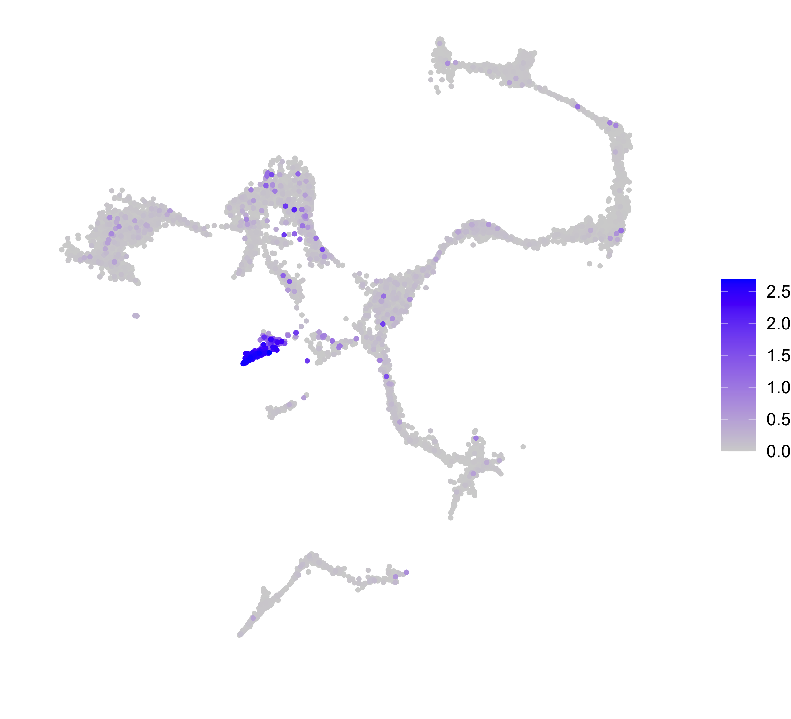

# Identifying Conserved Regulators in *Clytia* and *Hydra*

This document covers our analysis aimed at identifying conserved regulators of cell-type-specific transcription in *Clytia* and *Hydra*.  This required that we first perform a motif enrichment analysis on co-expressed genes in the *Clytia* atlas. For this part of the analysis, we used largely the same approach that we used for the *Hydra* single-cell atlas, although we had to make some modifications due to the lack of cis-regulatory element annotations for *Clytia*. After characterizing motif enrichment patterns in the *Clytia* atlas, we compared results across the *Clytia* and *Hydra* single-cell datasets to identify instances where both the expression of a transcription factor and the enrichment pattern of its motif were conserved in the two species.

[TOC]

## Gene Co-Expression Analysis Using Non-Negative Matrix Factorization (NMF)

Our first goal was to identify gene co-expression modules in the *Clytia* single-cell atlas using non-negative matrix factorization (NMF). For a description on the basic principles of NMF and our approach to applying it to single-cell expression data, see `05_hydraAtlasReMap.md`

We first imported the Seurat object containing the re-mapped *Clytia* single-cell data (generated in `11_clytiaAtlasReMap.md`) into R and then exported both the raw and normalized read count matrices to tsv files, along with a list of the variable genes used for the Seurat clustering.

(*01_clNMF/clNMF.R*)

```R
library(Seurat)
library(rstudioapi)

setwd(dirname(getActiveDocumentContext()$path))

cl <- readRDS('initSeurat.rds')

####NMF prep####
rawC <- t(as.matrix(cl@assays$RNA@counts))
write.table(rawC,file="cl.raw.counts.tsv",sep = '\t', quote = F)
rm(rawC)

normC <- t(as.matrix(cl@assays$SCT@data))
write.table(normC,file="cl.norm.counts.tsv",sep = '\t', quote = F)
rm(normC)

#list of variable genes to look at
write.table(cl@assays$SCT@var.features, file = 'cl.genes.tsv', row.names = F, col.names = F, quote = F)
```

We then set up a cNMF run to do a parameter sweep to determine the number of metagenes (`k`) to use:

(*01_clNMF/runPrep.sh*)

```Bash
#!/bin/bash
#SBATCH -p med
#SBATCH --job-name=prep
#SBATCH -c 2
#SBATCH -t 60-0
#SBATCH --mem=16G
#SBATCH --error=prep.err
#SBATCH --output=prep.out

source ~/.bash_profile

conda activate cnmf_env

python ../cNMF/cnmf.py prepare --name cl_course \
        -c cl.raw.counts.tsv \
        -k 15 20 25 30 35 40 45 50 55 60 65 70 75 80 85 90 \
        --n-iter 200 \
        --total-workers 15 \
        --seed 12345 \
        --tpm cl.norm.counts.tsv \
        --genes-file cl.genes.tsv
```

We then ran the primary factorization step of the cNMF analysis:

(*01_clNMF/runFactorize.sh*)

```bash
#!/bin/bash
#SBATCH --job-name=factorize
#SBATCH -p med
#SBATCH -c 2
#SBATCH -t 60-0
#SBATCH --array=0-14
#SBATCH --mem=8G
#SBATCH --error=factorize_%a.err
#SBATCH --output=factorize_%a.out

source ~/.bash_profile

conda activate cnmf_env

python ../cNMF/cnmf.py factorize --name cl_course --worker-index $SLURM_ARRAY_TASK_ID
```

We pooled the resulting analysis files:

(*01_clNMF/runCombine.sh*)

```bash
#!/bin/bash
#SBATCH --job-name=combine
#SBATCH -p bigmemm 
#SBATCH -c 1
#SBATCH -t 60-0
#SBATCH --mem=24G
#SBATCH --error=combine.err
#SBATCH --output=combine.out

source ~/.bash_profile

conda activate cnmf_env

python ../cNMF/cnmf.py combine --name cl_course
```

And visualized stability and error metrics to select the approximate `K` value to use:

(*01_clNMF/runKselect.sh*)

```bash
#!/bin/bash
#SBATCH --job-name=combine
#SBATCH -p bigmemm 
#SBATCH -c 1
#SBATCH -t 60-0
#SBATCH --mem=24G
#SBATCH --error=combine.err
#SBATCH --output=combine.out

source ~/.bash_profile

conda activate cnmf_env

python ../cNMF/cnmf.py k_selection_plot --name cl_course
```


Based on this plot, we selected the `K` range from 35-45. We then performed a finer grained parameter sweep to identify the 'best' `k` value within that range. 

We re-prepped the analysis for the new range of K values:

(*01_clNMF/runPrep2.sh*)

```bash
#!/bin/bash
#SBATCH -p med
#SBATCH --job-name=prep
#SBATCH -c 2
#SBATCH -t 60-0
#SBATCH --mem=24G
#SBATCH --error=prep2.err
#SBATCH --output=prep2.out

source ~/.bash_profile

conda activate cnmf_env

python ../cNMF/cnmf.py prepare --name cl_fine \
        -c cl.raw.counts.tsv \
        -k 35 36 37 38 39 40 41 42 43 44 45 \
        --n-iter 200 \
        --total-workers 15 \
        --seed 12345 \
        --tpm cl.norm.counts.tsv \
        --genes-file cl.genes.tsv
```

We then ran the factorization step:

(*01_clNMF/runFactorize2.sh*)

```bash
#!/bin/bash
#SBATCH --job-name=factorize
#SBATCH -p med
#SBATCH -c 2
#SBATCH -t 60-0
#SBATCH --array=0-14
#SBATCH --mem=8G
#SBATCH --error=factorizeB_%a.err
#SBATCH --output=factorizeB_%a.out

source ~/.bash_profile

conda activate cnmf_env

python ../cNMF/cnmf.py factorize --name cl_fine --worker-index $SLURM_ARRAY_TASK_ID
```

Combined the resulting files:

(*01_clNMF/runCombine2.sh*)

```bash
#!/bin/bash
#SBATCH --job-name=combine
#SBATCH -p bigmemm 
#SBATCH -c 1
#SBATCH -t 60-0
#SBATCH --mem=24G
#SBATCH --error=combine.err
#SBATCH --output=combine.out

source ~/.bash_profile

conda activate cnmf_env

python ../cNMF/cnmf.py combine --name cl_fine
```

And visualized the stability and error metrics:

(*01_clNMF/runKselect2.sh*)

```bash
#!/bin/bash
#SBATCH --job-name=kSel
#SBATCH -p bigmemm 
#SBATCH -c 1
#SBATCH -t 60-0
#SBATCH --mem=24G
#SBATCH --error=kSel.err
#SBATCH --output=kSel.out

source ~/.bash_profile

conda activate cnmf_env

python ../cNMF/cnmf.py k_selection_plot --name cl_fine
```


Based on these results, we selected 37 as the number of metagenes to use in downstream analyses.

We then had to generate consensus results from the 200 replicates run for the 37-metagene analysis. We initially screened the similarity of the different runs using a permissive threshold setting (we retained runs with distances < 2.0) for the `consensus` function.

(*01_clNMF/runConseunsus2.sh*)

```bash
#!/bin/bash
#SBATCH --job-name=consensus
#SBATCH -p bigmemm
#SBATCH -c 1
#SBATCH -t 60-0
#SBATCH --mem=24G
#SBATCH --error=consensus.err
#SBATCH --output=consensus.out

source ~/.bash_profile

conda activate cnmf_env

python ../cNMF/cnmf.py consensus --name cl_fine --local-density-threshold 2.00 --components 37 --show-clustering
```


Based on the distance distribution, we set the cutoff to 0.13 to remove outliers:

(*01_clNMF/runConseunsus2.sh*)

```bash
#!/bin/bash
#SBATCH --job-name=consensus
#SBATCH -p bigmemm
#SBATCH -c 1
#SBATCH -t 60-0
#SBATCH --mem=24G
#SBATCH --error=consensus.err
#SBATCH --output=consensus.out

source ~/.bash_profile

conda activate cnmf_env

python ../cNMF/cnmf.py consensus --name cl_fine --local-density-threshold 0.13 --components 37 --show-clustering
```



To link the gene co-expression programs from NMF to potential cell types/functions, we plotted the cell scores for each metagene on the UMAP from the original *Clytia* atlas publication (using a Seurat object generated in `11_clytiaAtlasReMap.md`)

(*01_clNMF/visNMF.R*)

```r
library(Seurat)
library(rstudioapi)
library(patchwork)

setwd(dirname(getActiveDocumentContext()$path))

#import UMAP from original clytia publication
cl <- readRDS('annotatedCl.rds')

#k37 course NMF module score visualization

#import nmf cell scores
k37.usage <- read.delim('nmf/cl_fine.usages.k_37.dt_0_13.consensus.txt',row.names = 1)

#normalize cell scores so that all scores in a cell sum to 1
k37.usage <- t(apply(k37.usage,1,function(x) x/sum(x)))

#append metagene cell scores to seurat metadata
md <- cl@meta.data

md$id <- rownames(md)

k37.usage <- as.data.frame(k37.usage)

colnames(k37.usage) <- gsub('X','mg',colnames(k37.usage))

#import metagene descriptions
#(based on initial review of cell score plots)
mgD <- read.csv('nmf/clMetaAnnot.csv',header = F)

colnames(k37.usage) <- paste(colnames(k37.usage), mgD$V2,sep=' ')

k37.usage$id <- rownames(k37.usage) 

md <- merge(md, k37.usage, by = 'id',all.x = T)

md[is.na(md)] <- 0

rownames(md) <- md$id

md$id <- NULL

cl@meta.data <- md

#plot metagene cell scores on the clytia UMAP
plotMods <- grep('mg',colnames(cl@meta.data),value = T)

gg <- FeaturePlot(cl,plotMods[1],order=T) + NoLegend() + NoAxes()

for(i in 2:length(plotMods)){
  subGG <- FeaturePlot(cl,plotMods[i],order=T) + NoLegend() + NoAxes()
  gg <- gg + subGG
}

dims <- sqrt(37)
dims <- c(ceiling(dims),floor(dims))

png('k37usage.png',4*dims[1],height = 5*dims[2],units = 'in',res = 300)
gg + plot_layout(dims[1])
dev.off()
```


## Analysis of Motif Enrichment

In order to use the NMF results for an enrichment analysis, we needed a way of isolating regulatory sequence associated with genes belonging to different metagenes; however, we did not have access to ATAC-seq or histone modification data for the *Clytia* genome. In addition, because there was little to no conservation in non-coding regions when comparing the *Clytia* genome to various *Hydra* genomes, we couldn't use phylogenetic footprinting to identify putative transcription factor binding sites. We therefore selected putative regulatory sequences by simply using the 1000 bp of sequence upstream of gene transcription start sites, since this region is very likely to contain at least some sequence with regulatory function. 

Our approach for identifying enriched motifs in *Hydra* was based on a gene set enrichment analysis framework; however, this method relies on relatively low false positive rates for binding site predictions, which we didn't have for the *Clytia* genome. We therefore used the analysis of motif enrichment (AME) pipeline from the meme suite of software tools to perform a more conventional motif enrichment analysis.

AME requires a list of sequences that have been scored in a way that assigns 'positive' sequences (e.g., genes strongly associated with a particular metagene) a small score and 'negative' sequences a high score. To generate scores that fit this criterion, we simply reversed the sign of the metagene gene scores, which use positive values to indicate a strong association between a gene and a metagene.

In the following R script, we use the *Clytia* gene models (generated in `11_clytiaAtlasReMap.md`) to determine the coordinates of 1000 bp long regions just upstream of TSS. Then, for each metagene in the *Clytia* NMF analysis, we assigned each putative promoter a score based on how strongly its nearby gene was associated with the metagene of interest. These results were then exported as bed files (titled `mg#_ScoredProms.bed` where the number corresponded to the metagene used to assign the gene scores for that particular bed file).

(*02_clEnrichment/enrichPrep.R*)

```R
library(rstudioapi)
library(plyr)

setwd(dirname(getActiveDocumentContext()$path))

#import NMF results to get coexpressed genes

clNMF <- read.delim('../nmf/cl_fine.gene_spectra_score.k_37.dt_0_13.txt',row.names = 1)

#load genome annotation 

clGtf <- read.delim('../../clFinal.merge.longestIso.rename.gtf',header = F)

clGtf <- clGtf[clGtf$V3 == 'gene',]

#reset coordinates to correspond to putative promoter regions (1000 bp upstream to TSS)

newCoords <- clGtf[,c(4,5,7)]

newCoords.p <- newCoords[newCoords$V7 == '+',]

newCoords.p$V5 <- newCoords.p$V4 + 100

newCoords.p$V4 <- newCoords.p$V4 - 1000

newCoords.m <- newCoords[newCoords$V7 == '-',]

newCoords.m$V4 <- newCoords.m$V5 - 100

newCoords.m$V5 <- newCoords.m$V5 + 1000

clGtf[clGtf$V7 == '+',c(4,5)] <- newCoords.p[,1:2]

clGtf[clGtf$V7 == '-',c(4,5)] <- newCoords.m[,1:2]

#convert from 1 based to 0 based coordinates

clGtf$V4 <- clGtf$V4 - 1

#convert to bed-like table

clBed <- clGtf[,c(1,4,5,9,6,7)]

clBed$V9 <- gsub(' ;.*','',clBed$V9)

clBed$V9 <- gsub('gene_id ','',clBed$V9)

clBed$V4[clBed$V4 < 0] <- 0

#import chrom sizes
cSizes <- read.delim('../../../cl/clytiaG.fa.fai', header = F)

#truncate any coordinates that go beyond the chrom boundaries
clBed$max <- as.numeric(mapvalues(clBed$V1, from = cSizes$V1, to = cSizes$V2, warn_missing = F))

clBed$V5[clBed$V5 > clBed$max] <- clBed[clBed$V5 > clBed$max,'max']

clBed$max <- NULL

#generate versions of bed file for each metagene with a score for each gene 

clNMF <- as.data.frame(t(clNMF))

clNMF$ID <- rownames(clNMF)

clNMF$ID <- gsub('[.]','_',clNMF$ID)

unlink('mgBeds',recursive = T)
dir.create('mgBeds',showWarnings = F)

options(scipen = 999)

lapply(1:37,function(x){
  clBed.mgs <- clBed
  
  #drop genes without a score
  clBed.mgs <- clBed.mgs[clBed.mgs$V9 %in% clNMF$ID,]
  
  clBed.mgs$score <- as.numeric(mapvalues(clBed.mgs$V9,from=clNMF$ID,to=clNMF[,x],warn_missing = F))
  
  #need to invert score so that genes strongly associated with the mg have small values
  
  clBed.mgs$score <- -clBed.mgs$score
  
  #order by score
  clBed.mgs <- clBed.mgs[order(clBed.mgs$score),]
  
  clBed.mgs$score <- (clBed.mgs$score - min(clBed.mgs$score)) + 1e-6
  
  #combine score with name
  clBed.mgs$V9 <- paste(clBed.mgs$V9,clBed.mgs$score,sep = ' ')
  
  clBed.mgs$score <- NULL
  write.table(clBed.mgs,paste0('mgBeds/','mg',x,'_scoredProms.bed'),row.names = F, col.names = F, sep = '\t', quote = F)
})
```

The bed files were then used to extract FASTA sequences from the *Clytia* genome for all putative promoter sequences. The headers of this fasta file also contained metagene scores for the corresponding gene model.

(*02_clEnrichment/bedToFasta.sh*)

```bash
#!/bin/bash

cd mgBeds

for arg in *bed
do
	newName="${arg/bed/fa}"
	
	bedtools getfasta -nameOnly -s -fi ../../../clytiaG.fa -bed $arg > "$newName"
	
	gsed -i 's/(.*)//g' "$newName"
done
```

In addition to the fasta sequences generated above, we also needed to generate a background file that specified the nucleotide frequencies in the *Clytia* genome. This was done using the following command:

`fasta-get-markov clytiaG.fa > clytiaBG.txt`

We then performed AME on each of our metagene-specific promoter FASTA files to get motif enrichment results for each metagene. We used the `pooledJasparNR.meme.txt` motif database generated as part of the analysis described in `07_genomeConservation.md`

(*02_clEnrichment/runAme.sh*)

```bash
#!/bin/bash

for arg in mgBeds/*fa
do
	outName="${arg/_scoredProms.fa/}"
	outName="${outName/mgBeds\//}"
	ame --oc enOut/$outName \
		--bfile clytiaBG.txt \
		$arg pooledJasparNR.meme.txt
done
```

Using the following R script, we pooled all the individual AME output files into a single enrichment results table. We then calculated a fold-enrichment score for each significant enrichment result (we used an E-value threshold of 10) by dividing the % of positive (i.e., strongly metagene-associated) genes that contained the target motif by the % of negative genes that contained the target motif. We then mapped these fold-enrichment scores onto the *Clytia* single cell atlas by generating a weighted average of fold-enrichment values for each motif for each cell using the NMF metagene cell scores. These single-cell enrichment scores were then used in a subsequent analysis to identify conserved motif enrichment patterns in *Clytia* and *Hydra*. Finally, we generated a motif by metagene heat map of enrichment scores to summarize the results.

(*02_clEnrichment/visClEn.R*)

```R
library(rstudioapi)
library(plyr)
library(gplots)
library(viridis)

setwd(dirname(getActiveDocumentContext()$path))

#list clytia enrichment result files
clEn.files <- list.files('enOut', pattern='ame.tsv',recursive = T, full.names = T)

#import clytia enrichment tables
clEn <- lapply(clEn.files, read.delim)

#drop comment lines from results
clEn <- lapply(clEn,function(x) x[!grepl('^#',x[,1]),])

#attach metagene IDs to objects in list
names(clEn) <- gsub('.*(mg\\d+)/ame.tsv','\\1',clEn.files)

#drop empty results
clEn <- clEn[sapply(clEn,length) > 0]

#add in column listing the metagene used to 
#calculate the states for that row
clEn.DF <- lapply(1:length(clEn),function(x){
  newDf <- clEn[[x]]
  newDf$mg <- names(clEn)[x]
  return(newDf)
})

#collapse into DF
clEn.DF <- do.call(rbind,clEn.DF)

####plotting####

#generate clytia enrichment scores
#will just base it on fold enrichment
clEn.DF$fc <- clEn.DF$X.TP/clEn.DF$X.FP

write.csv(clEn.DF,'clEnrichmentRes.csv',row.names = F)

#get list of all enriched motifs
motsUse <- unique(clEn.DF$motif_ID)

#load cl metagene cell scores
clNMF <- read.delim('../nmf/cl_fine.usages.k_37.dt_0_13.consensus.txt',row.names = 1)

#normalize cell scores so that the scores for a single cell sum to 1
clNMF <- t(apply(clNMF,1,function(x) x/sum(x)))

#for each enriched motif, go through each metagene that shows enrichment and multiply the fold enrichment by the cell score
enScores <- lapply(motsUse,function(x){
  motRes <- clEn.DF[clEn.DF$motif_ID == x,]
  motScores <- apply(motRes,1,function(y){
    mgUse <- as.numeric(gsub('mg','',y[18]))
    return(clNMF[,mgUse] * as.numeric(y[19]))
  })
  motScores <- apply(motScores,1,sum)
  return(motScores)
})

#get motif name (as opposed to JASPAR ID)
names(enScores) <- mapvalues(motsUse,from=clEn.DF$motif_ID,to=clEn.DF$motif_alt_ID,warn_missing = F)

#collapse to matrix
#this can be used to generate UMAP plots of enrichment scores
enScores <- do.call(cbind,enScores)

saveRDS(enScores,'clEnScores.rds')

#make matrix for heatmap plotting (motif by metagene enrichment score heatmap)
enScores.hm <- lapply(motsUse,function(x){
  motRes <- clEn.DF[clEn.DF$motif_ID == x,]
  mgIndex <- as.numeric(gsub('mg','',motRes$mg))
  enRow <- rep(0,37)
  enRow[mgIndex] <- motRes$fc
  enRow <- enRow/max(enRow)
  names(enRow) <- paste0('mg',1:37)
  return(enRow)
})

#collapse to matrix
enScores.hm <- do.call(rbind,enScores.hm)

#add in motif name to rownames
motsUse.names <- unique(clEn.DF$motif_alt_ID)

rownames(enScores.hm) <- paste(motsUse,motsUse.names,sep=' ')

#bring in metagene descriptions for colnames
mgAnnot <- read.csv('../nmf/clMetaAnnot.csv',header=F)

colnames(enScores.hm) <- paste(colnames(enScores.hm),mgAnnot$V2,sep=' ')

#reorder the columns so their grouped more logically
colOrder <- read.csv('../nmf/clMgOrder.csv',header=F)

enScores.hm <- enScores.hm[,colOrder$V1]

#plot enrichment heatmap
pdf('clMotifHeatmap.pdf',width = 15,height = 60)
heatmap.2(enScores.hm,
          Colv = F,
          scale = 'none',
          dendrogram = 'none',
          col = viridis(30),
          trace='none',
          key = F,
          keysize = 0.1,
          margins = c(10,10),
          colsep = c(3,9,15,24,33,35),
          distfun = function(x) as.dist(1-cor(t(x))),
          hclustfun = function(x) hclust(x, method="average"))
dev.off()

write.csv(enScores.hm,file='clEnHeatmap.csv')
```


## Comparing Motif Enrichment and Transcription Factor Expression Conservation in *Clytia* and *Hydra*

### Analysis Using Bona Fide Motif Sequences

We next wanted to compare the motif enrichment results for *Clytia* and *Hydra* using our aligned single-cell atlas. To do this, we adopted a strategy that was similar to the method we used to identify genes with conserved expression patterns (described in `12_crossSpeciesAtlasAlignment.md`). 

We had already generated single-cell motif enrichment scores for each species, so to identify the motifs that had similar enrichment patterns in the aligned principal component space we generated pseudo-cells using a high resolution louvain clustering analysis. We could then use these pseudo-cells to group small sets of cells from each species together and thus identify motifs with similar pseudo-cell enrichment patterns in the two species. 

To begin, we imported the single-cell enrichment scores for *Clytia* and *Hydra* along with the aligned cross-species atlas. We then generated pseudo-cells using the Seurat implementation of the Louvain clustering algorithm. 

(*03_crossCompare/enrichComp.R*)

```R
library(rstudioapi)
library(plyr)
library(Seurat)
library(ggplot2)
library(gplots)
library(viridis)

setwd(dirname(getActiveDocumentContext()$path))

#import clytia enrichment
enScores <- readRDS('../cl/remap/enrichment/clEnScores.rds')

clEn.DF <- read.csv('../cl/remap/enrichment/clEnrichmentRes.csv')

#load hydra motif enrichment scores
hvEn <- readRDS('../nmf/motScores.rds')

#disregard non-conserved motifs
motifCon <- read.csv('../../alignment_conservation/motifConservationStats.csv',row.names = 1)

motifCon.keep <- rownames(motifCon[motifCon$res == 'enriched',])

hvEn <- hvEn[,colnames(hvEn) %in% motifCon.keep]

#look for similar enrichment patterns using psuedocells
hvCl <- readRDS('aepClInt.rds')

hvCl <- FindClusters(hvCl, resolution = 10, graph.name = 'integrated_snn')

DefaultAssay(hvCl) <- 'SCT'

DimPlot(hvCl, group.by = 'integrated_snn_res.10') + NoLegend() + NoAxes()
```



We next calculated the average enrichment score for each motif in our results matrices, grouping cells first by species then by pseudo-cell. We then calculated a correlation score to compare enrichment patterns across pseudo-cells in the two species.

```R
#export version of hydra enrichment table with pseudocell info for cells
hvEn.exp <- hvEn

hvEn.exp$pseudoCell <- mapvalues(rownames(hvEn), from = colnames(hvCl), to = hvCl$integrated_snn_res.10,warn_missing = F)

#drop any cells not grouped into a psuedocell in the enrichment results matrix
hvEn.exp <- hvEn.exp[grepl('^\\d',hvEn.exp$pseudoCell),]

#drop non-conserved/non-enriched motifs
hvEn <- hvEn[,colnames(hvEn) %in% clEn.DF$motif_ID]

#use motif name instead of motif ID
colnames(hvEn) <- mapvalues(colnames(hvEn),from = clEn.DF$motif_ID,to = clEn.DF$motif_alt_ID,warn_missing = F)

#export version of clytia enrichment table with pseudocell info for cells
enScores.pc <- as.data.frame(enScores[rownames(enScores) %in% colnames(hvCl),])
enScores.pc.id <- mapvalues(rownames(enScores.pc),from=colnames(hvCl),to=hvCl$integrated_snn_res.10,warn_missing = F)

enScores.pc.exp <- as.data.frame(enScores.pc)
enScores.pc.exp$pseudoCell <- enScores.pc.id

#calculate average enrichment score for each motif for each pseudo-cell
#first for clytia
enScores.pc <- split(enScores.pc,enScores.pc.id)
enScores.pc <- lapply(enScores.pc,function(x) apply(x,2,mean))

enScores.pc <- do.call(rbind,enScores.pc)

#then for hydra
hvEn.pc <- as.data.frame(hvEn[rownames(hvEn) %in% colnames(hvCl),])
hvEn.pc.id <- mapvalues(rownames(hvEn.pc),from=colnames(hvCl),to=hvCl$integrated_snn_res.10,warn_missing = F)

hvEn.pc <- split(hvEn.pc,hvEn.pc.id)
hvEn.pc <- lapply(hvEn.pc,function(x) apply(x,2,mean))

hvEn.pc <- do.call(rbind,hvEn.pc)

#restrict psuedo-cells and motifs to only those that are present in both species
hvEn.pc <- hvEn.pc[,colnames(hvEn.pc) %in% colnames(enScores.pc)]
enScores.pc <- enScores.pc[,colnames(enScores.pc) %in% colnames(hvEn.pc)]

hvEn.pc <- hvEn.pc[rownames(hvEn.pc) %in% rownames(enScores.pc),]
enScores.pc <- enScores.pc[rownames(enScores.pc) %in% rownames(hvEn.pc),]

hvEn.pc <- hvEn.pc[,colnames(enScores.pc)]

write.csv(hvEn.pc,'pcAveHvEn.csv')
write.csv(enScores.pc,'pcAveClEn.csv')

#calculate correlation scores across pseudo-cells for each motif
crossMotCor <- vapply(1:ncol(hvEn.pc),function(x){
  cor(hvEn.pc[,x], enScores.pc[,x], method = 'pearson')
},numeric(1))

crossMotCor <- data.frame(motID = colnames(enScores.pc),crossMotCor)

#reduce redundancy of cor scores
lrMots <- read.csv('../nmf/hydraEnrichmentMatrixLR.csv')[,1]

lrMots <- gsub('.* ','',lrMots)

crossMotCor <- crossMotCor[crossMotCor$motID %in% lrMots,]

#subset to look only at high scoring enrichment results
crossMotCor.match <- crossMotCor[crossMotCor$crossMotCor > 0.5,]

#export correlation results
write.csv(crossMotCor,'crossMotCor.csv',row.names = F)
```

In order to identify putative conserved regulators, we manually reviewed the results contained in the `crossMotCor` object from this analysis (which contained correlation values indicating the degree of similarity in motif enrichment patterns in the two species), as well as the transcription factor expression conservation results described in `12_crossSpeciesAtlasAlignment.md`. This revealed the conserved regulators presented in figure 4. We used the following code to visualize these conserved enrichment and expression patterns in the aligned cross-species atlas (here we show example plots for *ebf*):

```R
#function for plotting motif enrichment scores for each species using the aligned seurat object
motScorePlot <- function(x){
  newMD <- hvCl@meta.data
  
  newMD$cID <- rownames(newMD)
  
  motCheck <- x
  
  motScoreDF <- data.frame(cID = c(rownames(enScores),rownames(hvEn)), motScore = c(enScores[,motCheck],hvEn[,motCheck]))
  
  newMD <- merge(newMD,motScoreDF,by='cID',all.x=T)
  
  newMD[is.na(newMD$motScore),'motScore'] <- 0
  
  rownames(newMD) <- newMD$cID
  
  newMD$cID <- NULL
  
  newMD <- newMD[colnames(hvCl),]
  
  hvCl@meta.data <- newMD
  
  gg <- FeaturePlot(hvCl,'motScore',split.by = 'species',pt.size = 0.6,order = T,combine=F)
  gg[[1]] + theme_void() + theme(plot.title = element_blank())
  ggsave(paste0('enPlot_',x,'_aep.png'),width = 5.5,height=5,dpi=450)
  
  gg[[2]] + theme_void() + theme(plot.title = element_blank())
  ggsave(paste0('enPlot_',x,'_cl.png'),width = 5.5,height=5,dpi=450)
}


motScorePlot('EBF3')

gg <- FeaturePlot(hvCl,'HVAEP1-G005780',split.by = 'species',order = T,pt.size=0.6,combine=F)
gg[[1]] + theme_void() + theme(plot.title = element_blank())
ggsave('ebfTran_aep.png',width = 5.5,height=5,dpi=450)

gg[[2]] + theme_void() + theme(plot.title = element_blank())
ggsave('ebfTran_cl.png',width = 5.5,height=5,dpi=450)
```

(EBF3 motif enrichment for *Hydra*)



(EBF3 motif enrichment for *Clytia*)



(*ebf* expression in *Hydra*)


(*ebf* expression in *Clytia*)


### Analysis Using Shuffled Motif Sequences

To determine if the similarities in motif enrichment patterns we observed in the two species were greater than would be expected based on chance, we repeated our enrichment comparison analysis using results based on shuffled versions of each transcription factor binding motif.

This required that we re-run the AME analysis using shuffled versions of each motif in our database (the generation of these shuffled motifs is described in `07_genomeConservation.md`)

(*02_clEnrichment/runAmeShuf.sh*)

```bash
#!/bin/bash

for arg in mgBeds/*fa
do
	outName="${arg/_scoredProms.fa/}"
	outName="${outName/mgBeds\//}"
	ame --oc enOutShuf/$outName \
		--bfile clytiaBG.txt \
		$arg shuffledJasparMotifs.meme.txt
done
```

We then transferred these enrichment results onto the *Clytia* single cell atlas by generating single-cell enrichment scores for each motif. As with the *Hydra* enrichment analysis (described in `10_hydraRegulators.md` ), we found that shuffling the motifs completely changed the resulting enrichment patterns, demonstrating that our enrichment results were not primarily being driven by sequence bias artifacts.

```R
library(rstudioapi)
library(plyr)
library(gplots)
library(viridis)

setwd(dirname(getActiveDocumentContext()$path))

#list clytia enrichment result files
clEn.files <- list.files('enOutShuf', pattern='ame.tsv',recursive = T, full.names = T)

#import clytia enrichment tables
clEn <- lapply(clEn.files, read.delim)

#drop comment lines from results
clEn <- lapply(clEn,function(x) x[!grepl('^#',x[,1]),])

#attach metagene IDs to objects in list
names(clEn) <- gsub('.*(mg\\d+)/ame.tsv','\\1',clEn.files)

#drop empty results
clEn <- clEn[sapply(clEn,length) > 0]

#add in column listing the metagene used to 
#calculate the states for that row
clEn.DF <- lapply(1:length(clEn),function(x){
  newDf <- clEn[[x]]
  newDf$mg <- names(clEn)[x]
  return(newDf)
})

#collapse into DF
clEn.DF <- do.call(rbind,clEn.DF)

####plotting####

#generate clytia enrichment scores
#will just base it on fold enrichment
clEn.DF$fc <- clEn.DF$X.TP/clEn.DF$X.FP

write.csv(clEn.DF,'clEnrichmentResShuf.csv',row.names = F)

#get list of all enriched motifs
motsUse <- unique(clEn.DF$motif_ID)

#load cl metagene cell scores
clNMF <- read.delim('../nmf/cl_fine.usages.k_37.dt_0_13.consensus.txt',row.names = 1)

#normalize cell scores so that the scores for a single cell sum to 1
clNMF <- t(apply(clNMF,1,function(x) x/sum(x)))

#for each enriched motif, go through each metagene that shows enrichment and multiply the fold enrichment by the cell score
enScores <- lapply(motsUse,function(x){
  motRes <- clEn.DF[clEn.DF$motif_ID == x,]
  motScores <- apply(motRes,1,function(y){
    mgUse <- as.numeric(gsub('mg','',y[18]))
    return(clNMF[,mgUse] * as.numeric(y[19]))
  })
  motScores <- apply(motScores,1,sum)
  return(motScores)
})

#get motif name (as opposed to JASPAR ID)
names(enScores) <- mapvalues(motsUse,from=clEn.DF$motif_ID,to=clEn.DF$motif_alt_ID,warn_missing = F)

#collapse to matrix
#this can be used to generate UMAP plots of enrichment scores
enScores <- do.call(cbind,enScores)

saveRDS(enScores,'clEnScoresShuf.rds')

#make matrix for heatmap plotting (motif by metagene enrichment score heatmap)
enScores.hm <- lapply(motsUse,function(x){
  motRes <- clEn.DF[clEn.DF$motif_ID == x,]
  mgIndex <- as.numeric(gsub('mg','',motRes$mg))
  enRow <- rep(0,37)
  enRow[mgIndex] <- motRes$fc
  enRow <- enRow/max(enRow)
  names(enRow) <- paste0('mg',1:37)
  return(enRow)
})

#collapse to matrix
enScores.hm <- do.call(rbind,enScores.hm)

#add in motif name to rownames
motsUse.names <- unique(clEn.DF$motif_alt_ID)

rownames(enScores.hm) <- paste(motsUse,motsUse.names,sep=' ')

#bring in metagene descriptions for colnames
mgAnnot <- read.csv('../nmf/clMetaAnnot.csv',header=F)

colnames(enScores.hm) <- paste(colnames(enScores.hm),mgAnnot$V2,sep=' ')

#reorder the columns so their grouped more logically
colOrder <- read.csv('../nmf/clMgOrder.csv',header=F)

enScores.hm <- enScores.hm[,colOrder$V1]

#plot enrichment heatmap
pdf('clMotifHeatmapShuf.pdf',width = 15,height = 60)
heatmap.2(enScores.hm,
          Colv = F,
          scale = 'none',
          dendrogram = 'none',
          col = viridis(30),
          trace='none',
          key = F,
          keysize = 0.1,
          margins = c(10,10),
          colsep = c(3,9,15,24,33,35),
          distfun = function(x) as.dist(1-cor(t(x))),
          hclustfun = function(x) hclust(x, method="average"))
dev.off()

write.csv(enScores.hm,file='clEnHeatmapShuf.csv')
```


We then looked for similarities in the enrichment patterns of these shuffled motifs across the *Hydra* and *Clytia* atlases. We found that no shuffled motifs showed signs of conservation (defined as having a correlation score > 0.5). This suggests that the similarities in motif enrichment across homologous cell types that we observed in our analysis using bona fide motif sequences are unlikely to have been driven purely by chance.

(*03_crossCompare/enrichCompShuf.R*)

```R
library(rstudioapi)
library(plyr)
library(Seurat)
library(ggplot2)
library(gplots)
library(viridis)

setwd(dirname(getActiveDocumentContext()$path))

#import clytia enrichment
enScores <- readRDS('../cl/remap/enrichment/clEnScoresShuf.rds')

clEn.DF <- read.csv('../cl/remap/enrichment/clEnrichmentResShuf.csv')

#load hydra motif enrichment scores
hvEn <- readRDS('../nmf/motScores_shuf.rds')

#disregard non-conserved motifs
motifCon <- read.csv('../../alignment_conservation/motifConservationStats.csv',row.names = 1)

motifCon.keep <- rownames(motifCon[motifCon$res == 'enriched',])

hvEn <- hvEn[,colnames(hvEn) %in% motifCon.keep]

#look for similar enrichment patterns using psuedocells
hvCl <- readRDS('aepClInt.rds')

hvCl <- FindClusters(hvCl, resolution = 10, graph.name = 'integrated_snn')

DefaultAssay(hvCl) <- 'SCT'

DimPlot(hvCl, group.by = 'integrated_snn_res.10') + NoLegend() + NoAxes()

#export version of hydra enrichment table with pseudocell info for cells
hvEn.exp <- hvEn

hvEn.exp$pseudoCell <- mapvalues(rownames(hvEn), from = colnames(hvCl), to = hvCl$integrated_snn_res.10,warn_missing = F)

#drop any cells not grouped into a psuedocell in the enrichment results matrix
hvEn.exp <- hvEn.exp[grepl('^\\d',hvEn.exp$pseudoCell),]

#drop non-conserved/non-enriched motifs
hvEn <- hvEn[,colnames(hvEn) %in% clEn.DF$motif_ID]

#use motif name instead of motif ID
colnames(hvEn) <- mapvalues(colnames(hvEn),from = clEn.DF$motif_ID,to = clEn.DF$motif_alt_ID,warn_missing = F)

#export version of clytia enrichment table with pseudocell info for cells
enScores.pc <- as.data.frame(enScores[rownames(enScores) %in% colnames(hvCl),])
enScores.pc.id <- mapvalues(rownames(enScores.pc),from=colnames(hvCl),to=hvCl$integrated_snn_res.10,warn_missing = F)

enScores.pc.exp <- as.data.frame(enScores.pc)
enScores.pc.exp$pseudoCell <- enScores.pc.id

#calculate average enrichment score for each motif for each pseudo-cell
#first for clytia
enScores.pc <- split(enScores.pc,enScores.pc.id)
enScores.pc <- lapply(enScores.pc,function(x) apply(x,2,mean))

enScores.pc <- do.call(rbind,enScores.pc)

#then for hydra
hvEn.pc <- as.data.frame(hvEn[rownames(hvEn) %in% colnames(hvCl),])
hvEn.pc.id <- mapvalues(rownames(hvEn.pc),from=colnames(hvCl),to=hvCl$integrated_snn_res.10,warn_missing = F)

hvEn.pc <- split(hvEn.pc,hvEn.pc.id)
hvEn.pc <- lapply(hvEn.pc,function(x) apply(x,2,mean))

hvEn.pc <- do.call(rbind,hvEn.pc)

#restrict psuedo-cells and motifs to only those that are present in both species
hvEn.pc <- hvEn.pc[,colnames(hvEn.pc) %in% colnames(enScores.pc)]
enScores.pc <- enScores.pc[,colnames(enScores.pc) %in% colnames(hvEn.pc)]

hvEn.pc <- hvEn.pc[rownames(hvEn.pc) %in% rownames(enScores.pc),]
enScores.pc <- enScores.pc[rownames(enScores.pc) %in% rownames(hvEn.pc),]

hvEn.pc <- hvEn.pc[,colnames(enScores.pc)]

write.csv(hvEn.pc,'pcAveHvEnShuf.csv')
write.csv(enScores.pc,'pcAveClEnShuf.csv')

#calculate correlation scores across pseudo-cells for each motif
crossMotCor <- vapply(1:ncol(hvEn.pc),function(x){
  cor(hvEn.pc[,x], enScores.pc[,x], method = 'pearson')
},numeric(1))

crossMotCor <- data.frame(motID = colnames(enScores.pc),crossMotCor)

#subset to look only at high scoring enrichment results
crossMotCor.match <- crossMotCor[crossMotCor$crossMotCor > 0.5,]
print(nrow(crossMotCor.match))
```

```
[1] 0
```


## Files Associated with This Document


```
13_conservedRegulators/
├── 01_clNMF
│   ├── cl_fine.clustering.k_37.dt_0_13.png
				Output generated by runConseunsus2.sh. Shows the results of a clustering
				analysis grouping together the 200 independent runs from the NMF analysis
				where K was set to 37. Used to select a distance cutoff to remove outlier
				NMF replicates and to generate a final set of consensus matrices.
│   ├── cl_fine.gene_spectra_score.k_37.dt_0_13.txt
				Matrix generated by runConseunsus2.sh that contains metagene Z-scores for
				each gene included in the Clytia atlas. A Higher z-scores indicates a 
				stronger associations between a gene and the metagene.
│   ├── cl_fine.gene_spectra_tpm.k_37.dt_0_13.txt
				Matrix generated by runConseunsus2.sh that contains the gene score matrix
				calculated by NMF that, when multiplied by the cell score matrix, approximates
				the values in the normalized expression matrix provided as input
				(cl.norm.counts.tsv).
│   ├── cl_fine.spectra.k_37.dt_0_13.consensus.txt
				Matrix generated by runConseunsus2.sh that contains the gene score matrix
				calculated by NMF that, when multiplied by the cell score matrix, approximates
				the values in the raw expression matrix provided as input
				(cl.raw.counts.tsv).
│   ├── cl_fine.usages.k_37.dt_0_13.consensus.txt
				Matrix generated by runConseunsus2.sh that contains the cell score matrix
				calculated by NMF. Higher values for a metagene in a given cell indicates that
				the metagene in question contributes more strongly to the cell's transcriptional
				profile.
│   ├── cl.genes.tsv
				List of variable gene IDs that were used for the NMF analysis of the
				clytia single-cell atlas.
│   ├── clNMF.R
				R script that exports expression matrices and a variable gene list from the
				Clytia single-cell atlas for use as input into an NMF analysis.
│   ├── cl.norm.counts.tsv
				Digital gene expression matrix containing Seurat-normalized read counts
				for the clytia single-cell atlas (taken from initSeurat.rds generated in
				11_clytiaAtlasReMap.md)
│   ├── cl.raw.counts.tsv
				Digital gene expression matrix containing raw read counts for the clytia 
				single-cell atlas (taken from initSeurat.rds generated in 
				11_clytiaAtlasReMap.md)
│   ├── runCombine2.sh
				Shell script that pools the individual files created by separate
				parallelized nmf runs generated as part of the fine resolution K 
				parameter sweep.
│   ├── runCombine.sh
				Shell script that pools the individual files created by separate
				parallelized nmf runs generated as part of the broad resolution K 
				parameter sweep.
│   ├── runConseunsus2.sh
				Shell script that calculates factorization matrices based on the 
				consensus of independent replicates for a given K value (in this 
				case, K=56).
│   ├── runFactorize2.sh
				Shell script that performs NMF across a relatively narrow range of 
				K values (K=35-45 by steps of 1). The script performs 200 independent 
				NMF calculations for each specified K value.
│   ├── runFactorize.sh
				Shell script that performs NMF across a relatively broad range of 
				K values (K=15-90 by steps of 5). The script performs 200 independent 
				NMF calculations for each specified K value.
│   ├── runKselect2.sh
				Shell script that calculates and plots both error and stability
				scores for different K values based on the results of runFactorize2.sh
				(K=35-45 by steps of 1). 
│   ├── runKselect.sh
				Shell script that calculates and plots both error and stability
				scores for different K values based on the results of runFactorize.sh
				(K=15-90 by steps of 5).
│   ├── runPrep2.sh
				Shell script that sets up the separate parallelized NMF runs across
				a relatiely narrow range of K values (K=35-45 by steps of 1). 
│   ├── runPrep.sh
				Shell script that sets up the separate parallelized NMF runs across
				a relatiely narrow range of K values (K=15-90 by steps of 5). 
│   └── visNMF.R
				R script used to visualize NMF metagene cell scores on the clytia atlas
				UMAP.
├── 02_clEnrichment
│   ├── ameOutBF.tar.gz
				Compressed directory containing the motif enrichment results generated by 
				AME for each metagene in the Clytia single cell atlas using bona fide 
				transcription factor binding motifs.
│   ├── ameOutShuf.tar.gz
				Compressed directory containing the motif enrichment results generated by 
				AME for each metagene in the Clytia single cell atlas using shuffled 
				transcription factor binding motifs.
│   ├── bedToFasta.sh
				Shell script that uses the bedtools getfasta function to extract putative
				promoter regions from the Clytia genome.
│   ├── clEnHeatmap.csv
				Motif by metagene matrix containing the values underlying the heatmap of 
				bona fide motif enrichment scores for the Clytia single-cell atlas.
│   ├── clEnHeatmapShuf.csv
				Motif by metagene matrix containing the values underlying the heatmap of 
				shuffled motif enrichment scores for the Clytia single-cell atlas.
│   ├── clEnrichmentRes.csv
				Table summarizing all significantly enriched motifs for all metagenes
				in the Clytia single-cell atlas identified by AME using bona fide
				motif sequences.
│   ├── clEnrichmentResShuf.csv
				Table summarizing all significantly enriched motifs for all metagenes
				in the Clytia single-cell atlas identified by AME using shuffled
				motif sequences.
│   ├── clEnScores.rds
				R binary file containing a matrix of single-cell enrichment scores for
				all bona fide motifs that were significantly enriched in at least one
				metagene.
│   ├── clEnScoresShuf.rds
				R binary file containing a matrix of single-cell enrichment scores for
				all shuffled motifs that were significantly enriched in at least one
				metagene.
│   ├── clMetaAnnot.csv
				Table containing descriptive names for the Clytia atlas metagenes.
│   ├── clMgOrder.csv
				Table that specifies the column order of the motif enrichment heatmaps 
    		(e.g., clEnHeatmap.csv)
│   ├── clytiaBG.txt
				File containing the base frequencies in the Clytia genome. Used for running
				AME in runAme.sh and visClEnShuf.R.
│   ├── enrichPrep.R
				R script that generates bed files containing the coordinates for putative
				promoter sequences in the Clytia genome. It generates a bed file for each 
				metagene in the Clytia atlas. The feature names in each bed file include
				the metagene score associated with the target gene of each putative promoter.
│   ├── mgBeds.tar.gz
				Compressed directory containing the bed files generated by enrichPrep.R as
				well as the fasta files generated by bedToFasta.sh.
│   ├── runAme.sh
				Shell script that performs AME to identify motifs enriched in the putative
				promoter regions of genes that are strongly associated with each metagene
				in the Clytia atlas. 
│   ├── runAmeShuf.sh
				Shell script that performs AME to identify shuffled motifs enriched in the 
				putative promoter regions of genes that are strongly associated with each 
				metagene in the Clytia atlas. 
│   ├── visClEn.R
				R script that maps the motif enrichment results from runAme.sh onto the 
				Clytia atlas to generate single cell enrichment scores. It also generates 
				a heatmap to visualize these results.
│   └── visClEnShuf.R
				R script that maps the shuffled motif enrichment results from runAme.sh 
				onto the Clytia atlas to generate single cell enrichment scores. It also 
				generates a heatmap to visualize these results.
└── 03_crossCompare
    ├── crossMotCor.csv
    		Table listing the motif enrichment cross-species correlation score for all
    		motifs that were enriched in at least one metagene in both the Clytia and 
    		Hydra single cell atlases.
    ├── crossMotCorShuf.csv
    		Table listing the motif enrichment cross-species correlation score for all
    		shuffled motifs that were enriched in at least one metagene in both the 
    		Clytia and Hydra single cell atlases.
    ├── enrichComp.R
    		R script that compares motif enrichment patterns in the Clytia and Hydra single-
    		cell atlases using the aligned cross-species atlas. Also includes code for
    		generating side-by-side plots of gene expression and motif enrichment in Hydra
    		and Clytia using the cross-species atlas.
    ├── enrichCompShuf.R
    		R script that compares shuffled motif enrichment patterns in the Clytia and 
    		Hydra single-cell atlases using the aligned cross-species atlas.
    ├── pcAveClEn.csv
    		Pseudo-cell by motif matrix of motif enrichment scores from clEnScores.rds 
    		that have been pooled and averaged for each pseudo-cell in the cross-species
    		atlas.
    ├── pcAveClEnShuf.csv
    		Pseudo-cell by motif matrix of shuffled motif enrichment scores from 
    		clEnScores.rds that have been pooled and averaged for each pseudo-cell in 
    		the cross-species atlas.
    ├── pcAveHvEn.csv
    		Pseudo-cell by motif matrix of motif enrichment scores from motScores.rds 
    		(generated in 10_hydraRegulators) that have been pooled and averaged for 
    		each pseudo-cell in the cross-species atlas.
    └── pcAveHvEnShuf.csv
    		Pseudo-cell by motif matrix of shuffled motif enrichment scores from 
    		motScores_shuf.rds (generated in 10_hydraRegulators) that have been pooled 
    		and averaged for each pseudo-cell in the cross-species atlas.
```

